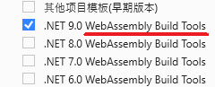
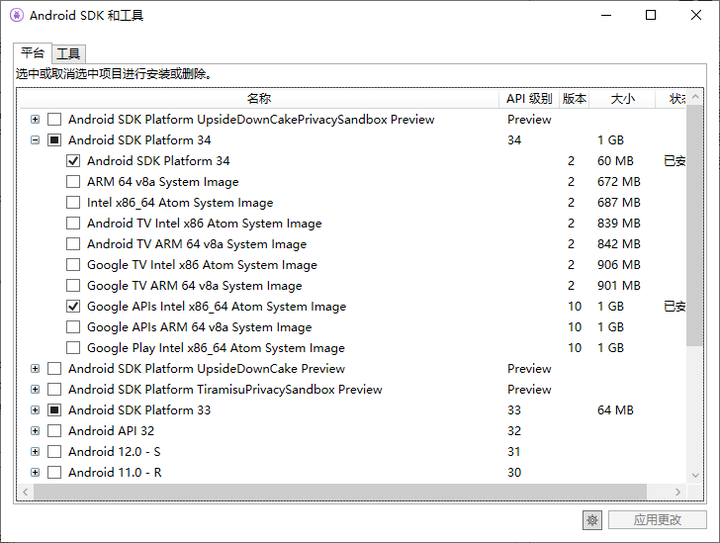

## 安装 Visual Studio

需要 [Visual Studio 2022 或更高版本](https://visualstudio.microsoft.com/vs/)，安装以下工作负载：

* 用于服务和 WebAssembly 开发

* 用于 iOS、Android 开发

* 用于 Windows 开发

* 安装 Android SDK 和工具，因网络原因可能下载慢或无法下载，请多试几次


iOS 开发需要有 Mac 主机，有关将 Visual Studio 连接到 Mac 生成主机以生成 iOS 应用的信息，请参阅[配对到 Mac 以进行 iOS 开发](https://learn.microsoft.com/zh-cn/xamarin/ios/get-started/installation/windows/connecting-to-mac/)。


## 安装搬运工扩展

搬运工扩展提供丰富的实用功能，除项目模板外，还包括大量的模板代码、自动生成实体类等功能，中文代码简拼助手让您开发业务时喜欢上中文代码。

若下载 Visual Studio 扩展慢，也可[手动下载最新搬运工扩展压缩包](https://github.com/daoting/dt/releases/latest)，下载后解压安装扩展，安装成功后可在 VS -> 扩展 -> 管理扩展 中查看。


搬运工客户端支持三种运行模式：单机、两层直连数据库、多层微服务
* 单机版独立运行，无服务，可使用Sqlite本地库
* 直连数据库，两层架构，无服务，不支持WebAssembly
* 多层微服务，使用自定义服务和搬运工标准服务(内核服务、消息服务、文件服务)


采用**多层微服务**时请继续以下安装

## 安装数据库

搬运工支持`mysql sqlserver oracle postgresql`四种类型的数据库，每个服务可同时使用一种或多种数据库，请根据需要自行安装。

## 安装 RabbitMQ

RabbitMQ 是消息队列中间件，搬运工基于它实现了微服务之间的Rpc调用、事件总线、远程事件、消息广播等功能，安装过程请自行搜索。

**若采用单体服务模式，可以不安装 RabbitMQ。**


* 启用事件通知插件，以便搬运工检测队列变化：

  `rabbitmq-plugins enable rabbitmq_event_exchange`
* 防火墙允许默认端口 5672, 15672 通过。


## 安装 Redis

搬运工使用Redis作为全局缓存数据库，以key-value形式存储要缓存的内容，供所有微服务使用，安装过程请自行搜索。

## 安装 IIS
可选，搬运工服务是标准的ASP.NET Core应用，它的部署可参考：[托管和部署 ASP.NET Core](https://learn.microsoft.com/zh-cn/aspnet/core/host-and-deploy/?view=aspnetcore-8.0)

运行搬运工样例不需要安装 IIS，可跳过不安装。

若无asp.net旧应用，无需安装“应用开发功能”，若调试wasm应用需要安装WebSocket协议，如下图：

安装[AspNetCoreModuleV2](https://dotnet.microsoft.com/download/dotnet/7.0) 点击对应版本的Hosting Bundle进行下载安装。

成功安装后
