## 创建空项目
1. 选择搬运工模板
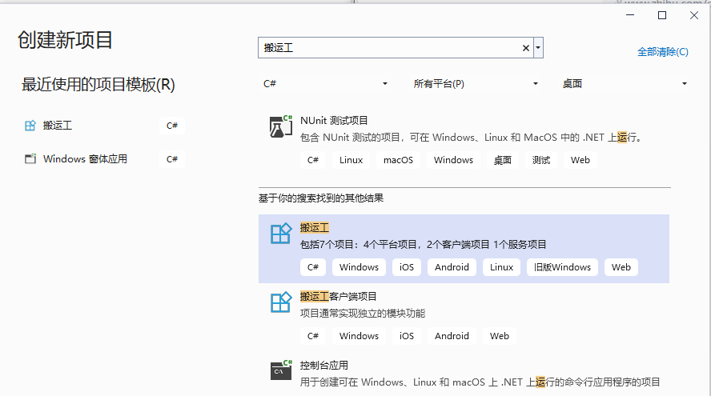

1. 使用默认选项创建应用
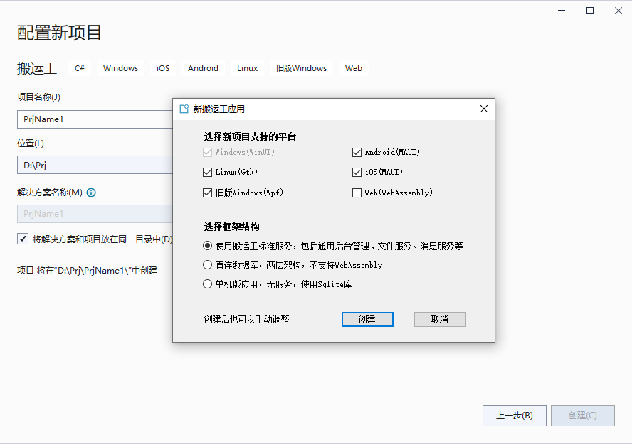

1. 单击创建按钮

1. 等待创建项目并还原其依赖项，因初次需要下载依赖包，网速慢的请多等会:skull:

1. 编辑器顶部的横幅可能会要求重新加载项目，单击“重新加载项目”：

**至此项目创建成功！**

## 解决方案目录
解决方案根目录如图所示：

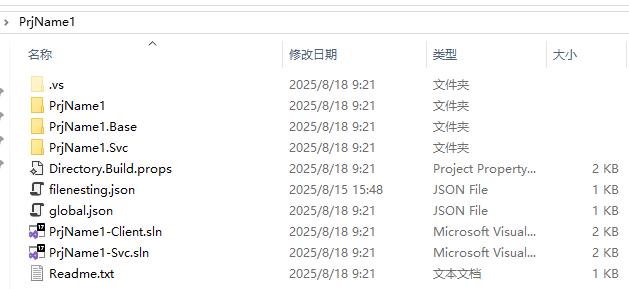

* PrjName1.sln 所有客户端项目，4个目标框架
* PrjName1-svc.sln 只服务
* PrjName1-win.sln 只net-windows框架
* PrjName1-android.sln 只net-android框架
* PrjName1-ios.sln 只net-ios框架
* PrjName1-skia.sln 只net框架，gtk和wpf项目
* PrjName1-wasm.sln 只net框架，wasm项目


为提高效率，开发时使用 PrjName1-win.sln ，适配不同平台时再打开对应 sln


## 初始化数据库
搬运工平台包含cm fsm msg三个基础微服务，这些服务包括基础菜单、用户、角色、权限、工作流、参数、文件等功能模块，是平台必不可少的基础服务，这些服务用到的数据结构需要在此初始化。

平台提供两种方法进行数据库初始化：**通过客户端初始化、通过服务初始化。**

### 通过客户端初始化


通过客户端初始化数据库没有连接服务，是纯粹的两层结构，直连数据库


1. VS打开解决方案PrjName1-win.sln，将PrjName1.Win 项目设为启动项目，ctrl + F5 启动应用，因为未启动服务，所以客户端启动后会提示服务器连接失败。

　　

2. 按下快捷键：ctrl + enter 唤出系统面板，点击**数据库初始化**
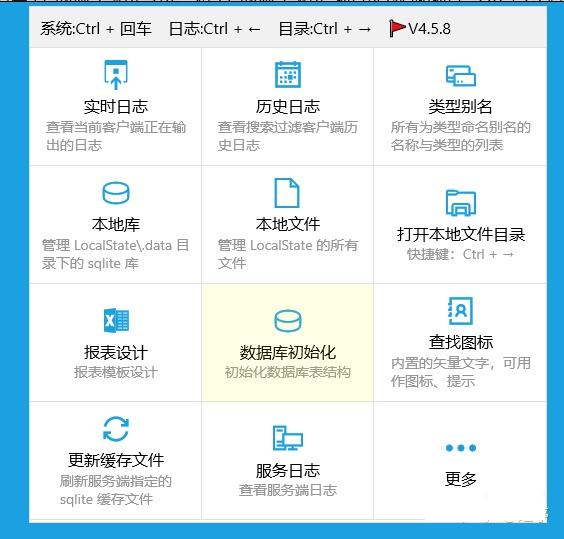

1.  显示**数据库初始化**向导，选择您需要的数据库类型，填写连接参数，每种库的参数略有不同，点击连接按钮
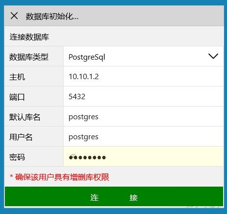

1. 连接失败时给出提醒，连接成功后新页面，失败时请根据提醒重新填写参数
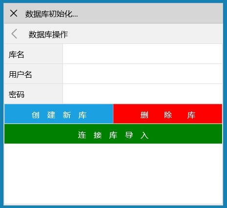

1. 填写库名及用户名、密码，三个按钮的功能：
* 创建新库：将删除旧库重新创建新库
* 删除库：即删除当前存在的旧库、用户、表空间等，慎用！
* 连接库导入：表示用当前的用户名、密码登录该库，执行sql脚本

6. 选择创建新库时，若库或用户已存在，将提示确认是否删除旧库重新创建，为避免误操作需要3次确认，底部日志会输出整个创建过程及创建空库成功的消息

　　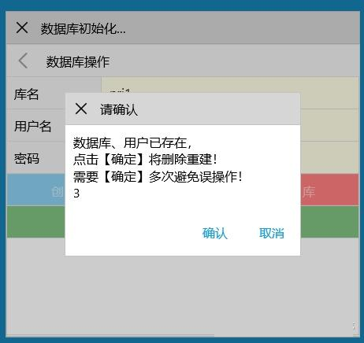

　　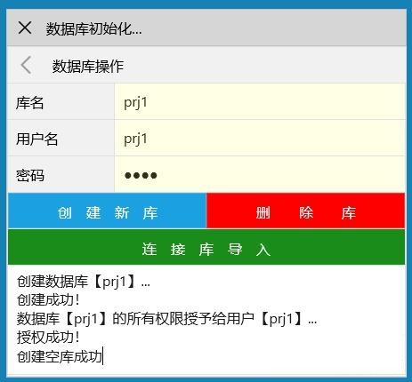

7. 点击 **连接库导入** 进入新页面，两个按钮：导入初始表结构及数据、导入其它
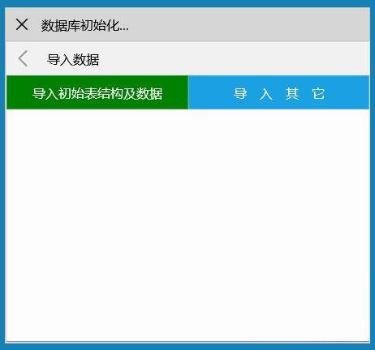

8. **导入初始表结构及数据** 就是本次初始化数据库的操作，导入前同样提示确认删除同名的表、视图等，通过日志查看导入过程及连接串

　　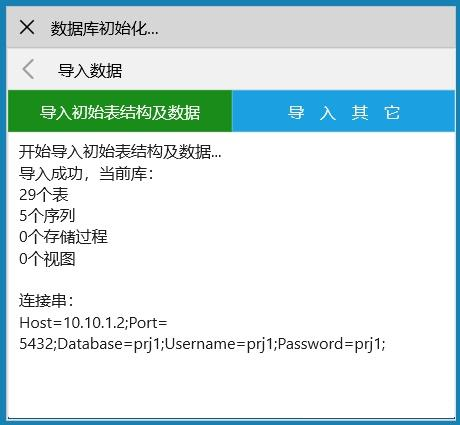

9. **导入其它** 可以选择自己的sql脚本文件，比如搬运工样例的sql脚本文件、自己业务系统的sql文件等

　　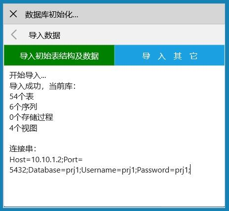

至此通过客户端初始化数据库完毕！

### 通过服务初始化


通过服务初始化只支持导入平台默认初始表结构及数据，无法导入外部sql脚本文件


1. VS打开解决方案PrjName1-svc.sln，打开 etc/config/service.json 文件，将顶部的Mode节设置为InitDb，初始化数据库模式：

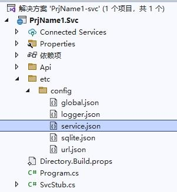


{
  // 设置运行模式，共三种，默认Svc模式
  // 1. Svc          普通微服务模式
  // 2. SingletonSvc 单体服务模式
  // 3. InitDb       初始化数据库模式
  "Mode": "InitDb",

}


2. ctrl + F5 启动服务，自动打开 https://localhost:1234/.admin 页面:

3. 选择您需要的数据库类型，填写连接参数，每种库的参数略有不同，点击连接按钮
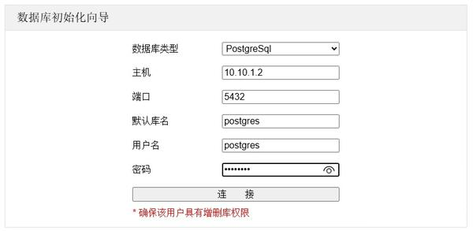

4. 连接失败时给出提醒，连接成功后进入导入库、创建新库页面
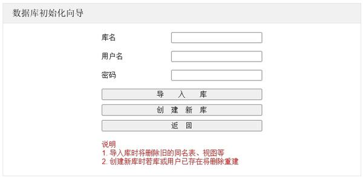

5. 填写库名及用户名、密码

　　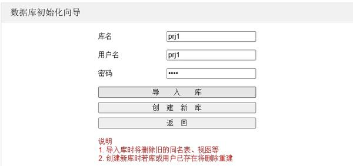

6. 选择**创建新库**时，若库或用户已存在，将提示确认是否删除旧库重新创建，避免误操作，底部的日志会输出整个初始化过程及新库的连接串

　　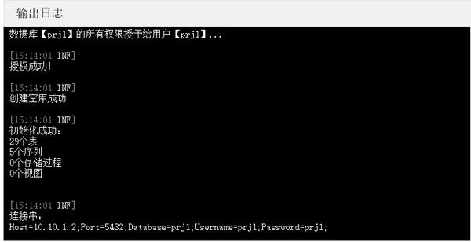

7. 选择**导入库**时将删除旧的同名表、视图等，底部日志会输出整个导入过程细节及库的连接串

　　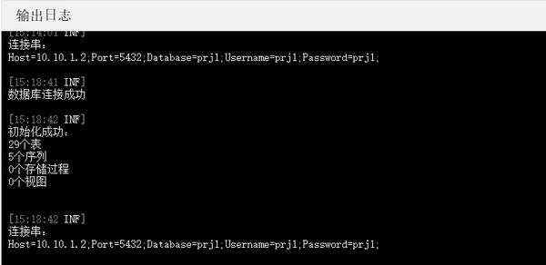

8. 数据库初始化成功后，复制新库的连接串，打开Svc项目的 etc/config/global.json 文件，将连接串粘贴到`Database`节，注意数据库类型一致。global.json 文件存储全局配置，包括应用名称、所有涉及的数据库连接串、rabbitmq配置、redis配置等，是系统内所有微服务需要的公共配置。数据库连接串可以为多个，并支持4种类型数据库，每个服务的默认库是这其中的一个。

{
  "App": "PrjName1",
  "Database": {
    "demodb": {
      "ConnStr": "User Id=PRJ;Password=prj;Data Source=(DESCRIPTION=(ADDRESS=(PROTOCOL=TCP)(HOST=10.10.1.2)(PORT=1521))(CONNECT_DATA=(SERVICE_NAME=sec)(SERVER=dedicated)))",
      "DbType": "oracle"
    }
  },
  "RabbitMq": {
    "HostName": "10.10.1.2",
    "UserName": "dt",
    "Password": "dt",
    "Port": 5672,
    "HttpPort": 15672
  },
  "Redis": "10.10.1.2,password=dt,defaultDatabase=15,allowAdmin=true"
}


1. 切换到 service.json 文件，检查确保`DbKey`节的值和 global.json 中的一致，将顶部的`Mode`节设置为`SingletonSvc`。详细参见[服务配置](/dt-docs/2基础/4服务/)

{
  // 设置运行模式，共三种，默认Svc模式
  // 1. Svc          普通微服务模式
  // 2. SingletonSvc 单体服务模式
  // 3. InitDb       初始化数据库模式
  "Mode": "SingletonSvc",

  // 默认数据源键名
  "DbKey": "demodb",
  // 服务名称
  "SvcName": "lob",

  // 是否输出所有调用的Sql语句或存储过程名
  "TraceSql": true,
  // 是否输出所有调用的Api名称
  "TraceRpc": true,
}


至此初始化数据库完毕！

## 配置客户端


搬运工客户端支持三种运行模式：单机、两层直连数据库、多层微服务
* 单机版独立运行，无服务，可使用Sqlite本地库
* 直连数据库，两层架构，无服务，不支持WebAssembly
* 多层微服务，使用自定义服务和搬运工标准服务(内核服务、消息服务、文件服务)


三种运行模式可在Shared项目的Config.json中配置

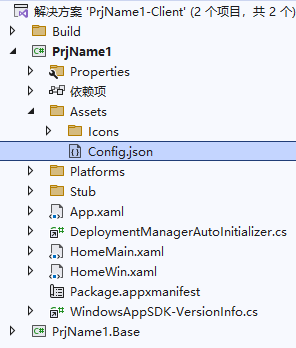


{
  "Title": "搬运工",

  // cm服务地址 或 直连数据库的键名
  "Server": "https://10.10.1.16:1234",
  //"Server": "pgdt",

  // 可直连数据库列表
  "Database": {
    "mydt": {
      "ConnStr": "Server=10.10.1.2;Port=3306;Database=dt;Uid=dt;Pwd=dt;",
      "DbType": "mysql"
    },
    "orcldt": {
      "ConnStr": "User Id=dt;Password=dt;Data Source=(DESCRIPTION=(ADDRESS=(PROTOCOL=TCP)(HOST=10.10.1.2)(PORT=1521))(CONNECT_DATA=(SERVICE_NAME=sec)(SERVER=dedicated)))",
      "DbType": "oracle"
    },
    "sqldt": {
      "ConnStr": "Data Source=10.10.1.2,1433;Initial Catalog=dt;User ID=dt;Password=dt;Encrypt=True;TrustServerCertificate=True;",
      "DbType": "sqlserver"
    },
    "pgdt": {
      "ConnStr": "Host=10.10.1.2;Port=5432;Database=dt;Username=dt;Password=dt;",
      "DbType": "postgresql"
    }
  }
}


单机模式只需要指定Title，并且AppStub继承DefaultStub


{
  "Title": "搬运工",
}


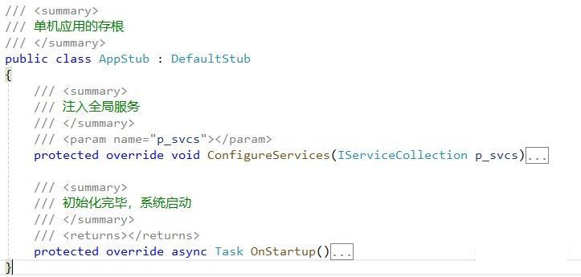

默认将配置成多层微服务模式


{
  "Title": "搬运工",

  // cm服务地址
  "Server": "https://10.10.1.16:1234"
}


## 启动服务


本项目以多层微服务模式运行，首先启动服务


1. VS打开解决方案PrjName1-svc.sln，修改etc/config/目录下的 global.json 和 service.json 文件，主要修改数据库连接串
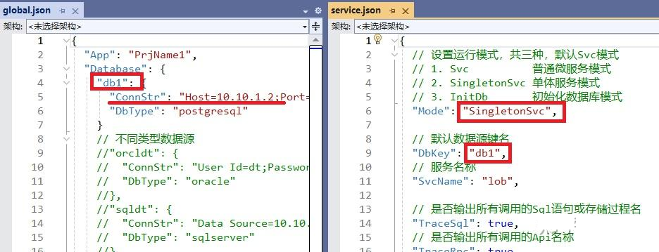

1. 确保生成成功，开始执行(ctrl + F5)，成功后会打开浏览器显示API目录页面，点击日志可查看启动过程：
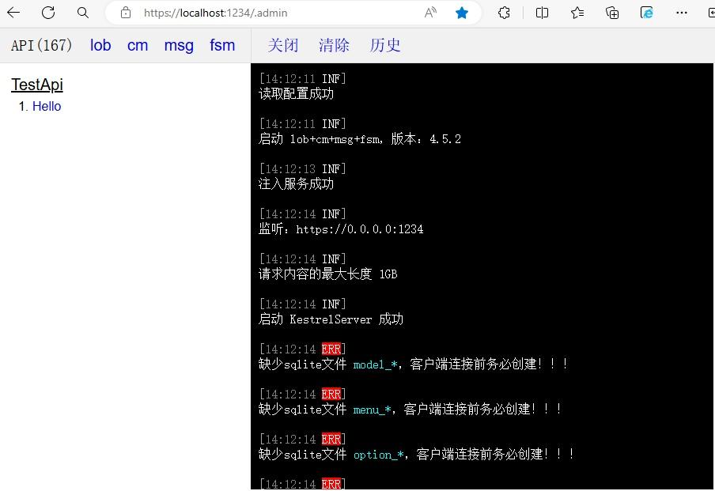

1. 初次运行服务提示缺少Sqlite文件 model_* ... ，运行cm服务的API UpdateAllSqliteFile
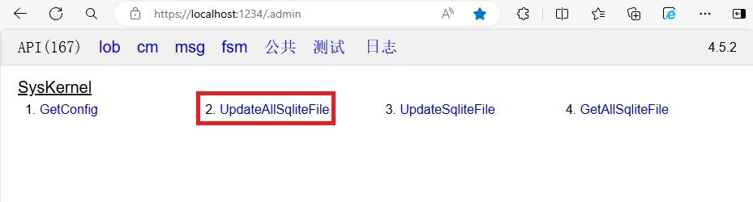
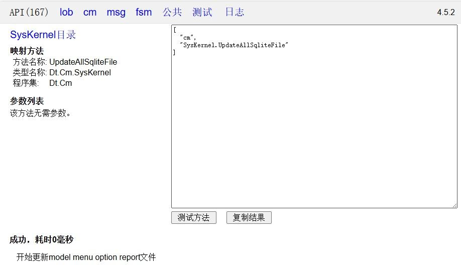
点击测试方法，将生成所有sqlite文件，日志输出：
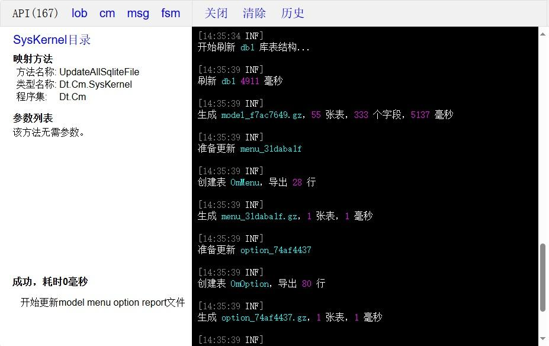

1. 始终保持服务运行状态，以便客户端App运行时连接 或 VS开发使用搬运工扩展添加框架代码时连接

1. 在客户端App运行之前，参见上一节配置客户端，需要设置服务地址，将Config.json中的Server修改为本机IP
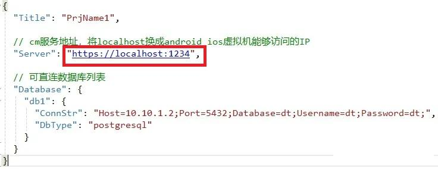

## 运行 App

### 运行 Windows App
1. VS打开解决方案PrjName1-win.sln，将PrjName1.Win项目设置为启动项目，F5启动调试，初次运行会显示用户协议和隐私政策对话框

　　

2. 点击同意后进入登录页面，输入预留手机号13511111111，默认密码1111，然后点击登 录，登录成功后进入主页，若失败可双击标题查看系统日志
　　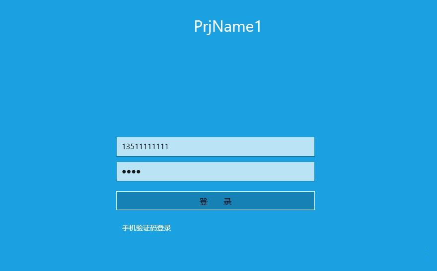

3. 登录成功后显示主页

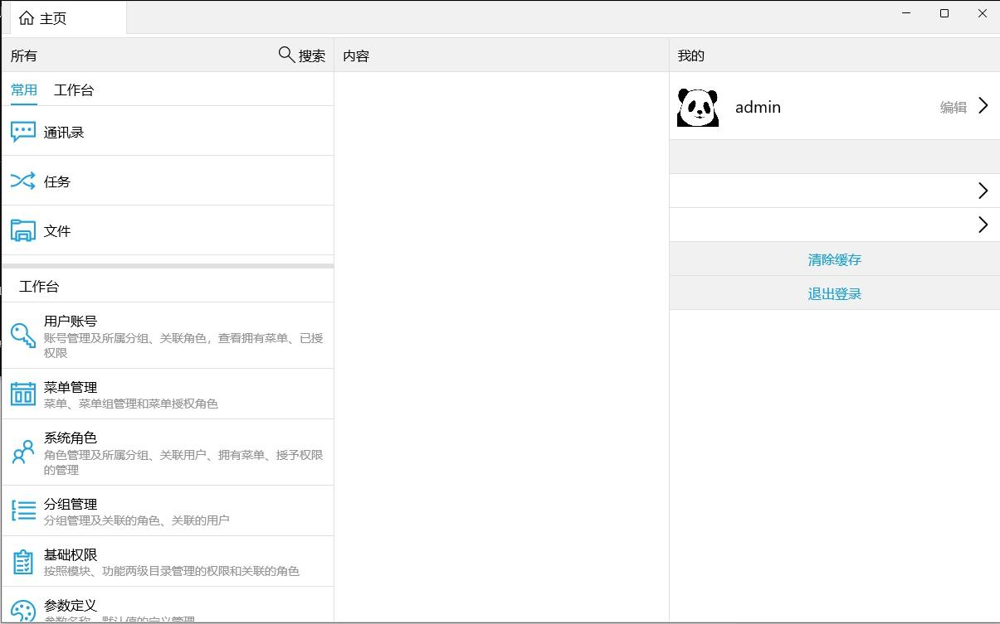

### 运行 Android App
1. 打开PrjName1-android.sln，将PrjName1.Droid项目设置为启动项目，初次运行需要添加Android设备，打开 Android -> Android设备管理器 添加设备，创建虚拟机时采用以下镜像不需要另外下载
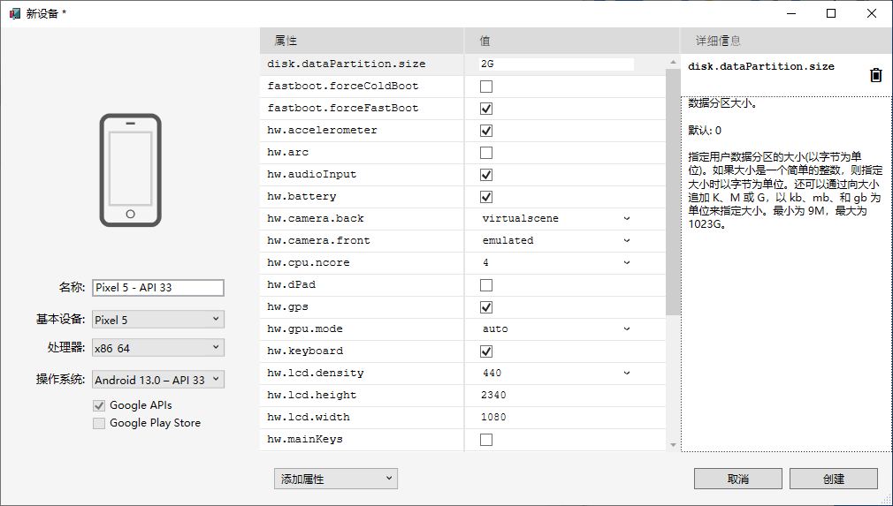

1. F5启动调试，和Windows App相同，初次运行会显示用户协议和隐私政策对话框，登录成功后进入主页
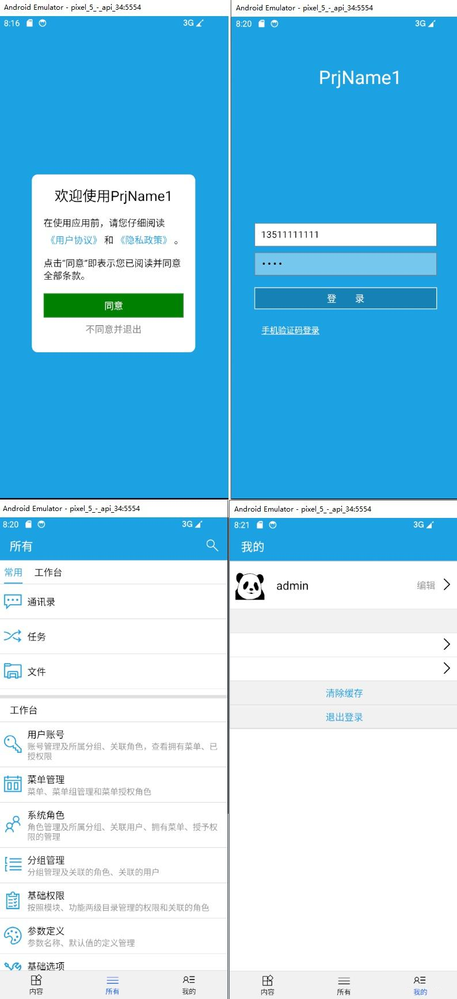

### 运行 iOS App
1. 运行 iOS App首先要有台mac设备，mac上环境的安装也得大半天，详细过程参见[与 Mac 配对进行 iOS 开发](https://learn.microsoft.com/zh-cn/dotnet/maui/ios/pair-to-mac?view=net-maui-7.0)

1. 目前在`VS17.4.3`上仍然无法在windows上远程显示模拟器，在 `工具 -> 选项` 中设置
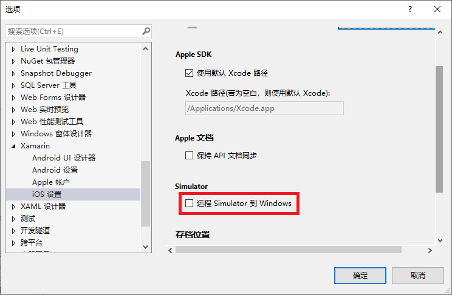

1. 打开PrjName1-ios.sln，将PrjName1.iOS项目设置为启动项目，F5启动调试，在mac中的模拟器上运行，和Android App相同

### 运行Skia App
1. 打开PrjName1-skia.sln，该方案包含两个可启动项目：PrjName1.Gtk、PrjName1.Wpf，PrjName1.Gtk可运行在linux windows上，PrjName1.Wpf可运行在win10以前的老版本windows上，若在windows上运行gtk应用，请参照 [Using the Skia+GTK head](https://platform.uno/docs/articles/features/using-skia-gtk.html?tabs=windows%2Cubuntu1804) 安装运行时。

1. 两个app运行效果除缺少部分动画外其它和Windows App相同

### 运行 Web App
1. 打开PrjName1-wasm.sln，将PrjName1.Wasm项目设置为启动项目

1. 初次生成Wasm项目前还需要很多准备工作，包括安装Python、下载并安装 Emscripten sdk (2G多)、下载.net针对Wasm的运行时，除安装Python外，其余两项可在初次生成Wasm项目前自动下载并安装，但因网络不稳定，并且自动安装失败不报错误，造成无法编译时让人摸不着头脑，希望道友们耐心坚持

1. 若生成成功，您太幸运了 ！贫道流下羡慕的泪水，摸索到这一步经历太多的辛酸，如 [编译时间26分钟](https://github.com/unoplatform/Uno.Wasm.Bootstrap/issues/326)

1. F5启动调试，和Windows App相同，初次运行会显示用户协议和隐私政策对话框，登录成功后进入主页


恭喜您，跨平台空应用创建成功！

