## 创建项目
1. 选择搬运工模板

1. 使用默认选项创建应用

1. 单击创建按钮

1. 等待创建项目并还原其依赖项，因初次需要下载依赖包，网速慢的请多等会:skull:

1. 编辑器顶部的横幅可能会要求重新加载项目，单击“重新加载项目”：

1. 至此项目创建成功！

## 初始化数据库
搬运工平台包含`cm fsm msg`三个基础微服务，这些服务包括基础菜单、用户、角色、权限、工作流、参数、文件等功能模块，是平台必不可少的基础服务，这些服务用到的数据结构需要在此初始化。

1. 打开Svc项目中的 etc/config/service.json 文件，将顶部的`Mode`节设置为`InitDb`，初始化数据库模式：
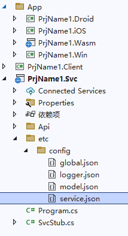

{
  // 设置运行模式，共三种，默认Svc模式
  // 1. Svc          普通微服务模式
  // 2. SingletonSvc 单体服务模式
  // 3. InitDb       初始化数据库模式
  "Mode": "InitDb",

}


1. 将Svc项目设置为启动项目，ctrl + F5 启动服务，自动打开 https://localhost:1234/.admin 页面:
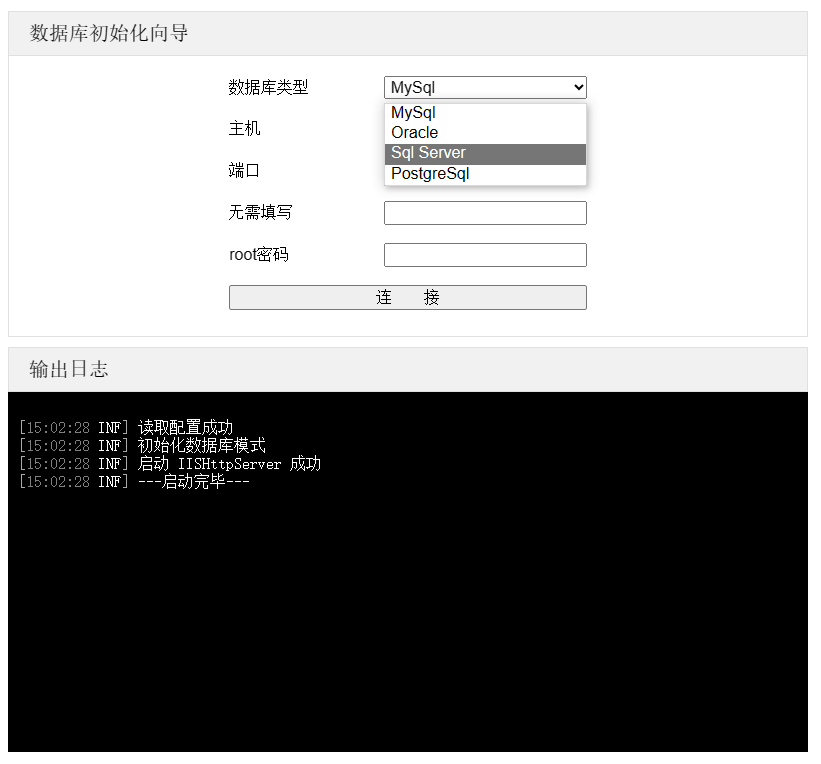

1. 选择您需要的数据库类型，填写连接参数，每种库的参数略有不同，点击`连接`按钮
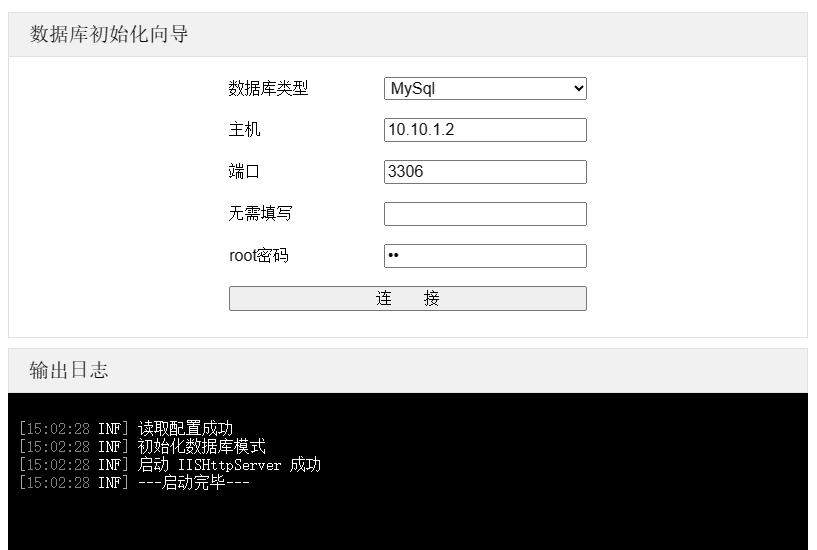

1. 连接失败时给出提醒，连接成功后进入创建新库页面
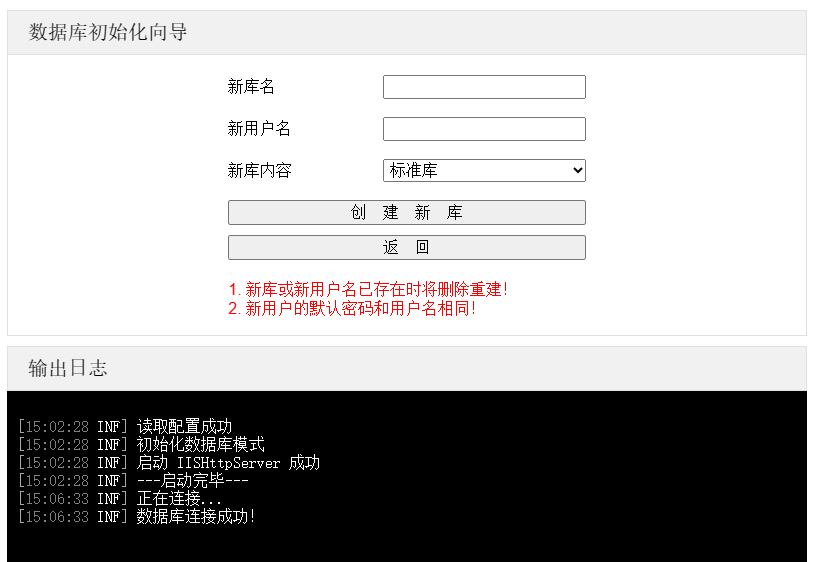

1. 填写新库名及新用户名，选择新库内容：
* `标准库`是搬运工的初始库，包括基础的表、视图、序列、存储过程等；
* `空库`就是只创建新库，无任何内容；
* `样例库`是搬运工样例使用的库，除标准库的内容外，还包括测试数据、样例用到的表、视图等；
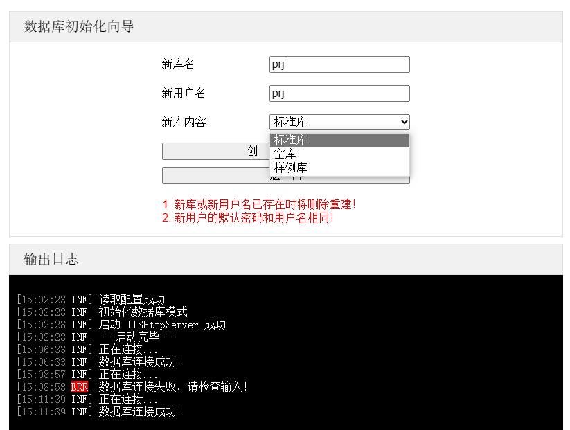

6. 点击`创建新库`，若库已存在，提示确认是否删除旧库重新创建，避免误操作，底部的日志会输出整个初始化过程及新库的连接串：
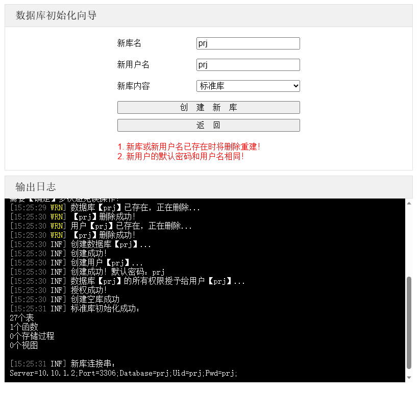

1. 数据库初始化成功后，复制新库的连接串，打开Svc项目的 etc/config/global.json 文件，将连接串粘贴到`Database`节，注意数据库类型一致。global.json 文件存储全局配置，包括应用名称、所有涉及的数据库连接串、rabbitmq配置、redis配置等，是系统内所有微服务需要的公共配置。数据库连接串可以为多个，并支持4种类型数据库，每个服务的默认库是这其中的一个。

{
  "App": "PrjName1",
  "Database": {
    "demodb": {
      "ConnStr": "User Id=PRJ;Password=prj;Data Source=(DESCRIPTION=(ADDRESS=(PROTOCOL=TCP)(HOST=10.10.1.2)(PORT=1521))(CONNECT_DATA=(SERVICE_NAME=sec)(SERVER=dedicated)))",
      "DbType": "oracle"
    }
  },
  "RabbitMq": {
    "HostName": "10.10.1.2",
    "UserName": "dt",
    "Password": "dt",
    "Port": 5672,
    "HttpPort": 15672
  },
  "Redis": "10.10.1.2,password=dt,defaultDatabase=15,allowAdmin=true"
}


1. 切换到 service.json 文件，检查确保`DbKey`节的值和 global.json 中的一致，将顶部的`Mode`节设置为`SingletonSvc`。详细参见[服务配置](/dt-docs/2基础/4服务/)

{
  // 设置运行模式，共三种，默认Svc模式
  // 1. Svc          普通微服务模式
  // 2. SingletonSvc 单体服务模式
  // 3. InitDb       初始化数据库模式
  "Mode": "SingletonSvc",

  // 默认数据源键名
  "DbKey": "demodb",
  // 服务名称
  "SvcName": "lob",

  // 是否输出所有调用的Sql语句或存储过程名
  "TraceSql": true,
  // 是否输出所有调用的Api名称
  "TraceRpc": true,
}


1. 至此初始化数据库完毕！

1. 查看Svc项目的 Properties/InitSql/目录下的`sql脚本`，也可以通过手动运行这些`sql脚本`初始化数据库。
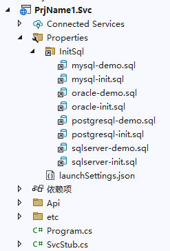

1. 通过数据库客户端工具查看初始表，4种数据库的初始结构略有不同，如mysql中无序列通过`sequence`模拟：
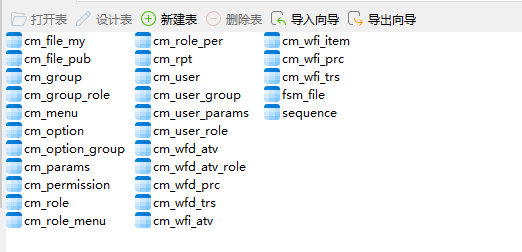

## 启动服务
1. 将Svc项目设置为启动项目，先确保服务能正常运行，以便客户端连接和使用搬运工扩展添加框架代码
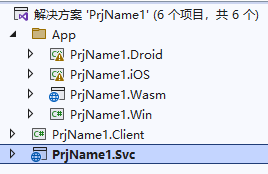

1. 生成Svc项目，确保生成成功

1. 开始执行(不调试)(Ctrl + F5)，成功后会打开浏览器显示API目录页面，点击日志可查看启动过程：
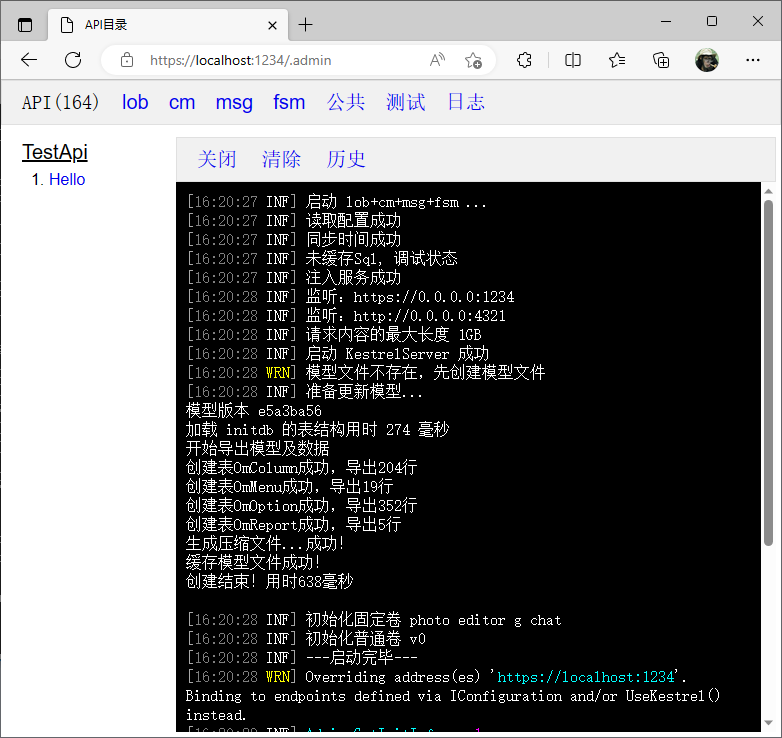

1. 始终保持Svc运行状态，以备客户端App运行时连接


在客户端App运行之前，需要设置服务地址，打开Client项目的 `Stub/AppStub.cs` 文件，将SvcUrl修改为本机IP
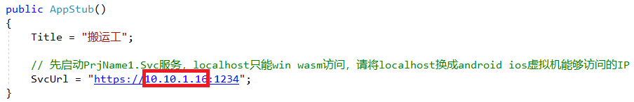


## 运行 Windows App
1. 将Win项目设置为启动项目，F5启动调试，初次运行会显示用户协议和隐私政策对话框

1. 点击`同意`后进入登录页面，输入预留手机号 `13511111111` ，点击`获取验证码`后，在`验证码`框内 Ctrl + v粘贴，然后点击`登 录`，登录成功后进入主页，若失败可双击标题查看系统日志
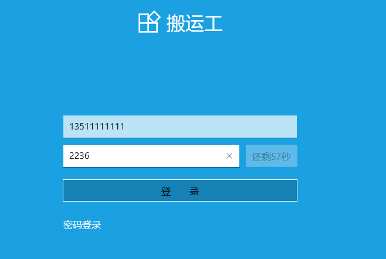

1. 登录成功后显示主页

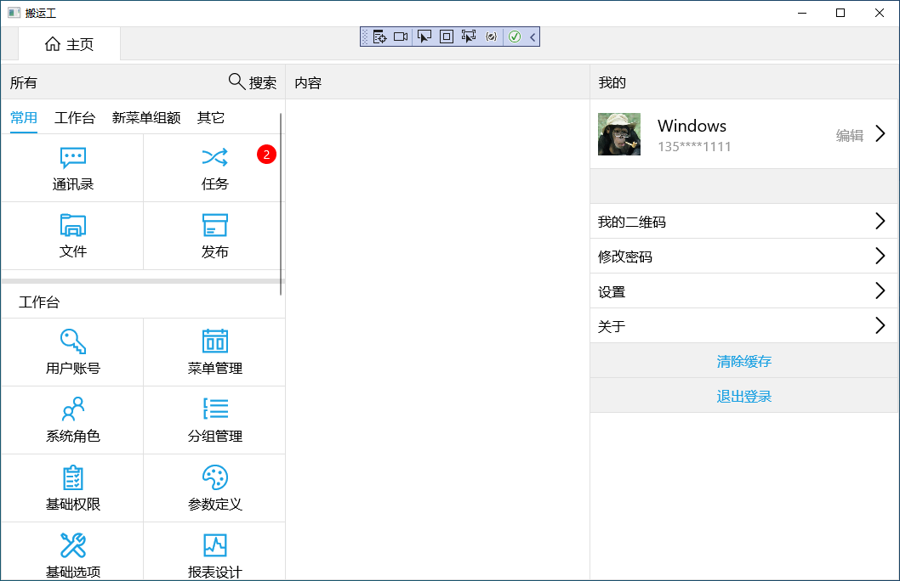

## 运行 Android App
1. 将Droid项目设置为启动项目，初次运行需要添加Android设备，打开 `Android -> Android设备管理器` 添加设备，创建虚拟机时采用以下镜像不需要另外下载

1. F5启动调试，和Windows App相同，初次运行会显示用户协议和隐私政策对话框，登录成功后进入主页
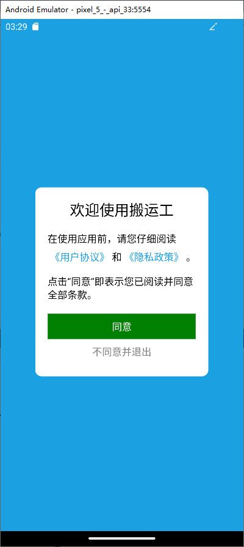
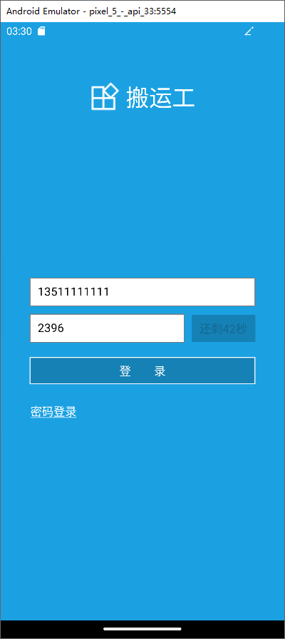
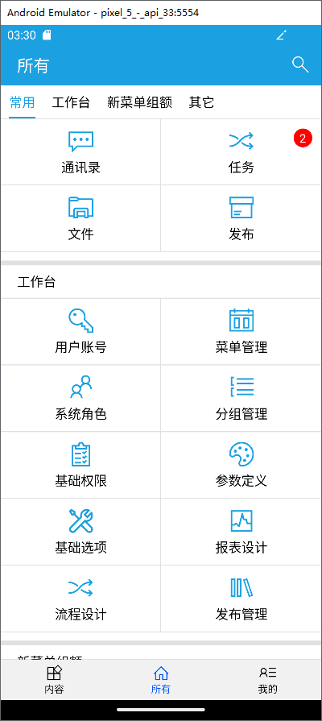
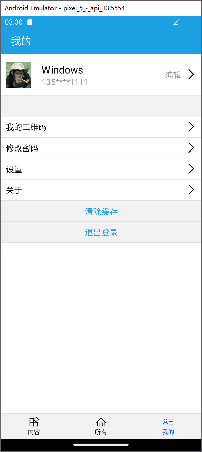

## 运行 iOS App
1. 运行 iOS App首先要有台mac设备，mac上环境的安装也得大半天，详细过程参见[与 Mac 配对进行 iOS 开发](https://learn.microsoft.com/zh-cn/dotnet/maui/ios/pair-to-mac?view=net-maui-7.0)

1. 目前在`VS17.4.3`上仍然无法在windows上远程显示模拟器，在 `工具 -> 选项` 中设置

1. F5启动调试，在mac中的模拟器上运行，和Windows App相同
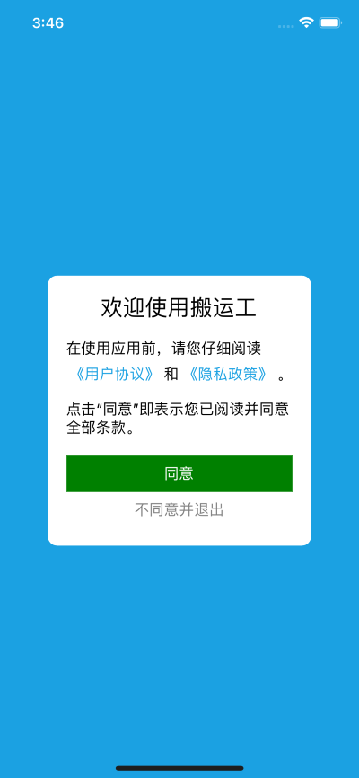
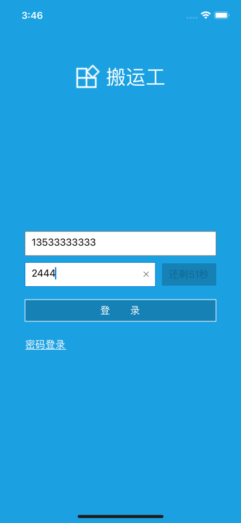
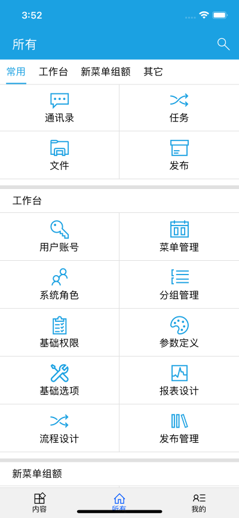
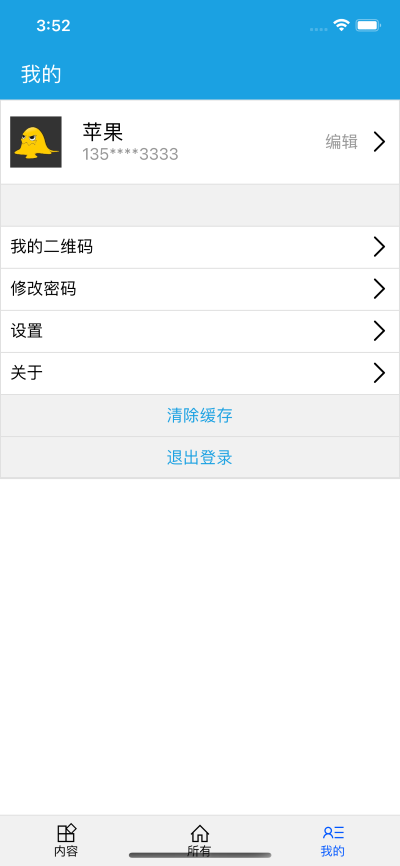

## 运行 WebAssembly App
1. 初次生成Wasm项目前还需要很多准备工作，包括 `安装Python`、下载并安装 `Emscripten sdk` (2G多)、下载 `.NET针对Wasm的运行时`，除`安装Python`外，其余两项可在初次生成Wasm项目前自动下载并安装，但因网络不稳定，并且自动安装失败不报错误，造成无法编译时让人摸不着头脑。为了提高初次运行体验，道友们可省去以上所有准备工作，直接下载 [.net for wasm + sqlite压缩包](https://github.com/daoting/dt/releases/latest)，此压缩包已合并sqlite库，生成Wasm项目时不再需要`Emscripten`编译sqlite的静态库.a文件，将下载的压缩文件放在固定目录，并`编辑Wasm项目文件`，修改sdk路径
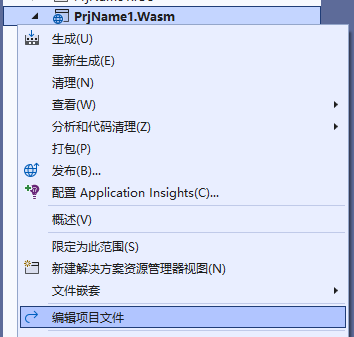
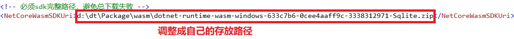

1. 将Wasm项目`设为启动项目`并生成，若生成成功，您太幸运了🎉！贫道流下羡慕的泪水，摸索到这一步经历太多的辛酸，如 [编译时间26分钟](https://github.com/unoplatform/Uno.Wasm.Bootstrap/issues/326)
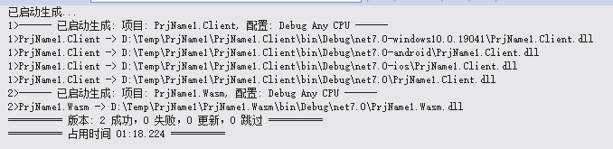

1. F5启动调试，和Windows App相同，初次运行会显示用户协议和隐私政策对话框，登录成功后进入主页
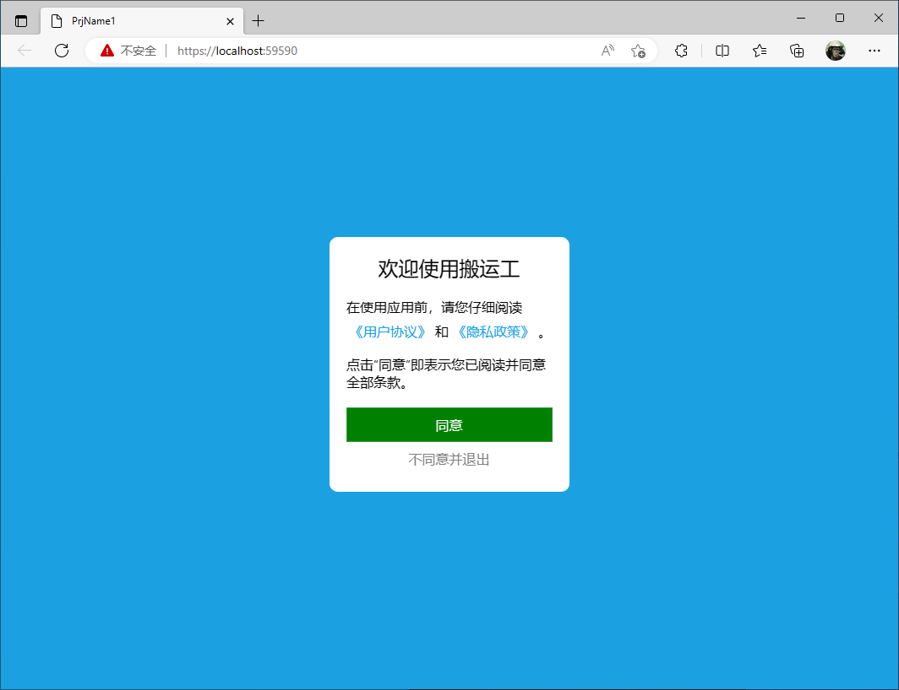
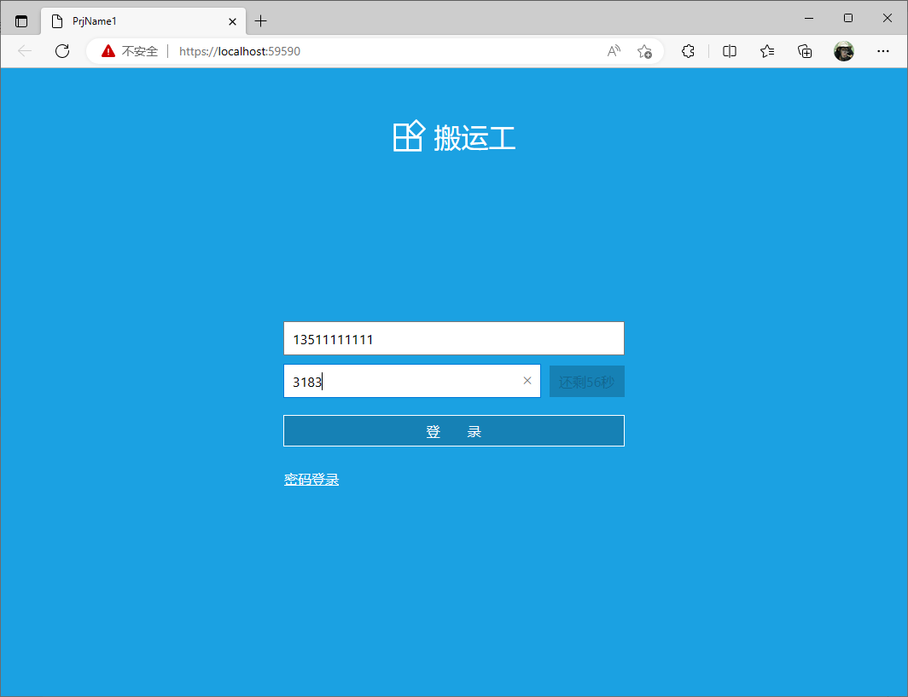
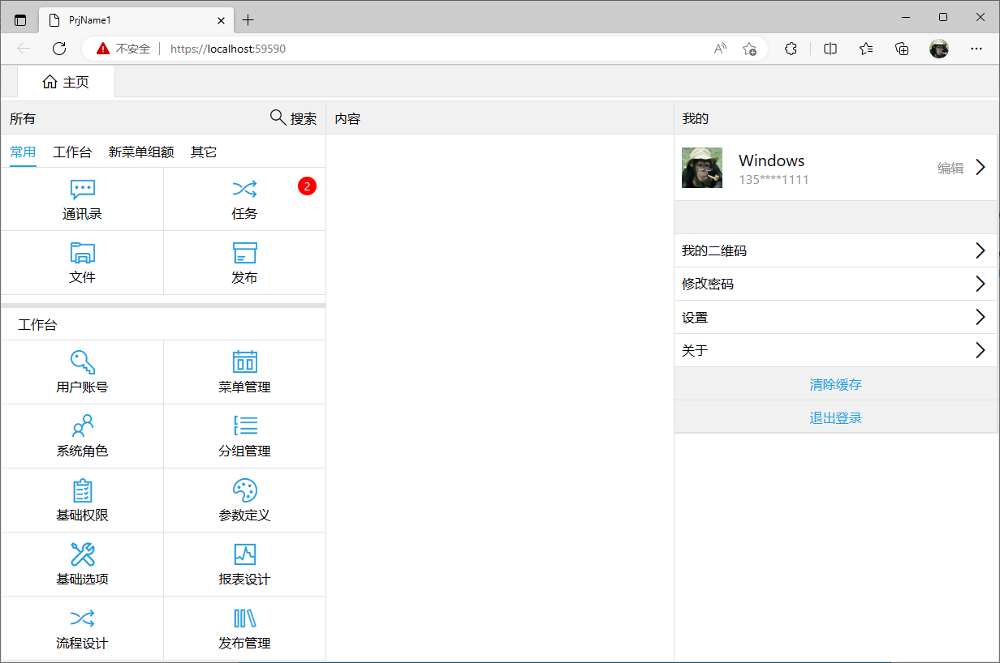


恭喜您，跨平台空应用创建成功！

