入手一个新框架，大家总想通过实现简单功能以管中窥豹，下面就演示利用VS扩展中的代码框架进行增删改查的三个例子，这些例子也可参见搬运工样例。

## 初始化样例库
演示前先初始化样例库，参见[创建空项目时的初始化数据库](/dt-docs/docs/1开始/2创建项目/#初始化数据库) 的设置，唯一不同是新库内容选择`样例库`，后续过程也相同，直到启动该服务。
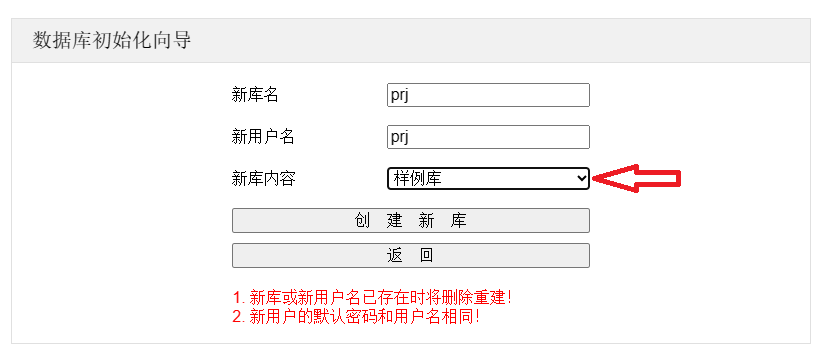


请始终保持Svc运行状态，VS扩展工具会使用该服务


## 单实体框架
1. 该实例演示单表增删改查的功能

1. 在Client项目中添加目录`单实体\Domain`，右键选择`搬运工 -> 实体类`
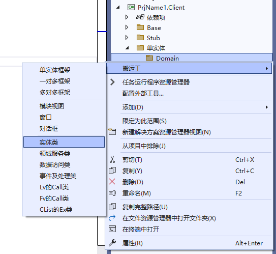
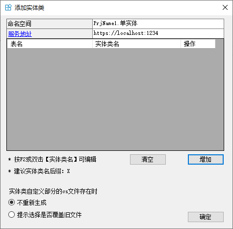

1. 点击`增加`，选择表`demo_基础`，点击`确定`，生成实体类`基础X`，该类有两个文件组成，参见[实体类详细]()
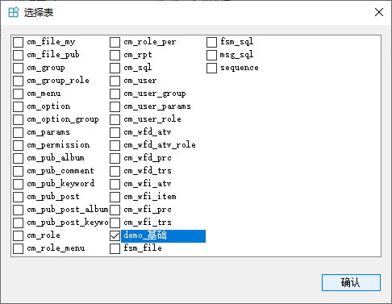
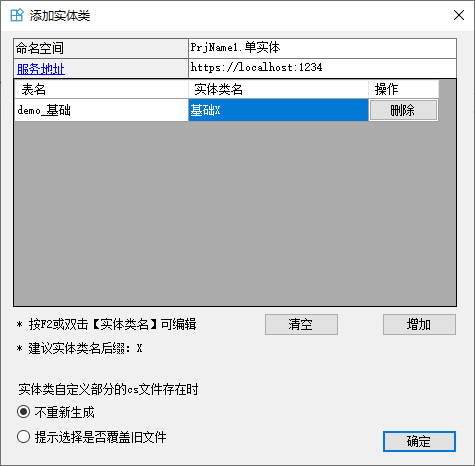
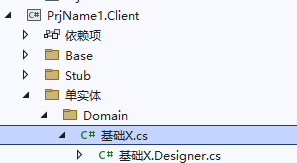

1. 添加代码框架，右键选择`搬运工 -> 单实体框架`，点击`选择`，选择表`demo_基础`，点击`确认`，生成框架文件
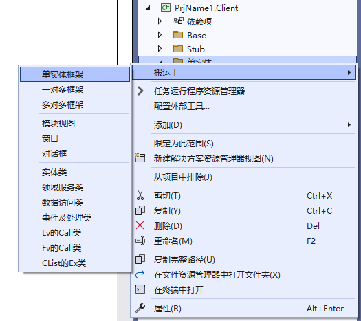
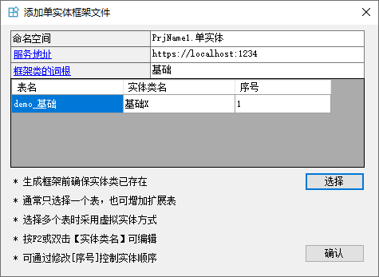
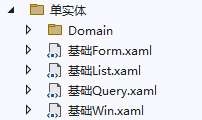

1. 将Win项目设置为启动项目，F5启动调试，登录成功后在`主页`左侧菜单中点击`菜单管理`，然后增加菜单`单实体`，视图名称`基础Win`，确保和功能主窗口中View标签名相同，成功保存后右下提示需要`更新模型`，点击`更新模型`，如下图所示：
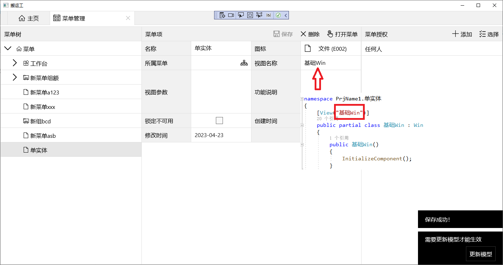

1. 将菜单授权`任何人`，关闭并重新启动应用，登录成功后在`主页`左侧菜单中点击`单实体`，将显示单表的增删改查窗口
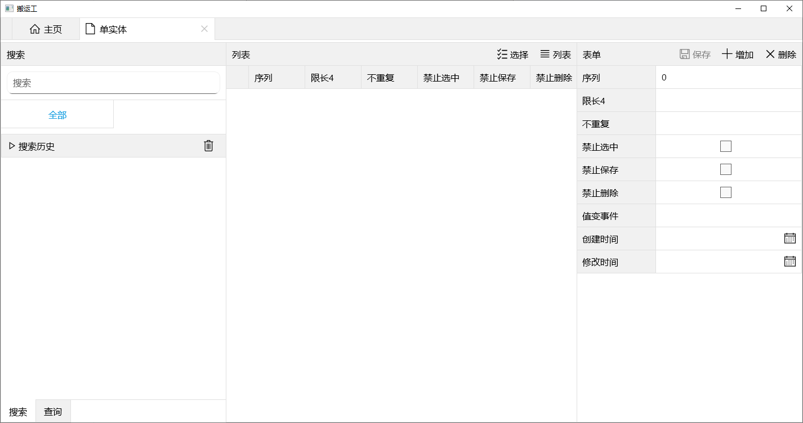

1. 将其他Droid iOS 或 Wasm项目设置为启动项目，同样可运行`单实体`功能

## 一对多框架
1. 该实例演示一对多父子表增删改查的功能

1. 在Client项目中添加目录`一对多\Domain`，右键选择`搬运工 -> 实体类`，点击`增加`，选择表`demo_父表 demo_大儿 demo_小儿`，点击`确定`，生成三个实体类
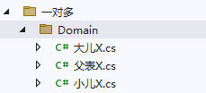

1. 添加代码框架，右键选择`搬运工 -> 一对多框架`，`父实体`点击`选择`表`demo_父表`，`子实体`选择`demo_大儿 demo_小儿`，将`demo_小儿`的父主键名称修改为`GroupID`，点击`确认`，生成框架文件
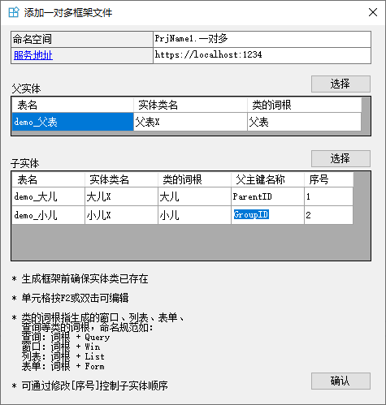
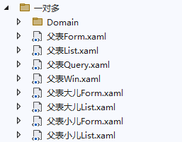

1. 和[单实体框架](#单实体框架)相同，生成启动项目、添加菜单项(视图名称和主窗口标签名称相同)、菜单授权后，就可打开`一对多`窗口查看默认功能
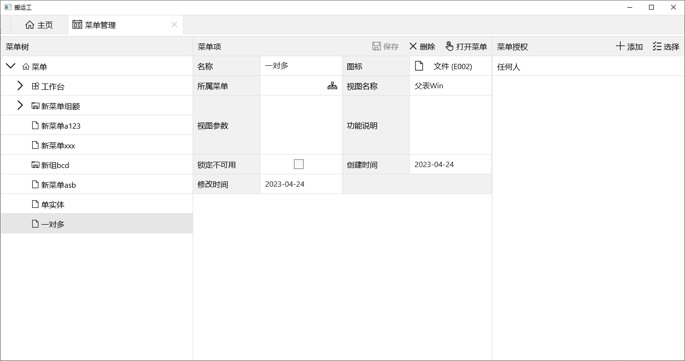
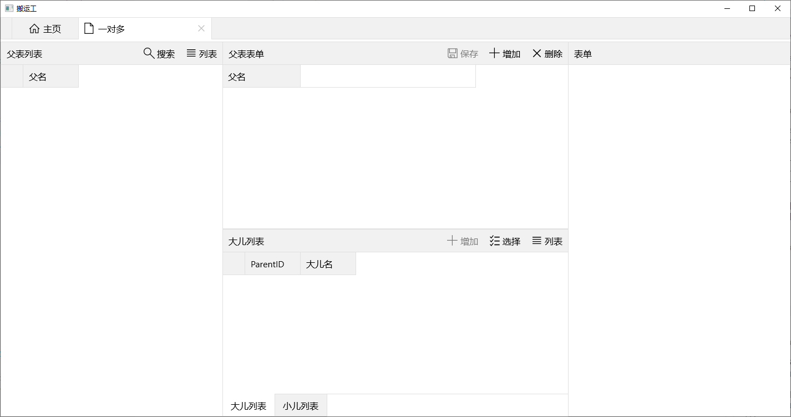

1. 运行其他平台的App项目，打开`一对多`查看默认功能

## 多对多框架
1. 该实例演示多对多关系表的增删改查功能，用户和角色、权限和角色、角色和用户及权限都是多对多关系，分别以用户、角色、权限为主体实现管理功能。

1. 在Client项目中添加目录`多对多\Domain`，右键选择`搬运工 -> 实体类`，点击`增加`，选择表`demo_角色 demo_用户 demo_权限 demo_角色权限 demo_用户角色`，点击`确定`，生成五个实体类
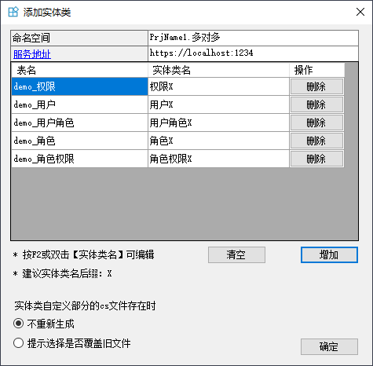
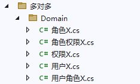

1. 添加以`角色`为主体的代码框架，添加目录`多对多\角色`，右键选择`搬运工 -> 多对多框架`，`主实体`点击`选择`表`demo_角色`，`关联实体`选择`demo_用户 demo_权限`，`中间实体`选择`demo_角色权限 demo_用户角色`，完善`中间实体`的外键字段名，确保`关联实体`和`中间实体`的表顺序对应，点击`确认`，生成框架文件
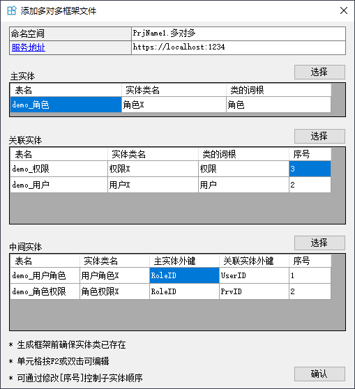
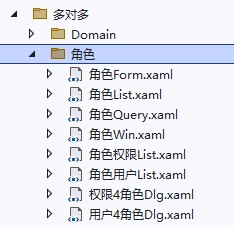

1. 添加以`权限`为主体的代码框架，添加目录`多对多\权限`，右键选择`搬运工 -> 多对多框架`，`主实体`点击`选择`表`demo_权限`，`关联实体`选择`demo_角色`，`中间实体`选择`demo_角色权限`，完善`中间实体`的外键字段名，点击`确认`

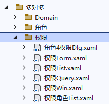

1. 添加以`用户`为主体的代码框架，添加目录`多对多\用户`，右键选择`搬运工 -> 多对多框架`，`主实体`点击`选择`表`demo_用户`，`关联实体`选择`demo_角色`，`中间实体`选择`demo_用户角色`，完善`中间实体`的外键字段名，点击`确认`
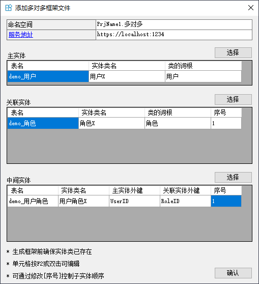
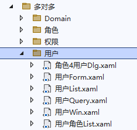

1. 和[单实体框架](#单实体框架)相同，生成启动项目、添加三个菜单项(`用户管理 角色管理 权限管理`)、菜单授权后，点击`更新模型`，重启应用即可测试这三个菜单项
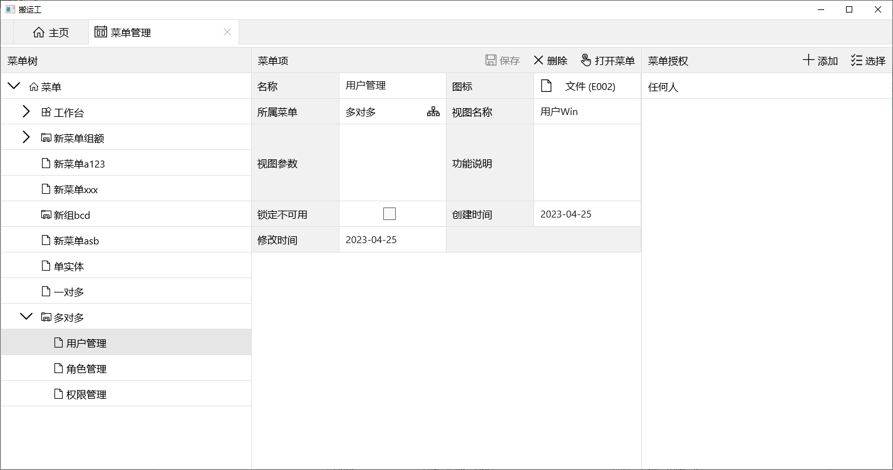
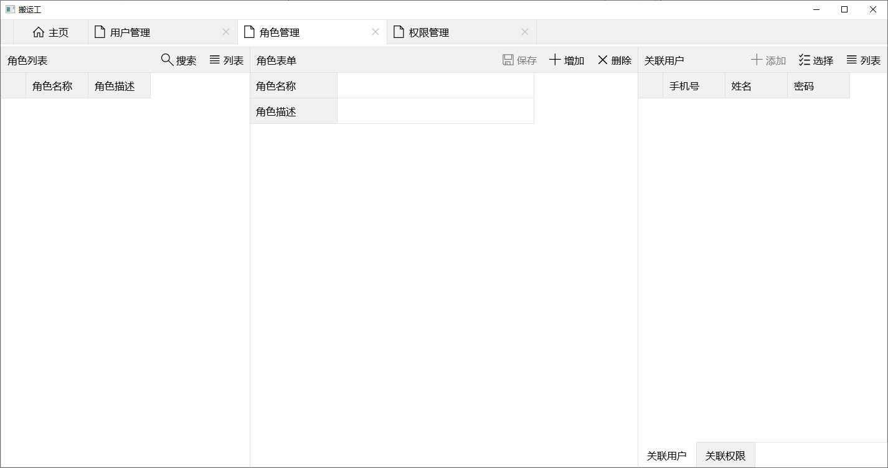


以上三个例子都是通过VS扩展工具中提供的基础框架自动生成的，这只适用于普通场景，个性化需求还得靠自定义实现，VS扩展中的框架通常用来生成单表、一对多、多对多等不同模式的基础结构，然后在此基础上进行修改以满足需求。
