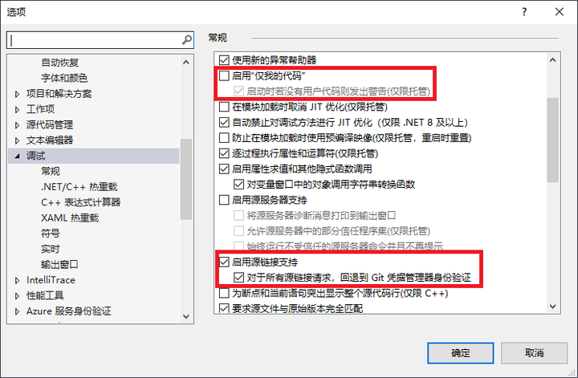
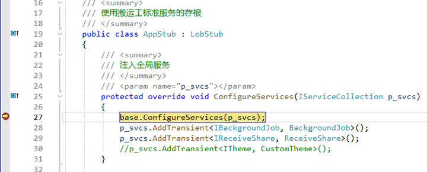
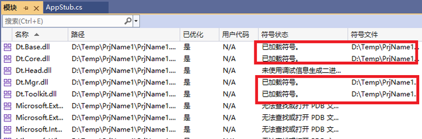
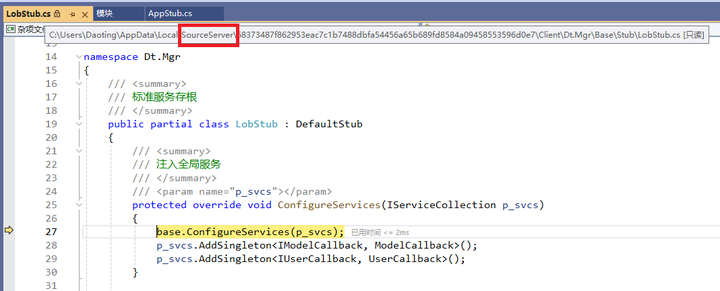
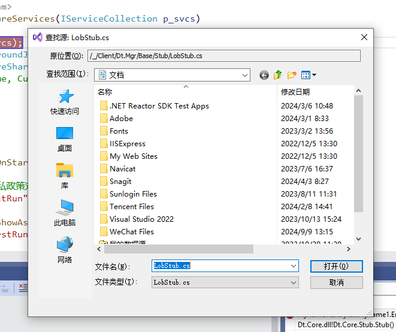

有两种方式调试搬运工源码
1. 以 [SourceLink](https://github.com/dotnet/sourcelink/) 方式直接调试dt的nuget包，Dt.Infras Dt.Service Dt.Client包都支持

2. 将dt源码下载到本地，将dt源码项目添加到目标解决方案中进行调试

不推荐第二种方式，将dt源码项目添加到目标解决方案会增加资源占用，编译、启动、调试都显著变慢，并且dt源码的版本需要手动同步，增加很多重复无聊工作。

还有一种极端的情况，自己修改dt代码、打包，项目中引用自己的包。这是一种纯吸血的自私行为，发现小bug或增加小功能自己解决，也不提交，解决不了的等更新，完全违背开源精神，是所有开源项目抵触的行为。这种情况遇到bug时需要首先排除自己的原因，而且dt在打包时有很多附加处理，比如.pdb文件中调试路径等，所以这种情况请跳过本节内容，自行解决调试过程。

下面介绍以 [SourceLink](https://github.com/dotnet/sourcelink/) 方式调试dt包的过程

## 调试设置
打开VS -> 工具 -> 选项 -> 调试，按如下设置：

dt的所有包已包含针对不同平台的.pdb文件，**无需选择启用源服务器支持**。

## 开始调试
以搬运工模板创建的空项目为例，打开Win平台解决方案PrjName1-win.sln，设置断点，启动调试

查看模块是否加载dt调试符号

F11进入方法

LobStub.cs是自动从github下载的源码，按照版本存在本地，下次调试不用重复下载。当无法连接github时会出现以下提示

点击取消会自动调试反编译代码，这种情况通常是国内访问github受限的原因，可以使用github加速神器FastGithub。

## 项目设置

以 [SourceLink](https://github.com/dotnet/sourcelink/) 方式调试需要.pdb符号文件，默认VS不自动将包中的.pdb文件复制到输出目录，需要在App项目中添加`<CopyDebugSymbolFilesFromPackages>true</CopyDebugSymbolFilesFromPackages>`设置，对于除WinUI的其它App项目就可以正常调试了。

但WinUI的App项目仍无法调试，因msix打包后子目录Appx是实际的运行根目录，打包时并未复制.pdb文件到Appx目录，试过很多方法都无法完美解决，最后在Microsoft.AppxPackage.Targets中找到方法，需要在App项目中另外添加`<AppxPackageIncludePrivateSymbols>true</AppxPackageIncludePrivateSymbols>`设置，没有在微软的文档中看到该设置，算是原创吧。 

通过搬运工模板创建的项目无需以上设置，其它平台调试方法相同。

