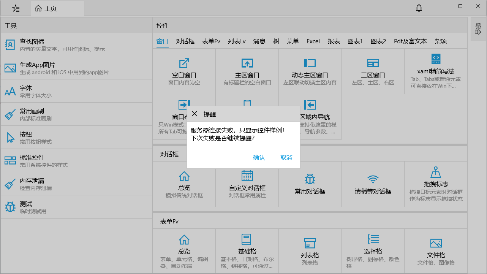

在运行搬运工样例之前，请参照[开发环境](/dt-docs/1开始/1开发环境/)完成先决条件的安装，然后根据以下顺序运行并调试搬运工样例：

## GitHub库
dt项目有多个分支，用到的主要是master infras分支

* master分支包含Client Service Demo三个子目录，分别是搬运工客户端、服务端、样例。
* infras分支是Dt.Infras包的源码，包含搬运工客户端 Excel Chart Pdf等基础控件，因被第三方警告，[可能用到的部分模型代码未经授权](https://github.com/Daoting/dt/issues/102)，故采取分支的方式提供给大家，好东西要分享！

因此
1. 要运行或调试搬运工样例请在本地克隆或下载 [dt 库](https://github.com/daoting/dt) 的master分支
2. 要运行或调试Excel Chart Pdf等基础控件请在本地克隆或下载 [dt 库](https://github.com/daoting/dt) 的infras分支


* 如果只把搬运工当作一套客户端控件库，不使用搬运工服务和基础设施，请参考 [只用控件](#只用控件)
* 若使用整个搬运工平台请从 [初始化数据库](#初始化数据库) 开始


## 只用控件
若只想查看控件样例，可以不初始化数据库、不启动服务、不进行任何配置。

VS打开解决方案Demo\Demo-win.sln，将Demo.Win项目设置为启动项目，F5启动调试，因服务未运行无法连接，连接超时后只显示控件样例页面。

Demo.UI是控件样例项目，在控件样例主页选择任意控件即可进行功能测试，设置断点可跟踪调试控件运行过程，详细调试过程请参考 [调试搬运工](/dt-docs/1开始/3调试搬运工)

## 初始化数据库
和创建新项目相同，首先需要初始化数据库，采用客户端方式初始化，[参见更多初始化方式](/dt-docs/1开始/2创建项目/#初始化数据库)

通过客户端初始化数据库没有连接服务，是纯粹的两层结构，直连数据库


1. VS打开解决方案Demo\Demo-win.sln，将Demo.Win 项目设为启动项目，ctrl + F5 启动应用，因为未启动服务，所以客户端启动后会提示服务器连接失败。

2. 按下快捷键：ctrl + enter 唤出系统面板，点击数据库初始化

3. 显示数据库初始化向导，选择您需要的数据库类型，系统支持四种类型的数据库mysql oracle sqlserver postgresql，填写连接参数，每种库的参数略有不同，点击连接按钮，以postgresql为例

4. 连接失败时给出提醒，连接成功后新页面 

5. 填写库名及用户名、密码，三个按钮的功能：
* 创建新库将 将删除旧库重新创建新库
* 删除库 即删除当前存在的旧库、用户、表空间等，慎用！
* 连接库导入 表示用当前的用户名、密码登录该库，执行sql脚本

6. 选择创建新库时，若库或用户已存在，将提示确认是否删除旧库重新创建，为避免误操作需要3次确认，底部日志会输出整个创建过程及创建空库成功的消息

7. 点击 **连接库导入** 进入新页面，两个按钮：导入初始表结构及数据、导入其它

 

8. 点击 **导入其它** 选择`Demo\InitSql\postgresql-demo.sql`脚本文件，该脚本是搬运工样例的初始化脚本

 

至此初始化数据库完毕！

## 配置客户端
参见 [创建新项目时的配置客户端](/dt-docs/1开始/2创建项目/#配置客户端)

## 启动服务
参见 [创建新项目时的启动服务](/dt-docs/1开始/2创建项目/#启动服务)

## 启动客户端
保持服务运行状态。

1. VS打开解决方案Demo\Demo-win.sln，将Demo.Win项目设置为启动项目，F5启动调试，初次运行会显示用户协议和隐私政策对话框

 

2. 若服务未运行或客户端配置无法连接，连接超时后只显示控件样例页面，**所以若只想查看控件样例，也可以不初始化数据库、不启动服务、不进行任何配置**

 

3. 点击同意后进入登录页面，输入预留手机号13511111111，默认密码1111，然后点击登 录，登录成功后进入主页，若失败可双击标题查看系统日志

 

4. 登录成功后显示主页

* 主页左侧是开始菜单，包含所有功能列表，支持多级菜单、收藏、搜索
* 中间是工作流的待办任务
* 右侧登录人相关的设置，在PhoneUI模式为三个标签页：所有 待办 我的

后续会详细介绍功能和操作。
