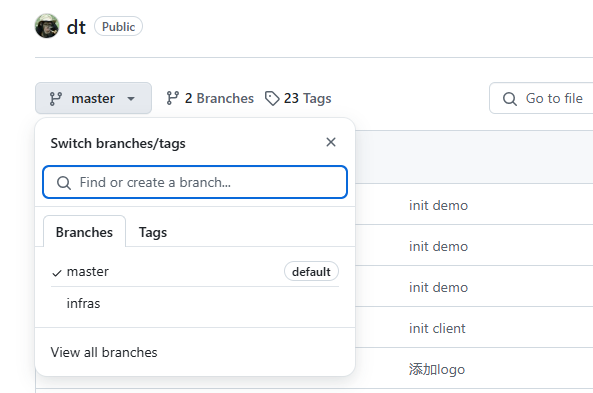
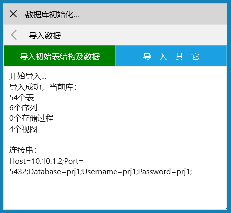

在运行搬运工样例之前，请参照[开发环境](/dt-docs/1开始/1开发环境/)完成先决条件的安装，然后根据以下顺序运行并调试搬运工样例：
## Dt 库
1. 在本地克隆或下载 [Dt 库](https://github.com/daoting/dt)，如放在 D:\Dt
1. Dt 库包含`Client Infras Service Tools Doc`五个子目录，其余为本地临时目录，各目录内容如下：

## 基础服务
1. 搬运工基础服务在`Service`目录，包括`cm fsm msg`三个微服务和`boot cosm`服务，首先要把这三个微服务跑起来。

1. 初始化数据库，系统支持四种类型的数据库`mysql oracle sqlserver postgresql`，参见[初始化样例库](/dt-docs/1开始/3小试牛刀/#初始化demo库)，初始表：

1. 这些服务支持在IIS或k8s上部署，为方便起见默认部署在IIS上，若本机未安装IIS，请参见[安装 IIS](/dt-docs/1开始/1开发环境/#安装-iis)进行安装。

1. 运行 `Dt\Service\iis\dt-setup.bat`，自动安装IIS应用池 和 Web应用

1. 以**管理员身份**运行Visual Studio，打开Service.sln，以下是各项目的内容


* [cm](/dt-docs/2基础/4服务/#内核模型服务cm)是Core Model的缩写，是内核模型服务，包括基础菜单、用户、角色、权限、工作流、参数、文件目录、发布等功能模块，是平台必不可少的基础服务。

* [fsm](/dt-docs/2基础/4服务/#文件服务fsm)是文件服务，文件服务统一管理应用范围内使用的文件，在k8s中支持多副本部署，支持分卷存储文件。

* [msg](/dt-docs/2基础/4服务/#消息服务msg)平台内置的基础消息服务，支持多副本部署。

[查看服务详细描述](/dt-docs/2基础/4服务/)


1. 和[创建空项目](/dt-docs/1开始/2创建项目/#初始化配置)的过程类似，打开每个服务的etc目录，修改global.json、service.json 文件配置，[查看服务详细配置](/dt-docs/2基础/4服务/#服务配置)

1. 将cm项目`设为启动项目`，F5启动调试，在浏览器输入 `http://localhost/dt-cm/.admin` ，打开日志

1. 打开 `D:\Dt\Service\src\Dt.Cm\Api\SysKernel.cs`，在`GetConfig`方法设置断点，在.admin页面中`测试方法`

1. 同理，确保 `http://localhost/dt-msg/.admin`  `http://localhost/dt-fsm/.admin` 服务能正常访问。至此，搬运工服务已正常运行并支持调试。

## 客户端
1. 搬运工客户端在`Client`目录，各子目录内容如下图所示：

1. 打开任何`.sln`，将`Dt.Shell.Win`项目`设为启动项目`，F5启动调试，默认显示控件样例主页

1. 在控件样例主页选择任意控件即可进行功能测试，设置断点可跟踪调试控件运行过程

1. `搬运工后台管理`提供通用的系统管理功能，包括基础菜单、用户、角色、权限、工作流、参数、文件目录、发布等功能模块，采用基于角色的访问控制(RBAC)，可通过以下两种方式启动后台管理，一种方式在主页上直接点击`切换到后台管理`，另一种方式修改启动时的Stub类型，启动后主页为后台管理主页。


搬运工后台管理需要连接基础服务，请始终保持基础服务运行状态


1. 其他平台客户端的运行请参照[创建空项目](/dt-docs/1开始/2创建项目//#运行-android-app)，过程类似。

## 基础设施
基础设施在`Infras`目录，主要包括Excel控件、Chart控件、后台任务、iOS版图片库访问等，不依赖于其它任何第三方功能，最终打包成`Dt.Infras`提供给客户端使用，各子目录内容如下图所示：

## 工具
搬运工用到的各类工具放在`Tools`目录，各子目录内容如下图所示：
