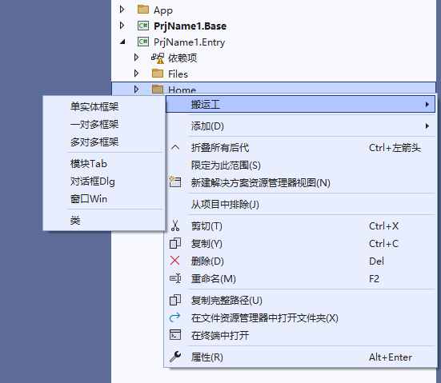
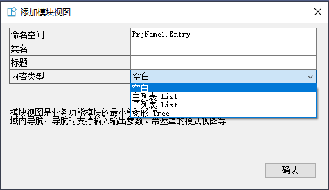
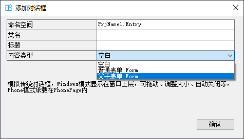
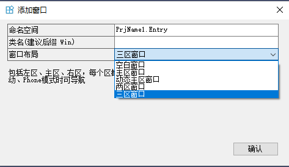
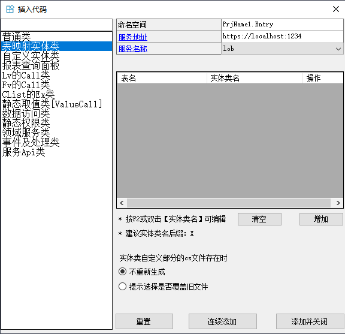
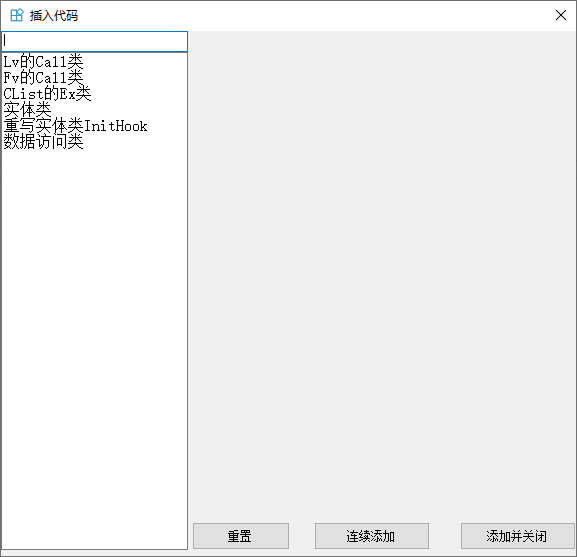
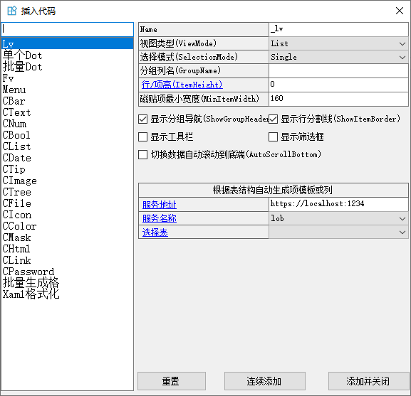
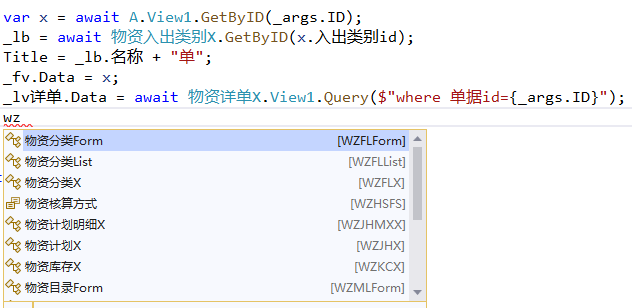
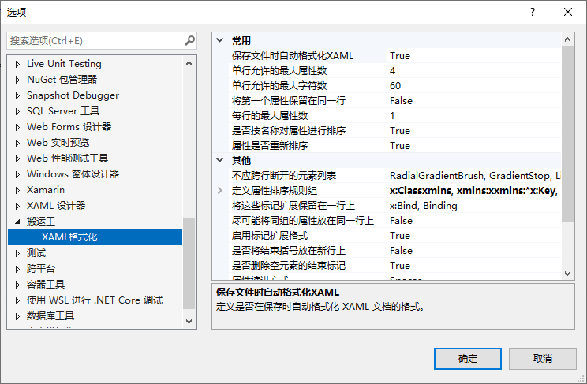

搬运工的VS扩展包括项目模板、常用代码模板、中文代码简拼助手、sql格式化、xaml格式化等功能。

## 项目模板
创建新项目或添加空项目时，选择搬运工项目模板，点击创建，显示项目模板的选项。

支持三种框架结构：
- 使用搬运工标准服务，包括通用后台管理、文件服务、消息服务等
- 直连数据库，两层架构
- 单机版应用，无服务，使用客户端Sqlite库存储

每种结构都有自己的使用场景，绝大部分场景使用第一种结构，它采用多层微服务，使用自定义服务和搬运工标准服务(内核服务、消息服务、文件服务)。

两层架构适用于客户端少的小型项目，比如十多个客户端、服务器性能差甚至没有专用服务器。

单机版适用于工具类的项目，没有互联需求，只存储简单数据。

点击创建生成新项目，详细过程参见[创建新项目](/dt-docs/1开始/2创建项目/)。

在当前解决方案中添加空项目时，选择**搬运工客户端类库**模板，点击创建。

## 设置框架
为提高生成效率，开发时可以设置单一目标框架，适配不同平台时再添加其他目标框架。
目标框架在 `Directory.Build.props` 中定义

可以手动修改，搬运工扩展提供了更方便的操作，右键解决方案 -> 设置框架

选择目标框架，点击确定，VS将重新加载整个解决方案。

## 代码模板
搬运工的VS扩展提供了大量的代码模板，有三种位置可以使用代码模板：

### 项目内的文件夹
在项目内的文件夹上右键，选择**搬运工**

单实体框架、一对多框架、多对多框架参见[视图框架](/dt-docs/4实体框架/4通用框架/)

添加模块Tab

添加对话框Dlg

添加窗口Win

添加类，左侧是类的种类，右侧是类的参数，输入参数后，点击添加按钮，自动生成代码。

### c#代码编辑器
在代码编辑器中右键选择**搬运工**，或按下快捷键`alt + 1`

若代码编辑器中已选择sql语句，按下`alt + 1`会自动格式化。

### xaml代码编辑器
在xaml代码编辑器中右键选择**搬运工**，或按下快捷键`alt + 1`

## 中文代码简拼助手
安装搬运工扩展后，VS代码智能提示自动支持中文简拼。

## xaml格式化
安装搬运工扩展后，默认会在保存xaml时自动格式化xaml代码，也可通过菜单 工具 -> 选项 -> 搬运工 -> xaml格式化，设置是否启用自动格式化以及格式化设置。

推荐保留默认设置，多人协作时能保持代码整洁。默认设置：
- 单行允许的最大属性数4，单行允许的最大字符数60，超过任何一个值时自动换行；
- 换行时，每行1个属性，对齐；
- 属性按照字母重新排序，但`x:Name ID Title Icon Text Content SrcID TgtID`排在前面；
- 结束括号不放在新行
- 自动删除空元素的结束标记
- 自闭合元素结束斜杠前有空格
- 文档根元素的属性分成多行
- ...

## sql格式化
和工具软件中的sql美化相同，便于阅读和调试。

使用方法：
在 c#代码编辑器 或 xaml代码编辑器 中选择sql语句，按下`alt + 1`会自动格式化。
