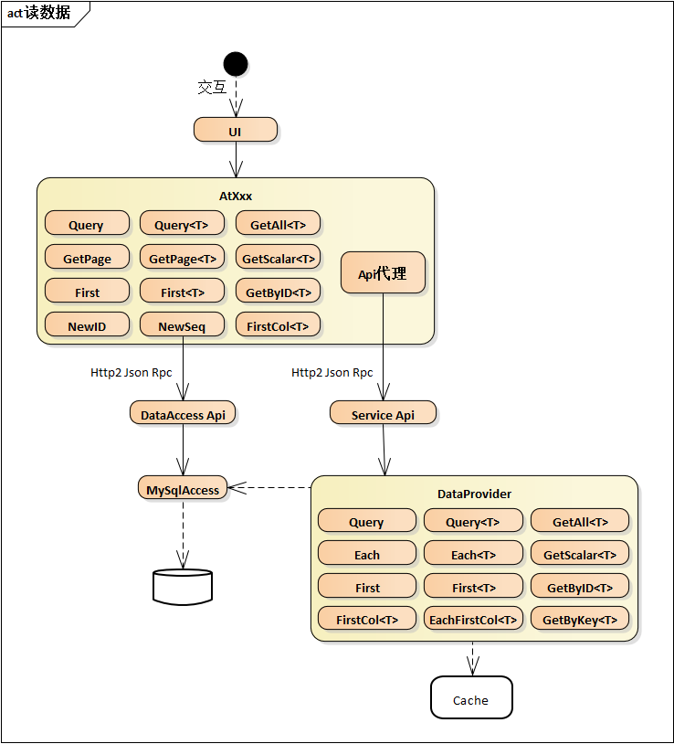

## 总体架构
本系统未严格按照某种具体的服务架构进行设计，[参见常见服务架构](#常见服务架构)，而是根据自身整体架构的特点，借鉴以上各架构的思想，比如DDD模式的领域事件、充血模式、领域服务，CQRS架构的读写分离，六边形架构的微服务API设计等，结合客户端xaml的优势，使用MVVM(Model-View-ViewModel)模式开发客户端控件，**实现客户端领域层和服务端领域层代码相同**，既可以将业务放在客户端处理也可以稍加修改放在服务端处理，完美实现技术与业务解耦、业务逻辑解耦、业务封装复用等关键功能，为开发人员提供一种易懂易用的框架风格。总体框架图：


目前平台只支持所有微服务连接同一RabbitMq、同一Redis，但每个微服务可以连接不同的数据库，详细配置参见[服务配置](/dt-docs/2基础/4服务/)。


## 客户端
###	View层
客户端采用`MVVM`模式，属于富客户端，支持App和Web，可以看作单页模式的UI，常用的xaml控件Lv Fv Tv Excel等。

###	ViewModel层
View层的这些控件都支持多种数据源类型，如Fv支持普通对象作为数据源，和Row、Entity数据源一样也实现了Fv.Changed事件、FvCell.Changed事件、淡黄色修改状态样式、支持撤销等功能；

Lv Tv支持所有实现INotifyList接口的数据源，常用数据源类型有Table、Table<TEntity>、Nl<T>等。

用户通过与这些控件的交互修改了数据，如在Fv中修改了某格的选项，在Lv中删除了某行等，但控件不包含数据持久化的功能，只是修改了数据源的值。

### 应用层
应用层一般是指*.xaml.cs中的代码，主要包括交互处理、加载数据源、调用实体扩展方法保存数据、调用领域服务处理交叉业务逻辑、调用微服务API等，应用层是UI、数据、业务逻辑、持久化等的粘合剂，虽然没有具体的实现细节，但却包含重要的交互控制功能，相当于MVC架构的控制层。

### 领域层
领域层是业务开发过程中的重要部分，包括实体、实体读写、业务逻辑、领域服务等，并且**实现客户端领域层和服务端领域层代码相同**，既可以将业务放在客户端处理也可以稍加修改放在服务端处理。但系统未采用DDD模式的聚合根、值对象、仓库等概念。详细请参见[领域层](/dt-docs/2基础/3领域层/)

### 外观层
外观层是为了屏蔽底层的实现细节，为上层提供简洁使用方法。该层通常由静态类、扩展方法等组成，比如`AtXxx`就是静态类，作为服务代理，每个服务代理对应一个微服务，如`AtCm`和`cm`服务、`AtMsg`和`msg`服务，服务代理约定的命名规则为“At + 首字母大写的服务名”，At为Access To的缩写，每个`Api`在服务代理类中都对应一个原型相同的静态方法，服务代理的主要工作是序列化请求、采用`http2`协议、`Post`方法、传输`json内容`的方式调用服务端的`Api`，返回`json结果`并将其转换成需要的类型提供给调用者，该静态方法由所属服务自动生成：

由上图可见，生成的代码已自动标记`服务名、Api、Api参数`，同时带有注释内容，`Entry.GetConfig`是`Api`的完整名称，其中`Entry`在服务端是一个类，`GetConfig`是它的方法，每个微服务可以包含多个`Api`类，用于区分`Api`的不同功能范围，如上图中`Entry`负责登录相关，`UserRoleApi`负责用户角色相关。

以上生成的静态方法属于架构图中外观层左侧的`Api`，每个服务代理`AtXxx`还负责“读数据”和“写数据”，这些读写数据的`Api`属于公共`Api`，即每个服务代理都提供的`Api`，为了使用方便，达到静态继承的目的，这部分`Api`实现的比较诡异，以`AtCm`为例看一下实现过程：
首先这部分`Api`作为静态方法放在泛型抽象类`DataProvider<T>`中：

`AtCm`继承`DataProvider<T>`，传递`AccessInfo`类型作为泛型参数：

这样在调用`AtCm.Query`时就能提交给`cm`服务，`AtMsg.Query`时就能提交给`msg`服务，`AtState.Query`时就能查询本地`sqlite`库，使用非常方便。

这些公共Api是客户端的数据访问对象，它屏蔽了sql生成、序列化反序列化、网络通信等细节，为客户端提供数据加载和持久化功能。参见架构图中部的红箭头，它们在服务端调用的是`DataAccess Api`，直接数据访问，未涉及服务端的业务逻辑、领域事件等内容，所以这部分的业务逻辑只能放在客户端处理，对于复杂的业务逻辑尽可能放在实体`Entity`中处理，也就是DDD推荐的充血模式，可参见`Dt.Mgr`中的流程设计部分，这种模式适用于大部分场景，服务端的数据访问对于前端完全透明，类似传统的直连数据库方式，系统主要功能都在客户端完成，这些公共`Api`按功能又可分为读数据和写数据，详细内容在后面陈述。

架构图中外观层还包括`EntityEx` `EntityX`的扩展方法和静态泛型方法，这些在[领域层](/dt-docs/2基础/3领域层/)已有描述。`Kit`是一个包罗万象的大静态类，涉及客户端的各个方面，不在此详述。

### 数据访问层
数据访问层是一个抽象层，对上层提供数据访问规范，对下层提供数据处理标准，主要由`IDataAccess`定义：

数据访问对象和DDD模式中数据仓库(Repository) 类似，介于领域层与基础层之间，负责数据映射、根据实体状态生成Sql、数据持久化等功能。它的存在让领域层感觉不到基础层的存在，领域层需要什么只需查询数据访问对象，不需要知道数据实际放在哪里。

客户端的数据访问对象已合并在服务代理类中，作为公共`Api`使用；服务端的数据提供者已绑定在当前`http`请求的`Bag`(私有类)中，总体架构中都已介绍，以下按照读写数据的分类进行详细说明。

#### 读数据
借鉴CQRS读写分离的原则，数据查询采用sql参数化查询的方式，既灵活、查询速度快，也和领域相关内容解耦：

读数据按位置分为两种，客户端公共`Api`读数据和服务端`DataAccess`读数据，两处的方法及参数基本相同，下面以客户端为例介绍这些方法。
客户端公共查询`Api`分三类：

1. 返回实体列表，参见下图有五个方法，`Query`和`Query<T>`两方法参数相同，Sql键名+Sql参数，返回类型为`Table`和`Table<T>`，`Page`和`Page<T>`是按页查询，除页面参数外，其他参数和`Query`相同。

1. 返回单个实体对象，主要有三个方法，`GetRow`和`Get<T>`的参数和`Query`相同，只是返回符合条件的第一行数据，`GetByID<T>`是通过主键获取实体对象，不需要Sql查询语句。

1. 查询单个值，`GetScalar<T>`是通过Sql参数查询返回第一单元格数据，`NewID`获取新ID，详见“分布式ID生成方案”一节，`NewSeq`获取新序列号，类似于oracle的sequence，自增长的序列号，一般用来存储显示顺序。

整个读数据的核心就是Sql参数化查询，它是最灵活、最直观、性能最优的查询方式，远比其他ORM生成的查询好控制。

需要特殊说明的是，通过Sql参数查询的方式，结果不管是实体列表还是单个实体，Sql语句中的列都无需和实体属性一一对应，按需查询即可，[从Row到Entity](/dt-docs/2基础/3领域层/#从row到entity)中已介绍，因为`Entity`继承自`Row`，最终使用单元格`Cell`存储数据，而实体属性只是对`Cell`的封装，当Sql查询语句中缺少或多出某些列时，能正常进行序列化、反序列化、类型转换，只是在访问缺少的属性时异常，这样增加了很大的灵活性，比如：某列内容多但不需要显示，查询时为提高性能减少数据量就可以不查询该列，但前端其他列的绑定都不受影响。Sql查询语句中也可以比实体属性多出一些列，比如通过多表联合查询的翻译列等，这些多出的列在绑定显示时同样不受影响。

#### 写数据
系统提供的写数据方式共两种，第一种为通过客户端领域层，将待持久化的实体在客户端生成Sql，交由代理方法调用服务端`DataAccess Api`，最终由`MySqlAccess OracleAccess SqlServerAccess PostgreSqlAccess`将数据持久化到数据库，该模式可以理解为传统的sql方式，只是sql语句由程序自动生成；第二种是整个过程在服务端完成。**原则上整个系统不允许出现含insert update delete的sql语句，增删改的sql语句都由系统自动生成。**

保存单个实体数据使用`Save<T>`方法，该方法根据实体状态`IsAdded`确定是`insert`还是`update`，当`update`时，只将变化的`Cell`(根据`IsChanged`状态)生成sql语句；收集领域事件，在保存成功后统一触发。


`Exec`和`BatchExec`是直接执行sql语句，业务开发时禁止使用。


### 基础层
基础层负责序列化反序列化、网络通信、接口实现等基础性工作，如`RemoteAccess`实现远程数据访问，`SqliteAccess`实现本地`sqlite`库数据访问，`UnaryRpc`实现基于`Http2`的请求/响应模式的远程调用等等。这部分大多是一些私有的内部类，上层业务开发不涉及。

## 服务端

### 领域层
服务端领域层结构与客户端相同，代码通用，因此不再重复描述，只描述不同内容。

`Api`层不再作为完整的层存在，传统`Api`层对应于当前系统的领域服务，是客户端提交请求的入口，因采用富客户端单页模式，所以请求参数和返回结果都为数据，无UI相关内容，可以包含参数校验、实体加载、多种类型实体之间的业务交互、数据持久化等内容。在实现上`Api`类继承自`DomainSvc`并带有Api标签，如下图：

每个`Api`类在服务的`.admin`页面都可以查看到：

点击`Api`方法进入测试页面，输入参数可以手动测试：

`Api`类已注册为服务，调用时首先创建服务实例，调用业务方法，并且在`Api`调用结束后，根据是否成功处理后续工作，如提交或回滚事务、关闭数据库连接等。

基类`DomainSvc`包含以下成员：

### 基础层
服务端基础层主要包括日志、本地事件、远程事件、数据访问、缓存处理等功能，在开发时可通过Kit静态类调用。

## 常见服务架构

1. 领域驱动设计：DDD(Domain Driven Design)领域驱动设计，作为一种软件建模方法，通过其自有的原则与套路来解决软件的复杂性问题，DDD设计的目的是使得业务能够从技术中分离并突显出来，让代码直接表达业务内容，其中包含了聚合根、领域服务、实体、值对象、仓库、工厂等概念。

1. 命令查询职责分离：CQRS(Command Query Responsibility Segregation)命令查询职责分离，就是读写分离，读写分离的主要目的是为了提高查询性能，同时达到读、写解耦。而DDD和CQRS结合，可以分别对读和写建模。

1. 六边形架构：又名端口适配器架构，它的核心理念是：应用是通过端口与外部进行交互的，这也是微服务架构下API网关盛行的主要原因。六边形架构中，内部业务逻辑（应用层和领域模型）与外部资源（APP，WEB应用以及数据库资源等）完全隔离，仅通过适配器进行交互。它解决了业务逻辑与用户界面的代码交错的主要问题，从而可以很好的实现前后端分离。

1. 整洁架构：又名洋葱架构，同心圆代表应用软件的不同部分，从里到外依次是领域模型、领域服务、应用服务、最外围是容易变化的内容，如界面和基础设施（如数据存储等）。整洁架构是以领域模型为中心，不是以数据为中心。


虽然整洁架构、六边形架构以及DDD分层架构三种架构模型展现方式以及解决问题的出发点不一样，但其架构思想与微服务架构高内聚低耦合的设计原则高度一致。

