## 服务配置
服务端系统配置包括全局配置和服务配置两部分，所有配置文件的存储路径为`/etc/config/`。

* 文件`global.json`中存储全局配置，全局配置包括应用名称、所有涉及的数据库连接串、rabbitmq配置、redis配置等，是系统内所有微服务需要的公共配置。
* 文件`service.json`中存储当前服务的配置，内容包括默认数据源、各种控制参数等。
* 文件`logger.json`是单独提供给日志的配置文件。系统配置未包含环境变量。
* 文件`model.json`是cm服务导出模型库时的配置文件。

当服务部署在`K8s`时，路径`/etc/config/`下的`json`配置文件作为集群的`configMap`资源，以`Volume`的方式加载到`Pod`中，最后释放到服务的`app/etc/config`目录下，支持动态更新配置文件，响应时间10多秒。

### 获取配置值
获取配置的统一方法：`Kit.GetCfg` 可以获取`global.json service.json`两个配置文件及环境变量中的值，也可通过`Kit.Config`属性自由查询，定义如下：

public partial class Kit
{
    /// 

    /// 获取系统配置中指定键的值
    /// 

    /// <typeparam name="T">值的类型</typeparam>
    /// <param name="p_key">键名</param>
    /// <param name="p_defaultValue">键不存在时的默认值</param>
    /// <returns></returns>
    public static T GetCfg<T>(string p_key, T p_defaultValue)

    /// 

    /// 获取系统配置中指定键的值
    /// 

    /// <typeparam name="T">值的类型</typeparam>
    /// <param name="p_key">键名</param>
    /// <returns></returns>
    public static T GetCfg<T>(string p_key)
}


### global.json

{
  "App": "dt",
  "Database": {
    "mydt": {
      "ConnStr": "Server=10.10.1.2;Port=3306;Database=dt;Uid=dt;Pwd=dt;",
      "DbType": "mysql"
    },
    "orcldt": {
      "ConnStr": "User Id=dt;Password=dt;Data Source=(DESCRIPTION=(ADDRESS=(PROTOCOL=TCP)(HOST=10.10.1.2)(PORT=1521))(CONNECT_DATA=(SERVICE_NAME=sec)(SERVER=dedicated)))",
      "DbType": "oracle"
    },
    "sqldt": {
      "ConnStr": "Data Source=10.10.1.2,1433;Initial Catalog=dt;User ID=dt;Password=dt;Encrypt=True;TrustServerCertificate=True;",
      "DbType": "sqlserver"
    },
    "pgdt": {
      "ConnStr": "Host=10.10.1.2;Port=5432;Database=dt;Username=dt;Password=dt;",
      "DbType": "postgresql"
    }
  },
  "RabbitMq": {
    "HostName": "10.10.1.2",
    "UserName": "dt",
    "Password": "dt",
    "Port": 5672,
    "HttpPort": 15672
  },
  "Redis": "10.10.1.2,password=dt,defaultDatabase=15,allowAdmin=true"
}


* `App`节定义系统名称，用于在`RabbitMq`等处识别不同系统。
* `Database`节是系统所有微服务用到的所有数据库信息，每个库信息包括连接串、库类型，每个库都有唯一的键名，用于在每个微服务的`service.json`中配置默认数据源键名使用。
* `RabbitMq`节定义连接`RabbitMq`服务器的配置。
* `Redis`节定义连接`Redis`服务器的配置。

### service.json

{
  // 设置运行模式，共三种，默认Svc模式
  // 1. Svc          普通微服务模式
  // 2. SingletonSvc 单体服务模式
  // 3. InitDb       初始化数据库模式
  "Mode": "SingletonSvc",

  // 默认数据源键名
  "DbKey": "mydt",
  // 服务名称
  "SvcName": "cosm",

  // 是否输出所有调用的Sql语句或存储过程名
  "TraceSql": true,
  // 是否输出所有调用的Api名称
  "TraceRpc": true,

  // 启动KestrelServer时的监听设置
  "KestrelListen": [
    {
      "Scheme": "https",
      "Address": "0.0.0.0",
      "Port": "20204"
    }
  ],

  /************** 以下配置只在单体时有效 **************/
  // 单体服务时合并所有微服务为一个服务，微服务包括：
  // 1. cm msg fsm三个标准微服务
  // 2. 当前服务
  // 3. CustomSvcDbKey配置的服务

  // 自定义服务的数据源键名
  // 1. 可以自定义cm msg fsm服务或当前服务的数据源键名，否则采用默认数据源键名
  // 2. 定义任意其它服务的数据源键名，实现跨多个数据源操作
  "CustomSvcDbKey": {
    //"svcname": "dbkey"
  },

  // cm服务用，除默认数据源外，其余需要导出到模型库的数据源键名
  "ExportToModel": [],

  // fsm服务用
  "FixedVolume": "photo;editor;g;chat",
  "MaxRequestBodySize": 1073741824
}


### model.json

{
  "OmOption": {
    // 创建sqlite表、索引等
    "Create": [
      "create table if not exists OmOption (Name text not null,Category text not null)",
      "create index if not exists \"OmOption_Category\" on \"OmOption\"(\"Category\")"
    ],
    // 待导出的数据
    "Data": "select a.Name,b.Name Category from cm_option a, cm_option_group b where a.GroupID=b.ID order by Category,Dispidx",
    // 数据源键名，省略时使用默认键名
    "DbKey": "dt"
  },
  "OmReport": {
    "Create": [
      "create table if not exists OmReport (ID integer not null,Name text,Define text,primary key (ID))"
    ],
    "Data": "select id,name,define from cm_rpt"
  },
  "OmMenu": {
    "Create": [
      "create table if not exists OmMenu (ID integer not null,ParentID integer,Name text,IsGroup integer,ViewName text,Params text,Icon text,Note text,DispIdx integer,primary key (ID))"
    ],
    "Data": "select * from cm_menu where islocked=0 order by dispidx"
  }
}


`model.json`是`cm`服务导出模型库时的配置文件，除了`cm`服务用到外，当一个服务配置成**单体模式**时也需要该文件。

该配置文件的每一节都是要导出到sqlite的表结构及数据，当需要在客户端缓存一些其它常用数据时可以在此添加配置，上述默认的缓存内容禁止删除。OmOption是提供给下拉选择框的数据源，如学历、地区等；OmReport是报表模板；OmMenu是菜单。

当配置中的数据修改后，需要更新模型库文件。

## 微服务

### 部署
部署服务时支持两种模式：
* 微服务模式，部署时各微服务单独部署，独立配置；
* 单体模式，就是将所有微服务合并成一个服务使用，并且只一个副本，相当于传统的单体服务，适用于功能简单、用户量较少的情况，该模式部署方便、节省资源和网络通信，微服务之间的Rpc调用变成内部方法调用，EventBus还按照微服务的方式进行。


`两种部署模式都支持每个微服务连接不同数据库。`单体模式时虽然对外是一个服务地址，但RPC请求还是区分每个微服务的。因此两种部署模式功能相同，可根据需求任意切换，一般开发时使用单体模式。


如何在单体模式连接不同数据库呢？主要在`service.json`的配置上：

{
  // 设置运行模式，共三种，默认Svc模式
  // 1. Svc          普通微服务模式
  // 2. SingletonSvc 单体服务模式
  // 3. InitDb       初始化数据库模式
  "Mode": "SingletonSvc",

  /************** 以下配置只在单体时有效 **************/
  // 单体服务时合并所有微服务为一个服务，微服务包括：
  // 1. cm msg fsm三个标准微服务
  // 2. 当前服务
  // 3. CustomSvcDbKey配置的服务
  
  // 自定义服务的数据源键名
  // 1. 可以自定义cm msg fsm服务或当前服务的数据源键名，否则采用默认数据源键名
  // 2. 定义任意其它服务的数据源键名，实现跨多个数据源操作
  "CustomSvcDbKey": {
    "svc1": "dbkey1",
    "svc2": "dbkey2",
  },
}


单体模式除了包括`cm msg fsm 当前服务`四个微服务外，还可以在`CustomSvcDbKey`节定义其它微服务，并指定数据源键名，实现跨多个数据源操作，当然这些微服务只提供公共`Api`。

### 内置服务
平台提供五个内置微服务：
* 内核模型服务(cm)
* 消息服务(msg)
* 文件服务(fsm)
* 宇宙服务(cosm)
* 承载wasm服务(boot)

每个微服务都有独立的服务存根类(Stub)、服务配置、服务日志、sql语句字典等，Stub主要定义服务名称、注册全局服务、注册中间件等，如：

/// 

/// 服务存根
/// 

public class SvcStub : Stub
{
    /// 

    /// 定义全局服务
    /// 

    /// <param name="p_services"></param>
    public override void ConfigureServices(IServiceCollection p_services)
    {
        p_services.AddSingleton<SqliteModelHandler>();
    }

    /// 

    /// 自定义请求处理或定义请求管道的中间件
    /// 

    /// <param name="p_app"></param>
    /// <param name="p_handlers">注册自定义请求处理</param>
    public override void Configure(IApplicationBuilder p_app, IDictionary<string, RequestDelegate> p_handlers)
    {
        Kit.GetService<SqliteModelHandler>().Init(p_handlers);
    }
}



目前平台只支持所有微服务连接同一`RabbitMq`、同一`Redis`，但每个微服务可以连接不同的数据库，详细配置见[service.json配置](#servicejson)。


### 内核模型服务(cm)
cm是`Core Model`的缩写，内核模型服务是平台必不可少的基础服务，客户端启动时首先连接该服务获取配置，配置包括：所有微服务地址、服务器时间、是否为单体服务等。

还提供下载缓存在客户端的sqlite文件，有包含所有库结构的model.db文件，菜单缓存文件menu.db，报表模板缓存文件report.db，自定义缓存文件等，该服务**暂不支持多副本部署**。

基础模型包括基础菜单、用户、角色、权限、工作流、参数、文件目录等功能模块，数据结构如下：
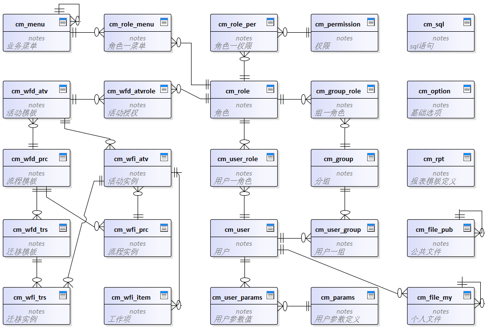
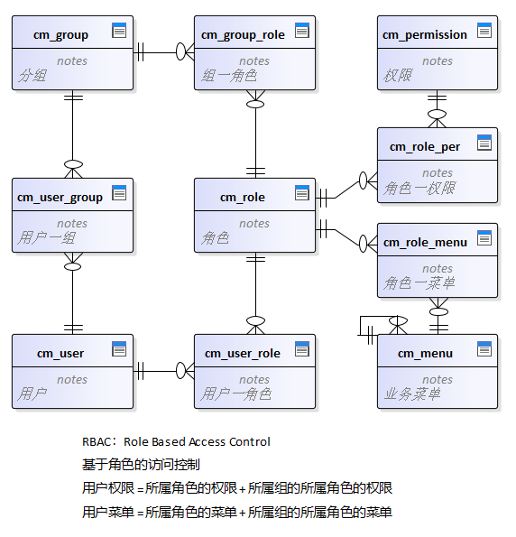

### 消息服务(msg)
平台内置的基础消息服务，**支持多副本部署**，所有已注册的客户端在启动时调用服务端的`Register`方法，该`Api`采用基于`http2`协议的`ServerStream`模式，即：客户端发送一个请求，服务端返回数据流响应，**相当于在服务端和客户端建立了长连接，服务端可以实时向客户端推送信息**。

    /// 

    /// 客户端注册在线推送
    /// 

    /// <param name="p_deviceInfo">客户端设备信息</param>
    /// <param name="p_writer"></param>
    /// <returns></returns>
    public async Task Register(Dict p_deviceInfo, ResponseWriter p_writer)
    {
        var ci = new ClientInfo(p_deviceInfo, p_writer, _userID);
        // 注册新会话(同一账号支持多个会话)，并向新会话发送离线信息
        await Online.Register(ci);

        // 推送
        while (await ci.SendMsg())
        { }

        // 推送结束，删除会话
        Online.RemoveSession(ci.UserID, ci.SessionID);
        Log.Debug("{0} 离线", ci.UserID);
    }


**推送过程**

服务端向客户端发送的消息主要包括三类：
* 即时消息(聊天内容或系统消息)；
* 订阅消息；
* 指令消息；

其中即时消息和指令消息按`userid`发送，订阅消息只推送给订阅了该消息类型的用户，所有类型消息的发送都遵循`在线直接发送`、`离线按照用户设置进行推送`的原则。其推送过程如下图所示：
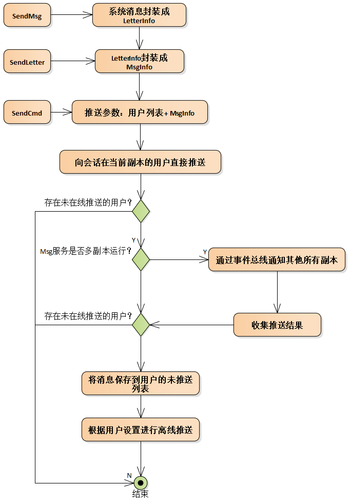

**客户端解析推送**
客户端需要在解析推送类型上指定[PushApi]标签，调用过程由系统内部处理。

系统内置推送处理

[PushApi]
public class SysPushApi
{
    /// 

    /// 接收服务器推送的聊天信息
    /// 

    /// <param name="p_letter"></param>
    public void ReceiveLetter(LetterInfo p_letter)
    {
        ChatDs.ReceiveLetter(p_letter);
    }

    /// 

    /// 系统警告提示
    /// 

    /// <param name="p_msg"></param>
    public void ShowSysWarning(string p_msg)
    {
        Kit.Warn($"【系统通知】\r\n{p_msg}");
    }

    /// 

    /// 新任务提醒
    /// 

    public void WfNotify()
    {
        WfiDs.ReceiveNewTask();
    }
}


以下是客户端自定义推送处理和推送指令消息的例子：

[PushApi]
public class PushDemoApi
{
    public void Hello(string p_msg)
    {
        Kit.Msg($"【收到服务端推送】\r\n{p_msg}");
    }
}

    void OnPush()
    {
        SendCmd(Kit.UserID, new MsgInfo
        {
            MethodName = "PushDemoApi.Hello",
            Params = new List<object> { "Hello myself" }
        });
    }

    /// 

    /// 向某用户的客户端推送指令信息
    /// 

    /// <param name="p_userID"></param>
    /// <param name="p_msg"></param>
    /// <returns>true 在线推送</returns>
    static Task<bool> SendCmd(long p_userID, MsgInfo p_msg)
    {
        return Kit.Rpc<bool>(
            "msg",
            "CmdMsg.SendCmd",
            p_userID,
            p_msg
        );
    }


### 文件服务(fsm)
文件服务统一管理应用范围内使用的文件，在`k8s`中**支持多副本部署**，支持分卷存储文件，可通过`ConfigMap`将数据卷`Volume`挂载到指定目录，该服务只负责文件的上传下载和文件管理功能，不涉及具体的业务问题，在功能和`Api`上较稳定。

#### 卷
文件的本地目录为`drive`，为了和`wwwroot`区分，映射到虚拟目录`drv`，并且`drive`下的所有文件都作为网站静态文件，访问路径形如：https://localhost/dt-fsm/drv/v0/21/06/80819234523705344.jpg。

/// 

/// 自定义请求处理或定义请求管道的中间件
/// 

/// <param name="p_app"></param>
/// <param name="p_handlers">注册自定义请求处理</param>
public override void Configure(IApplicationBuilder p_app, IDictionary<string, RequestDelegate> p_handlers)
{
    Cfg.Init();

    // 注册请求路径处理
    p_handlers["/.u"] = (p_context) => new Uploader(p_context).Handle();
    p_handlers["/.d"] = (p_context) => new Downloader(p_context).Handle();

    // 设置可浏览目录的根目录，测试用
    p_app.UseDirectoryBrowser(new DirectoryBrowserOptions
    {
        FileProvider = new PhysicalFileProvider(Cfg.Root),
        RequestPath = "/drv"
    });

    // drive下的所有文件作为网站静态文件，映射到虚拟目录drv，和wwwroot区分
    p_app.UseStaticFiles(new StaticFileOptions
    {
        FileProvider = new PhysicalFileProvider(Cfg.Root),
        RequestPath = "/drv"
    });
}


服务支持挂载多个卷，每个卷有不同的用途，系统将卷划分为`固定卷`和`普通卷`。
* `固定卷`是指客户端在上传文件时可根据卷名访问的卷，该卷一般存储特殊用途的文件，如头像文件、聊天文件等，使用场景较少。
* `普通卷`是除固定卷以外的卷，上传文件时根据普通卷的使用情况动态选择要存储的卷，服务启动时在`Redis`缓存中创建了`SortedSet`类型的`volume`键，该`SortedSet`列表中的每行对应一个卷，值为这个卷的“正在使用数”，正在使用数就是当前正在写入卷的请求数，该数值能正确反映一个卷的闲置状态，每次有新的上传请求时都选择“正在使用数”最小的卷进行存储。

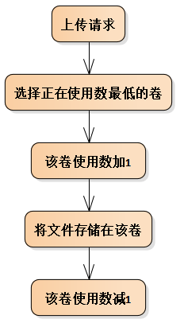

#### 上传
文件上传采用流式上传方式，流式上传和使用`IFormFile`在效率上没有太大的差异，`IFormFile`的缺点主要是客户端上传过来的文件首先会缓存在服务器内存中，任何超过 64KB 的单个缓冲文件会从 RAM 移动到服务器磁盘上的临时文件中。文件上传所用的资源（磁盘、RAM）取决于并发文件上传的数量和大小，流式上传主要解决内存占用过高和磁盘空间不足问题。

`Http Post`请求时内容有三种编码类型，系统文件上传使用`multipart/form-data`：
* `application/x-www-urlencoded`，`Form`默认的编码类型，消息内容会经过 URL 格式编码，就像在GET请求时 URL 里的 `QueryString` 那样。
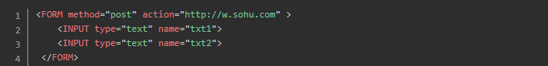
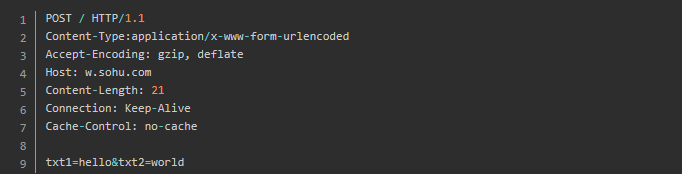

* `multipart/form-data`,它可以包含了多个 `Parts`，每个 `Part` 都包含头信息部分，`Part` 头信息中必须包含一个 `Content-Disposition` 头，其他的头信息则为可选项，比如 `Content-Type` 等，`Content-Disposition` 包含 `type` 和一个名字为 `name` 的 `parameter`，`type`是 `form-data`，`name` 参数的值则为表单控件（也即 field）的名字，如果是文件，那么还有一个 `filename` 参数，值就是文件名。
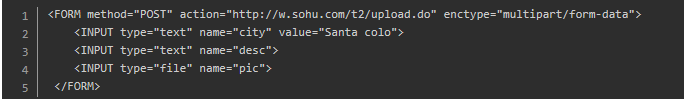
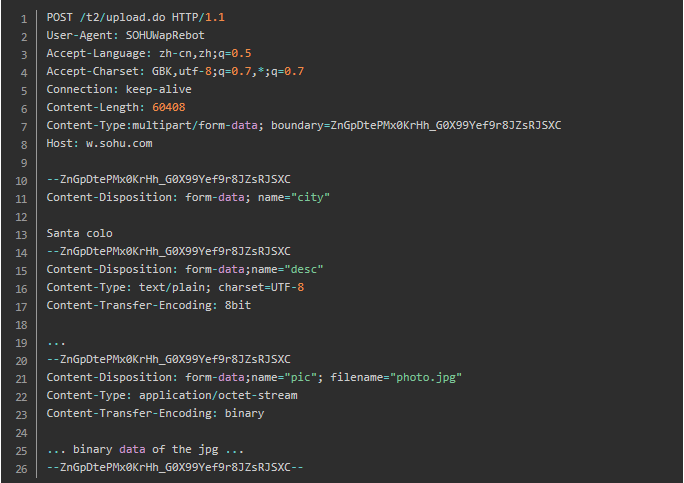

* `text-plain`，空格转换为 "+" 加号，但不对特殊字符编码。

文件上传的Section结构如下：
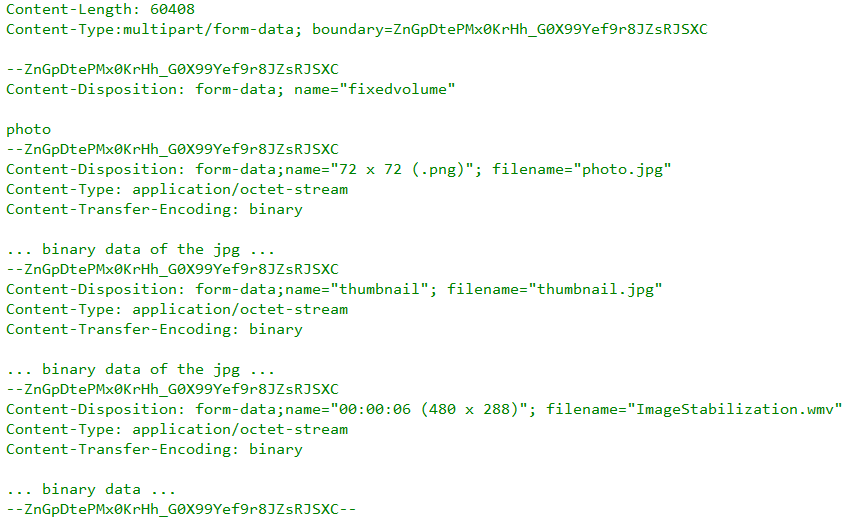
当使用固定卷时第一Section用于指定固定卷名，当使用普通卷时所有Section都是FileSection。

文件上传过程：

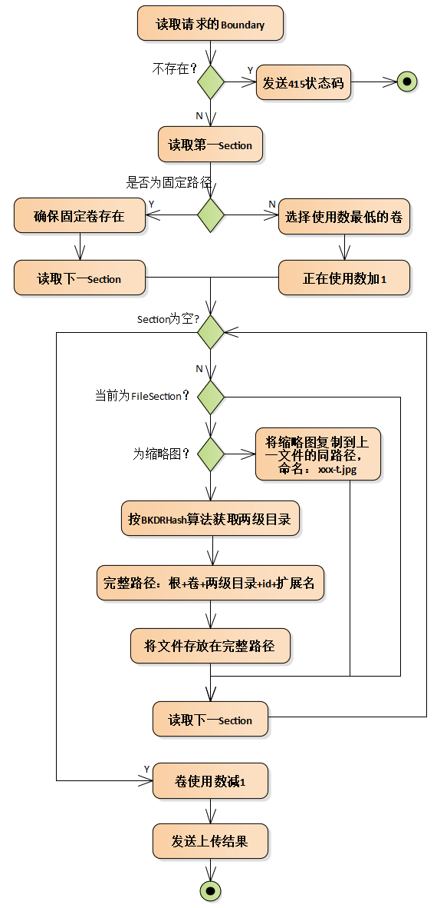

#### 下载
下载文件时需要提供文件的完整路径，记录文件下载次数。下载缩略图时，若缩略图不存在，则下载原始图像，客户端可通过`Api`先判断缩略图是否存在。

缩略图命名规则：

原文件名添加后缀"`-t.jpg`"，如 143203944767549440.wmv 的缩略图文件名为143203944767549440.wmv-t.jpg。


#### 浏览
和下载类似，文件服务还支持按路径直接浏览的方式，方便图片或视频等嵌入到网页中。

如：https://localhost/dt-fsm/drv/v0/21/06/80819234523705344.jpg

同样浏览缩略图时若无缩略图自动取原图。

#### 网页发布
文件服务还提供静态网页浏览的功能，和`cm`服务中的发布模块配合。文件服务中与发布相关：`drive/g`是动态生成的网页，目录结构如下：

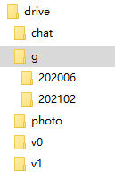

### 宇宙服务(cosm)
cosm服务是一个空服务，只提供公共Api，通过配置`service.json`可以实现以下功能：
* 单体服务，适用于不需要任何自定义Api，所有功能都在客户端完成的情况。
* 每个微服务独立部署时，若微服务只需连接不同数据库，无需自定义Api，可按照服务名、默认数据源键名配置cosm，相当于单体模式的其它微服务。

### 承载wasm(boot)
`boot`服务不同于以上四个服务，它只是用来承载`wasm web`网站，无数据库、RabbitMq、Redis连接，无Api。

wasm应用发布时默认会为`js css wasm clr`格式的文件生成`Brotli`压缩文件，文件名为原名加`br`扩展名，参见下图，参见[预压缩详情](https://platform.uno/docs/articles/external/uno.wasm.bootstrap/doc/features-pre-compression.html)

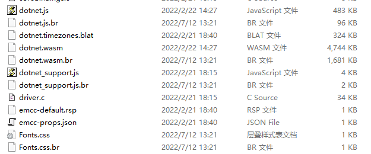

发布后生成的`dist`目录就是一个完整的单页面静态`wasm`网站。
`Uno.Wasm.Bootstrap.DevServer`提供的 `webapp` 包括调试代理、xaml热重载等功能，正式发布后都不需要，并且缺少自动下载同名`.br`文件的功能，因此平台提供`boot`服务作为承载wasm静态网站的`webapp`。

`boot`服务通过`service.json`配置`wasm`静态网站的位置，可以是完整路径或相对路径：

{
  "WasmPath": "dist"
}


`boot`服务启动时加入三个中间件：
* 第一个中间件重写请求文件路径，将存在`Brotli`压缩文件的路径指向压缩文件`.br`；
* 第二个中间件处理访问根路径时的默认页，使用标准的`UseDefaultFiles`；
* 第三个中间件使用标准的`UseStaticFiles`，增加支持 `.clr .br .dat` 文件类型，同时对于`.br`文件，mime类型在 `OnPrepareResponse` 时重置到非压缩文件的类型。


public override void Configure(IApplicationBuilder p_app, IDictionary<string, RequestDelegate> p_handlers)
{
    string pathBase = Kit.GetCfg<string>("WasmPath");
    if (!Path.IsPathRooted(pathBase))
    {
        // 相对路径
        pathBase = Path.Combine(AppContext.BaseDirectory, pathBase);
    }
    var fileProvider = new PhysicalFileProvider(pathBase);

    p_app.UseMiddleware<RewriteBrFileMiddleware>(fileProvider);

    // 该中间件处理访问根路径时的默认页，内部只重置 context.Request.Path 的值
    // 所以必须在UseStaticFiles之前调用，最终由 StaticFiles 中间件响应默认页
    p_app.UseDefaultFiles(new DefaultFilesOptions
    {
        FileProvider = fileProvider,
        RequestPath = ""
    });

    p_app.UseStaticFiles(new StaticFileOptions
    {
        FileProvider = fileProvider,
        ContentTypeProvider = _mimeTypeProvider,
        OnPrepareResponse = SetCacheHeaders
    });
}


将`boot`部署到`IIS`时通常以项目名命名webapp名，如：https://localhost/fz，平台服务和`boot`的典型部署如下图所示：

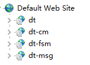

## Api授权控制
通过`Rpc`方式调用服务`Api`时，系统内部执行公共的授权验证，授权验证标签为`AuthAttribute`，可以标记在`Api`的**类或方法**上，按照就近原则，若方法上有`Auth`标签就按方法的`Auth`进行授权验证，否则按类的`Auth`标签进行授权验证，类和方法上都无`Auth`标签时不进行授权验证，访问无限制。


/// 

/// 授权标志
/// 

[AttributeUsage(AttributeTargets.Class | AttributeTargets.Method, AllowMultiple = false)]
public class AuthAttribute : Attribute
{
    /// 

    /// 所有登录用户
    /// 

    public AuthAttribute()
    { }

    /// 

    /// 自定义校验授权方法
    /// Attribute 的参数只支持简单类型、Type、enum，无法指定委托
    /// 

    /// <param name="p_customAuthType">自定义校验授权方法的类型</param>
    public AuthAttribute(Type p_customAuthType)
    {
        if (p_customAuthType.GetInterface("ICustomAuth") == null)
            throw new Exception(p_customAuthType.FullName + " 需要实现 ICustomAuth 接口");
        CustomAuthType = p_customAuthType;
    }

    /// 

    /// 自定义校验授权方法的类型
    /// 

    public Type CustomAuthType { get; set; }
}


提供两种格式的`Auth`标签：
* 一种为 `[Auth]` 表示所有登录用户都可访问(只限制匿名用户)；
* 一种为 `[Auth(Type)]` 表示外部自定义校验授权方法，`Type`需要实现`ICustomAuth`接口，可以按照需求自定义授权验证，如按权限判断、按用户所属分类等等。

例如：

public class TestAuth : DomainSvc
{
    [Auth]
    public string Auth()
    {
        return "必须登录后可访问";
    }

    [Auth(typeof(MyAuth))]
    public string CustomAuth()
    {
        return "自定义授权验证";
    }
}

public class MyAuth : ICustomAuth
{
    public Task<bool> IsAuthenticated(HttpContext p_context)
    {
        string userID = p_context.Request.Headers["uid"];
        return Task.FromResult(false);
    }
}


## 面向切面编程AOP
通过预编译方式或运行期动态代理方式实现在不修改源代码的情况下给程序动态统一添加功能的一种技术，系统内部使用`Castle.Core`在运行时动态生成代理类的方式实现`AOP`编程。

首先在需要拦截的`Api`类型上指定`Interceptors`，支持多个拦截器，再将需要拦截的方法指定为`virtual`。例如：

[Api(Interceptors = new Type[] { typeof(Interceptor1), typeof(Interceptor2) }, IsTest = true)]
public class TestIntercept : DomainSvc
{
    /// 

    /// 不拦截内嵌方法
    /// 

    /// <returns></returns>
    public virtual Task<string> CallInline()
    {
        return GetSql();
    }

    /// 

    /// 外层不拦截，拦截内嵌方法
    /// 

    /// <returns></returns>
    public Task<string> NotIntercept()
    {
        return GetSql();
    }

    public virtual Task<string> GetSql()
    {
        return _da.GetScalar<string>("select `sql` from cm_sql");
    }
}

public class Interceptor1 : IInterceptor
{
    bool isIntercepted = false;

    public async void Intercept(IInvocation p_invocation)
    {
        // 只拦截一次
        if (isIntercepted)
        {
            Log.Information("1号拦截器放行 " + p_invocation.Method.Name);
            p_invocation.Proceed();
            return;
        }

        isIntercepted = true;
        Log.Information("1号拦截器已拦截 " + p_invocation.Method.Name);
        var type = p_invocation.Method.ReturnType;
        try
        {
            p_invocation.Proceed();
            // 异步时等待外部调用结束
            if (type == typeof(Task) || typeof(Task).IsAssignableFrom(type))
                await ((Task)p_invocation.ReturnValue);
        }
        catch
        {
            throw;
        }
        finally
        {
            Log.Information("1号拦截器结束 " + p_invocation.Method.Name);
        }
    }
}

public class Interceptor2 : IInterceptor
{
    bool isIntercepted = false;

    public async void Intercept(IInvocation p_invocation)
    {
        if (isIntercepted)
        {
            Log.Information("2号拦截器放行 " + p_invocation.Method.Name);
            p_invocation.Proceed();
            return;
        }

        isIntercepted = true;
        Log.Information("2号拦截器已拦截 " + p_invocation.Method.Name);
        var type = p_invocation.Method.ReturnType;
        try
        {
            p_invocation.Proceed();
            // 异步时等待外部调用结束
            if (type == typeof(Task) || typeof(Task).IsAssignableFrom(type))
                await ((Task)p_invocation.ReturnValue);
        }
        catch
        {
            throw;
        }
        finally
        {
            Log.Information("2号拦截器结束 " + p_invocation.Method.Name);
        }
    }
}


## 服务部署
服务端环境的安装部署主要包括`平台服务、数据库、RabbitMQ、Redis、k8s、IIS`等，参见[开发环境安装](/dt-docs/1开始/1开发环境/)。

本节主要介绍平台服务的两种部署方式：
* IIS部署
* k8s部署

### Web服务器
`Asp.net core`的web服务器有两种：`KestrelServer` 和 `IISHttpServer`。

* `IISHttpServer`主要用于部署在`IIS`并且进程内承载时使用，具体可参见下一节的“承载模式”，`IISHttpServer`的配置在`web.config`。
* 其他情况都使用`KestrelServer`，它的监听和协议在`service.json` 中配置，可以监听多个Url，每个监听可以指定使用的协议、监听地址、端口、X509证书文件及密码等，如：

{
  "DbConn": "dt",
  "TraceSql": true,
  "TraceRpc": true,

  "KestrelListen": [
    {
      "Scheme": "http",
      "Address": "0.0.0.0",
      "Port": "30001"
    },
    {
      "Scheme": "https",
      "Address": "0.0.0.0",
      "Port": "20201"
    }
  ],

  "SvcUrls": {
    "msg": "*/dt-msg",
    "fsm": "*/dt-fsm",
    "demo": "*/dt-demo"
  }
}


### IIS部署
在开发或部署到`windows server`时首选`IIS`，和传统`asp.net`应用不同，`IIS`只作为反向代理使用。

#### [安装IIS](/dt-docs/1开始/1开发环境/#安装-iis)

#### https配置
`http2.0`协议比`http1.1`更高效，本来`http2.0`协议和`https`之间没有依赖关系，但主流浏览器和`.net`都要求采用`http2.0`协议通信必须启用`https`。

平台所有服务都同时支持`http1.1`和`http2.0`协议，平台四种客户端(`win wasm android ios`) 与服务之间以及服务与服务之间都采用`http2.0`协议进行`http`请求，虽然`http`请求为`http2.0`但它们之间采用何种通信协议，最终取决于是否启用`https`，启用`https`时采用`http2.0`协议，否则仍采用`http1.1`协议。

因此要想采用高效的`http2.0`协议必须启用`https`通信，而要使用`https`需要在网站的服务器上配置`https`证书。

证书可以向专门的`https`证书提供商进行购买，也可以自己生成，两种的区别是自己生成的证书不被浏览器信任，需要点击信任或将证书安装在“受信任的根证书颁发机构”之后才能继续访问，安装方法是将`Dt\Service\iis\tls.pfx`证书安装在“受信任的根证书颁发机构”，私钥密码`dt`。

默认情况下，`IIS`中的网站只提供了`http`绑定，要支持`https`绑定，首先需要`pfx`格式的服务器证书，以下为生成`https`证书的过程：


在windows上安装`Win64OpenSSL_Light-1_1_1b.exe`，然后打开PowerShell(管理员)，cd到openssl.exe所在的目录

生成私钥tls.key, 密钥位数是 2048

`.\openssl genrsa -out tls.key 2048`

使用`server.key` 生成自签证书，域名`localhost`，有效期20年

`.\openssl req -new -x509 -days 7300 -key tls.key -out tls.crt -subj /CN=localhost -addext "subjectAltName=DNS:localhost"`

生成tls.key, tls.crt文件用于以上secret资源，crt存储公钥，key存储私钥
将私钥和公钥合并成pfx证书，密码为dt，用于服务的x509认证

`.\openssl pkcs12 -export -in tls.crt -inkey tls.key -out tls.pfx -name "Dt Platform"`


导入服务器证书，证书位置`Dt\Service\iis\tls.pfx`，私钥密码`dt`，此证书签名为`localhost`，只在开发时使用，生成环境可替换，导入新证书即可。

然后右键“Default Web Site”->编辑绑定->添加->选择https->选择ssl证书，也可以使用IIS Express提供的证书。

当使用`KestrelServer`时需要将证书复制到服务的根目录：

    /// 

    /// KestrelServer 监听设置
    /// 

    /// <param name="p_options"></param>
    void ConfigureKestrelListen(KestrelServerOptions p_options)
    {
        var sect = Kit.Config.GetSection("KestrelListen").GetChildren();

        // service.json 中无配置
        if (!sect.Any())
        {
            // 使用 launchSettings.json 中配置，
            // 都无配置使用缺省：http://localhost:5000; https://localhost:5001
            Log.Information("service.json无监听配置，使用默认");
            return;
        }

        // 根据 service.json 的 KestrelListen 节配置设置监听
        // 可以监听多个Url，每个监听的Url配置一次
        foreach (var item in sect)
        {
            // 使用协议：http https
            string scheme = item.GetValue<string>("Scheme");
            string address = item.GetValue<string>("Address");
            int port = item.GetValue<int>("Port");

            if ("https".Equals(scheme, StringComparison.OrdinalIgnoreCase))
            {
                // https协议
                p_options.Listen(IPAddress.Parse(address), port, listenOptions =>
                {
                    // 浏览器要求http2.0协议必须采用https通信，http2.0协议和https之间本来没有依赖关系！
                    // 系统默认 Http1AndHttp2
                    //listenOptions.Protocols = HttpProtocols.Http1AndHttp2;

                    string cerFileName = item.GetValue<string>("Certificate:FileName");
                    string cerPwd = item.GetValue<string>("Certificate:Password");
                    try
                    {
                        if (!string.IsNullOrEmpty(cerFileName))
                        {
                            // 加载X509证书
                            listenOptions.UseHttps(new X509Certificate2(Path.Combine(AppContext.BaseDirectory, "etc/config/", cerFileName), cerPwd));
                        }
                        else
                        {
                            // 无证书使用默认localhost证书
                            listenOptions.UseHttps();
                        }
                        Log.Information($"监听：{listenOptions}");
                    }
                    catch (Exception ex)
                    {
                        Log.Error(ex, $"Kestrel加载X509证书文件[{cerFileName}]时异常");
                    }
                });
            }
            else
            {
                // http协议，无X509证书
                p_options.Listen(IPAddress.Parse(address), port, listenOptions =>
                {
                    Log.Information($"监听：{listenOptions}");
                });
            }
        }
    }


对称加密是加密和解密使用同一个密钥；非对称加密使用一对非对称的私有密钥和公开密钥，发送密文的一方使用对方的公开密钥进行加密处理，对方收到被加密的信息后，再使用自己的私有密钥进行解密，对称密钥的好处是解密的效率比较快，非对称加密的好处是传输的内容不能被破解。HTTPS采用对称加密和非对称加密两者并用的混合加密机制，过程如下
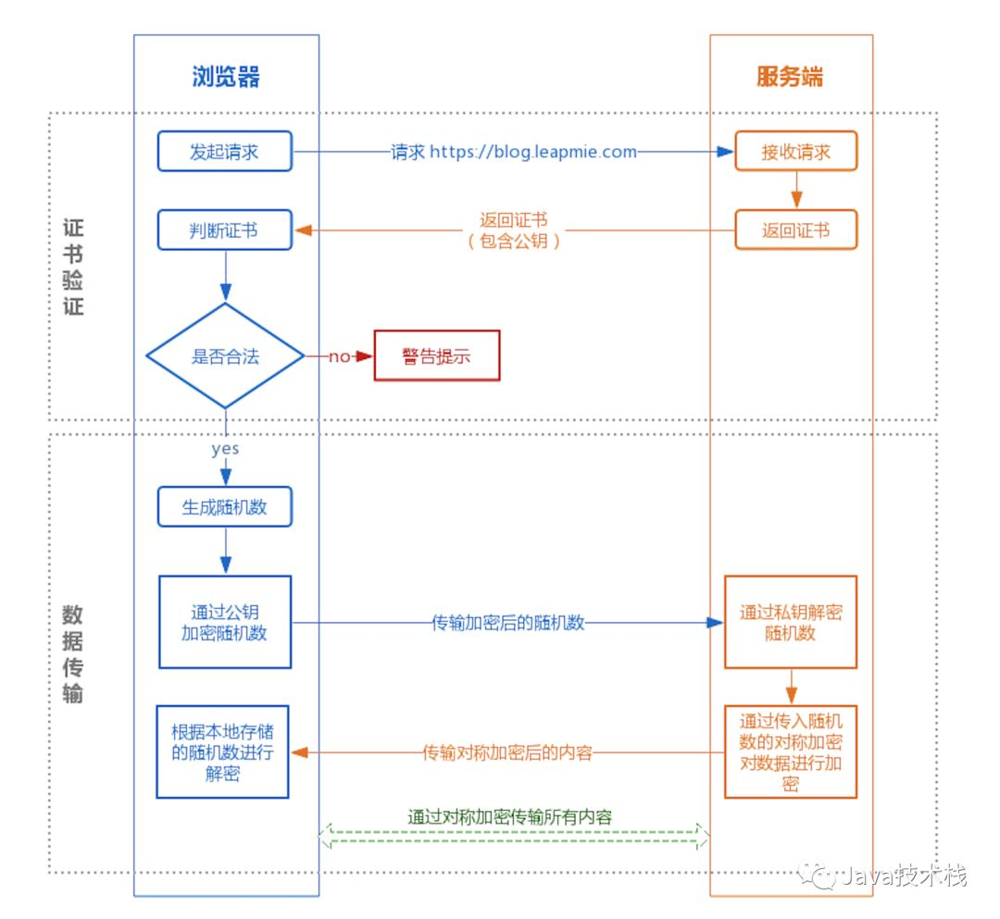

#### 承载模式
将服务部署在IIS时有两种承载模式：进程(w3wp)外承载和进程内承载。

进程外承载时`CreateDefaultBuilder`将 `Kestrel` 服务器配置为 Web 服务器，如下图：

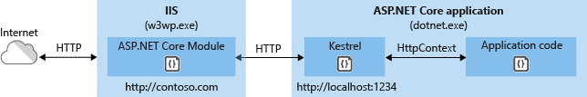

进程内承载时`CreateDefaultBuilder`将`IISHttpServer`配置为 Web 服务器，相较进程外承载提供更优的性能，因为请求并不通过环回适配器进行代理，可提供明显更高的请求吞吐量，默认采用进程内承载，参见：
https://docs.microsoft.com/zh-cn/aspnet/core/host-and-deploy/iis/in-process-hosting?view=aspnetcore-5.0 

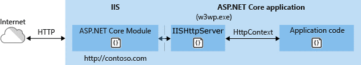

IIS同样支持启动多个服务进程提高响应，对于无状态服务非常有效。

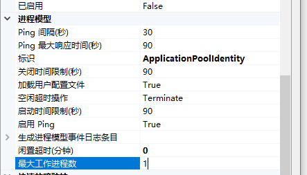

#### 添加服务
可以运行批处理文件 \Dt\Service\iis\xxx.bat自动添加服务；

也可以手动添加服务，过程如下：

因每个asp.net core应用需要占用独立应用池，先创建应用池，命名规则`appName-svcName`：

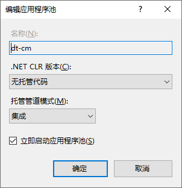

网站右键->添加应用程序->别名为`appName-svcName`，路径为服务的发布目录，开发时为项目目录，注意web.config文件：

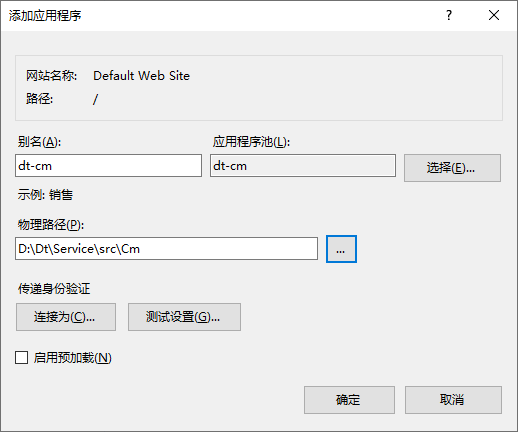

#### 调试服务
VS中主要有两种调试服务方式，一种是直接启动应用的方式，另一种是部署到IIS或IIS Express进行调试。

系统采用部署到IIS的调试方法。老版本的VS调试IIS上的asp.net应用时需要采用“附加到进程 w3wp”的方式，新版本更方便，初次启动调试时自动创建应用池和应用，代码修改后重新编译时能自动停止应用池，再次启动调试时会同步启动应用池，并且支持调试服务的启动部分。因应用池命名的原因，请使用上节的bat添加服务。注意在关闭VS时会自动停止所有调试过的应用池，可以手动运行startpool.bat启动所有应用池。

调试服务时可访问：`https://localhost/dt-xxx/.admin` -> 选择Api -> 填写完整参数值 -> 点击调试按钮。
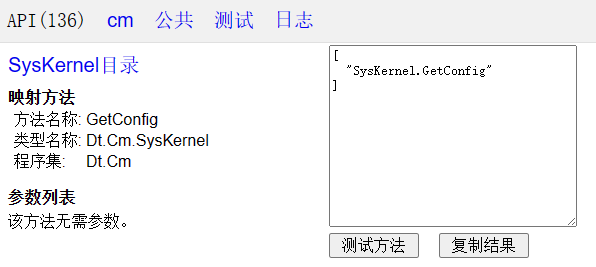

### k8s部署
k8s的概念和环境安装过程请参见下一章介绍。

在开发环境和生产环境都可以使用k8s模式部署服务，k8s模式是通过`helm->k8s->docker`在容器内运行服务，该模式启动慢、耗资源、附加到远程调试无法调试服务的启动部分，运行前需要生成镜像、使用Helm部署到容器、附加到远程pod等过程，所以该模式部署繁琐耗时，不适合在开发过程中使用，适合于生产环境的云部署。

k8s模式下的服务需要一系列步骤才能运行：编译生成docker镜像、运行Helm打包脚本部署到k8s、附加到远程pod进行调试等，为方便部署和远程调试，开发工具使用VS Code，利用VS Code提供的任务，将一系列步骤打包成一个任务运行，任务定义参见`.vscode\tasks.json`，详细步骤参见`dt\Service\k8s`目录下的`debug.ps1`脚本文件、chart模板、服务配置。k8s远程调试参见`.vscode\launch.json`配置。
