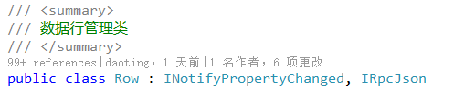
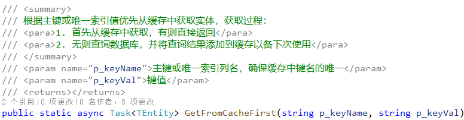

领域层是业务开发过程中的重要部分，包括实体、实体读写、业务逻辑、领域服务等，并且实现**客户端领域层和服务端领域层代码相同**，既可以将业务放在客户端处理也可以稍加修改放在服务端处理。但系统未采用DDD模式的聚合根、值对象、仓库等概念，不再区分聚合根、值对象等类型，实体之间的关系可自定义调整。

## 实体
遵循`ORM`的映射规则，实体类和数据库中的表或视图一一映射。

一个实体类分2个文件：`.tbl.cs  .cs`，可通过VS扩展工具自动生成，`.tbl.cs`文件包括表的映射属性和构造方法，表结构修改时需要重新生成，因此不可手动修改，避免被覆盖。


[Tbl("demo_crud")]
public partial class CrudX : EntityX<CrudX>
{
    #region 构造方法
    CrudX() { }

    public CrudX(CellList p_cells) : base(p_cells) { }

    public CrudX(
        long ID,
        string Name = default,
        int Dispidx = default,
        DateTime Mtime = default,
        bool EnableInsertEvent = default,
        bool EnableNameChangedEvent = default,
        bool EnableDelEvent = default)
    {
        AddCell("ID", ID);
        AddCell("Name", Name);
        AddCell("Dispidx", Dispidx);
        AddCell("Mtime", Mtime);
        AddCell("EnableInsertEvent", EnableInsertEvent);
        AddCell("EnableNameChangedEvent", EnableNameChangedEvent);
        AddCell("EnableDelEvent", EnableDelEvent);
        IsAdded = true;
    }
    #endregion

    /// 

    /// 名称
    /// 

    public string Name
    {
        get { return (string)this["Name"]; }
        set { this["Name"] = value; }
    }
}


`.tbl.cs`文件中类的标签有两种：`Tbl` `Sqlite`，对应远程库和本地`sqlite`库，除标签不同外，领域层的所有操作不区分远程库和本地 `Sqlite`库，实体读写、业务逻辑、领域服务写法完全相同：

// 该实体是表 demo_crud 的映射
[Tbl("demo_crud")]
public partial class CrudX : EntityX<CrudX>

// 该实体存储在 local 库的 Crud 表
[Sqlite("local")]
public partial class CrudX : EntityX<CrudX>


## 业务逻辑
`.cs`文件存放业务逻辑或静态辅助方法，只在初次自动生成。实体类默认以`X`为后缀，避免重名且方便识别。

重写`InitHook`方法，注册回调，可以进行业务校验或添加领域事件
* `OnSaving`保存前
* `OnSaved`保存后
* `OnDeleting`删除前
* `OnDeleted`删除后
* `OnChanging`属性值变化前


public partial class CrudX
{
    public static async Task<CrudX> New(string Name)
    {
        return new CrudX(
            ID: await NewID(),
            Name: Name,
            Dispidx: await NewSeq("Dispidx"),
            Mtime: Kit.Now);
    }

    protected override void InitHook()
    {
        OnSaving(() =>
        {
            if (IsAdded && EnableInsertEvent)
            {
                AddEvent(new InsertCrudEvent { ID = ID });
            }
            else if (!IsAdded
                && EnableNameChangedEvent
                && _cells["Name"].IsChanged)
            {
                AddEvent(new NameChangedEvent
                {
                    // 保存后信息丢失
                    OriginalVal = _cells["Name"].GetOriginalVal<string>(),
                    NewVal = Name,
                });
            }
            return Task.CompletedTask;
        });

        OnSaved(async () => await this.ClearCache(nameof(Phone)));

        OnDeleting(() =>
        {
            if (EnableDelEvent)
            {
                AddEvent(new DelCrudEvent { Tgt = this });
            }
            return Task.CompletedTask;
        });

        OnDeleted(async () => await this.ClearCache(nameof(Phone)));
        
        OnChanging<string>(nameof(Name), v =>
        {
            //Kit.Msg("Name新值：" + v);
        });
    }
}


若是父实体，可在`.cs`文件中增加子实体列表属性，并添加`ChildX`标签，指明父表外键属性名：

[ChildX("ParentID")]
public Table<ChildTbl1X> Tbl1 { get; set; }

[ChildX("GroupID")]
public Table<ChildTbl2X> Tbl2 { get; set; }


`OnSaving`和`OnDeleting`在写数据前调用，返回`Task`，通过抛出异常来禁止写数据，`OnSaving`回调使用场景较多，如保存前的校验(如不可为空、重名、数据不符合业务规则等)、数据完善(如修改时间)、还可触发领域事件。

`OnChanging`回调是属性值(Cell值)改变时的钩子方法，若实体类中包含某属性的钩子方法，所有对`Cell.Val`的赋值都会调用钩子方法，包括UI的绑定，主要用于：数据校验不符合业务抛异常使赋值失败、和其他列值的联动。

`OnSaved`和`OnDeleted`在写数据后调用，一般用来做善后工作，如清除缓存。


禁止实体类中涉及UI和持久化功能


## 构造实体
构造实体的方法：
1. 调用`New`静态方法或直接`new`

1. 通过`Entity`静态方法查询数据创建实体

/// 

/// 借用泛型参数 TEntity 实现通用的静态方法
/// 

/// <typeparam name="TEntity">实体类型参数</typeparam>
public abstract class EntityX<TEntity> : Entity
    where TEntity : Entity
{
    /// 

    /// 查询实体列表，可以提供 where子句 或 Sql字典的键名 或 Sql语句进行查询
    /// 

    /// <param name="p_whereOrKeyOrSql">三种查询：
    /// <para>1. where子句，以where开头的过滤条件，返回的实体包含所有列值</para>
    /// <para>2. Sql键名或Sql语句，自由查询，返回的实体列值自由</para>
    /// <para>3. null时返回所有实体</para>
    /// </param>
    /// <param name="p_params">参数值，支持Dict或匿名对象，默认null</param>
    /// <returns>返回实体列表</returns>
    public static Task<Table<TEntity>> Query(string p_whereOrKeyOrSql, object p_params = null)

    /// 

    /// 按页查询实体列表，可以提供 where子句 或 Sql字典的键名 或 Sql语句进行查询
    /// 

    /// <param name="p_starRow">起始行号：mysql中第一行为0行</param>
    /// <param name="p_pageSize">每页显示行数</param>
    /// <param name="p_whereOrKeyOrSql">三种查询：
    /// <para>1. where子句，以where开头的过滤条件，返回的实体包含所有列值</para>
    /// <para>2. Sql键名或Sql语句，自由查询，返回的实体列值自由</para>
    /// <para>3. null时返回所有实体</para>
    /// </param>
    /// <param name="p_params">参数值，支持Dict或匿名对象，默认null</param>
    /// <returns>返回实体列表</returns>
    public static Task<Table<TEntity>> Page(int p_starRow, int p_pageSize, string p_whereOrKeyOrSql, object p_params = null)

    /// 

    /// 返回第一个实体对象，不存在时返回null，可以提供 where子句 或 Sql字典的键名 或 Sql语句进行查询
    /// 

    /// <param name="p_whereOrKeyOrSql">三种查询：
    /// <para>1. where子句，以where开头的过滤条件，返回的实体包含所有列值</para>
    /// <para>2. Sql键名或Sql语句，自由查询，返回的实体列值自由</para>
    /// <para>3. null时返回第一个实体</para>
    /// </param>
    /// <param name="p_params">参数值，支持Dict或匿名对象，默认null</param>
    /// <returns>返回实体对象或null</returns>
    public static Task<TEntity> First(string p_whereOrKeyOrSql, object p_params = null)

    /// 

    /// 根据主键获得实体对象(包含所有列值)，仅支持单主键
    /// 

    /// <param name="p_id">主键值</param>
    /// <returns>返回实体对象或null</returns>
    public static Task<TEntity> GetByID(object p_id)

    /// 

    /// 根据主键或唯一索引列获得实体对象(包含所有列值)，仅支持单主键
    /// 

    /// <param name="p_keyName">主键或唯一索引列名</param>
    /// <param name="p_keyVal">键值</param>
    /// <returns>返回实体对象或null</returns>
    public static Task<TEntity> GetByKey(string p_keyName, string p_keyVal)

    /// 

    /// 根据主键获得实体对象及所有子实体列表，仅支持单主键，不涉及缓存！
    /// 

    /// <param name="p_id">主键</param>
    /// <returns>返回实体对象或null</returns>
    public static async Task<TEntity> GetByIDWithChild(object p_id)

    /// 

    /// 根据主键或唯一索引值优先从缓存中获取实体，获取过程：
    /// <para>1. 首先从缓存中获取，有则直接返回</para>
    /// <para>2. 无则查询数据库，并将查询结果添加到缓存以备下次使用</para>
    /// 

    /// <param name="p_keyName">主键或唯一索引列名，确保缓存中键名的唯一</param>
    /// <param name="p_keyVal">键值</param>
    /// <returns></returns>
    public static async Task<TEntity> GetFromCacheFirst(string p_keyName, string p_keyVal)        
}


1. 通过AtXxx静态方法查询数据创建实体

/// 

/// 数据访问基类，为方便使用所有方法为静态，通过 TAccessInfo 提供实际的数据查询对象
/// 

/// <typeparam name="TAccessInfo">数据访问的描述信息</typeparam>
public abstract class DataAccess<TAccessInfo>
    where TAccessInfo : AccessInfo, new()
{
    /// 

    /// 以参数值方式执行Sql语句，返回结果集
    /// 

    /// <param name="p_keyOrSql">Sql字典中的键名(无空格) 或 Sql语句</param>
    /// <param name="p_params">参数值，支持Dict或匿名对象，默认null</param>
    /// <returns>返回Table数据</returns>
    public static Task<Table> Query(string p_keyOrSql, object p_params = null)

    /// 

    /// 以参数值方式执行Sql语句，返回实体列表
    /// 

    /// <typeparam name="TEntity">实体类型</typeparam>
    /// <param name="p_keyOrSql">Sql字典中的键名(无空格) 或 Sql语句</param>
    /// <param name="p_params">参数值，支持Dict或匿名对象，默认null</param>
    /// <returns>返回实体列表</returns>
    public static Task<Table<TEntity>> Query<TEntity>(string p_keyOrSql, object p_params = null)

    /// 

    /// 按页查询数据
    /// 

    /// <param name="p_starRow">起始行号：mysql中第一行为0行</param>
    /// <param name="p_pageSize">每页显示行数</param>
    /// <param name="p_keyOrSql">Sql字典中的键名(无空格) 或 Sql语句</param>
    /// <param name="p_params">参数值，支持Dict或匿名对象，默认null</param>
    /// <returns>返回Table数据</returns>
    public static Task<Table> Page(int p_starRow, int p_pageSize, string p_keyOrSql, object p_params = null)

    /// 

    /// 按页查询数据
    /// 

    /// <typeparam name="TEntity">实体类型</typeparam>
    /// <param name="p_starRow">起始行号：mysql中第一行为0行</param>
    /// <param name="p_pageSize">每页显示行数</param>
    /// <param name="p_keyOrSql">Sql字典中的键名(无空格) 或 Sql语句</param>
    /// <param name="p_params">参数值，支持Dict或匿名对象，默认null</param>
    /// <returns>返回Table数据集</returns>
    public static Task<Table<TEntity>> Page<TEntity>(int p_starRow, int p_pageSize, string p_keyOrSql, object p_params = null)

    /// 

    /// 以参数值方式执行Sql语句，只返回第一行数据
    /// 

    /// <param name="p_keyOrSql">Sql字典中的键名(无空格) 或 Sql语句</param>
    /// <param name="p_params">参数值，支持Dict或匿名对象，默认null</param>
    /// <returns>返回第一行Row或null</returns>
    public static Task<Row> First(string p_keyOrSql, object p_params = null)

    /// 

    /// 以参数值方式执行Sql语句，返回第一个实体对象，实体属性由Sql决定，不存在时返回null
    /// 

    /// <typeparam name="TEntity">实体类型</typeparam>
    /// <param name="p_keyOrSql">Sql字典中的键名(无空格) 或 Sql语句</param>
    /// <param name="p_params">参数值，支持Dict或匿名对象，默认null</param>
    /// <returns>返回实体对象或null</returns>
    public static Task<TEntity> First<TEntity>(string p_keyOrSql, object p_params = null)
}


`EntityX`和`AtXxx`的静态查询方法都是调用数据访问层的读数据方法，这些代理方法最终通过`Rpc调用`或`Sqlite读写`实现。
实体类继承自`EntityX<T>`，将当前实体类型作为泛型参数，使静态方法不再需要泛型参数就实现通用，省去在每个实体类都生成相同的静态方法。

public partial class CrudX : EntityX<CrudX>
{
}

public abstract class EntityX<TEntity> : Entity
    where TEntity : Entity
{
    public static Task<Table<TEntity>> Query(string p_whereOrKeyOrSql, object p_params = null)
}


当使用通用静态方法查询数据创建实体时，每个查询只是sql和参数不同，这些查询很多时候是需要复用的，通常将这些查询封装成静态方法放在`.cs`文件，将用到的sql语句作为常量放在`.cs`文件的尾部，因此`.cs`文件内容主要包括4类：
1. 重写InitHook方法，存放业务逻辑；
2. 静态New方法，构造实体；
3. 可复用的静态查询方法，构造实体列表；
4. sql语句常量

以下是sql语句的通用写法：
1. sql语句作为常量字符串 const string；
2. 以@标记的字符串；
3. sql语句多行时第一行和最后行都为空，方便复制调试；
4. 常量名以Sql开头，推荐用中文，方便理解；


    partial class WfdDs
    {
        // 用户在一个流程实例中参与的所有任务
        const string Sql所有经办历史任务 = @"
select wi.id item_id,
       pi.id prci_id,
       pd.id prcd_id,
       ad.id atvd_id,
       ai.id atvi_id,
       pd.name prcname,
       ad.name atvname,
       pi.status,
       pi.name formname,
       wi.sender,
       wi.stime,
       wi.mtime,
       wi.reCount
from cm_wfi_atv ai,
     cm_wfi_prc pi,
     cm_wfd_atv ad,
     cm_wfd_prc pd,
     (select id,
             atvi_id,
             mtime,
             sender,
             stime,
             (select count(1)
              from cm_wfi_item
              where atvi_id = t.atvi_id
                    and Assign_Kind = 4
                    and id <> t.id) as reCount
     	from cm_wfi_item t
     	where status = 1
     	      and user_id = @p_userid
     	      and (@p_start < '1900-01-01' or mtime >= @p_start)
     	      and (@p_end < '1900-01-01' or mtime <= @p_end)) wi
 where wi.atvi_id = ai.id
       and ai.prci_id = pi.id
       and pi.prcd_id = pd.id
       and ai.atvd_id = ad.id
       and (@p_status > 2 or pi.status = @p_status)
 order by wi.stime desc
";
    }


## 保存实体
实体持久化包括三种情况：单个实体对象的持久化、同一实体类型的实体列表的持久化、任意实体及实体列表的持久化。

前两种情况可通过扩展方法完成，这些扩展方法包括实体及实体列表的保存与删除，扩展方法参见`EntityEx`：

/// 

/// Entity扩展
/// 

public static class EntityEx
{
    /// 

    /// 保存实体数据，成功后：
    /// <para>1. 若存在领域事件，则发布事件</para>
    /// <para>2. 若已设置服务端缓存，则删除缓存</para>
    /// <para>3. 实体状态复位 AcceptChanges </para>
    /// 

    /// <typeparam name="TEntity">实体类型</typeparam>
    /// <param name="p_entity">待保存的实体</param>
    /// <param name="p_isNotify">是否提示保存结果，客户端有效</param>
    /// <returns>是否成功</returns>
    public static async Task<bool> Save<TEntity>(this TEntity p_entity, bool p_isNotify = true)

    /// 

    /// 一个事务内批量保存Table中新增、修改、删除的实体数据
    /// <para>删除行通过Table的ExistDeleted DeletedRows判断获取</para>
    /// <para>保存成功后，对于每个保存的实体：</para>
    /// <para>1. 若存在领域事件，则发布事件</para>
    /// <para>2. 若已设置服务端缓存，则删除缓存</para>
    /// <para>3. 实体状态复位 AcceptChanges </para>
    /// 

    /// <typeparam name="TEntity">实体类型</typeparam>
    /// <param name="p_tbl">实体表</param>
    /// <param name="p_isNotify">是否提示保存结果，客户端有效</param>
    /// <returns>是否成功</returns>
    public static async Task<bool> Save<TEntity>(this Table<TEntity> p_tbl, bool p_isNotify = true)

    /// 

    /// 一个事务内批量保存实体数据，根据实体状态执行新增、修改
    /// <para>保存成功后，对于每个保存的实体：</para>
    /// <para>1. 若存在领域事件，则发布事件</para>
    /// <para>2. 若已设置服务端缓存，则删除缓存</para>
    /// <para>3. 实体状态复位 AcceptChanges </para>
    /// 

    /// <param name="p_list">待保存列表</param>
    /// <param name="p_isNotify">是否提示保存结果，客户端有效</param>
    /// <returns>true 保存成功</returns>
    public static async Task<bool> Save<TEntity>(this IEnumerable<TEntity> p_list, bool p_isNotify = true)

    /// 

    /// 一个事务内批量保存一对多的父实体数据和所有子实体数据
    /// <para>保存成功后，对于每个保存的实体：</para>
    /// <para>1. 若存在领域事件，则发布事件</para>
    /// <para>2. 若已设置服务端缓存，则删除缓存</para>
    /// <para>3. 实体状态复位 AcceptChanges </para>
    /// 

    /// <typeparam name="TEntity">父实体类型</typeparam>
    /// <param name="p_entity">待保存的父实体</param>
    /// <param name="p_isNotify">是否提示保存结果，客户端有效</param>
    /// <returns>是否成功</returns>
    public static async Task<bool> SaveWithChild<TEntity>(this TEntity p_entity, bool p_isNotify = true)

    /// 

    /// 删除实体，依靠数据库的级联删除自动删除子实体，成功后：
    /// <para>1. 若存在领域事件，则发布事件</para>
    /// <para>2. 若已设置服务端缓存，则删除缓存</para>
    /// 

    /// <typeparam name="TEntity">实体类型</typeparam>
    /// <param name="p_entity">待删除的实体</param>
    /// <param name="p_isNotify">是否提示删除结果，客户端有效</param>
    /// <returns>true 删除成功</returns>
    public static async Task<bool> Delete<TEntity>(this TEntity p_entity, bool p_isNotify = true)

    /// 

    /// 一个事务内批量删除Table的所有实体数据，成功后对于每个删除的实体：
    /// <para>1. 若存在领域事件，则发布事件</para>
    /// <para>2. 若已设置服务端缓存，则删除缓存</para>
    /// 

    /// <param name="p_tbl">待删除实体列表</param>
    /// <param name="p_isNotify">是否提示删除结果，客户端有效</param>
    /// <returns>true 删除成功</returns>
    public static Task<bool> Delete<TEntity>(this Table<TEntity> p_tbl, bool p_isNotify = true)

    /// 

    /// 一个事务内批量删除实体数据，成功后对于每个删除的实体：
    /// <para>1. 若存在领域事件，则发布事件</para>
    /// <para>2. 若已设置服务端缓存，则删除缓存</para>
    /// 

    /// <param name="p_list">待删除实体列表</param>
    /// <param name="p_isNotify">是否提示删除结果，客户端有效</param>
    /// <returns>true 删除成功</returns>
    public static async Task<bool> Delete<TEntity>(this IList<TEntity> p_list, bool p_isNotify = true)

    /// 

    /// 清除以某列为键名的实体缓存，键名组成：
    /// <para>表名:列名:列值</para>
    /// 

    /// <typeparam name="TEntity">实体类型</typeparam>
    /// <param name="p_entity">实体</param>
    /// <param name="p_colName">主键或唯一索引列名</param>
    /// <returns></returns>
    public static Task ClearCache<TEntity>(this TEntity p_entity, string p_colName)
}


不同类型的实体及实体列表在同一事务中持久化需在领域服务中完成，详见以下的[领域服务](#领域服务)。

原则上整个系统不允许出现含 `insert update delete` 的sql语句，增删改的sql语句都由系统自动生成。


## 领域服务
每个模块都包含一个或多个领域服务类，主要处理涉及多种实体的交叉业务逻辑或无法确定放在何处的功能。

### 客户端
客户端领域服务类的命名以`Ds`为后缀，无状态，所有方法、属性、事件等都为静态，领域服务类继承自`DomainSvc<T>`。和`EntityX<T>`相同，将当前领域服务类作为泛型参数传递到基类，使每个领域服务类保证有一套只属于自己的静态变量。


/// 

/// 领域服务的抽象基类
/// 

/// <typeparam name="TDomainSvc">当前领域服务的类型，保证静态变量属于各自的领域服务类型</typeparam>
public abstract class DomainSvc<TDomainSvc>
    where TDomainSvc : class
{
    /**********************************************************************************************************************************************************/
    // 泛型类型：
    // 对象是类的实例，提供具体类型参数的泛型类是泛型类型的实例
    // 若将cm服务的类型作为类型参数，如 AbcDs : DomainSvc<AtCm.Info>
    // 则AbcDs是该泛型基类的实例类，泛型基类中保证有一套只属于AbcDs类的静态变量实例！
    // 因此类型参数相同的泛型类的静态成员相同
    /***********************************************************************************************************************************************************/

    /// 

    /// 日志对象，日志属性中包含来源
    /// 

    protected static readonly ILogger _log = Log.ForContext("src", typeof(TDomainSvc).FullName);
}


基类中只包含变量：`_log`，`_log`较于Log的优点是日志属性中包含来源:

总体而言，**客户端能处理绝大部分业务功能，无法实现或影响效率的功能还需要服务端实现**。

### 服务端
服务端领域服务同时也是微服务的Api，是客户端提交请求的入口。为尽最大可能的使服务端与客户端代码通用，在实现上领域服务类继承自DomainSvc并带有Api标签，基类的方法和成员名称相同，但不是静态。

/// 

/// 领域服务的抽象基类，也是Rpc Api入口
/// 

public abstract class DomainSvc
{
    /// 

    /// 获取领域层数据访问对象
    /// 

    protected IDataAccess _da => _bag.DataAccess;

    /// 

    /// 获取当前用户标识，UI客户端rpc为实际登录用户ID
    /// <para>特殊标识：110为admin页面，111为RabbitMQ rpc，112为本地调用</para>
    /// 

    protected long _userID => _bag.UserID;

    /// 

    /// 日志对象，日志中比静态Log类多出Api名称和当前UserID
    /// 

    protected ILogger _log => _bag.Log;

    /// 

    /// 当前http请求是否为匿名用户
    /// 

    protected bool _isAnonymous => _bag.UserID == -1;
}


## 从Row到Entity
数据对象是整个系统的基础，标准的DDD设计包含多种数据对象，基本上每层一种类型，如：

它的优势是各层之间可以自定义数据内容，降低各层之间的耦合，缺点是类型转换带来的资源消耗、系统的分裂感、代码及名称的繁琐，总体感觉太过于循规蹈矩。

本系统的数据对象需要满足以下使用场景：
* 支持UI层的绑定(ViewMode)
* 自动生成实体代码
* 自定义序列化内容
* 从db加载数据时高性能不使用反射
* 反序列化时自动转换实体类型
* 充血模式的实体对象
* 数据持久化时转换成Sql

为满足以上所有使用场景，采用`Row`作为基类，`Row`负责装载所有数据，内部通过数据项(`Cell`)集合的方式进行管理，`Table`是`Row`的集合类，并包含`Columns`属性，为满足领域中用到的实体对象，抽象类`Entity`继承自`Row`，所有实体类需要从`Entity`派生，泛型类`Table<TEntity>`继承自`Table`，泛型参数约束为实体类。

下面针对这些使用场景逐一说明：

###	UI绑定
Fv的数据源为`Row`时，`FvCell`数据源对应`Cell`，通过`Row.Cells[ID]`确定，绑定路径为固定的`Val`，`Row`实现接口`INotifyPropertyChanged`，确保双向绑定有效，如`IsChanged`属性绑定到保存按钮的`IsEnable`属性实现保存控制。

同样`Cell`也实现接口`INotifyPropertyChanged`，常用的绑定属性有：

`Lv`或`Tv`的数据源为`Table`时，`Row`对应UI中的`ViewItem`，实际绑定到`LvRow`或`TvPanelItem`，`Cell`对应具体的可视元素，`Table`继承自`ObservableCollection<Row>`，能将行数的变化实时反应到UI上。

###	生成实体代码
参见上述读写数据过程，业务开发时既可以使用`Table/Row`，也可以使用`Table<Entity>/Entity`，一般简单数据读写时使用`Table/Row`，包含业务逻辑时使用`Table<Entity>/Entity`，实体类代码分成两部分，一部分通过系统自动生成代码，主要为构造方法和属性，另一部分为业务逻辑，根据需求完成。为方便管理，自动生成的代码禁止修改，只修改业务逻辑的`partial classs`，参见[业务逻辑](#业务逻辑)。

自动生成实体代码需要提供实体类对应的表名，如下：

生成实体类代码如下：

该实体类主要包括构造方法和属性，公共构造方法用于手动创建实体对象，方法参数除主键外其他参数都有默认值，默认值是数据库表结构中字段的默认值；属性和字段一一对应，所以属性类型都是`System`命名空间的简单类型，如`string long DateTime bool int byte`等，但不包括枚举类型。

**有两种类型需要特别关注：**`bool enum`。

对于`bool`类型：
1. 在mysql中自动对应`tinyint(1)`，无需额外处理；
2. oracle中自定义对应`char(1)`，值为`1 0`，需要平台特殊处理，**生成实体类时自动将`#bool#`开始的注释当作bool类型**；
3. sqlserver中自动对应`bit`，无需额外处理；
4. postgresql中自动对应`bool`，无需额外处理；
5. 增删改语句内部已特殊处理，但sql查询语句需要注意，除pg中只能当作字符进行比较，其余都可当作数字进行比较！

对于`enum`类型， 为了编码、查询、显示方便，平台自己增加并特殊处理了`enum`类型的情况：
1. 在mysql中将无符号`tinyint(4)`设计为enum类型，最多能存储256个成员，在程序中已够用，生成实体类时支持自动将`#EnumName#`开始的注释当作枚举类型，增加方便性和代码的可读性。如`Gender`(性别)枚举类型：

2. oracle中将`number(3)`设计为enum类型；
3. sqlserver中将`tinyint`设计为enum类型；
4. pg中将`int2`设计为enum类型；

这样所有涉及对该实体类的sql查询、序列化反序列化，底层都会自动将数据转为对应的`enum`类型，减少很多重复的工作量，如sql查询中不再需要`case`语句，程序用于显示的地方显示`enum`成员名，保存时为`byte tinyint number 或 int2`值，编辑时下拉选项为所有`enum`成员。

oracle中`number`类型的c#类型的对应关系
* `number(1-4)`　　`Int16/shot`
* `number(5-9)`　　`Int32/int`
* `number(10-19)`　`Int64/long`
* `number(20-38)`　`decimal`

postgresql中类型和c#类型的对应关系

Postgresql   .Net System Type
----------   ----------------
int8         Int64
int4         Int32
int2         Int16
float8       Double
float4       Single
bool         Boolean
varchar      String
text         String
bytea        Byte[]
date         DateTime
money        Decimal
numeric      Decimal
time         DateTime
timetz       DateTime
timestamp    DateTime
timestamptz  DateTime
interval     TimeSpan
inet         IPAddress
bit          Boolean
uuid         Guid
array        Array


###	自定义序列化
数据对象需要在客户端与服务端之间、服务与服务之间传输，序列化时需要保证数据的完整、简洁，以下为`Table` `Row`序列化为`json`时的结构：


// Row
[
    "#row",
	"新建/修改状态", // 可能没有
    {
        "key1": "当前值", // string类型，值无变化
        "key2": ["类型", "当前值"], // 非string类型，值无变化
		"key3": ["类型", "当前值", "原始值"], // 值变化时传递完整信息
    }
]

// Table
[
    "#tbl",
	[
        [
            "列名1"  // string类型省略
        ], 
        [
            "列名2", 
            "列类型"
        ], 
        [
            "列名3", 
            "列类型"
        ]
    ], 
    [
        [
            ["列1原始值","列1当前值"], // 值变化时传递两值数组
            12,     // 无变化时只传单值
            "2016-10-18T09:08:22.702351+08:00",
			"Added/Modified" // 多出的列为行状态
        ], 
        [
            "列1值", 
            , 
            "2016-10-18T09:08:22.702351+08:00"
        ], 
        [
            , 
            33, 
            ,
        ]
    ]
]


###	高性能加载数据
普通`ORM`从数据库读取数据、加载数据时一般通过反射创建实体对象、进行属性赋值，本系统采用的方式不同，因基类`Row`通过数据项集合的方式管理数据，实体类属性并不直接对应变量，所以添加数据时不需要通过反射的方式对属性赋值，而是向集合增加数据项即可，参见以下：

        async Task QueryInternal<TRow>(Table p_tbl, string p_keyOrSql, object p_params = null)
            where TRow : Row
        {
            var cmd = CreateCommand(p_keyOrSql, p_params, false);
            try
            {
                await OpenConnection();
                using (var wrappedReader = (IWrappedDataReader)await _conn.ExecuteReaderAsync(cmd))
                {
                    // Dapper2.0 改版
                    MySqlDataReader reader = (MySqlDataReader)wrappedReader.Reader;

                    // Entity类型
                    Type tpEntity = null;
                    if (typeof(TRow).IsSubclassOf(typeof(Entity)))
                    {
                        tpEntity = typeof(TRow);
                    }

                    // 参见github上的MySqlDataReader.cs
                    // 获取列定义
                    var cols = reader.GetColumnSchema();
                    foreach (var col in cols)
                    {
                        if (col.AllowDBNull.HasValue && col.AllowDBNull.Value && col.DataType.IsValueType)
                        {
                            // 可为null的值类型
                            p_tbl.Add(col.ColumnName, typeof(Nullable<>).MakeGenericType(col.DataType));
                        }
                        else if (col.DataType == typeof(byte) && tpEntity != null)
                        {
                            // Entity 时根据属性类型将 byte 自动转为 enum 类型
                            var prop = tpEntity.GetProperty(col.ColumnName, BindingFlags.Public | BindingFlags.Instance | BindingFlags.DeclaredOnly | BindingFlags.IgnoreCase);
                            p_tbl.Add(col.ColumnName, prop != null ? prop.PropertyType : col.DataType);
                        }
                        else
                        {
                            p_tbl.Add(col.ColumnName, col.DataType);
                        }
                    }

                    while (await reader.ReadAsync())
                    {
                        // 整行已读到内存，官方推荐使用同步方法获取值，比异步性能更好！
                        // 无参数构造方法可能为private，如实体类型
                        var row = (TRow)Activator.CreateInstance(typeof(TRow), true);
                        for (int i = 0; i < reader.FieldCount; i++)
                        {
                            var col = p_tbl.Columns[i];
                            if (reader.IsDBNull(i))
                                new Cell(row, col.ID, col.Type);
                            else
                                new Cell(row, col.ID, col.Type, reader.GetValue(i));
                        }
                        p_tbl.Add(row);
                    }
                }
            }
            catch (Exception ex)
            {
                throw GetSqlException(cmd, ex);
            }
            finally
            {
                ReleaseConnection();
            }
        }


###	自动类型转换
为避免数据对象在客户端与服务端之间、各层之间的耦合性，采用降型传输的方式，即将实体类型降低为`Row`传输，反序列化时再根据实际情况创建新的实体对象，比如客户端实体类`UserA`，在保存实体数据时以`Row`类型传输到服务端，反序列化时创建实体对象`UserB`，类型`UserA`和`UserB`分属两端，各自独立使用，无任何代码上的耦合，但数据内容是相同的或相交的，这样既降低实体类型的耦合性也减少实体类型转换带来的冗余操作。

由上图可见，两个实体类型不论数据相同还是相交，`Row`都应该提供两个实体的完整数据。

### 转换成Sql
在生成实体类型代码时通过`Tbl`标签已指定映射的表名/视图名，实体对象在使用过程中自动记录数据变化及状态(如`IsAdded`, `IsChanged`)，在传输过程未丢失任何信息，客户端和服务端都可以将实体对象生成要执行的Sql语句，生成Sql过程请参见`TableSchema.cs`文件，客户端公共Api的“写数据”就是在客户端生成的Sql语句。

## 实体缓存

实体缓存适用于**频繁使用并且基本无修改**的实体，其它情况请谨慎使用缓存。


实体缓存涉及两方面内容：`GetFromCacheFirst`用于优先从缓存读取实体

实体修改或删除后需要清除缓存，可在实体类的`InitHook`的`OnSaved OnDeleted`回调中清除，如：
