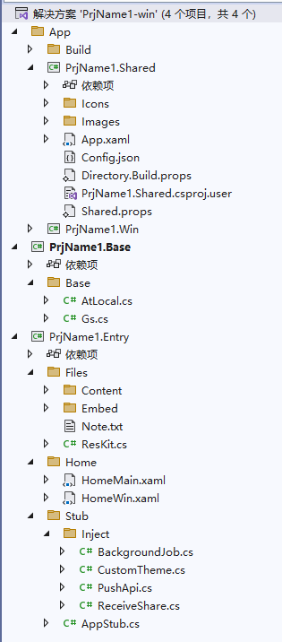
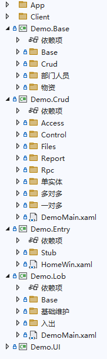

利用搬运工项目模板[创建新项目](/dt-docs/1开始/2创建项目/)的结构如下：

- PrjName1.Base，客户端基础项目，无任何UI，包括实体、领域服务、数据访问类、接口等
- PrjName1.Entry，含Stub、主窗口、框架UI的入口项目
- App\PrjName1.xxx，头部项目，无任何业务功能，包含一些公共的资源文件、图片、图标等

对于功能少的小型项目，除头部项目外分两个项目已足够，项目少便于快速开发和调试。

对于模块多、功能复杂的项目，建议再增加多个子项目，便于团队协作开发。比如：
- PrjName1.Base，其它项目都引用，无任何UI，包括实体、领域服务、数据访问类、接口等
- PrjName1.Entry，含Stub、主窗口、框架UI的入口项目，无任何业务功能
- PrjName1.UI，多个模块都引用的公共控件，尽可能的小、不经常改动，修改后依赖它的项目都需要重新编译
- PrjName1.ModuleA，模块A的UI和业务逻辑
- PrjName1.ModuleB，模块B的UI和业务逻辑

推荐参考Demo项目的结构，Demo项目是一个完整的搬运工项目，包含了所有的功能模块，便于学习和参考。

当模块项目之间**互相有依赖关系**时，无法通过直接引用的方式实现。一般通过以下方法：
1. 使用接口隔离，Base或UI项目中定义接口，模块内实现，其他模块引用时通过注入获取对象，进行调用。此为传统方法，用起来麻烦，但规范，推荐。
1. 将公共的功能抽取到Base或UI项目中，其它模块项目直接引用。此方法会造成公共项目庞大，修改后所有项目都需要重新编译，不利于快速开发和调试，不推荐。
1. 使用搬运工提供的共享视图、共享任意对象等功能，此方法简单方便，项目之间无代码耦合，独立编译，但不适合所有场景，推荐。

以下介绍共享视图、共享Tab、共享Form
## 共享视图
视图共享是粗颗粒度共享，无任何依赖关系的两个项目之间共享带有`[View]`标签的窗口或实现 `IView` 的类型，就是利用系统自带的打开窗口、打开视图功能。

定义共享视图

[View("基础")]
public partial class 基础Win : Win
{
    readonly 基础Form _form;

    public 基础Win()
    {
        InitializeComponent();
        _form = new 基础Form { OwnWin = this };
    }
}


在其它项目中打开该视图

Kit.OpenView("基础");


## 共享任意对象
共享任意对象比较自由，可以是普通对象或UI对象，对于任意使用`[Shared]`标签标记的类，系统会自动将其注册到共享对象管理器中，其它任意项目都可使用。

定义共享类型

[Share]
public partial class 基础List : List
{
}

[Share("自定义名称")]
public partial class 基础List : List
{
}


在其它项目中打开该视图

var list = Kit.GetShareObj<List>("基础List");


Kit中共享类型相关方法

/// 

/// 根据共享类型别名获取实例对象，通常用在两个无引用关系的dll之间的互相访问
/// 

/// <typeparam name="T">对象类型</typeparam>
/// <param name="p_alias">别名</param>
/// <param name="p_params">构造方法参数</param>
/// <returns>返回共享类型的实例对象</returns>
public static T GetShareObj<T>(string p_alias, object[] p_params = null)

/// 

/// 根据别名获取共享类型，通常用在两个无引用关系的dll之间的互相访问
/// 

/// <param name="p_alias">类型别名</param>
/// <returns>返回类型</returns>
public static Type GetShareType(string p_alias)
