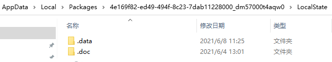
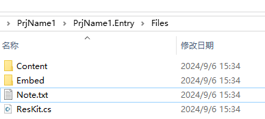
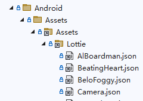
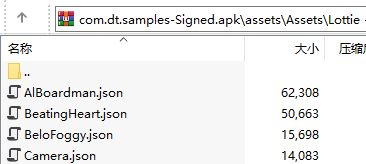
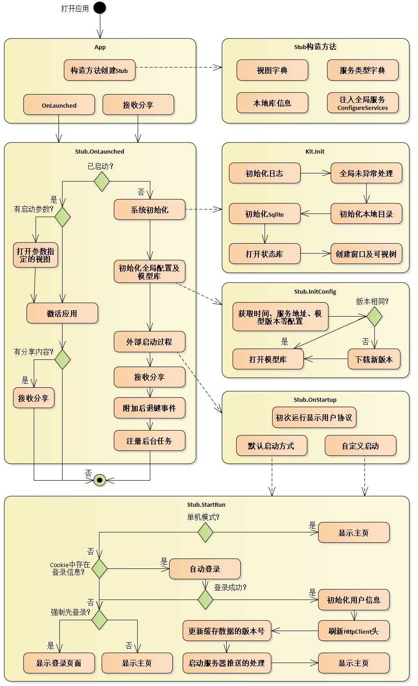

## 本地存储
客户端本地文件存储的根目录为`Kit.RootPath`，在不同平台对应不同位置，如：

/// 

/// 本地文件的根路径
/// uwp：C:\Users\...\LocalState
/// android：/data/user/0/App.Droid/files
/// ios：/Users/usrname/Library/Developer/CoreSimulator/Devices/xxx/data/Containers/Data/Application/yyy/Library/Data
/// wasm：/local
/// 

public static string RootPath
{
    get { return ApplicationData.Current.LocalFolder.Path; }
}

/// 

/// 本地缓存文件的存放路径
/// uwp：C:\Users\...\LocalState\.doc
/// android：/data/user/0/App.Droid/files/.doc
/// ios：/Users/usrname/Library/Developer/CoreSimulator/Devices/xxx/data/Containers/Data/Application/yyy/Library/Data/.doc
/// wasm：/local/.doc
/// 

public static string CachePath { get; } = Path.Combine(ApplicationData.Current.LocalFolder.Path, ".doc");

/// 

/// 本地sqlite数据文件的存放路径
/// uwp：C:\Users\...\LocalState\.data
/// android：/data/user/0/App.Droid/files/.data
/// ios：/Users/usrname/Library/Developer/CoreSimulator/Devices/xxx/data/Containers/Data/Application/yyy/Library/Data/.data
/// wasm：/local/.doc
/// 

public static string DataPath { get; } = Path.Combine(ApplicationData.Current.LocalFolder.Path, ".data");



`.doc`目录存储所有的缓存文件，如头像图片、下载的各种文件等等。

`.data`目录下的`.db`文件是Sqlite库文件，每个`.db`文件都是一个Sqlite库，`state.db`为状态库文件，存储App运行过程中产生的数据；`model.db`为模型库文件，是只读库，主要存储不经常变化的数据，从服务端下载，服务端更新时自动同步。除`state.db`和`model.db`之外，系统也支持自定义，只需在定义实体时指定sqlite库名即可：

[Sqlite("local")]
public partial class CrudX : EntityX<CrudX>
{
}


每个Sqlite库对应一个操作类，该类负责数据的`CRUD`，如`AtState、AtModel`分别为`state.db`和`model.db`的操作类，详细操作参见[领域层](/dt-docs/2基础/3领域层/)。

## 资源文件
资源文件是项目中不可缺少的部分，它的生成操作主要有：嵌入的资源、内容、AndroidAsset、BundleResource等，这些生成操作最终可分为两类：嵌入文件和内容文件。

为了更方便使用，搬运工项目模板中将这两类文件统一放在项目的`Files`目录

### 嵌入文件
嵌入的资源是将文件内容嵌入在生成的dll文件中，支持中文文件名。

所有平台用法相同，都是获取嵌入资源的文件流，约定统一放在项目的`Files\Embed`目录下，并提供`ResKit.GetStream()`获取嵌入资源的文件流：


/// 

/// 嵌入资源文件工具类
/// 

public static class ResKit
{
    const string _path = "PrjName1.Entry.Files.Embed.";

    /// 

    /// 返回资源文件流，需要在外部关闭流，文件在 Files\Embed 目录
    /// 

    /// <param name="p_fileName">文件名，在 Files\Embed 下含子目录时需要添加子目录前缀如：Excel.1040.xlsx</param>
    /// <returns></returns>
    /// <exception cref="Exception"></exception>
    public static Stream GetStream(string p_fileName)
    {
        Assembly assembly = typeof(ResKit).Assembly;
        Stream stream = assembly.GetManifestResourceStream(_path + p_fileName);
        if (stream == null)
            throw new Exception("未找到资源文件：" + p_fileName);
        return stream;
    }

    /// 

    /// 返回资源文件内容，文件在 Files\Embed 目录
    /// 

    /// <param name="p_fileName">文件名，在 Files\Embed 下含子目录时需要添加子目录前缀如：Excel.1040.xlsx</param>
    /// <returns></returns>
    /// <exception cref="Exception"></exception>
    public static string GetText(string p_fileName)
    {
        try
        {
            Assembly assembly = typeof(ResKit).Assembly;
            using (var stream = assembly.GetManifestResourceStream(_path + p_fileName))
            using (var reader = new StreamReader(stream))
            {
                return reader.ReadToEnd();
            }
        }
        catch
        {
            throw new Exception("未找到资源文件：" + p_fileName);
        }
    }
}


### 内容文件
内容文件是将资源文件打包输出到app的某个目录下，不同平台生成操作不同：

* `Content`在所有平台都有效，资源文件可以放在任意位置；
* `AndroidAsset`只在android有效，并且要求资源文件必须放在`Android\Assets`目录下，输出目录不包括Android这级，项目目录及apk包内输出目录如下：

* `BundleResource`只在iOS有效，资源文件放在`iOS\Resources`目录下；

为了统一内容文件的路径，项目中只使用`Content`，并约定统一放在项目的`Files\Content`目录下，**文件名只可字母数字，中文名在android下出错**，代码中的访问路径如：`ms-appx:///PrjName1.Entry/Files/Content/Lottie/abc.json`


禁止将内容文件放在当前项目的 Assets 目录下，在android会包含两份重复的文件


## 提醒与通知
`app`激活时使用`Kit.Msg Kit.Warn Kit.Error`提示消息，不使用通知。

通知一般和后台任务配合，用来在`app`退出时提醒用户，通知的功能主要两部分：显示标题和内容；点击通知后打开或激活`app`并显示通知的关联页。推送通知使用`Kit.Toast`方法：

public partial class Kit
{
    /// 

    /// 发布消息提示
    /// 

    /// <param name="p_content">显示内容</param>
    /// <param name="p_delaySeconds">
    /// 几秒后自动关闭，默认3秒
    /// <para>大于0：启动定时器自动关闭，点击也关闭</para>
    /// <para>0：不自动关闭，但点击关闭</para>
    /// <para>小于0：始终不关闭，只有程序控制关闭</para>
    /// </param>
    public static NotifyInfo Msg(string p_content, int p_delaySeconds = 3)

    /// 

    /// 警告提示
    /// 

    /// <param name="p_content">显示内容</param>
    /// <param name="p_delaySeconds">
    /// 几秒后自动关闭，默认5秒
    /// <para>大于0：启动定时器自动关闭，点击也关闭</para>
    /// <para>0：不自动关闭，但点击关闭</para>
    /// <para>小于0：始终不关闭，只有程序控制关闭</para>
    /// </param>
    public static NotifyInfo Warn(string p_content, int p_delaySeconds = 5)

    /// 

    /// 显示错误对话框
    /// 

    /// <param name="p_content">消息内容</param>
    /// <param name="p_title">标题</param>
    public static void Error(string p_content, string p_title = null)

    /// 

    /// 显示系统通知，iOS只有app在后台或关闭时才显示！其他平台始终显示
    /// 

    /// <param name="p_title">标题</param>
    /// <param name="p_content">内容</param>
    /// <param name="p_startInfo">点击通知的启动参数</param>
    public static void Toast(string p_title, string p_content, AutoStartInfo p_startInfo = null)
}


## 当前用户
可以通过静态类`Kit`访问与当前登录用户相关的信息，包括具有的权限、用户参数等。

public partial class Kit
{
    /// 

    /// 用户ID
    /// 

    public static long UserID { get; set; } = -1;

    /// 

    /// 姓名
    /// 

    public static string UserName { get; set; } = "无";

    /// 

    /// 手机号码
    /// 

    public static string UserPhone { get; set; }

    /// 

    /// 头像
    /// 

    public static string UserPhoto { get; set; }

    /// 

    /// 是否已登录
    /// 

    public static bool IsLogon => UserID > 0;

    /// 

    /// cookie自动登录
    /// 

    /// <param name="p_showWarning">是否显示警告信息</param>
    /// <returns></returns>
    public static Task<bool> LoginByCookie(bool p_showWarning = false)

    /// 

    /// 判断当前登录用户是否具有指定权限
    /// 

    /// <param name="p_permission">权限名称</param>
    /// <returns>true 表示有权限</returns>
    public static Task<bool> HasPermission(string p_permission)

    /// 

    /// 根据参数id获取用户参数值
    /// 

    /// <typeparam name="T"></typeparam>
    /// <param name="p_paramID"></param>
    /// <returns></returns>
    public static Task<T> GetParamByID<T>(long p_paramID)

    /// 

    /// 根据参数名称获取用户参数值
    /// 

    /// <typeparam name="T"></typeparam>
    /// <param name="p_paramName"></param>
    /// <returns></returns>
    public static Task<T> GetParamByName<T>(string p_paramName)

    /// 

    /// 保存用户参数值
    /// 

    /// <param name="p_paramID"></param>
    /// <param name="p_value"></param>
    /// <returns></returns>
    public static Task<bool> SaveParams(string p_paramID, string p_value)
}


## 启动过程

## 后台任务
后台任务是系统的重要补充，它能够在不打开app的情况下访问服务器，获得所需的提醒，各平台实现方式不同，windows android是独立的真后台，iOS只是模拟的后台而且运行不准时，为了实现跨平台效果，后台统一采用定时执行的方式，windows android为默认的最小时间间隔15分钟，iOS无法保证准确的时间间隔。

同样后台任务需要在`AppStub`的`ConfigureServices`方法注入后台任务服务，完成后台任务内容即可。

public class AppStub : DefaultStub
{
    protected override void ConfigureServices(IServiceCollection p_svcs)
    {
        base.ConfigureServices(p_svcs);
        p_svcs.AddSingleton<IRpcConfig, RpcConfig>();
        p_svcs.AddTransient<IBackgroundJob, BackgroundJob>();
        p_svcs.AddTransient<IReceiveShare, ReceiveShare>();
        p_svcs.AddSingleton<ILogSetting, LogSetting>();
        p_svcs.AddTransient<ITheme, CustomTheme>();
    }
}

class BackgroundJob : IBackgroundJob
{
    /// 

    /// 后台任务处理，除 AtState、Stub、Kit.Rpc、Kit.Toast 外，不可使用任何UI和外部变量，保证可独立运行！！！
    /// 记录日志使用 BgJob.WriteLog
    /// 

    public async Task Run()
    {
        //string tpName = AtState.GetCookie("LoginPhone");
        Kit.Toast(
            "样例",
            DateTime.Now.ToString(),
            new AutoStartInfo { WinType = typeof(LvHome).AssemblyQualifiedName, Title = "列表" });

        await Task.CompletedTask;
    }
}


目前后台任务存在的问题：
* android：延时15分钟后执行，关闭app后不运行后台任务，WorkManager not working when app is killed
* iOS：在真机、未禁止后台刷新、非省电模式、锁屏的情况下，最小延时15分钟后执行，其它情况不执行！！！
* win：x64模式下运行完美，延时15分钟
* wasm：不支持

详细参见[后台任务问题](https://github.com/Daoting/dt/issues/3)

以下是各平台的实现细节，业务开发过程用不到，有兴趣的可以参考：
### Windows
在包配置文件Package.appxmanifest中设置定时器入口：

    <Applications>
        <Application Id="App"
          Executable="$targetnametoken$.exe"
          EntryPoint="$targetentrypoint$">
            <uap:VisualElements
              DisplayName="搬运工-WinUI"
              Description="WinUI版搬运工"
              BackgroundColor="transparent"
              Square150x150Logo="Assets\Square150x150Logo.png"
              Square44x44Logo="Assets\Square44x44Logo.png">
                <uap:DefaultTile Wide310x150Logo="Assets\Wide310x150Logo.png" />
                <uap:SplashScreen Image="Assets\SplashScreen.png" BackgroundColor="#1BA1E2" />
            </uap:VisualElements>
            <Extensions>
                <Extension Category="windows.backgroundTasks" EntryPoint="Dt.Tasks.TimeTriggeredTask">
                    <BackgroundTasks>
                        <Task Type="timer"/>
                    </BackgroundTasks>
                </Extension>

                <!--单击Toast通知激活的 CLSID-->
                <desktop:Extension Category="windows.toastNotificationActivation">
                    <desktop:ToastNotificationActivation ToastActivatorCLSID="10ab3dd3-6a3c-41b1-93a2-5fde2f2c7c28" />
                </desktop:Extension>

                <!--Register COM CLSID LocalServer32 registry key-->
                <com:Extension Category="windows.comServer">
                    <com:ComServer>
                        <com:ExeServer Executable="Dt.Shell.Win.exe" Arguments="-ToastActivated" DisplayName="Toast activator">
                            <com:Class Id="10ab3dd3-6a3c-41b1-93a2-5fde2f2c7c28" DisplayName="Toast activator"/>
                        </com:ExeServer>
                    </com:ComServer>
                </com:Extension>
            </Extensions>
        </Application>
    </Applications>

    <Capabilities>
        <rescap:Capability Name="runFullTrust" />
    </Capabilities>
    
    <Extensions>
        <Extension Category="windows.activatableClass.inProcessServer">
            <InProcessServer>
                <Path>WinRT.Host.dll</Path>
                <ActivatableClass ActivatableClassId="Dt.Tasks.TimeTriggeredTask" ThreadingModel="both" />
            </InProcessServer>
        </Extension>
    </Extensions>

后台定时任务的入口类必须在`.winmd`项目中，如`Dt.Task`项目生成`Dt.Task.winmd`，该类只起到入口作用，不依赖任何其他程序集，如：

/// 

/// 锁屏后定时启动后台任务，后台任务必须在*.winmd项目中，最小时间间隔15分钟
/// 

public sealed class TimeTriggeredTask : IBackgroundTask
{
    /// 

    /// 后台处理入口
    /// 

    /// <param name="taskInstance"></param>
    public async void Run(IBackgroundTaskInstance taskInstance)
    {
        var deferral = taskInstance.GetDeferral();
        try
        {
            Type tp = Type.GetType("Dt.Core.BgJob,Dt.Core");
            if (tp != null)
            {
                var run = tp.GetMethod("Run", BindingFlags.Public | BindingFlags.Static);
                var task = run.Invoke(null, new object[] { }) as Task;
                await task;
            }
        }
        catch { }
        deferral.Complete();
    }
}



因win后台是完全独立的，即使`app`在前台已打开也没有任何关系，所以后台代码中除 AtState、UnaryRpc、Kit.Toast 外，不可使用任何UI和外部变量，保证可独立运行！！！唯一UI相关的是Kit.Toast显示通知。


### Android
安卓版后台经历了多次变更，以前的方法都已过时后台触发不稳定，最后选定google提供的WorkManager方式(费挺大周折)，该方式需要引用包：

<ItemGroup Condition="$(TargetFramework.Contains('-android'))">
    <PackageReference Include="Square.OkHttp3" Version="4.9.3.2" />
    <!-- WorkManager后台任务引用 -->
    <PackageReference Include="Xamarin.AndroidX.Work.Runtime" Version="2.7.1.4" />
</ItemGroup>


升级到.net-maui后，关闭app后不运行后台任务！


### iOS
利用Background Fetch方式实现后台任务，首先在Info.plist中开启：

    <!--后台模式-->
	<key>UIBackgroundModes</key>
	<array>
		<string>fetch</string>
		<string>processing</string>
	</array>
    <!--后台任务标识，代码中注册和请求时一致-->
    <key>BGTaskSchedulerPermittedIdentifiers</key>
    <array>
        <string>Dt.Core.BgJob</string>
    </array>



public static partial class BgJob
{
    public const string ToastStart = "ToastStart";
    // 和 Info.plist 的 BGTaskSchedulerPermittedIdentifiers 值相同
    const string _taskID = "Dt.Core.BgJob";

    /// 

    /// 注册后台任务必须在 AppDelegate 构造方法中调用
    /// 

    public static void RegisterEarliest()
    {
        // iOS13 以后原 Background Fetch 方式失效，采用注册后台任务、提交后台任务请求的方式
        // 注册和提交请求通过 _taskID 识别任务，和 Info.plist 的 BGTaskSchedulerPermittedIdentifiers 值相同！

        // 只有真机才能成功提交后台任务请求！！！

        // https://dzone.com/articles/how-to-update-app-content-with-background-tasks-us
        // https://github.com/spaceotech/BackgroundTask/blob/master/SOBackgroundTask/Application/AppDelegate.swift

        try
        {
            // 必须在 AppDelegate 构造方法中调用！！！
            bool suc = BGTaskScheduler.Shared.Register(_taskID, null, BgJobHandler);
            Debug.WriteLine(suc ? "后台任务注册成功" : "后台任务注册失败");
        }
        catch (Exception ex)
        {
            Debug.WriteLine("后台任务注册异常：" + ex.Message);
        }
    }
}


### 统一后台任务
三平台的后台任务最终统一调BgJob.Run方法，该方法是后台任务运行入口：

    /// 

    /// 后台任务运行入口
    /// 此方法不可使用任何UI和外部变量，保证可独立运行！！！
    /// 

    /// <returns></returns>
    public static async Task Run()
    {
        WriteLog("进入Run");

        // 前端在运行或后台资源未释放，Stub实例存在
        Stub stub = Stub.Inst;
        if (stub == null)
        {
            // 因后台任务独立运行，存根类型需要从State库获取！
            string tpName = await CookieX.Get(_stubType);
            if (!string.IsNullOrEmpty(tpName))
            {
                Type tp = Type.GetType(tpName);
                if (tp != null)
                    stub = Activator.CreateInstance(tp) as Stub;
            }
        }

        if (stub == null)
        {
            Unregister();
            return;
        }

        var bgJob = stub.SvcProvider.GetService<IBackgroundJob>();
        if (bgJob != null)
        {
            string msg = "启动";
            try
            {
                await bgJob.Run();
                msg += " -> 结束";
            }
            catch (Exception ex)
            {
                msg += $" -> 运行异常\r\n{ex.Message}";
            }
            WriteLog(msg);
        }
        else
        {
            Unregister();
            WriteLog("无处理内容，已注销！");
        }
    }
