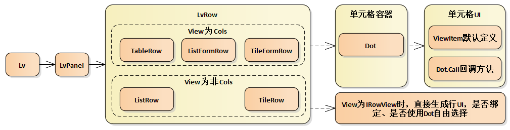

Lv为列表控件(ListView)，因使用频率高采用缩写作为控件名称，**无编辑功能**，涉及的主要类型关系如下图所示：

## 视图类型
`Lv.ViewMode`提供三种视图类型：表格(`Table`)、列表(`List`)、磁贴(`Tile`)，默认为`List`。

`Lv.View`为行/项目模板，支持`DataTemplate`、`DataTemplateSelector`、`Cols`列定义 或 `IRowView`，是`Lv`的默认`xaml`内容。

### 列定义
当`Lv.View`为`Cols`列定义时，支持所有视图类型：

<a:Lv x:Name="_lv" ViewMode="Table">
    <a:Cols>
        <a:Col ID="xm" Title="姓名" Width="120" />
        <a:Col ID="bh" Title="编号" Width="80" />
        <a:Col ID="chushengrq" Title="出生日期" Width="120" />
        <a:Col ID="shenfenzh" Title="身份证号码" Width="200" />
        <a:Col ID="xb" Title="性别" Width="60" FontSize="12" />
        <a:Col ID="hunfou" Title="婚否" Width="60" />
        <a:Col ID="shengao" Title="身高" Width="60" FontStyle="Italic" FontWeight="Bold" />
        <a:Col ID="bumen" Title="所属部门" Width="100" Foreground="White" Background="Gray" />
        <a:Col ID="note" Title="备注" Width="150" RowSpan="2" />
    </a:Cols>
</a:Lv>

`ViewMode`为`Table`显示为普通的表格：

`ViewMode`为`List`显示为表单列表：

`ViewMode`为`Tile`显示为表单磁贴：

### 行/项目模板定义
行/项目模板定义适用于视图类型为列表或磁贴的情况，磁贴与列表的不同主要是`ViewMode`为`Tile`。

<a:Lv x:Name="_lv" ViewMode="Table">
    <DataTemplate>
        <Grid Padding="6">
            <Grid.ColumnDefinitions>
                <ColumnDefinition Width="Auto" />
                <ColumnDefinition Width="*" />
            </Grid.ColumnDefinitions>
            <Grid.RowDefinitions>
                <RowDefinition Height="Auto" />
                <RowDefinition Height="Auto" />
            </Grid.RowDefinitions>
            <Border Background="{StaticResource 主蓝}"
                    Height="50"
                    Width="50"
                    VerticalAlignment="Center">
                <TextBlock Text="{Binding Index}"
                            FontSize="30"
                            Foreground="White"
                            VerticalAlignment="Center"
                            TextAlignment="Center" />
            </Border>

            <StackPanel Margin="10,0,0,0" VerticalAlignment="Center" Grid.Column="1">
                <a:Dot ID="xm" />
                <StackPanel Orientation="Horizontal">
                    <a:Dot ID="xb" />
                    <a:Dot ID="chushengrq" Margin="20,0,0,0" />
                </StackPanel>
            </StackPanel>
            <StackPanel Grid.Row="1" Grid.ColumnSpan="2">
                <a:Dot ID="shenfenzh" />
                <a:Dot ID="bumen" />
                <a:Dot ID="note" Call="Def.小灰" />
            </StackPanel>
        </Grid>
    </DataTemplate>
</a:Lv>


## 数据源
`Lv`的数据源有两种类型：`普通数据源` 和 `分页数据源`。

所有数据源类型都支持动态设置排序、过滤、分组操作，其属性如下：

/// 

/// 获取设置过滤回调
/// 

public Predicate<object> Filter

/// 

/// 获取设置排序条件
/// 

public SortDescription SortDesc

/// 

/// 获取设置分组列名
/// 

public string GroupName


### 普通数据源
通过`Data`属性获取和设置，类型为`INotifyList`，常用数据源类型有`Table` 和 `Nl<T>`。

`Table` 类型在客户端和服务端都能使用，一般作为数据库查询结果，也可手动创建，并且子类`Table<TEntity>`支持实体操作，详细参见[Table操作](/dt-docs/2基础/2基础功能/#table操作)。

`Nl<T>`不同于`List<T>`，它是具有集合变化通知的泛型列表，是`NotifyList`的缩写。

遵循`MVVM`的设计模式，集合变化时(如增删行数据)能直接反映到前端UI，所以`Lv`增删行时只能通过`Data`数据源进行，未提供其他方法，所有操作只针对数据而不是UI。当需要批量操作数据时，为达到高效只刷新一次UI，除使用以上批量增删方法外还可以使用Defer()用来延迟触发集合变化事件，用法如：

using (tbl.Defer())
{
    foreach (var row in data)
    {
        tbl.Add(row);
    }
}


从设置Data到UI显示的过程为：Data(源) -> LvDataView(排序、过滤、分组处理) -> LvItem(数据+Style+UI) -> LvRow (内容布局、数据绑定)，整个流程如下图所示：

### 分页数据源
分页数据源的属性为`PageData`，在滚动栏滚动到最低端时加载下一页数据，滚动到最上端时加载上一页数据，动态加载数据最终还是操作`Lv.Data`。分页数据源类型为`PageData`，通过`NextPage`回调方法或`Sql`获取下一页数据，获取新页数据的优先级为：`NextPage > Sql > SqlStr`，`InsertTop`属性控制新数据是否插入头部(默认插入尾部)，调用`PageData.LoadPageData()`方法加载新页数据，使用过程如：

void OnPageData(object sender, RoutedEventArgs e)
{
    _isTbl = true;
    _lv.PageData = new PageData { NextPage = OnNextPage };
}

void OnTopPageData(object sender, RoutedEventArgs e)
{
    _isTbl = true;
    _lv.PageData = new PageData { NextPage = OnNextPage, InsertTop = true };
}

void OnPageObjs(object sender, RoutedEventArgs e)
{
    _isTbl = false;
    _lv.PageData = new PageData { NextPage = OnNextPage };
}

void OnNextPage(PageData p_pd)
{
    INotifyList ls;
    if (_isTbl)
        ls = SampleData.CreatePersonsTbl(p_pd.PageSize);
    else
        ls = SampleData.CreatePersonsList(p_pd.PageSize);
    p_pd.LoadPageData(ls);
}


## 行内容UI
`Lv`可视树结构如下图所示：
* `Lv`内容由`LvPanel`承载；
* `LvPanel`继承自`Panel`，负责`LvRow`的生成和布局；
* `LvRow`也继承自`Panel`，负责行内容的生成和布局；
* 行内容由单元格UI和静态UI组成，在控件外部定义，通过`Lv.View`属性指定，`View`的类型可以为`DataTemplate、DataTemplateSelector、Cols`列定义 或 `IRowView`。


所以`Lv`的界面主要通过`View`和`ViewMode`控制。

`ViewMode`控制行与行之间的布局关系，如表格和列表的行与行是自上而下布局的，磁贴是先水平后垂直布局的；

`View`只控制行内容，是业务开发的重点。


根据View的不同类型介绍如下：

### Cols
列定义支持所有视图类型，行内容由所有列(`Cols`)组成，根据每个列定义(`Col`)生成`Dot`作为单元格容器。

`ViewMode`为表格视图时每项为表格的一行，列表视图的每行、磁贴视图的每项为一个表单，使用场景较少，[运行时UI参见](#列定义)。


除Cols外其他View类型都不支持表格视图。


### DataTemplate
当每行UI格式相同只是数据不同时适用，支持虚拟行模式，定义和UI显示参见[行/项目模板定义](#行项目模板定义)。

### TemplateSelector
根据行数据动态获取行数据模板再根据行数据模板创建行内容的方式，适用于不同数据采用不同行内容和行样式的情况，自由度相对较大，布局时不支持虚拟行方式，如聊天目录：

使用方法如：

public partial class LvListSelector : Win
{
    public LvListSelector()
    {
        InitializeComponent();

        _lv.View = new ListItemSelector
        {
            Male = (DataTemplate)Resources["Male"],
            Lady = (DataTemplate)Resources["Lady"],
        };
        _lv.Data = SampleData.CreatePersonsTbl(50);
    }
}

public class ListItemSelector : DataTemplateSelector
{
    public DataTemplate Male { get; set; }
    public DataTemplate Lady { get; set; }

    protected override DataTemplate SelectTemplateCore(object item)
    {
        if (((LvItem)item).Row.Str("xb") == "男")
            return Male;
        return Lady;
    }
}


### IRowView
`IRowView`是创建行内容自由度最大的方式，当使用`DataTemplateSelector`需要大量`DataTemplate`或每个`DataTemplate`只有细微差别时，可以使用`IRowView`方式替代，该方式为古老的创建行方法，最大缺点是无法像使用`DataTemplate`那样在`xaml`中定义事件，如`Button.Click`，只能在创建UI时硬编码。该方式不支持虚拟行，创建时直接生成最终界面，无需`Dot`或绑定，但也支持数据修改后同步显示的效果。

当数据源行数较少且每行UI都有差别时，该方式是效率最高的，如`NavList`就采用该方式。

外部通过代码创建的UI可以包含绑定，也可以根据行数据直接生成静态UI。如：

public partial class LvRowView : Win
{
    public LvRowView()
    {
        InitializeComponent();

        _lv.View = new MyRowView();
        _lv.Data = SampleData.CreatePersonsTbl(50);
    }
}

public class MyRowView : IRowView
{
    public UIElement Create(LvItem p_item)
    {
        return new TextBlock
        {
            Text = p_item.Row.Str("xm"),
            Margin = new Thickness(10),
            Foreground = (p_item.Row.Str("xb") == "男") ? Res.BlackBrush : Res.RedBrush,
        };
    }
}


## 单元格UI
单元格UI是指表格中的单元格界面、列表/磁贴行数据的每项对应的界面，整个`Lv`控件界面是由这些单元格UI以行的布局规则组成，所有单元格UI决定了`Lv`的显示内容。

从数据源到单元格UI的依赖关系如下图所示：

### ViewItem
在`Lv`控件中，`ViewItem`扮演非常重要的角色，它是数据源中的每行数据和`Lv`中的每行UI的中间对象，属于`MVVM`的`VM`，`Lv`表格中的每行、列表中的每行、磁贴中的每项的`DataContext`就是`ViewItem`对象。 `ViewItem`主要负责两方面功能：
1. 负责监听数据源的变化，保证数据修改、删除时能实时的更新到界面；
2. 负责控制行样式，包括前景、背景、字体大小粗细等样式，这些样式会应用到每个单元格UI；

### Dot
`Dot`继承自`ContentPresenter`，作为单元格UI的容器，负责展示`Table`数据源的`Cell`、普通对象的属性、或根据行数据动态生成UI。

它主要通过`DataContextChanged`事件生成或更新单元格内容，`DataContext`为`ViewItem`对象，除`Dot`的5种样式采用`OneTime`绑定到`ViewItem`外，所有内部元素只依靠切换 `DataContext` 更新，Dot的定义：

public partial class Dot : ContentPresenter
{
    public Dot()
    {
        // 系统默认大小14，uwp初次测量结果偏小
        FontSize = _defaultFontSize;
        DataContextChanged += OnDataContextChanged;
    }

    /// 

    /// 获取设置Dot内容对应的数据对象的属性名，null或空时对应数据对象本身
    /// 

    public string ID { get; set; }

    /// 

    /// 获取设置自定义单元格UI的方法名，多个方法名用逗号隔开，形如：Def.Icon,Def.小灰
    /// 

    public string Call

    /// 

    /// 获取设置格式串，null或空时按默认显示，如：时间格式、小数位格式、枚举类型名称
    /// <para>也是自定义单元格UI方法的参数</para>
    /// 

    public string Format

    /// 

    /// 获取设置内容为空时是否自动隐藏Dot，默认true
    /// <para>隐藏时Padding 或 Margin 不再占用位置！</para>
    /// <para>若false，内容为空时仍然占位</para>
    /// <para>未处理Table模式的Dot，因其负责画右下边线！</para>
    /// 

    public bool AutoHide

    void OnDataContextChanged(FrameworkElement sender, DataContextChangedEventArgs e)
    {
        ViewItem vi = e.NewValue as ViewItem;
        if (vi == null)
            return;

        if (!_isInit)
        {
            _isInit = true;

            /*****************************************************************************************/
            // 只在初次触发 DataContextChanged 构造内部元素！
            // 初次触发发生在加载 DataTemplate 后设置 DataContext 时，还未在可视树上！
            // 若在 OnApplyTemplate 或 Loaded 中绑定在uno上已晚！
            // Dot及内部元素的只有以下5种样式采用OneTime绑定，其余依靠切换 DataContext 更新Dot！！！
            /*****************************************************************************************/

            // 构造内部元素
            Content = GetCellUI(vi);

            // 设置初始值
            _set?.Invoke(new CallArgs(vi, this));

            // 优先级：直接设置 > ViewItem属性，未直接设置的绑定ViewItem中的行样式
            if (vi.Host.IsCustomItemStyle)
            {
                if (ReadLocalValue(ForegroundProperty) == DependencyProperty.UnsetValue)
                    SetBinding(ForegroundProperty, new Binding { Path = new PropertyPath("Foreground"), Mode = BindingMode.OneTime });
                if (ReadLocalValue(BackgroundProperty) == DependencyProperty.UnsetValue)
                    SetBinding(BackgroundProperty, new Binding { Path = new PropertyPath("Background"), Mode = BindingMode.OneTime });
                if (ReadLocalValue(FontWeightProperty) == DependencyProperty.UnsetValue)
                    SetBinding(FontWeightProperty, new Binding { Path = new PropertyPath("FontWeight"), Mode = BindingMode.OneTime });
                if (ReadLocalValue(FontStyleProperty) == DependencyProperty.UnsetValue)
                    SetBinding(FontStyleProperty, new Binding { Path = new PropertyPath("FontStyle"), Mode = BindingMode.OneTime });
                if (FontSize == _defaultFontSize)
                    SetBinding(FontSizeProperty, new Binding { Path = new PropertyPath("FontSize"), Mode = BindingMode.OneTime });
            }
        }
        else
        {
            _set?.Invoke(new CallArgs(vi, this));
        }
    }
}


#### 默认单元格UI

通过`ID`指定当前`Dot`要展示的数据源中的列名或属性名称，为`null`或空时对应`DataContext`本身，当未设置`Call`属性时，`Dot`的内容根据数据源自动生成，称为`默认单元格UI`，如`bool`类型显示为`CheckBox`、`Icons`类型显示图标、`int double`等数值类型右对齐、自动显示两位小数、`DateTime`只显示年-月-日、`Color`类型直接显示颜色等等。

#### 自定义单元格UI

`Call`属性非常重要，当默认单元格UI无法满足需求时，**它是自定义单元格UI的唯一方法**。

`Call`是字符串类型，记录自定义单元格UI的方法名，多个方法名用`逗号`隔开，大小写不敏感，也可以使用汉字，形如：`Def.Icon,Def.小灰`，这些方法会被顺序调用，比如：`Def.AutoDate,Def.小灰`，`Def`是类名，`AutoDate`是方法名，两个方法顺序调用，实现自适应时间转换(如 昨天，09:13, 2015-04-09)，并且深灰小字样式。

`Def`是系统内置类型，主要包括以下常用方法：

/// 

/// 常用的单元格UI类型
/// 

[LvCall]
public class Def
{
    /// 

    /// 显示为图标字符
    /// 

    /// <param name="e"></param>
    public static void Icon(Env e)
    
    /// 

    /// 显示为CheckBox字符
    /// 

    /// <param name="e"></param>
    public static void CheckBox(Env e)

    /// 

    /// 显示为图片
    /// 

    /// <param name="e"></param>
    public static void Image(Env e)

    /// 

    /// 显示为文件列表链接
    /// 

    /// <param name="e"></param>
    public static void FileLink(Env e)

    /// 

    /// 显示为枚举类型的名称
    /// 

    /// <param name="e"></param>
    public static void EnumText(Env e)

    /// 

    /// 自适应时间转换器，如 昨天，09:13, 2015-04-09
    /// 

    /// <param name="e"></param>
    public static void AutoDate(Env e)

    /// 

    /// 红底白字的警告圈样式
    /// 

    /// <param name="e"></param>
    public static void Warning(Env e)

    /// 

    /// 深灰小字
    /// 

    /// <param name="e"></param>
    public static void 小灰(Env e)

    /// 

    /// 黑底白字
    /// 

    /// <param name="e"></param>
    public static void 黑白(Env e)

    /// 

    /// 蓝底白字
    /// 

    /// <param name="e"></param>
    public static void 蓝白(Env e)

    /// 

    /// 红底白字
    /// 

    /// <param name="e"></param>
    public static void 红白(Env e)
}


效果如下：

`Def.Image`目前主要支持两类图片路径`ms-appx`和文件服务路径，因uno平台原因`ms-appdata`和完整网络路径暂不支持，从文件服务下载的图片会缓存在本地，以备下次加载。

`Def.File`显示“文件列表链接”，点击链接显示文件列表对话框，若要在`Lv`中显示文件列表内容请直接使用`FileList`，但因占用区域太大不适合用在表格视图模式下。

`Call`方法所属的类型应有`[LvCall]`标签，方法原型：静态方法无返回值，所有用到的数据源、UI、Set事件等由`Env`参数提供，该类型可以通过VS扩展工具自动添加：

样例中的实现效果：

典型的`Call`方法如下所示：

public static void Format(Env e)
{
    var tb = new TextBlock { Style = Res.LvTextBlock,  };
    e.UI = tb;

    e.Set += c =>
    {
        tb.Text = c.GetVal<double>("shengao").ToString(c.Format);
    };
}


`Call`方法主要分成两部分：
* 一部分是设置单元格内容`e.UI`，相当于`DataTemplate`，但不包括绑定；
* 另一部分是附加`Set`事件，`Set`事件通过`Dot.DataContextChanged`事件触发，主要完成更新UI显示内容或更新样式的功能，附加`Set`事件的方法通常为`lambda`方法，采用`lambda`方法方便使用外部变量，相当于绑定中的赋值过程，但`Call`方法支持异步、可直接赋值，更方便直观。异步如：

public static void AsyncFunc(Env e)
{
    var tb = new TextBlock { Style = Res.LvTextBlock, };
    e.UI = tb;

    e.Set += async c =>
    {
        await Task.Delay(1000);
        tb.Text = new Random().Next(1000).ToString();
    };
}


`Set`事件的参数类型为`CallArgs`，通用的数据处理可以采用`CallArgs`扩展方法的方式复用，这些扩展方法相当于绑定中的转换器如：

public static class MyCallArgsEx
{
    public static bool IsHeigher(this CallArgs c)
    {
        return c.Double > 1.8;
    }
}



因此自定义单元格UI的复用分两个级别：
* 粗粒度的直接复用`Call`方法
* 细粒度的复用`CallArgs`扩展方法。


表格中的`Col`定义只是一个载体，在创建可视元素时仍采用`Dot`作为单元格UI的容器，并且将`Col`的属性复制到`Dot`，所以`Col.Call`的设置等同于`Dot.Call`。

建议行模板中尽可能的使用`Dot`，当无法使用`Dot`完成需求时，也可以采用传统的绑定方式，如：

<Ellipse Visibility="{Binding [Unread], Converter={StaticResource CvBoolToVisible}}" Fill="Red" />


还有一种情况就是单元格的内容为普通字符串，但无法从数据源中直接获得，例如`double`数值转带`%`的值，这时可以通过`Call`方式但比较麻烦，当数据源为`Entity`时可以为实体类增加只读属性，内部会自动将`Dot`绑定到该属性值，非常方便。如：

/// 

/// 带%的利率，绑定到Dot时使用的属性值！
/// 

public string RatePercent => ((double)this["Rate"]).ToString("P");

<a:Dot ID="RatePercent" />

若很多地方都需要该转换，则可通过统一的`Call`方法实现，看具体使用场景。

### 行样式
行样式放在此处说明是因为行样式的最终实现由`Dot`完成，行样式包括以下5个属性，通过`Lv.ItemStyle`回调方法设置。使用样例：

_lv.ItemStyle = e =>
{
    var row = e.Row;
    e.Background = row.Date("chushengrq").Month == 9 ? Res.浅黄 : Res.WhiteBrush;
    e.Foreground = row.Double("Shengao") > 1.75 ? Res.RedBrush : Res.BlackBrush;
    e.FontWeight = row.Str("bumen") == "循环门诊" ? FontWeights.Bold : FontWeights.Normal;
    e.FontStyle = row.Str("bumen") == "内分泌门诊" ? FontStyle.Italic : FontStyle.Normal;
};


## 选择模式
`Lv.SelectionMode`选择模式共三种：`None,Single,Multiple`，默认单选`Single`，可以动态切换，多选状态时行头显示选择框，`None`时无选择样式。

单选模式时常用`ItemClick`事件，每次点击行时都触发，通过参数`ItemClickArgs.IsChanged`判断当前点击行是否和上次点击行相同，事件定义：

void OnRowClick(object sender, RoutedEventArgs e)
{
    _lv.ItemClick += OnRowChanged;
}

void OnRowChanged(object sender, ItemClickArgs e)
{
    if (e.Data is Row row)
    {
        Row old = e.OldData as Row;
    }
    else if (e.Data is Person per)
    {
        Person old = e.OldData as Person;
    }
}

public class ItemClickArgs : EventArgs
{
    /// 

    /// 当前点击行是否和上次点击行相同
    /// 

    public bool IsChanged

    /// 

    /// 当前点击行
    /// 

    public object Data { get; }

    /// 

    /// 上次点击行
    /// 

    public object OldData { get; }

    /// 

    /// 当前点击的Row
    /// 

    public Row Row
}


属性HasSelected判断当前是否有选择行，该属性常用来绑定到有选择行时的操作，如删除：

<a:Mi ID="删除" Icon="垃圾箱" Click="OnDel" IsEnabled="{Binding HasSelected,ElementName=_lv}" />


和选择相关的属性包括：

/// 

/// 获取设置选择模式，默认Single
/// 

public SelectionMode SelectionMode

/// 

/// 获取当前选择的行列表
/// 

public IEnumerable<object> SelectedItems

/// 

/// 获取设置当前选定行，设置null时清空选择，多选时为返回最后选择行
/// 

public object SelectedItem

/// 

/// 获取设置选定行的索引，-1无选定行，设置-1清空选择
/// 

public int SelectedIndex

/// 

/// 获取选择的行数
/// 

public int SelectedCount

/// 

/// 获取当前选择的Row列表
/// 

public IEnumerable<Row> SelectedRows

/// 

/// 获取当前选定的Row
/// 

public Row SelectedRow

/// 

/// 获取是否有选择行
/// 

public bool HasSelected


在单选和多选之间切换的功能：

<a:Menu>
    <a:Mi ID="全选" Icon="正确" Click="OnSelectAll" Visibility="Collapsed" />
    <a:Mi ID="选择" Icon="全选" Click="OnMultiMode" />
    <a:Mi ID="取消" Icon="全选" Click="OnCancelMulti" Visibility="Collapsed" />
</a:Menu>

void OnSelectAll(object sender, Mi e)
{
    _lv.SelectAll();
}

void OnMultiMode(object sender, Mi e)
{
    _lv.SelectionMode = Base.SelectionMode.Multiple;
    Menu.HideExcept("删除", "全选", "取消");
}

void OnCancelMulti(object sender, Mi e)
{
    _lv.SelectionMode = Base.SelectionMode.Single;
    Menu.ShowExcept("删除", "全选", "取消");
}


## 分组
所有视图类型都支持分组，效果如下图所示：

涉及到分组相关的属性包括：

/// 

/// 获取设置顶部是否显示分组导航，默认true
/// 

public bool ShowGroupHeader

/// 

/// 获取设置分组列名
/// 

public string GroupName

/// 

/// 获取设置分组模板，和GroupContext配合使用
/// 

public DataTemplate GroupTemplate

/// 

/// 获取设置分组模板的数据上下文类型，和GroupTemplate配合使用，需继承自GroupContext
/// 

public Type GroupContext


自定义分组模板的样例：

<a:Lv x:Name="_lv">
    <DataTemplate>
        <a:Dot ID="xm" />
    </DataTemplate>
    <a:Lv.GroupTemplate>
        <DataTemplate>
            <StackPanel Padding="10,0,10,0" Orientation="Horizontal">
                <StackPanel Orientation="Horizontal" Padding="10,4,10,4" Background="Black">
                    <TextBlock Text="人数" Foreground="White" />
                    <TextBlock Text="{Binding Count}" Foreground="White" />
                </StackPanel>
                <StackPanel Orientation="Horizontal" Padding="10,4,10,4">
                    <TextBlock Text="平均身高" Foreground="White" />
                    <TextBlock Text="{Binding Average}" Foreground="White" />
                </StackPanel>
                <StackPanel Orientation="Horizontal" Padding="10,4,10,4" Background="Gray">
                    <TextBlock Text="最高" Foreground="White" />
                    <TextBlock Text="{Binding Max}" Foreground="White" />
                </StackPanel>
                <StackPanel Orientation="Horizontal" Padding="10,4,10,4" Background="Green">
                    <TextBlock Text="最矮" Foreground="White" />
                    <TextBlock Text="{Binding Min}" Foreground="White" />
                </StackPanel>
            </StackPanel>
        </DataTemplate>
    </a:Lv.GroupTemplate>
</a:Lv>

public partial class LvGroupTemplate : Win
{
    public LvGroupTemplate()
    {
        InitializeComponent();

        _lv.GroupName = "bumen";
        _lv.GroupContext = typeof(MyGroupContext);
        _lv.Data = SampleData.CreatePersonsTbl(100);
    }
}

public class MyGroupContext : GroupContext
{
    public double Sum => SumDouble("shengao");

    public string Average => AverageDouble("shengao").ToString("n2");

    public double Max => MaxDouble("shengao");

    public double Min => MinDouble("shengao");
}


## 上下文菜单
上下文菜单的定义统一通过附件依赖属性`Ex.Menu`，如：

<a:Lv x:Name="_lv">
    <a:Ex.Menu>
        <a:Menu>
            <a:Mi ID="保存" Icon="保存" />
            <a:Mi ID="搜索" Icon="搜索" />
        </a:Menu>
    </a:Ex.Menu>
</a:Lv>


触发上下文菜单的方式：windows系统为鼠标右键，phone模式通过点击标识按钮。

## 工具栏
`Lv`工具栏主要放置排序列、筛选、切换视图模式等菜单项，它和数据行、分组一起布局。
* 当`ScrollViewer`在`Lv`外部时，工具栏未达到可视区顶部时和数据行一起滚动，到达顶部后停留在顶部显示；

* 当`ScrollViewer`在`Lv`内部时，工具栏始终在顶部显示。

工具栏定义如：

<a:Lv x:Name="_lv">
    <a:Lv.Toolbar>
        <a:Menu>
            <a:Mi ID="姓名" CmdParam="xm" />
            <a:Mi ID="出生日期" CmdParam="chushengrq desc" />
            <a:Mi ID="视图" Icon="汉堡" ShowInPhone="Icon" Click="OnToggleViewMode" />
            <a:Mi ID="筛选" Icon="漏斗" CmdParam="#Filter" />
            <a:Mi ID="设置" Icon="设置" />
            <a:Mi ID="增加" Icon="加号" />
            <a:Mi ID="删除" Icon="删除" />
        </a:Menu>
    </a:Lv.Toolbar>
</a:Lv>



* 通过`Mi`的`CmdParam`可以指定排序列`ID`，初次点击降序时添加`desc`后缀；

* `#Filter`表示系统提供的默认筛选功能，对数据源所有列都可进行筛选，通常提供给管理员使用；

* 排序和默认筛选不需要`Click`事件，指定`CmdParam`即可执行，其他功能请在`Click`事件中处理，如切换视图模型。


## 下拉刷新
`Lv`下拉刷新内部使用`RefreshContainer`控件，在iOS android上映射为平台本地控件，性能好。使用下拉刷新分三步：

* 设置`Lv`属性 `PullToRefresh="True"`；

<a:Lv x:Name="_lv" PullToRefresh="True">


* 附加`Lv`事件`RefreshRequested`，在事件中刷新数据，如：

public LvPullToRefresh()
{
    InitializeComponent();
    _lv.Data = SampleData.CreatePersonsTbl(10);
    _lv.RefreshRequested += OnRefreshRequested;
}

async void OnRefreshRequested(object sender, AsyncEventArgs e)
{
    using (e.Wait())
    {
        await Task.Delay(2000);
        var tbl = _lv.Table;
        _lv.Data = SampleData.CreatePersonsTbl(tbl.Count + 10);
    }
}


* 增加刷新按钮，调用`Lv.RequestRefresh()`方法，供无触摸屏的win刷新使用

void OnRequestRefresh(object sender, RoutedEventArgs e)
{
    _lv.RequestRefresh();
}



* 列表控件`Lv`采用虚拟行和真实行两种模式进行布局，当未采用行模板选择器且不自动行高时使用虚拟行模式，此方式节省资源、交互流畅，但行高固定(以第一行为标准)、行模板相同，在业务需求允许的情况下**尽可能使用虚拟行模式**。

* `LvPanel`类包含整个布局算法，windows模式和Phone模式同样支持，分组行始终以真实行绘制，当虚拟行、真实行混排又支持多种视图类型时算法较复杂。

* 当`Lv`为列表或磁贴模式时，**行模板内尽可能使用`Dot`显示数据**，`Dot`作为行模板的占位格(继承自`ContentPresenter`)，具有写法简洁、能根据数据类型生成可视元素、缓存可视元素、支持视图扩展等优势。


