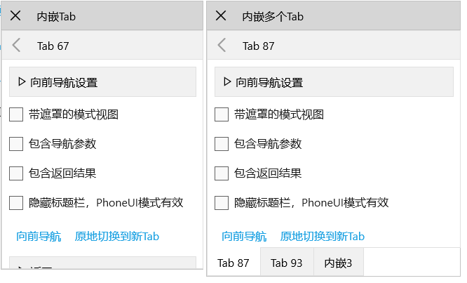

`Tab`是系统中非常重要的容器控件，两种模式最终以`Tab`为最小容器进行管理。
* Phone模式时负责填充整个页面内容，并且窗口内的所有`Tab`可互相导航；
* Win模式时是浮动、停靠、拖拽组合时的最小单位；
* 同一`Tab`区域可通过切换`Tab`实现区域内导航效果，并且支持带遮罩的模式视图、导航参数、导航结果；
* 它更是业务开发时功能模块的容器，是**模块视图**的基类，相比于`Fv Lv`，`Tab`属于容器型控件，支持各种导航，和`Fv Lv`一起是系统最核心最常用的控件。

前面在介绍界面框架时提到**窗口内部导航**和**Tab区域内导航**，这两种导航使Windows模式和Phone模式衔接在一起，是搬运工平台UI的灵魂和重要基础，它使得我们既能保证传统的快速开发，又能适配不同的界面模式。

在实际业务开发过程中，我们通常将一个独立功能放在`Win`中实现，`Win`中有多个区域，包括列表、表单、搜索、关联数据等区域，每个区域是一个`Tab`，如果将所有`Tab`的内容都放在`Win.xaml`中，`Win.xaml.cs`会包含所有列表数据的加载、关联互动、搜索等功能代码，这样代码冗长非常混乱，也不利于后期的维护工作。如果将每个`Tab`的内容放在独立的`xaml`中实现，既模块清晰，也便于复用和维护。

/// 

/// 模块视图的基类，功能模块的容器
/// <para>1. Phone模式时是页面内容Page.Content</para>
/// <para>2. Win模式时是浮动、停靠、拖拽组合时的最小单位</para>
/// <para>3. Phone模式时窗口内的所有Tab可互相导航</para>
/// <para>4. 同一Tab区域可通过切换Tab实现区域内导航效果</para>
/// <para>5. 区域内导航支持带遮罩的模式视图、导航参数、导航结果</para>
/// 

public partial class Tab : TabItem, IPhonePage



系统中把继承`Tab`实现的独立功能模块称为**模块视图**。


## 导航
同一`Win`中所有`Tab`是紧耦合的，互相之间可直接调用，每个模块视图通过`OwnWin`获取所属的`Win`，`Win`中以属性的方式公开所有模块视图，这样每个模块视图都可访问`Win`中的其他模块视图。

导航同样包含两类：`Win`内导航、`Tab`区域内导航。

### Win内导航
`Win`内导航只在Phone模式有效，包括三个方法：

/// 

/// 导航到指定Tab
/// 

/// <param name="p_tab"></param>
public void NaviTo(Tab p_tab)

/// 

/// 导航到多页Tab
/// 

/// <param name="p_ls"></param>
public void NaviTo(List<Tab> p_ls)

/// 

/// 导航到指定页，支持多页Tab形式
/// 

/// <param name="p_tabTitle">多个页面时用逗号隔开(自动以Tab形式显示)，null时自动导航到第一个Tab</param>
public void NaviTo(string p_tabTitle)


### Tab区域内导航
`Tab`区域内导航对于Win模式和Phone模式都有效，Phone模式下也是独立页面，和Win内导航无区别，Win模式下切换整个模块视图，向前向后的导航方法：

/// 

/// 向前导航到新Tab，可异步等待返回值
/// 

/// <typeparam name="T">返回值的类型</typeparam>
/// <param name="p_tab">导航到新Tab</param>
/// <param name="p_params">输入参数，值为新Tab的NaviParams属性</param>
/// <param name="p_isModal">WinUI模式是否带遮罩，遮罩为了禁止对其他位置编辑(用Dlg实现)</param>
/// <returns>返回时的输出参数</returns>
public Task<T> Forward<T>(Tab p_tab, object p_params = null, bool p_isModal = false)

/// 

/// 向前导航到新Tab
/// 

/// <param name="p_tab">导航到新Tab</param>
/// <param name="p_params">输入参数，值为新Tab的NaviParams属性</param>
/// <param name="p_isModal">WinUI模式是否带遮罩，遮罩为了禁止对其他位置编辑(用Dlg实现)</param>
public void Forward(Tab p_tab, object p_params = null, bool p_isModal = false)

/// 

/// 向后导航到上一Tab
/// 

public async void Backward()

/// 

/// 切换到指定Tab，切换后新Tab的上一Tab为首页
/// 

/// <param name="p_tab"></param>
/// <param name="p_showBackBtn">是否显示返回按钮</param>
public void Toggle(Tab p_tab, bool p_showBackBtn = false)

/// 

/// Tab区域内导航时返回到首页
/// 

public void BackToHome()


`Forward<T>`方法对于需要输入输出参数的情况非常方便，输入参数提供给新`Tab`的`NaviParams`属性，一般在`OnFirstLoaded`时使用，输出参数为等待后的返回值，是新`Tab`的`Result`，参数定义：

/// 

/// 导航时的入参，一般在 OnFirstLoaded 时使用
/// 

public object NaviParams

/// 

/// 导航返回值
/// 

public object Result


含输入输出参数的导航如：

async void OnEditFolder(object sender, Mi e)
{
    if (await Forward<bool>(new EditFolder(_fileMgr), e.Row))
        LoadData();
}

public sealed partial class EditFolder : Tab
{
    protected override void OnFirstLoaded()
    {
        Row row = CreateData();
        if (NaviParams is Row r)
        {
            row.InitVal(0, r.ID);
            row.InitVal(1, r["name"]);
        }
        _fv.Data = row;
    }
}


`Tab`还可以通过以下方法放在`Dlg`中显示，同样支持`Tab`区域内导航：

public partial class Dlg : Control, IDlgPressed
{
    /// 

    /// 加载Tab，PhoneUI直接显示，WinUI外套Tabs
    /// 

    /// <param name="p_tab"></param>
    public void LoadTab(Tab p_tab)

    /// 

    /// 窗口内加载多Tab，PhoneUI外套PhoneTabs，WinUI外套Tabs
    /// 

    /// <param name="p_tabs"></param>
    public void LoadTabs(IList<Tab> p_tabs)
}


使用时如：

var dlg = new Dlg { IsPinned = true, Title = "内嵌Tab" };
dlg.LoadTab(new TabNaviItem());
dlg.Show();

var dlg = new Dlg { Title = "内嵌多个Tab" };
dlg.LoadTabs(new List<Tab>
{ 
    new TabNaviItem(),
    new TabNaviItem(),
    new Tab { Title = "内嵌3", Content = new TextBlock { Text = "标准Tab" }},
});
dlg.Show();


## 虚方法
针对Tab的生命周期，经常重写以下三个虚方法，`OnFirstLoaded`在`DtControl`中定义：

/// 

/// 只在第一次Loaded事件时调用，始终在OnLoadTemplate后调用
/// 

protected virtual void OnFirstLoaded()

/// 

/// 后退之前
/// 

/// <returns>true 表允许关闭</returns>
protected virtual Task<bool> OnClosing()

/// 

/// 后退完成
/// 

protected virtual void OnClosed()


使用场景：`OnFirstLoaded`用来加载模块视图的初始数据，`OnClosing`切换模块视图前对修改的保存提示等。