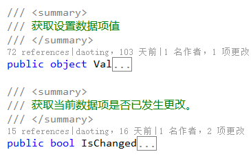
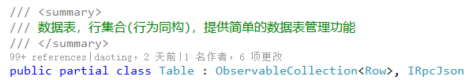

数据对象是整个系统的基础，标准的DDD设计包含多种数据对象，基本上每层一种类型，如：

它的优势是各层之间可以自定义数据内容，降低各层之间的耦合，缺点是类型转换带来的资源消耗、系统的分裂感、代码及名称的繁琐，总体感觉太过于循规蹈矩。

本系统的数据对象需要满足以下使用场景：
* 支持UI层的绑定(ViewMode)
* 自动生成实体代码
* 自定义序列化内容
* 从db加载数据时高性能不使用反射
* 反序列化时自动转换实体类型
* 充血模式的实体对象
* 数据持久化时转换成Sql

为满足以上所有使用场景，采用`Row`作为基类，`Row`负责装载所有数据，内部通过数据项(`Cell`)集合的方式进行管理，`Table`是`Row`的集合类，并包含`Columns`属性，为满足领域中用到的实体对象，抽象类`Entity`继承自`Row`，所有实体类需要从`Entity`派生，泛型类`Table<TEntity>`继承自`Table`，泛型参数约束为实体类。

下面针对这些使用场景逐一说明：

##	UI绑定
Fv的数据源为`Row`时，`FvCell`数据源对应`Cell`，通过`Row.Cells[ID]`确定，绑定路径为固定的`Val`，`Row`实现接口`INotifyPropertyChanged`，确保双向绑定有效，如`IsChanged`属性绑定到保存按钮的`IsEnable`属性实现保存控制。

同样`Cell`也实现接口`INotifyPropertyChanged`，常用的绑定属性有：

`Lv`或`Tv`的数据源为`Table`时，`Row`对应UI中的`ViewItem`，实际绑定到`LvRow`或`TvPanelItem`，`Cell`对应具体的可视元素，`Table`继承自`ObservableCollection<Row>`，能将行数的变化实时反应到UI上。

##	生成实体代码
参见上述读写数据过程，业务开发时既可以使用`Table/Row`，也可以使用`Table<Entity>/Entity`，一般简单数据读写时使用`Table/Row`，包含业务逻辑时使用`Table<Entity>/Entity`，实体类代码分成两部分，一部分通过系统自动生成代码，主要为构造方法和属性，另一部分为业务逻辑，根据需求完成。为方便管理，自动生成的代码禁止修改，只修改业务逻辑的`partial classs`，参见[业务逻辑](#业务逻辑)。

自动生成实体代码需要提供实体类对应的表名，如下：

生成实体类代码如下：

该实体类主要包括构造方法和属性，公共构造方法用于手动创建实体对象，方法参数除主键外其他参数都有默认值，默认值是数据库表结构中字段的默认值；属性和字段一一对应，所以属性类型都是`System`命名空间的简单类型，如`string long DateTime bool int byte`等，但不包括枚举类型。

**有两种类型需要特别关注：**`bool enum`。

对于`bool`类型：
1. 在mysql中自动对应`tinyint(1)`，无需额外处理；
2. oracle中自定义对应`char(1)`，值为`1 0`，需要平台特殊处理，**生成实体类时自动将`#bool#`开始的注释当作bool类型**；
3. sqlserver中自动对应`bit`，无需额外处理；
4. postgresql中自动对应`bool`，无需额外处理；
5. 增删改语句内部已特殊处理，但sql查询语句需要注意，除pg中只能当作字符进行比较，其余都可当作数字进行比较！

对于`enum`类型， 为了编码、查询、显示方便，平台自己增加并特殊处理了`enum`类型的情况：
1. 在mysql中将无符号`tinyint(4)`设计为enum类型，最多能存储256个成员，在程序中已够用，生成实体类时支持自动将`#EnumName#`开始的注释当作枚举类型，增加方便性和代码的可读性。如`Gender`(性别)枚举类型：

2. oracle中将`number(3)`设计为enum类型；
3. sqlserver中将`tinyint`设计为enum类型；
4. pg中将`int2`设计为enum类型；

这样所有涉及对该实体类的sql查询、序列化反序列化，底层都会自动将数据转为对应的`enum`类型，减少很多重复的工作量，如sql查询中不再需要`case`语句，程序用于显示的地方显示`enum`成员名，保存时为`byte tinyint number 或 int2`值，编辑时下拉选项为所有`enum`成员。

oracle中`number`类型的c#类型的对应关系
* `number(1-4)`　　`Int16/shot`
* `number(5-9)`　　`Int32/int`
* `number(10-19)`　`Int64/long`
* `number(20-38)`　`decimal`

postgresql中类型和c#类型的对应关系

Postgresql   .Net System Type
----------   ----------------
int8         Int64
int4         Int32
int2         Int16
float8       Double
float4       Single
bool         Boolean
varchar      String
text         String
bytea        Byte[]
date         DateTime
money        Decimal
numeric      Decimal
time         DateTime
timetz       DateTime
timestamp    DateTime
timestamptz  DateTime
interval     TimeSpan
inet         IPAddress
bit          Boolean
uuid         Guid
array        Array


##	自定义序列化
数据对象需要在客户端与服务端之间、服务与服务之间传输，序列化时需要保证数据的完整、简洁，以下为`Table` `Row`序列化为`json`时的结构：


// Row
[
    "#row",
	"新建/修改状态", // 可能没有
    {
        "key1": "当前值", // string类型，值无变化
        "key2": ["类型", "当前值"], // 非string类型，值无变化
		"key3": ["类型", "当前值", "原始值"], // 值变化时传递完整信息
    }
]

// Table
[
    "#tbl",
	[
        [
            "列名1"  // string类型省略
        ], 
        [
            "列名2", 
            "列类型"
        ], 
        [
            "列名3", 
            "列类型"
        ]
    ], 
    [
        [
            ["列1原始值","列1当前值"], // 值变化时传递两值数组
            12,     // 无变化时只传单值
            "2016-10-18T09:08:22.702351+08:00",
			"Added/Modified" // 多出的列为行状态
        ], 
        [
            "列1值", 
            , 
            "2016-10-18T09:08:22.702351+08:00"
        ], 
        [
            , 
            33, 
            ,
        ]
    ]
]


##	高性能加载数据
普通`ORM`从数据库读取数据、加载数据时一般通过反射创建实体对象、进行属性赋值，本系统采用的方式不同，因基类`Row`通过数据项集合的方式管理数据，实体类属性并不直接对应变量，所以添加数据时不需要通过反射的方式对属性赋值，而是向集合增加数据项即可，参见以下：

        async Task QueryInternal<TRow>(Table p_tbl, string p_keyOrSql, object p_params = null)
            where TRow : Row
        {
            var cmd = CreateCommand(p_keyOrSql, p_params, false);
            try
            {
                await OpenConnection();
                using (var wrappedReader = (IWrappedDataReader)await _conn.ExecuteReaderAsync(cmd))
                {
                    // Dapper2.0 改版
                    MySqlDataReader reader = (MySqlDataReader)wrappedReader.Reader;

                    // Entity类型
                    Type tpEntity = null;
                    if (typeof(TRow).IsSubclassOf(typeof(Entity)))
                    {
                        tpEntity = typeof(TRow);
                    }

                    // 参见github上的MySqlDataReader.cs
                    // 获取列定义
                    var cols = reader.GetColumnSchema();
                    foreach (var col in cols)
                    {
                        if (col.AllowDBNull.HasValue && col.AllowDBNull.Value && col.DataType.IsValueType)
                        {
                            // 可为null的值类型
                            p_tbl.Add(col.ColumnName, typeof(Nullable<>).MakeGenericType(col.DataType));
                        }
                        else if (col.DataType == typeof(byte) && tpEntity != null)
                        {
                            // Entity 时根据属性类型将 byte 自动转为 enum 类型
                            var prop = tpEntity.GetProperty(col.ColumnName, BindingFlags.Public | BindingFlags.Instance | BindingFlags.DeclaredOnly | BindingFlags.IgnoreCase);
                            p_tbl.Add(col.ColumnName, prop != null ? prop.PropertyType : col.DataType);
                        }
                        else
                        {
                            p_tbl.Add(col.ColumnName, col.DataType);
                        }
                    }

                    while (await reader.ReadAsync())
                    {
                        // 整行已读到内存，官方推荐使用同步方法获取值，比异步性能更好！
                        // 无参数构造方法可能为private，如实体类型
                        var row = (TRow)Activator.CreateInstance(typeof(TRow), true);
                        for (int i = 0; i < reader.FieldCount; i++)
                        {
                            var col = p_tbl.Columns[i];
                            if (reader.IsDBNull(i))
                                new Cell(row, col.ID, col.Type);
                            else
                                new Cell(row, col.ID, col.Type, reader.GetValue(i));
                        }
                        p_tbl.Add(row);
                    }
                }
            }
            catch (Exception ex)
            {
                throw GetSqlException(cmd, ex);
            }
            finally
            {
                ReleaseConnection();
            }
        }


##	自动类型转换
为避免数据对象在客户端与服务端之间、各层之间的耦合性，采用降型传输的方式，即将实体类型降低为`Row`传输，反序列化时再根据实际情况创建新的实体对象，比如客户端实体类`UserA`，在保存实体数据时以`Row`类型传输到服务端，反序列化时创建实体对象`UserB`，类型`UserA`和`UserB`分属两端，各自独立使用，无任何代码上的耦合，但数据内容是相同的或相交的，这样既降低实体类型的耦合性也减少实体类型转换带来的冗余操作。

由上图可见，两个实体类型不论数据相同还是相交，`Row`都应该提供两个实体的完整数据。

## 转换成Sql
在生成实体类型代码时通过`Tbl`标签已指定映射的表名/视图名，实体对象在使用过程中自动记录数据变化及状态(如`IsAdded`, `IsChanged`)，在传输过程未丢失任何信息，客户端和服务端都可以将实体对象生成要执行的Sql语句，生成Sql过程请参见`TableSchema.cs`文件，客户端公共Api的“写数据”就是在客户端生成的Sql语句。


实体在保存、删除时会自动生成Sql语句，无需手动代码。原则上整个系统不允许出现含 `insert update delete` 的sql语句，增删改的sql语句都由系统自动生成。

