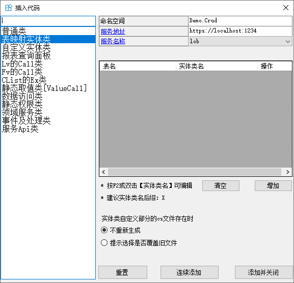
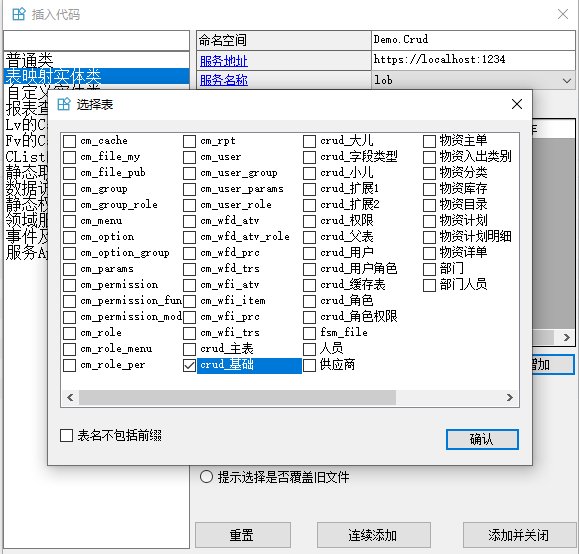
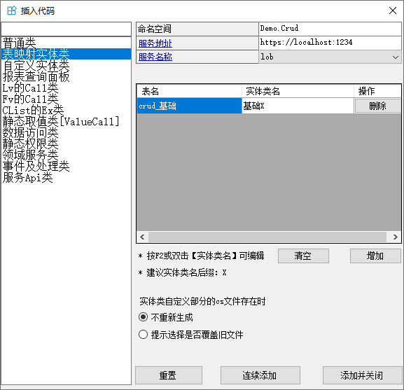
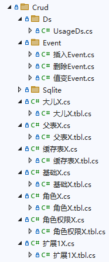
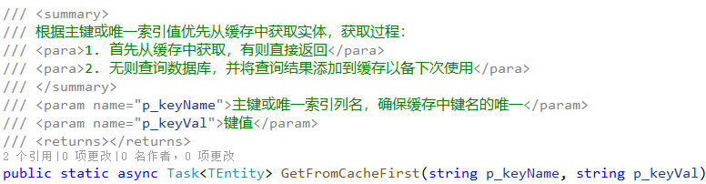
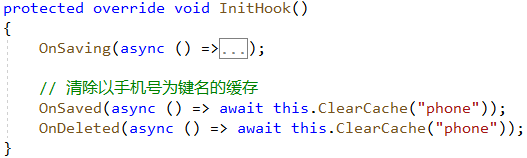

## 生成实体代码
遵循`ORM`的映射规则，实体类和数据库中的表或视图一一映射。实体类默认以`X`为后缀，避免重名且方便识别。

一个实体类分2个文件：`.tbl.cs  .cs`，可通过VS扩展工具自动生成。

1. 在项目中选择实体类的目录，右键选择`搬运工 -> 类`，右侧选择`表映射实体类`

1. 点击`增加`，选择要生成实体类的表，左下角取消选项`表名不包含前缀`，点击`确定`，点击`添加并关闭`，生成实体类，每个实体类有两个文件组成，`.tbl.cs`文件包括表的映射属性和构造方法，表结构修改时需要重新生成，因此不可手动修改，避免被覆盖。`.cs`文件只在初次自动生成，存放业务逻辑和静态辅助方法等。


[Tbl("demo_crud")]
public partial class CrudX : EntityX<CrudX>
{
    #region 构造方法
    CrudX() { }

    public CrudX(CellList p_cells) : base(p_cells) { }

    public CrudX(
        long ID,
        string Name = default,
        int Dispidx = default,
        DateTime Mtime = default,
        bool EnableInsertEvent = default,
        bool EnableNameChangedEvent = default,
        bool EnableDelEvent = default)
    {
        AddCell("ID", ID);
        AddCell("Name", Name);
        AddCell("Dispidx", Dispidx);
        AddCell("Mtime", Mtime);
        AddCell("EnableInsertEvent", EnableInsertEvent);
        AddCell("EnableNameChangedEvent", EnableNameChangedEvent);
        AddCell("EnableDelEvent", EnableDelEvent);
        IsAdded = true;
    }
    #endregion

    /// 

    /// 名称
    /// 

    public string Name
    {
        get { return (string)this["Name"]; }
        set { this["Name"] = value; }
    }
}


`.tbl.cs`文件中类的标签有两种：`Tbl` `Sqlite`，对应远程库和本地`sqlite`库，除标签不同外，领域层的所有操作不区分远程库和本地 `Sqlite`库，实体读写、业务逻辑、领域服务写法完全相同：

// 该实体是表 demo_crud 的映射
[Tbl("demo_crud")]
public partial class CrudX : EntityX<CrudX>

// 该实体存储在 local 库的 Crud 表
[Sqlite("local")]
public partial class CrudX : EntityX<CrudX>


## 创建实体对象
构造实体对象的方法：
1. 调用`New`静态方法或直接`new`

1. 通过`EntityX`静态方法查询数据创建实体

/// 

/// 借用泛型参数 TEntity 实现通用的静态方法
/// 

/// <typeparam name="TEntity">实体类型参数</typeparam>
public abstract class EntityX<TEntity> : Entity
    where TEntity : Entity
{
    /// 

    /// 查询实体列表，可以提供 where子句 或 Sql字典的键名 或 Sql语句进行查询
    /// 

    /// <param name="p_whereOrKeyOrSql">三种查询：
    /// <para>1. where子句，以where开头的过滤条件，返回的实体包含所有列值</para>
    /// <para>2. Sql键名或Sql语句，自由查询，返回的实体列值自由</para>
    /// <para>3. null时返回所有实体</para>
    /// </param>
    /// <param name="p_params">参数值，支持Dict或匿名对象，默认null</param>
    /// <returns>返回实体列表</returns>
    public static Task<Table<TEntity>> Query(string p_whereOrKeyOrSql, object p_params = null)

    /// 

    /// 按页查询实体列表，可以提供 where子句 或 Sql字典的键名 或 Sql语句进行查询
    /// 

    /// <param name="p_starRow">起始行号：mysql中第一行为0行</param>
    /// <param name="p_pageSize">每页显示行数</param>
    /// <param name="p_whereOrKeyOrSql">三种查询：
    /// <para>1. where子句，以where开头的过滤条件，返回的实体包含所有列值</para>
    /// <para>2. Sql键名或Sql语句，自由查询，返回的实体列值自由</para>
    /// <para>3. null时返回所有实体</para>
    /// </param>
    /// <param name="p_params">参数值，支持Dict或匿名对象，默认null</param>
    /// <returns>返回实体列表</returns>
    public static Task<Table<TEntity>> Page(int p_starRow, int p_pageSize, string p_whereOrKeyOrSql, object p_params = null)

    /// 

    /// 返回第一个实体对象，不存在时返回null，可以提供 where子句 或 Sql字典的键名 或 Sql语句进行查询
    /// 

    /// <param name="p_whereOrKeyOrSql">三种查询：
    /// <para>1. where子句，以where开头的过滤条件，返回的实体包含所有列值</para>
    /// <para>2. Sql键名或Sql语句，自由查询，返回的实体列值自由</para>
    /// <para>3. null时返回第一个实体</para>
    /// </param>
    /// <param name="p_params">参数值，支持Dict或匿名对象，默认null</param>
    /// <returns>返回实体对象或null</returns>
    public static Task<TEntity> First(string p_whereOrKeyOrSql, object p_params = null)

    /// 

    /// 根据主键获得实体对象(包含所有列值)，仅支持单主键
    /// 

    /// <param name="p_id">主键值</param>
    /// <returns>返回实体对象或null</returns>
    public static Task<TEntity> GetByID(object p_id)

    /// 

    /// 根据主键或唯一索引列获得实体对象(包含所有列值)，仅支持单主键
    /// 

    /// <param name="p_keyName">主键或唯一索引列名</param>
    /// <param name="p_keyVal">键值</param>
    /// <returns>返回实体对象或null</returns>
    public static Task<TEntity> GetByKey(string p_keyName, string p_keyVal)

    /// 

    /// 根据主键获得实体对象及所有子实体列表，仅支持单主键，不涉及缓存！
    /// 

    /// <param name="p_id">主键</param>
    /// <returns>返回实体对象或null</returns>
    public static async Task<TEntity> GetByIDWithChild(object p_id)

    /// 

    /// 根据主键或唯一索引值优先从缓存中获取实体，获取过程：
    /// <para>1. 首先从缓存中获取，有则直接返回</para>
    /// <para>2. 无则查询数据库，并将查询结果添加到缓存以备下次使用</para>
    /// 

    /// <param name="p_keyName">主键或唯一索引列名，确保缓存中键名的唯一</param>
    /// <param name="p_keyVal">键值</param>
    /// <returns></returns>
    public static async Task<TEntity> GetFromCacheFirst(string p_keyName, string p_keyVal)        
}


1. 通过AtXxx静态方法查询数据创建实体

/// 

/// 数据访问基类，为方便使用所有方法为静态，通过 TAccessInfo 提供实际的数据查询对象
/// 

/// <typeparam name="TAccessInfo">数据访问的描述信息</typeparam>
public abstract class DataAccess<TAccessInfo>
    where TAccessInfo : AccessInfo, new()
{
    /// 

    /// 以参数值方式执行Sql语句，返回结果集
    /// 

    /// <param name="p_keyOrSql">Sql字典中的键名(无空格) 或 Sql语句</param>
    /// <param name="p_params">参数值，支持Dict或匿名对象，默认null</param>
    /// <returns>返回Table数据</returns>
    public static Task<Table> Query(string p_keyOrSql, object p_params = null)

    /// 

    /// 以参数值方式执行Sql语句，返回实体列表
    /// 

    /// <typeparam name="TEntity">实体类型</typeparam>
    /// <param name="p_keyOrSql">Sql字典中的键名(无空格) 或 Sql语句</param>
    /// <param name="p_params">参数值，支持Dict或匿名对象，默认null</param>
    /// <returns>返回实体列表</returns>
    public static Task<Table<TEntity>> Query<TEntity>(string p_keyOrSql, object p_params = null)

    /// 

    /// 按页查询数据
    /// 

    /// <param name="p_starRow">起始行号：mysql中第一行为0行</param>
    /// <param name="p_pageSize">每页显示行数</param>
    /// <param name="p_keyOrSql">Sql字典中的键名(无空格) 或 Sql语句</param>
    /// <param name="p_params">参数值，支持Dict或匿名对象，默认null</param>
    /// <returns>返回Table数据</returns>
    public static Task<Table> Page(int p_starRow, int p_pageSize, string p_keyOrSql, object p_params = null)

    /// 

    /// 按页查询数据
    /// 

    /// <typeparam name="TEntity">实体类型</typeparam>
    /// <param name="p_starRow">起始行号：mysql中第一行为0行</param>
    /// <param name="p_pageSize">每页显示行数</param>
    /// <param name="p_keyOrSql">Sql字典中的键名(无空格) 或 Sql语句</param>
    /// <param name="p_params">参数值，支持Dict或匿名对象，默认null</param>
    /// <returns>返回Table数据集</returns>
    public static Task<Table<TEntity>> Page<TEntity>(int p_starRow, int p_pageSize, string p_keyOrSql, object p_params = null)

    /// 

    /// 以参数值方式执行Sql语句，只返回第一行数据
    /// 

    /// <param name="p_keyOrSql">Sql字典中的键名(无空格) 或 Sql语句</param>
    /// <param name="p_params">参数值，支持Dict或匿名对象，默认null</param>
    /// <returns>返回第一行Row或null</returns>
    public static Task<Row> First(string p_keyOrSql, object p_params = null)

    /// 

    /// 以参数值方式执行Sql语句，返回第一个实体对象，实体属性由Sql决定，不存在时返回null
    /// 

    /// <typeparam name="TEntity">实体类型</typeparam>
    /// <param name="p_keyOrSql">Sql字典中的键名(无空格) 或 Sql语句</param>
    /// <param name="p_params">参数值，支持Dict或匿名对象，默认null</param>
    /// <returns>返回实体对象或null</returns>
    public static Task<TEntity> First<TEntity>(string p_keyOrSql, object p_params = null)
}


`EntityX`和`AtXxx`的静态查询方法都是调用数据访问层的读数据方法，这些代理方法最终通过`Rpc调用`或`Sqlite读写`实现。
实体类继承自`EntityX<T>`，将当前实体类型作为泛型参数，使静态方法不再需要泛型参数就实现通用，省去在每个实体类都生成相同的静态方法。

public partial class CrudX : EntityX<CrudX>
{
}

public abstract class EntityX<TEntity> : Entity
    where TEntity : Entity
{
    public static Task<Table<TEntity>> Query(string p_whereOrKeyOrSql, object p_params = null)
}


当使用通用静态方法查询数据创建实体时，每个查询只是sql和参数不同，这些查询很多时候是需要复用的，通常将这些查询封装成静态方法放在实体类的`.cs`文件，将用到的sql语句作为常量放在`.cs`文件的尾部。

## 保存实体对象
实体持久化包括三种情况：单个实体对象的持久化、同一实体类型的实体列表的持久化、任意实体及实体列表的持久化。

前两种情况可通过扩展方法完成，这些扩展方法包括实体及实体列表的保存与删除，扩展方法参见`EntityEx`：

/// 

/// Entity扩展
/// 

public static class EntityEx
{
    /// 

    /// 保存实体数据，成功后：
    /// <para>1. 若存在领域事件，则发布事件</para>
    /// <para>2. 若已设置服务端缓存，则删除缓存</para>
    /// <para>3. 实体状态复位 AcceptChanges </para>
    /// 

    /// <typeparam name="TEntity">实体类型</typeparam>
    /// <param name="p_entity">待保存的实体</param>
    /// <param name="p_isNotify">是否提示保存结果，客户端有效</param>
    /// <returns>是否成功</returns>
    public static async Task<bool> Save<TEntity>(this TEntity p_entity, bool p_isNotify = true)

    /// 

    /// 一个事务内批量保存Table中新增、修改、删除的实体数据
    /// <para>删除行通过Table的ExistDeleted DeletedRows判断获取</para>
    /// <para>保存成功后，对于每个保存的实体：</para>
    /// <para>1. 若存在领域事件，则发布事件</para>
    /// <para>2. 若已设置服务端缓存，则删除缓存</para>
    /// <para>3. 实体状态复位 AcceptChanges </para>
    /// 

    /// <typeparam name="TEntity">实体类型</typeparam>
    /// <param name="p_tbl">实体表</param>
    /// <param name="p_isNotify">是否提示保存结果，客户端有效</param>
    /// <returns>是否成功</returns>
    public static async Task<bool> Save<TEntity>(this Table<TEntity> p_tbl, bool p_isNotify = true)

    /// 

    /// 一个事务内批量保存实体数据，根据实体状态执行新增、修改
    /// <para>保存成功后，对于每个保存的实体：</para>
    /// <para>1. 若存在领域事件，则发布事件</para>
    /// <para>2. 若已设置服务端缓存，则删除缓存</para>
    /// <para>3. 实体状态复位 AcceptChanges </para>
    /// 

    /// <param name="p_list">待保存列表</param>
    /// <param name="p_isNotify">是否提示保存结果，客户端有效</param>
    /// <returns>true 保存成功</returns>
    public static async Task<bool> Save<TEntity>(this IEnumerable<TEntity> p_list, bool p_isNotify = true)

    /// 

    /// 一个事务内批量保存一对多的父实体数据和所有子实体数据
    /// <para>保存成功后，对于每个保存的实体：</para>
    /// <para>1. 若存在领域事件，则发布事件</para>
    /// <para>2. 若已设置服务端缓存，则删除缓存</para>
    /// <para>3. 实体状态复位 AcceptChanges </para>
    /// 

    /// <typeparam name="TEntity">父实体类型</typeparam>
    /// <param name="p_entity">待保存的父实体</param>
    /// <param name="p_isNotify">是否提示保存结果，客户端有效</param>
    /// <returns>是否成功</returns>
    public static async Task<bool> SaveWithChild<TEntity>(this TEntity p_entity, bool p_isNotify = true)

    /// 

    /// 删除实体，依靠数据库的级联删除自动删除子实体，成功后：
    /// <para>1. 若存在领域事件，则发布事件</para>
    /// <para>2. 若已设置服务端缓存，则删除缓存</para>
    /// 

    /// <typeparam name="TEntity">实体类型</typeparam>
    /// <param name="p_entity">待删除的实体</param>
    /// <param name="p_isNotify">是否提示删除结果，客户端有效</param>
    /// <returns>true 删除成功</returns>
    public static async Task<bool> Delete<TEntity>(this TEntity p_entity, bool p_isNotify = true)

    /// 

    /// 一个事务内批量删除Table的所有实体数据，成功后对于每个删除的实体：
    /// <para>1. 若存在领域事件，则发布事件</para>
    /// <para>2. 若已设置服务端缓存，则删除缓存</para>
    /// 

    /// <param name="p_tbl">待删除实体列表</param>
    /// <param name="p_isNotify">是否提示删除结果，客户端有效</param>
    /// <returns>true 删除成功</returns>
    public static Task<bool> Delete<TEntity>(this Table<TEntity> p_tbl, bool p_isNotify = true)

    /// 

    /// 一个事务内批量删除实体数据，成功后对于每个删除的实体：
    /// <para>1. 若存在领域事件，则发布事件</para>
    /// <para>2. 若已设置服务端缓存，则删除缓存</para>
    /// 

    /// <param name="p_list">待删除实体列表</param>
    /// <param name="p_isNotify">是否提示删除结果，客户端有效</param>
    /// <returns>true 删除成功</returns>
    public static async Task<bool> Delete<TEntity>(this IList<TEntity> p_list, bool p_isNotify = true)

    /// 

    /// 清除以某列为键名的实体缓存，键名组成：
    /// <para>表名:列名:列值</para>
    /// 

    /// <typeparam name="TEntity">实体类型</typeparam>
    /// <param name="p_entity">实体</param>
    /// <param name="p_colName">主键或唯一索引列名</param>
    /// <returns></returns>
    public static Task ClearCache<TEntity>(this TEntity p_entity, string p_colName)
}


不同类型的实体及实体列表在同一事务中持久化需在领域服务中完成，详见[领域服务](/dt-docs/4实体框架/3业务逻辑#领域服务)。

原则上整个系统不允许出现含 `insert update delete` 的sql语句，增删改的sql语句都由系统自动生成。


## 实体对象缓存

实体对象缓存属于全局缓存，服务端全局缓存使用redis内存数据库，以key-value形式存储要缓存的内容，所有服务都可访问，使用常见的过期策略，缓存的对象在整个应用中是唯一的。详见[全局缓存](/dt-docs/2基础/2基础功能/#缓存)。


实体缓存适用于**频繁使用并且基本无修改**的实体，其它情况请谨慎使用缓存。


实体对象缓存涉及两方面内容：
1. 读取缓存：`GetFromCacheFirst`用于优先从缓存读取实体

2. 更新缓存：实体修改或删除后需要清除缓存，可在实体类的`InitHook`的`OnSaved OnDeleted`回调中清除，如：
