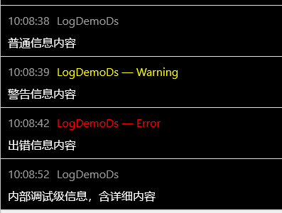

业务逻辑是指实体对象之间为了互相提供服务，应该具备的规则与流程。

业务逻辑的内容包括四个部分：

1. 领域实体：定义了实体对象具有的属性和行为；
2. 业务规则：定义了需要完成一个动作，必须满足的条件；
3. 数据完整性：某些数据不可少；
4. 流程：定义了领域实体之间的交互关系。

搬运工对以上四部分的代码主要放在两个位置：实体类的`.cs`文件 和 领域服务类 中。

## 实体类
实体类`.cs`文件内容主要包括4方面：
1. 重写InitHook方法，存放业务逻辑，包括业务规则校验、数据完整性校验等；
2. 静态New方法，构造实体；
3. 可复用的静态查询方法，构造实体列表；
4. sql语句常量

### InitHook
重写`InitHook`方法，注册回调，可以进行业务校验或添加领域事件
* `OnSaving`保存前
* `OnSaved`保存后
* `OnDeleting`删除前
* `OnDeleted`删除后
* `OnChanging`属性值变化前


public partial class CrudX
{
    public static async Task<CrudX> New(string Name)
    {
        return new CrudX(
            ID: await NewID(),
            Name: Name,
            Dispidx: await NewSeq("Dispidx"),
            Mtime: Kit.Now);
    }

    protected override void InitHook()
    {
        OnSaving(async () =>
        {
            Throw.IfEmpty(Name, "权限名称不可为空！");

            if (!IsAdded && Cells["Name"].IsChanged)
            {
                if (!await Kit.Confirm("权限名称会被硬编码在程序中，确认要修改吗？"))
                    Throw.Msg("已取消保存");
            }

            if (IsAdded || Cells["Name"].IsChanged)
            {
                if (Decimal.TryParse(Name, out _))
                    Throw.Msg("权限名称不可全部为数字！", cName);
                if (await GetCount($"where name='{Name}' and func_id={FuncID}") > 0)
                    Throw.Msg("相同功能内的权限名称不可重复！", cName);
            }

            if (IsAdded && EnableInsertEvent)
            {
                AddEvent(new InsertCrudEvent { ID = ID });
            }
            else if (!IsAdded
                && EnableNameChangedEvent
                && _cells["Name"].IsChanged)
            {
                AddEvent(new NameChangedEvent
                {
                    // 保存后信息丢失
                    OriginalVal = _cells["Name"].GetOriginalVal<string>(),
                    NewVal = Name,
                });
            }
        });

        OnSaved(async () => await this.ClearCache(nameof(Phone)));

        OnDeleting(async () =>
        {
            Throw.If(ID < 1000, "系统权限无法删除！");

            // 清除关联用户的数据版本号，没放在 OnDeleted 处理因为cm_role_per有级联删除
            var ls = await At.FirstCol<long>($"select id from cm_role a where exists (select role_id from cm_role_per b where a.id=b.role_id and per_id={ID})");
            RbacDs.DelRoleDataVer(ls, RbacDs.PrefixPer);

            if (EnableDelEvent)
            {
                AddEvent(new DelCrudEvent { Tgt = this });
            }
        });

        OnDeleted(async () => await this.ClearCache(nameof(Phone)));
        
        OnChanging<string>(nameof(Name), v =>
        {
            //Kit.Msg("Name新值：" + v);
        });
    }
}


若是父实体，可在`.cs`文件中增加子实体列表属性，并添加`ChildX`标签，指明父表外键属性名：

[ChildX("ParentID")]
public Table<ChildTbl1X> Tbl1 { get; set; }

[ChildX("GroupID")]
public Table<ChildTbl2X> Tbl2 { get; set; }


`OnSaving`和`OnDeleting`在写数据前调用，返回`Task`，通过抛出异常来禁止写数据，`OnSaving`回调使用场景较多，如保存前的校验(如不可为空、重名、数据不符合业务规则等)、数据完善(如修改时间)、还可触发领域事件。

`OnChanging`回调是属性值(Cell值)改变时的钩子方法，若实体类中包含某属性的钩子方法，所有对`Cell.Val`的赋值都会调用钩子方法，包括UI的绑定，主要用于：数据校验不符合业务抛异常使赋值失败、和其他列值的联动。

`OnSaved`和`OnDeleted`在写数据后调用，一般用来做善后工作，如清除缓存。


禁止实体类中涉及UI和持久化功能


### 静态New方法
静态New方法用于构造实体，命名`New`只为统一好记，参数为实体类的常用属性，并且调用`NewID()`和`NewSeq()`方法生成ID和序号。

public static async Task<CrudX> New(string Name)
{
    return new CrudX(
        ID: await NewID(),
        Name: Name,
        Dispidx: await NewSeq("Dispidx"),
        Mtime: Kit.Now);
}


### 静态查询方法
可复用的静态查询方法

public static Task<Table<PermissionX>> GetUserPermission(long p_userID)
{
    return Query(string.Format(Sql用户具有的权限, p_userID));
}

public static Task<Table<PermissionX>> GetRolePermission(long p_roleID)
{
    return Query(string.Format(Sql角色权限, p_roleID));
}

public static Task<Table<PermissionX>> GetUserPersAndModule(long p_userID)
{
    return Query(string.Format(Sql用户具有的权限及所属, p_userID));
}


### sql语句常量
以下是sql语句的通用写法：
1. sql语句作为常量字符串 const string；
2. 以@标记的字符串；
3. sql语句多行时第一行和最后行都为空，方便复制调试；
4. 常量名以Sql开头，推荐用中文，方便理解；


    partial class WfdDs
    {
        // 用户在一个流程实例中参与的所有任务
        const string Sql所有经办历史任务 = @"
select wi.id item_id,
       pi.id prci_id,
       pd.id prcd_id,
       ad.id atvd_id,
       ai.id atvi_id,
       pd.name prcname,
       ad.name atvname,
       pi.status,
       pi.name formname,
       wi.sender,
       wi.stime,
       wi.mtime,
       wi.reCount
from cm_wfi_atv ai,
     cm_wfi_prc pi,
     cm_wfd_atv ad,
     cm_wfd_prc pd,
     (select id,
             atvi_id,
             mtime,
             sender,
             stime,
             (select count(1)
              from cm_wfi_item
              where atvi_id = t.atvi_id
                    and Assign_Kind = 4
                    and id <> t.id) as reCount
     	from cm_wfi_item t
     	where status = 1
     	      and user_id = @p_userid
     	      and (@p_start < '1900-01-01' or mtime >= @p_start)
     	      and (@p_end < '1900-01-01' or mtime <= @p_end)) wi
 where wi.atvi_id = ai.id
       and ai.prci_id = pi.id
       and pi.prcd_id = pd.id
       and ai.atvd_id = ad.id
       and (@p_status > 2 or pi.status = @p_status)
 order by wi.stime desc
";
    }



VS中选中sql语句，右键菜单点击搬运工，或 Alt + 1 快捷键可以格式化sql语句


## 领域服务
每个模块都包含一个或多个领域服务类，主要处理涉及多种实体的交叉业务逻辑或无法确定放在何处的功能。

### 客户端
客户端领域服务类的命名以`Ds`为后缀，无状态，所有方法、属性、事件等都为静态，领域服务类继承自`DomainSvc<T>`。和`EntityX<T>`相同，将当前领域服务类作为泛型参数传递到基类，使每个领域服务类保证有一套只属于自己的静态变量。


/// 

/// 领域服务的抽象基类
/// 

/// <typeparam name="TDomainSvc">当前领域服务的类型，保证静态变量属于各自的领域服务类型</typeparam>
public abstract class DomainSvc<TDomainSvc>
    where TDomainSvc : class
{
    /**********************************************************************************************************************************************************/
    // 泛型类型：
    // 对象是类的实例，提供具体类型参数的泛型类是泛型类型的实例
    // 若将cm服务的类型作为类型参数，如 AbcDs : DomainSvc<AtCm.Info>
    // 则AbcDs是该泛型基类的实例类，泛型基类中保证有一套只属于AbcDs类的静态变量实例！
    // 因此类型参数相同的泛型类的静态成员相同
    /***********************************************************************************************************************************************************/

    /// 

    /// 日志对象，日志属性中包含来源
    /// 

    protected static readonly ILogger _log = Log.ForContext("src", typeof(TDomainSvc).FullName);
}


基类中只包含变量：`_log`，`_log`较于Log的优点是日志属性中包含来源:

如工作流领域服务的发送业务：

public partial class WfiDs : DomainSvc<WfiDs>
{
    /// 

    /// 发送成功事件
    /// 

    public static event Action<WfFormInfo> Sended;

    public static async Task Send(WfFormInfo p_info)
    {
        // 先按照非发送状态保存表单数据，如自填写、新建等数据
        // 此保存过程和发送无关，相当于点击保存按钮，与发送不在一个事务！
        if (!await SaveFormInternal(p_info, false))
        {
            Kit.Warn("表单保存失败！");
            return;
        }

        var w = At.NewWriter();
        // 判断当前活动是否结束（需要多人同时完成该活动的情况）
        if (!await p_info.AtvInst.IsFinished())
        {
            // 活动未结束（不是最后一人），只结束当前工作项
            if (await p_info.Form.SendInternal(w))
                await SaveWorkItem(false, p_info, w);
            return;
        }

        // 后续活动
        if (p_info.NextAtvs.Count == 0)
        {
            // 无后续活动，结束当前工作项和活动
            if (await p_info.Form.SendInternal(w))
                await SaveWorkItem(true, p_info, w);
            return;
        }

        bool manualSend = false;
        var nextRecvs = new AtvRecvs();
        foreach (var atv in p_info.NextAtvs)
        {
            switch (atv.Type)
            {
                case WfdAtvType.Normal:
                    // 普通活动
                    var recv = await LoadRecvs(atv, p_info);
                    if (recv.Recvs != null && recv.Recvs.Count > 0)
                    {
                        AtvRecv ar = new AtvRecv { Def = atv, IsRole = recv.IsRole, Recvs = recv.Recvs };
                        nextRecvs.Atvs.Add(ar);

                        if (recv.IsManualSend)
                            manualSend = true;
                    }
                    break;

                case WfdAtvType.Sync:
                    // 同步活动 且 可激活后续活动时
                    if (await IsActive(atv, p_info))
                    {
                        // 同步活动只支持一个后续活动！
                        var syncNext = await WfdAtvX.GetFirstNextAtv(atv.ID);
                        if (syncNext != null)
                        {
                            recv = await LoadRecvs(syncNext, p_info);
                            if (recv.Recvs != null && recv.Recvs.Count > 0)
                            {
                                nextRecvs.SyncAtv = new AtvSyncRecv
                                {
                                    SyncDef = atv,
                                    Def = syncNext,
                                    IsRole = recv.IsRole,
                                    Recvs = recv.Recvs
                                };

                                if (recv.IsManualSend)
                                    manualSend = true;
                            }
                        }
                    }
                    break;

                case WfdAtvType.Finish:
                    // 结束活动
                    nextRecvs.FinishedAtv = new AtvFinishedRecv { Def = atv };
                    break;
            }
        }

        // 当后续迁移活动为独占式选择且后续活动多于一个时手动选择
        if (!manualSend
            && p_info.AtvDef.TransKind == WfdAtvTransKind.独占式选择
            && nextRecvs.AtvCount > 1)
        {
            manualSend = true;
        }
        p_info.NextRecvs = nextRecvs;

        if (!await p_info.Form.SendInternal(w))
            return;

        // 外部可以修改接收者列表
        if (p_info.NextRecvs != null && p_info.NextRecvs.AtvCount > 0)
        {
            if (manualSend)
            {
                // 手动选择后发送
                var dlg = new WfSendDlg();
                if (await dlg.Show(p_info))
                    DoSend(true, p_info, dlg.Note == "" ? null : dlg.Note, w);
            }
            else
            {
                DoSend(false, p_info, null, w);
            }
        }
        else
        {
            Kit.Warn("无后续活动接收者，请检查流程授权是否合理！");
        }
    }

    /// 

    /// 执行发送
    /// 

    /// <param name="p_manualSend">是否手动选择接收者</param>
    /// <param name="p_info"></param>
    /// <param name="p_note">留言</param>
    /// <param name="w"></param>
    static async void DoSend(bool p_manualSend, WfFormInfo p_info, string p_note, IEntityWriter w)
    {
        #region 后续活动
        // 生成后续活动的活动实例、工作项、迁移实例，一个或多个
        var tblAtvs = await Table<WfiAtvX>.Create();
        var tblItems = await Table<WfiItemX>.Create();
        var tblTrs = await Table<WfiTrsX>.Create();
        DateTime time = Kit.Now;

        if (p_info.NextRecvs.FinishedAtv != null
            && (!p_manualSend || p_info.NextRecvs.FinishedAtv.IsSelected))
        {
            // 完成
            p_info.PrcInst.Status = WfiPrcStatus.结束;
            p_info.PrcInst.Mtime = time;
        }
        else
        {
            // 普通活动
            foreach (AtvRecv ar in p_info.NextRecvs.Atvs)
            {
                // 手动无选择时
                if (p_manualSend
                    && (ar.SelectedRecvs == null || ar.SelectedRecvs.Count == 0))
                    continue;

                var atvInst = await WfiAtvX.New(
                    PrciID: p_info.PrcInst.ID,
                    AtvdID: ar.Def.ID,
                    Status: WfiAtvStatus.活动,
                    Ctime: time,
                    Mtime: time);
                tblAtvs.Add(atvInst);

                if (p_manualSend)
                {
                    // 手动发送，已选择项可能为用户或角色
                    atvInst.InstCount = ar.SelectedRecvs.Count;
                    foreach (var recvID in ar.SelectedRecvs)
                    {
                        long? userID = ar.IsRole ? null : recvID;
                        long? roleID = ar.IsRole ? recvID : null;
                        var wi = await WfiItemX.New(
                            AtviID: atvInst.ID,
                            Stime: time,
                            Ctime: time,
                            Mtime: time,
                            AssignKind: WfiItemAssignKind.普通指派,
                            SenderID: Kit.UserID,
                            Sender: Kit.UserName,
                            Status: WfiItemStatus.活动,
                            RoleID: roleID,
                            UserID: userID,
                            Note: p_note);
                        tblItems.Add(wi);
                    }
                }
                else
                {
                    // 自动发送，按角色
                    atvInst.InstCount = ar.Recvs.Count;
                    foreach (var row in ar.Recvs)
                    {
                        long? userID = ar.IsRole ? null : row.ID;
                        long? roleID = ar.IsRole ? row.ID : null;
                        var wi = await WfiItemX.New(
                            AtviID: atvInst.ID,
                            Stime: time,
                            Ctime: time,
                            Mtime: time,
                            AssignKind: WfiItemAssignKind.普通指派,
                            SenderID: Kit.UserID,
                            Sender: Kit.UserName,
                            Status: WfiItemStatus.活动,
                            RoleID: roleID,
                            UserID: userID,
                            Note: p_note);
                        tblItems.Add(wi);
                    }
                }

                // 增加迁移实例
                var trs = await p_info.CreateAtvTrs(ar.Def.ID, atvInst.ID, time, false);
                tblTrs.Add(trs);
            }

            // 同步活动
            var syncAtv = p_info.NextRecvs.SyncAtv;
            if (syncAtv != null
                && (!p_manualSend || (syncAtv.SelectedRecvs != null && syncAtv.SelectedRecvs.Count > 0)))
            {
                // 同步实例
                var syncInst = await WfiAtvX.New(
                    PrciID: p_info.PrcInst.ID,
                    AtvdID: syncAtv.SyncDef.ID,
                    Status: WfiAtvStatus.同步,
                    InstCount: 1,
                    Ctime: time,
                    Mtime: time);
                tblAtvs.Add(syncInst);

                // 同步工作项
                WfiItemX item = await WfiItemX.New(
                    AtviID: syncInst.ID,
                    AssignKind: WfiItemAssignKind.普通指派,
                    Status: WfiItemStatus.同步,
                    IsAccept: false,
                    UserID: Kit.UserID,
                    SenderID: Kit.UserID,
                    Sender: Kit.UserName,
                    Stime: time,
                    Ctime: time,
                    Mtime: time);
                tblItems.Add(item);

                // 同步迁移实例
                long trsdid = await WfdDs.GetWfdTrsID(p_info.PrcInst.PrcdID, p_info.AtvInst.AtvdID, syncAtv.SyncDef.ID, false);

                var trs = await WfiTrsX.New(
                    TrsdID: trsdid,
                    SrcAtviID: p_info.AtvInst.ID,
                    TgtAtviID: syncInst.ID,
                    IsRollback: false,
                    Ctime: time);
                tblTrs.Add(trs);

                // 同步活动的后续活动实例
                var nextInst = await WfiAtvX.New(
                    PrciID: p_info.PrcInst.ID,
                    AtvdID: syncAtv.Def.ID,
                    Status: WfiAtvStatus.活动,
                    Ctime: time,
                    Mtime: time);
                tblAtvs.Add(nextInst);

                if (p_manualSend)
                {
                    // 手动发送，已选择项可能为用户或角色
                    nextInst.InstCount = syncAtv.SelectedRecvs.Count;
                    foreach (var recvID in syncAtv.SelectedRecvs)
                    {
                        long? userID = syncAtv.IsRole ? null : recvID;
                        long? roleID = syncAtv.IsRole ? recvID : null;
                        var wi = await WfiItemX.New(
                            AtviID: nextInst.ID,
                            Stime: time,
                            Ctime: time,
                            Mtime: time,
                            AssignKind: WfiItemAssignKind.普通指派,
                            SenderID: Kit.UserID,
                            Sender: Kit.UserName,
                            Status: WfiItemStatus.活动,
                            RoleID: roleID,
                            UserID: userID,
                            Note: p_note);
                        tblItems.Add(wi);
                    }
                }
                else
                {
                    // 自动发送，按角色
                    nextInst.InstCount = syncAtv.Recvs.Count;
                    foreach (var row in syncAtv.Recvs)
                    {
                        long? userID = syncAtv.IsRole ? null : row.ID;
                        long? roleID = syncAtv.IsRole ? row.ID : null;
                        var wi = await WfiItemX.New(
                            AtviID: nextInst.ID,
                            Stime: time,
                            Ctime: time,
                            Mtime: time,
                            AssignKind: WfiItemAssignKind.普通指派,
                            SenderID: Kit.UserID,
                            Sender: Kit.UserName,
                            Status: WfiItemStatus.活动,
                            RoleID: roleID,
                            UserID: userID,
                            Note: p_note);
                        tblItems.Add(wi);
                    }
                }

                // 增加迁移实例
                trsdid = await WfdDs.GetWfdTrsID(p_info.PrcInst.PrcdID, syncAtv.SyncDef.ID, syncAtv.Def.ID, false);

                trs = await WfiTrsX.New(
                    TrsdID: trsdid,
                    SrcAtviID: syncInst.ID,
                    TgtAtviID: nextInst.ID,
                    IsRollback: false,
                    Ctime: time);
                tblTrs.Add(trs);
            }
        }

        // 发送是否有效
        // 1. 只有'完成'时有效
        // 2. 至少含有一个活动实例时有效
        if (tblAtvs.Count == 0 && p_info.PrcInst.Status != WfiPrcStatus.结束)
        {
            Kit.Msg("所有后续活动均无接收者，发送失败！");
            return;
        }
        #endregion

        #region 整理待保存数据
        if (p_info.PrcInst.IsChanged)
            await w.Save(p_info.PrcInst);

        p_info.AtvInst.Finished();
        await w.Save(p_info.AtvInst);

        p_info.WorkItem.Finished();
        await w.Save(p_info.WorkItem);

        if (tblAtvs.Count > 0)
        {
            await w.Save(tblAtvs);
            await w.Save(tblItems);
            await w.Save(tblTrs);
        }
        #endregion

        if (await w.Commit(false))
        {
            Kit.Msg("发送成功！");
            p_info.CloseForm();

            // 触发事件
            Sended?.Invoke(p_info);

            // 推送客户端提醒
            PushNotify(tblItems);
        }
        else
        {
            // 避免保存失败后，再次点击发送时和保存表单一起被保存，造成状态错误！
            p_info.PrcInst.RejectChanges();
            p_info.AtvInst.RejectChanges();
            p_info.WorkItem.RejectChanges();
            Kit.Warn("发送失败！");
        }
    }

    /// 

    /// 保存当前工作项置完成状态
    /// 

    /// <param name="p_isFinished"></param>
    /// <param name="p_info"></param>
    /// <param name="w"></param>
    /// <returns></returns>
    static async Task SaveWorkItem(bool p_isFinished, WfFormInfo p_info, IEntityWriter w)
    {
        if (p_isFinished)
            p_info.AtvInst.Finished();
        p_info.WorkItem.Finished();

        if (p_info.AtvInst.IsChanged)
            await w.Save(p_info.AtvInst);
        await w.Save(p_info.WorkItem);

        if (await w.Commit(false))
        {
            Kit.Msg(p_isFinished ? "任务结束" : "当前工作项完成");
            p_info.CloseForm();
        }
        else
        {
            Kit.Warn("工作项保存失败");
        }
    }

    /// 

    /// 推送接收者客户端提醒
    /// 

    /// <param name="p_items"></param>
    static async void PushNotify(Table<WfiItemX> p_items)
    {
        foreach (var item in p_items)
        {
            if (item.UserID != null)
            {
                await PushUserMsg(item.UserID.Value, item);
            }
            else if (item.RoleID != null)
            {
                var ls = await RbacDs.GetUsersOfRole(item.RoleID.Value);
                if (ls != null && ls.Count > 0)
                {
                    foreach (var userID in ls)
                    {
                        await PushUserMsg(userID, item);
                    }
                }
            }
        }
    }

    static async Task PushUserMsg(long p_userID, WfiItemX p_item)
    {
        var mi = new MsgInfo
        {
            MethodName = "SysPushApi.WfNotify",
            Params = new List<object> { p_item.ID, p_item.Sender },
            Title = "您有新的待办任务",
        };

        await AtMsg.SendCmd(p_userID, mi);
    }

    /// 

    /// 加载活动的接收者
    /// 

    /// <param name="p_atv"></param>
    /// <param name="p_info"></param>
    /// <returns></returns>
    static async Task<RecvDef> LoadRecvs(WfdAtvX p_atv, WfFormInfo p_info)
    {
        RecvDef recv = new RecvDef();
        if (p_atv.ExecLimit == WfdAtvExecLimit.无限制)
        {
            // 无限制
            if (p_atv.ExecScope == WfdAtvExecScope.一组用户 || p_atv.ExecScope == WfdAtvExecScope.单个用户)
            {
                // 一组用户或单个用户，所有授权用户为被选项
                recv.IsManualSend = true;
                recv.IsRole = false;
                recv.Recvs = await GetAtvUsers(p_atv.ID);
            }
            else
            {
                // 所有用户或任一用户，按角色发
                recv.IsRole = true;
                recv.Recvs = await RoleX.Query($"where exists (select distinct (role_id) from cm_wfd_atv_role ar where r.id=ar.role_id and atv_id={p_atv.ID})");
            }
        }
        else
        {
            // 有限制，按过滤后的用户发送
            recv.IsRole = false;
            var users = await GetAtvUsers(p_atv.ID);
            if (users.Count > 0)
            {
                long atvdid = (p_atv.ExecLimit == WfdAtvExecLimit.已完成活动的执行者 || p_atv.ExecLimit == WfdAtvExecLimit.已完成活动的同部门执行者) ? p_atv.ExecAtvID.Value : p_atv.ID;
                var limitUsers = await GetLimitUsers(atvdid, p_atv.ExecLimit, p_info);
                if (limitUsers.Count > 0)
                {
                    // 取已授权用户和符合限制用户的交集
                    Table tblJoin = new Table
                    {
                        {"id", typeof(long) },
                        {"name" }
                    };
                    foreach (var l in limitUsers)
                    {
                        foreach (var r in users)
                        {
                            if (r.Long("id") == l.Long(0))
                            {
                                tblJoin.AddRow(new { id = l.Long(0), name = r["name"] });
                                break;
                            }
                        }
                    }
                    recv.Recvs = tblJoin;
                }
            }

            // 除‘所有用户’外其余手动发送
            if (p_atv.ExecScope != WfdAtvExecScope.所有用户)
                recv.IsManualSend = true;
        }
        return recv;
    }

    /// 

    /// 是否激活后续活动
    /// 

    /// <param name="p_atvSync">同步活动</param>
    /// <param name="p_info"></param>
    /// <returns></returns>
    static async Task<bool> IsActive(WfdAtvX p_atvSync, WfFormInfo p_info)
    {
        int cnt = await WfiAtvX.GetCount($"where prci_id={p_info.PrcInst.ID} and atvd_id={p_atvSync.ID}");

        // 已产生同步实例
        if (cnt > 0)
            return false;

        // 获得同步前所有活动
        var trss = await WfdTrsX.Query($"where tgt_atv_id={p_atvSync.ID}");

        // 聚合方式
        // 全部
        if (p_atvSync.JoinKind == 0)
            return await GetAllFinish(trss, p_info);

        // 任一
        if (p_atvSync.JoinKind == WfdAtvJoinKind.任一任务)
            return true;

        // 即时
        return await GetExistFinish(trss, p_info);
    }

    /// 

    /// 获得同步前的活动是否已经都完成
    /// 

    /// <param name="p_trss"></param>
    /// <param name="p_info"></param>
    /// <returns></returns>
    static async Task<bool> GetAllFinish(Table<WfdTrsX> p_trss, WfFormInfo p_info)
    {
        bool finish = true;
        foreach (var trs in p_trss)
        {
            if (trs.SrcAtvID == p_info.AtvDef.ID)
                continue;

            int cnt = await WfiAtvX.GetCount($"where atvd_id={trs.SrcAtvID} and prci_id={p_info.PrcInst.ID} and status=1");
            if (cnt == 0)
            {
                finish = false;
                break;
            }
        }
        return finish;
    }

    /// 

    /// 同步前已存在的实例是否都完成
    /// 

    /// <param name="p_trss"></param>
    /// <param name="p_info"></param>
    /// <returns></returns>
    static async Task<bool> GetExistFinish(Table<WfdTrsX> p_trss, WfFormInfo p_info)
    {
        bool finish = true;
        foreach (var trs in p_trss)
        {
            if (trs.SrcAtvID == p_info.AtvDef.ID)
                continue;

            var tbl = await At.Query($"select status from cm_wfi_atv where atvd_id={trs.SrcAtvID} and prci_id={p_info.PrcInst.ID}");
            if (tbl.Count > 0 && tbl[0].Int("status") != 1)
            {
                finish = false;
                break;
            }
        }
        return finish;
    }

    /// 

    /// 获取活动的所有可执行用户
    /// 

    /// <param name="p_atvid"></param>
    /// <returns></returns>
    static async Task<Table> GetAtvUsers(long p_atvid)
    {
        // 是否活动授权任何人
        if (await WfdAtvRoleX.GetCount($"where role_id=1 and atv_id={p_atvid}") == 0)
            return await At.Query($"select id,coalesce(name, acc, phone) as name from cm_user u where exists (select distinct (user_id) from cm_user_role ur where exists (select role_id from cm_wfd_atv_role ar where ur.role_id=ar.role_id and atv_id={p_atvid}) and u.id=ur.user_id) order by name");
        return await At.Query("select id, coalesce(name, acc, phone) as name from cm_user where expired='0'");
    }
}


总体而言，**客户端能处理绝大部分业务功能，无法实现或影响效率的功能还需要服务端实现**。

### 服务端
服务端领域服务同时也是微服务的Api，是客户端提交请求的入口。为尽最大可能的使服务端与客户端代码通用，在实现上领域服务类继承自DomainSvc并带有Api标签。

/// 

/// 领域服务的抽象基类，也是Rpc Api入口
/// 

public abstract class DomainSvc
{
    /// 

    /// 获取领域层数据访问对象
    /// 

    protected IDataAccess _da => _bag.DataAccess;

    /// 

    /// 获取当前用户标识，UI客户端rpc为实际登录用户ID
    /// <para>特殊标识：110为admin页面，111为RabbitMQ rpc，112为本地调用</para>
    /// 

    protected long _userID => _bag.UserID;

    /// 

    /// 日志对象，日志中比静态Log类多出Api名称和当前UserID
    /// 

    protected ILogger _log => _bag.Log;

    /// 

    /// 当前http请求是否为匿名用户
    /// 

    protected bool _isAnonymous => _bag.UserID == -1;
}


