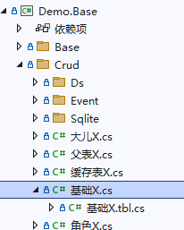
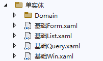

开发时经常将数据处理区分为：`单表、一对多、多对多`三种模式，同一模式在处理过程基本相同，为提高开发效率，平台通过VS扩展，对平时使用频率较高的模式提供代码框架，这样避免了很多重复的工作，当然框架不是万能的，可以通过继续修改以支持特定需求。

以下演示如何利用VS扩展对三种模式生成代码框架，演示前先参见[初始化数据库](/dt-docs/1开始/4搬运工样例/#初始化数据库)准备环境。


请始终保持Svc运行状态，VS扩展工具会使用该服务


## 单实体框架
1. 该实例演示单表增删改查的功能

1. Demo.Base项目中已生成表`crud_基础`的实体类`基础X`，参见[生成实体代码](/dt-docs/4实体框架/2实体基础/#生成实体代码)

1. 添加代码框架，右键选择`搬运工 -> 单实体框架`，点击`选择`，选择表`crud_基础`，点击`确认`，生成框架文件

1. 将Win项目设置为启动项目，F5启动调试，登录成功后在`主页`左侧菜单中点击`菜单管理`，然后增加菜单`单实体`，视图名称`基础`，参见[添加菜单](/dt-docs/5rbac/1菜单/#添加)，成功保存后，将菜单授权`任何人`，切记**更新缓存**

1. 关闭并重新启动应用，登录成功后在`主页`左侧菜单中点击`单实体`，将显示单表的增删改查窗口

1. 增删改查的功能都已实现，可以直接使用，当然也可以根据需要修改代码，框架生成的代码在`Demo.Crud\单实体\基础`目录下，主要有以下几个文件：
   - `基础Win.xaml 基础Win.xaml.cs`：窗口
   - `基础Query.xaml 基础Query.xaml.cs`：查询Tab
   - `基础List.xaml 基础List.xaml.cs`：列表List
   - `基础Form.xaml 基础Form.xaml.cs`：表单Form

1. 框架最终通过`List`和`Form`实现功能，操作过程及原理请参见[List和Form](/dt-docs/4实体框架/6list和form/)，这里不再赘述

1. 将其他android iOS 或 wasm项目设置为启动项目，同样可运行`单实体`功能

## 一对多框架
1. 该实例演示一对多父子表增删改查的功能

1. Demo.Base项目中已生成表`crud_父表 crud_大儿 crud_小儿`的实体，参见[生成实体代码](/dt-docs/4实体框架/2实体基础/#生成实体代码)

1. 添加代码框架，右键选择`搬运工 -> 一对多框架`，设置如下图所示，注意红框的内容，父主键字段名可能不同，采用父子表单是不同的交互界面，点击`确认`，生成框架文件

1. 编译生成、启动、添加菜单项`一对多`、菜单授权后，就可打开`一对多`窗口查看默认功能

1. 采用父子表单时，父`Form`会包含子列表，父子的增删改在一个事务中完成

1. 框架最终通过`List`和`Form`实现功能，操作过程及原理请参见[List和Form](/dt-docs/4实体框架/6list和form/)，这里不再赘述

1. 运行其他平台的App项目，打开`一对多`查看默认功能

## 多对多框架
1. 该实例演示多对多关系表的增删改查功能，用户和角色、权限和角色、角色和用户及权限都是多对多关系，分别以用户、角色、权限为主体实现管理功能。

1. Demo.Base项目中已生成表`crud_角色 crud_用户 crud_权限 crud_角色权限 crud_用户角色`的实体，参见[生成实体代码](/dt-docs/4实体框架/2实体基础/#生成实体代码)

1. 添加以`角色`为主体的代码框架，右键选择`搬运工 -> 多对多框架`，设置如下图所示，`主实体`点击`选择`表`crud_角色`，`关联实体`选择`crud_用户 crud_权限`，`中间实体`选择`crud_角色权限 crud_用户角色`，完善`中间实体`的外键字段名，确保`关联实体`和`中间实体`的表顺序对应，点击`确认`，生成框架文件

1. 同样添加以`权限`为主体和以`用户`为主体的代码框架

1. 编译生成、启动、添加三个菜单项(`用户管理 角色管理 权限管理`)、菜单授权后，切记**更新缓存**，重启应用即可测试这三个菜单项


以上三种模式的代码框架最终通过`List`和`Form`实现功能，操作过程及原理请参见[List和Form](/dt-docs/4实体框架/6list和form/)，这里不再赘述
