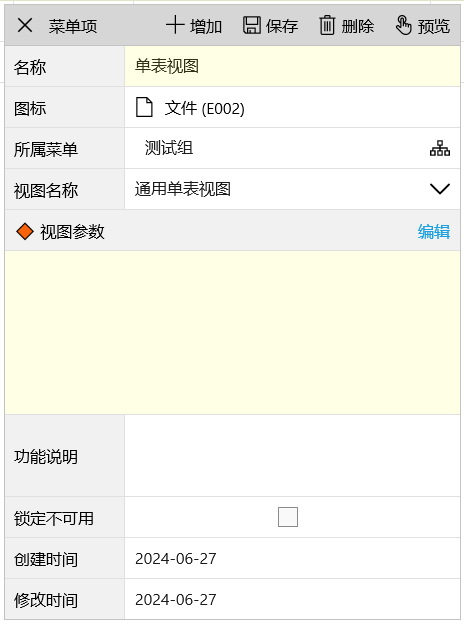
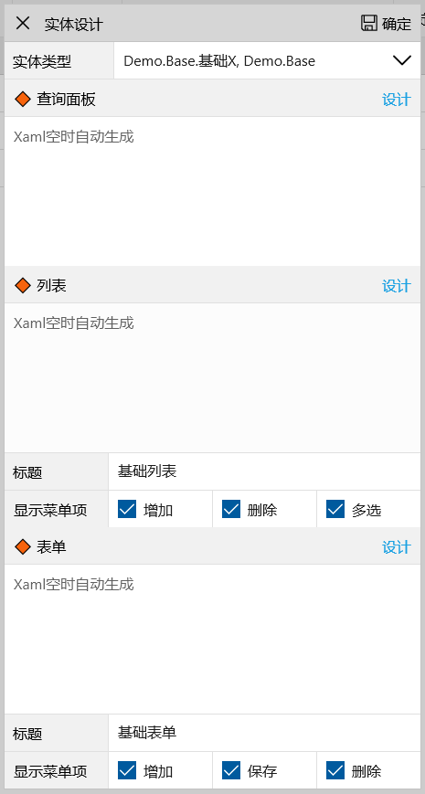
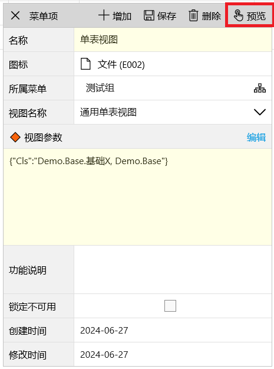

通用视图是对通用框架的再次简化，对于`单表、一对多、多对多`三种模式利用通用框架生成的代码，当只是在UI上做一些调整，比如对Lv调整显示模式、列序、修改列宽列标题，对Fv表单重新定义xaml等，通用视图就是很好的选择，它不需要额外的代码，只需要为`通用视图`定义好实体类型、Lv Fv的xaml、菜单项等，这些配置保存在json串提供给`通用视图`即可，大大减少冗余代码量。

通用视图有两种用法：菜单配置方式、代码调用方式，菜单配置方式零代码实现所有功能，以下针对三种模式演示通用视图的用法

## 通用单表视图

### 菜单配置
1. 在菜单管理中添加新菜单项，参见[添加菜单](/dt-docs/5rbac/1菜单/#添加)，视图名称选择`通用单表视图`

2. 视图参数右侧点击`编辑`按钮，选择实体类型`Demo.Base.基础X, Demo.Base`，当无任意修改时，点击`确定`即可

3. 无需保存，点击预览可查看效果

4. 个性化修改主要针对窗口中每个区域的`Lv`、`Fv`的xaml设计和菜单设置
