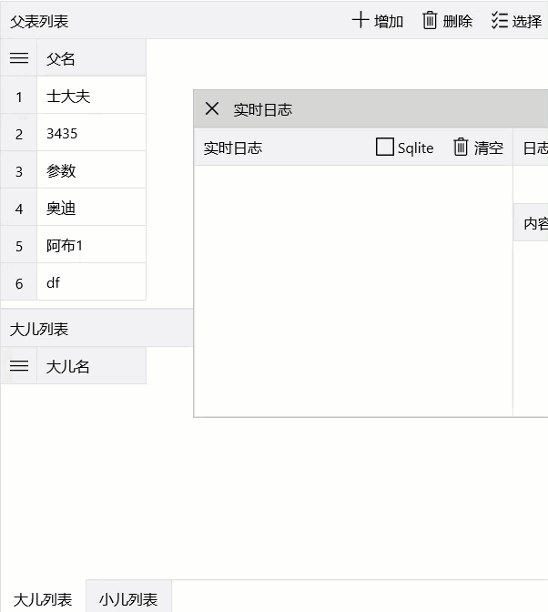
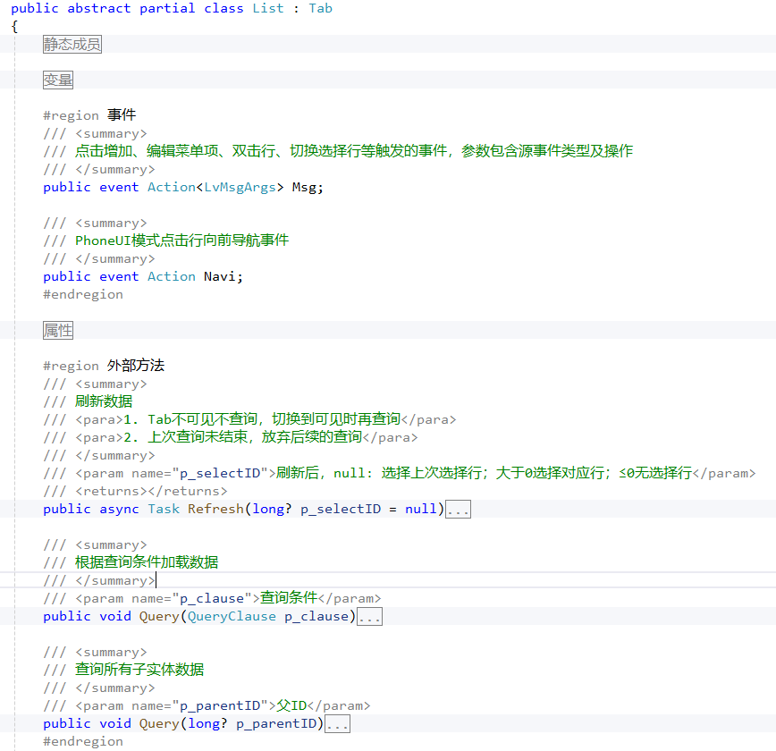
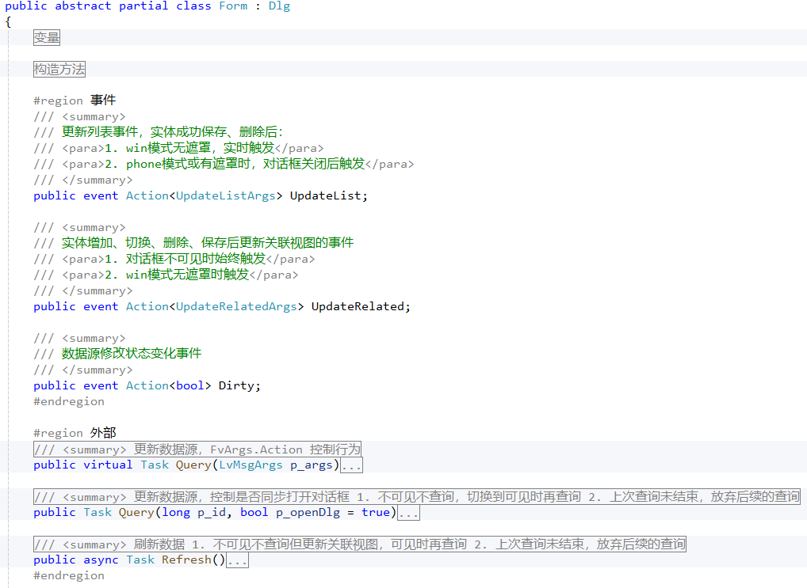

List和Form是通用框架和通用视图的基础模块，是列表Lv和表单Fv更高粒度的封装。


通用框架和通用视图的UI是搬运工推荐的交互方式，特点：
- 主窗口有两个或三个区域，左区、主区、右区
- 主窗口的内容一般为查询面板、列表，**切记没有表单！！！**
- 表单用对话框承载，一般无遮罩，点击主窗口的列表仍可切换表单内容，虽增加了交互代码的复杂性，但简化了操作，用户体验好
- UI只负责展示、交互、数据加载等操作，**业务逻辑在实体类和领域服务中实现！！！**
- 增加、保存等常用操作支持快捷键，Ctrl + N增加，Ctrl + S保存
- 连续增加时自动保存，录入过程尽可能不使用鼠标



## List
List是包含Lv和工具栏的Tab，主要实现减少无用查询、统一查询方法、创建默认菜单、统一触发事件等基础功能。

比如减少无用查询处理：
1. Tab不可见不查询，切换到可见时再查询
1. 上次查询未结束，放弃后续的查询

这些公共功能比较繁琐，提升了性能，若在每个模块各自实现代码冗余。

统一触发事件方便Tab之间联动，统一查询方法方便模块见交互时自动更新

## Form
Form是表单对话框，是包含主Fv、工具栏、子Lv、子Fv的Dlg，除了实现统一查询方法、创建默认菜单、统一触发事件等功能外，还支持管理一对多模式的子列表，单个事务完成父子的增删改等功能。

实体Form重写虚方法完成数据加载、增加等。

public sealed partial class 基础Form : Form
{
    public 基础Form()
    {
        InitializeComponent();
        Menu = CreateMenu();
    }
        
    protected override async Task OnAdd()
    {
        _fv.Data = await A.New();
    }

    protected override async Task OnGet()
    {
        _fv.Data = await A.GetByID(_args.ID);
    }
}


一对多模式

public sealed partial class 父表Form : Form
{
    public 父表Form()
    {
        InitializeComponent();
        ShowVeil = true;
        Menu = CreateMenu();
    }

    protected override async Task OnAdd()
    {
        _fv.Data = await A.New();
    }

    protected override async Task OnGet()
    {
        _fv.Data = await A.GetByID(_args.ID);
        _lv大儿.Data = await 大儿X.Query($"where parent_id={_args.ID}");
        _lv小儿.Data = await 小儿X.Query($"where group_id={_args.ID}");
    }

    protected override async Task OnAddChild(Fv p_fv)
    {
        if (p_fv == _fv大儿)
        {
            p_fv.Data = await 大儿X.New(ParentID: _fv.Row.ID);
        }
        else if (p_fv == _fv小儿)
        {
            p_fv.Data = await 小儿X.New(GroupID: _fv.Row.ID);
        }
    }
}
