菜单是RBAC（Role-Based Access Control）模型中的重要组成部分，RBAC模型是基于角色的访问控制模型，用户通过角色来访问系统资源。

菜单管理是RBAC模型的核心功能之一，主要用于管理系统中的菜单项和权限。菜单项可以是系统中的功能模块、页面、报表等，权限则是指对菜单项的访问控制，用户可访问的菜单=所属角色的菜单+所属组的所属角色的菜单：
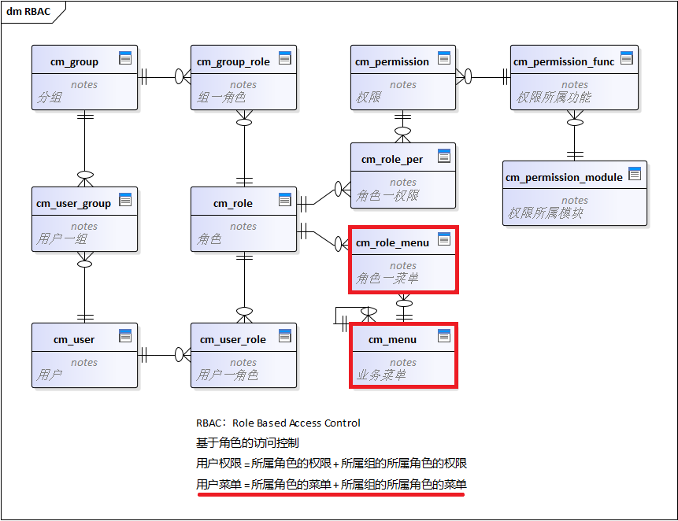

## 菜单管理
菜单管理的功能包括：增、删、改、查、授权等，授权是指将菜单项授权给角色，被授权的用户录后可查看和操作授权的菜单项。
内置的菜单管理功能可以在主页的工作台组中找到
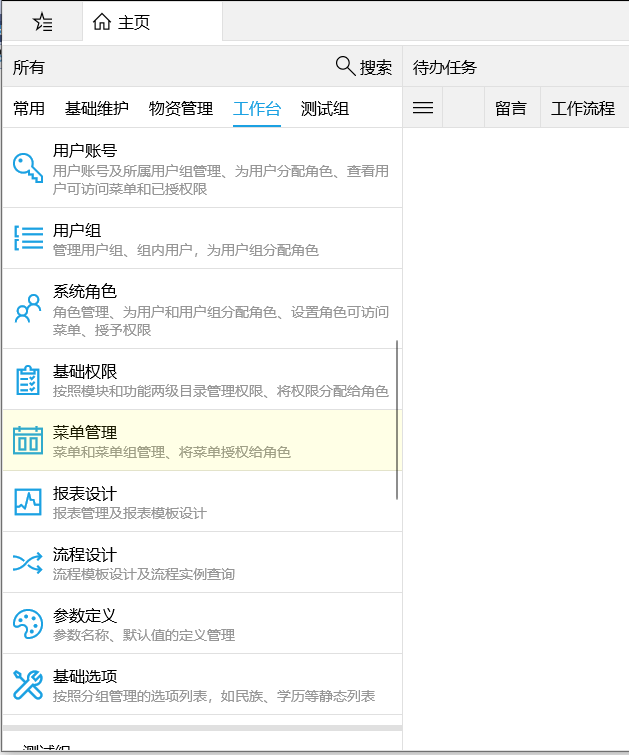
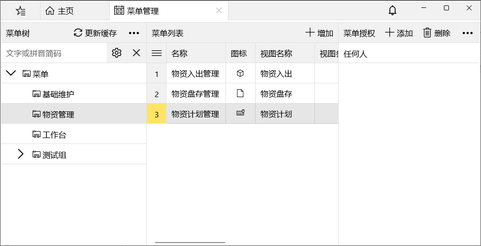

左侧树形菜单显示系统中的所有菜单组，中间的菜单列表是当前组的所有菜单(包括菜单项和菜单组)，右侧列表显示当前选中菜单项的授权角色列表。

### 添加

添加新菜单包括菜单项和菜单组，菜单组只起到分组作用，为了更好的组织菜单项，菜单项才是菜单的重点：
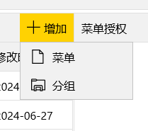

菜单项包括：名称、图标、所属菜单组、视图名称、视图参数等。
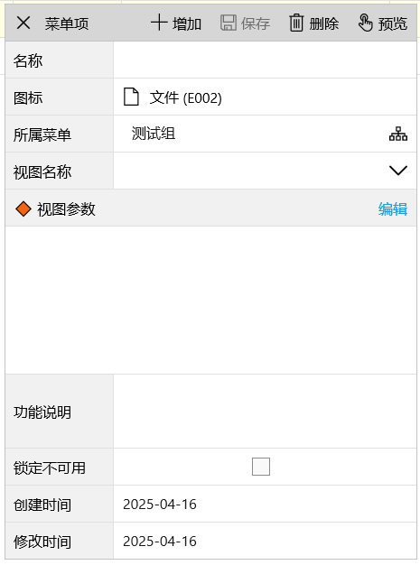

其中视图名称和视图参数是重点，视图名称是指用`View`标签中定义的窗口名称，视图参数是打开菜单项创建窗口实例时传递给构造方法的参数，`string`类型，可以是json xml等任意格式。
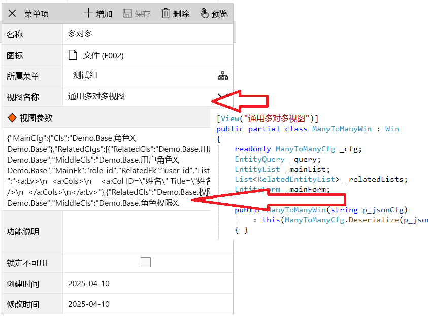

视图名称的下拉列表包含所有项目中有`View`标签的名称

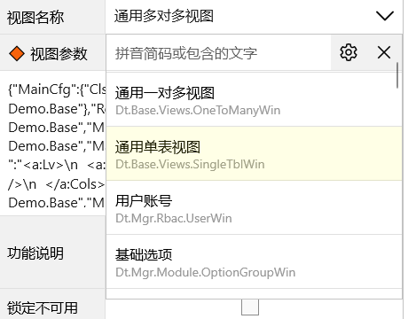

`View`标签可以用在窗口子类上或实现`IView`接口的类上，所以打开菜单项时不一定是窗口实例，可以运行任意代码，比如对话框或无UI的任务。


/// 

/// 根据窗口/视图类型和参数激活旧窗口、打开新窗口 或 自定义启动(IView)
/// 

/// <param name="p_type">窗口/视图类型</param>
/// <param name="p_title">标题</param>
/// <param name="p_icon">图标</param>
/// <param name="p_params">初始参数</param>
/// <returns>返回打开的窗口或视图，null表示打开失败</returns>
public object OpenWin(Type p_type, string p_title, Icons p_icon, object p_params)
{
    Throw.IfNull(p_type, "待显示的窗口类型不可为空！");

    // 激活旧窗口，比较窗口类型和初始参数
    Win win;
    Desktop desktop = Desktop.Inst;
    if (!Kit.IsPhoneUI
        && desktop != null
        && (win = desktop.ActiveWin(p_type, p_params)) != null)
    {
        return win;
    }

    // 打开新窗口
    if (p_type.IsSubclassOf(typeof(Win)))
    {
        if (p_params == null)
            win = (Win)Activator.CreateInstance(p_type);
        else
            win = (Win)Activator.CreateInstance(p_type, p_params);

        if (string.IsNullOrEmpty(win.Title) && string.IsNullOrEmpty(p_title))
            win.Title = "无标题";
        else if (!string.IsNullOrEmpty(p_title))
            win.Title = p_title;

        if (p_icon != Icons.None)
            win.Icon = p_icon;

        // 记录初始参数，设置自启动和win模式下识别窗口时使用
        if (p_params != null)
            win.Params = p_params;

        if (Kit.IsPhoneUI)
        {
            win.NaviToHome();
        }
        else if (desktop != null)
        {
            desktop.ShowNewWin(win);
        }
        else
        {
            // 无桌面时用对话框显示
            var dlg = new Dlg { IsPinned = true };
#if WIN
            // 空出主窗口的标题栏
            dlg.Top = 50;
            dlg.Height = Kit.ViewHeight - 50;
#endif
            dlg.LoadWin(win);
            dlg.Show();
        }
        return win;
    }

    // 处理自定义启动情况
    if (p_type.GetInterface("IView") == typeof(IView))
    {
        IView viewer = Activator.CreateInstance(p_type) as IView;
        viewer.Run(p_title, p_icon, p_params);
        return viewer;
    }

    Kit.Msg("打开窗口失败，窗口类型继承自Win或实现IView接口！");
    return null;
}


当视图参数为json xml格式时，手写参数串比较困难，可以为视图参数添加编辑功能。
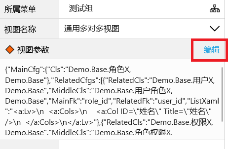

点击`编辑`按钮会显示编辑器，编辑器需要`ViewParamsEditor`标签并且实现`IViewParamsEditor`接口。
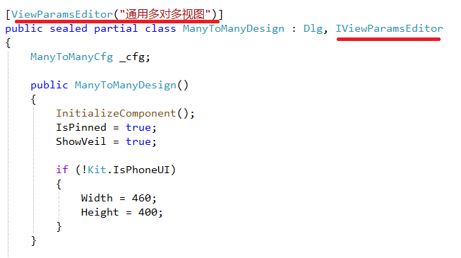

编辑器会加载当前的视图参数，编辑完成后点击`确定`按钮会将编辑器中的内容转换为json格式的字符串，传递给菜单项的视图参数。
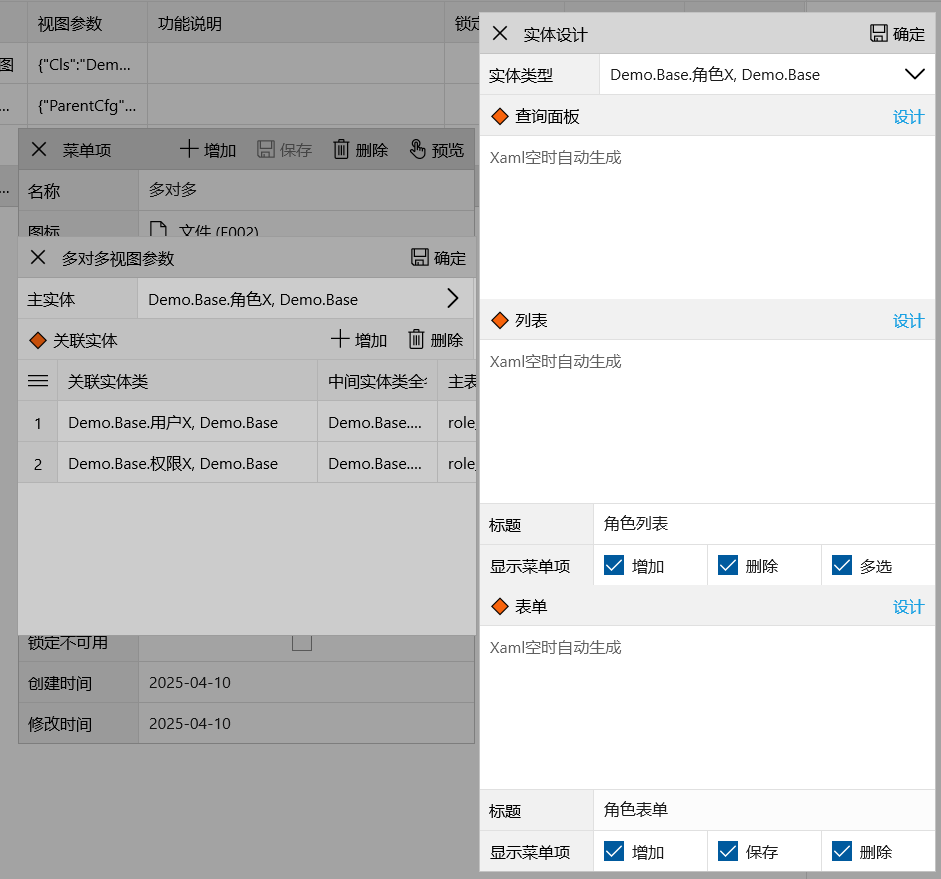

### 调整
菜单项可以调整所属菜单组，也可以`上移  下移`调整在组内的位置

### 预览
菜单项的预览功能可以在编辑表单的工具栏菜单或列表的右键菜单使用，点击`预览`会显示当前菜单项的实际运行效果。
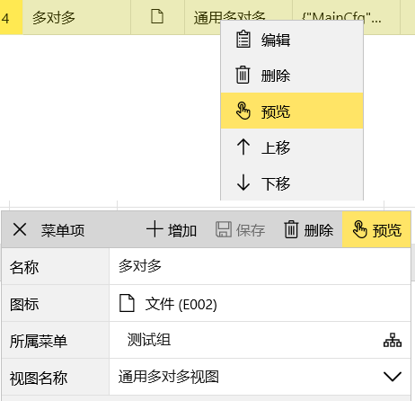

### 删除
删除菜单组时若存在子菜单组或菜单项，会确认是否继续删除。

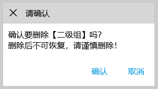

### 授权
授权是指将菜单项授权给角色，被授权的用户录后可查看和操作授权的菜单项。
通过工具栏操作完成增加或删除授权角色的功能。
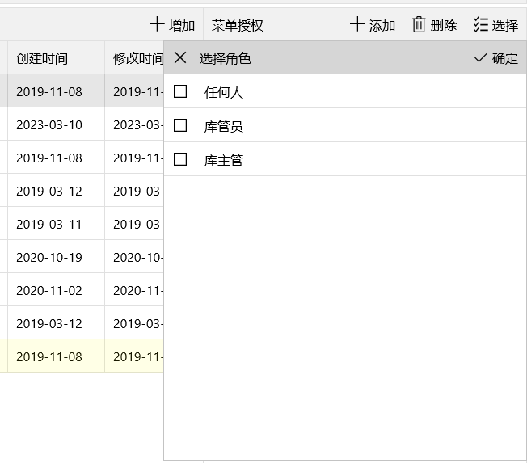

### 更新缓存


对菜单增、删、改、授权等修改后，切记`更新缓存`，更新缓存后登录，修改才能生效。

为了减少服务端压力提高性能，菜单数据采用`用户数据缓存`方式，详见[用户数据缓存](/dt-docs/2基础/2基础功能/#用户数据缓存)。

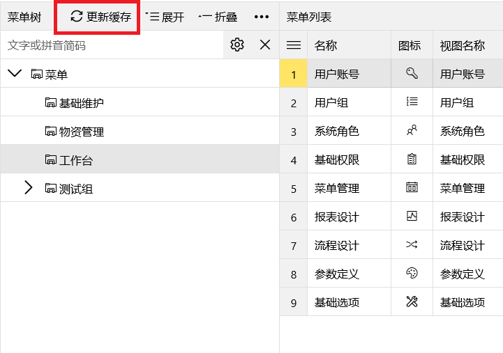

## 菜单浏览
菜单浏览是指用户可以查看所有授权的菜单项，并通过点击菜单项来访问系统功能。

HomeMenu实现菜单浏览功能，它是Tab，可以放置窗口的任意区域，默认主页将其放置在左侧。
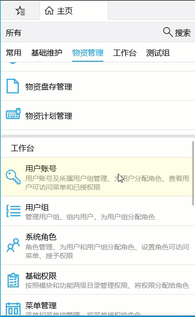

1. 主页相当于**Windows桌面**，登录后在左侧可查看所有菜单。

1. 菜单浏览时支持菜单树的多级导航。

1. 搜索时支持简拼和模糊搜索，搜索范围是所有授权的菜单。

1. 收藏夹相当于**Windows的开始菜单**，方便用户访问常用菜单，在任意窗口下都可以打开收藏夹，不必回到主页。