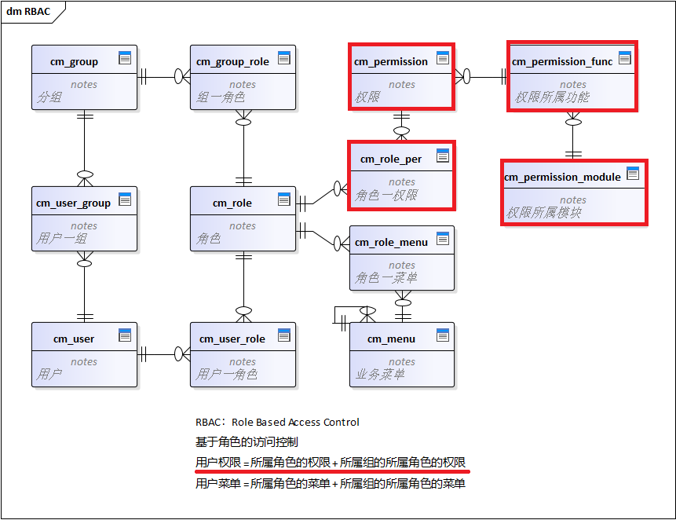
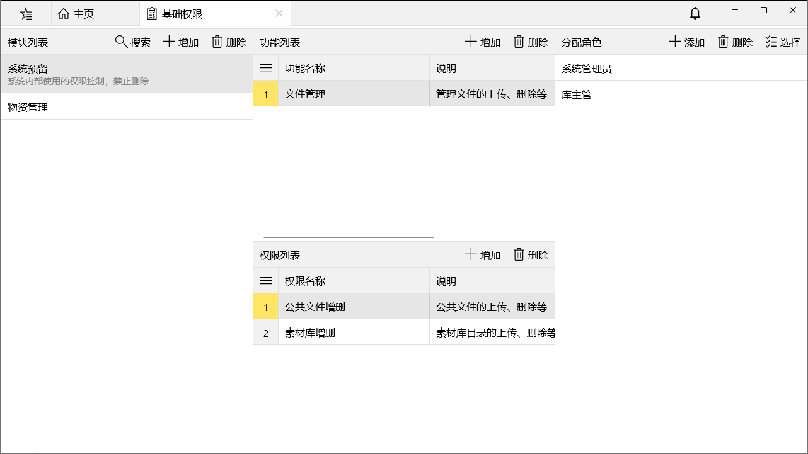
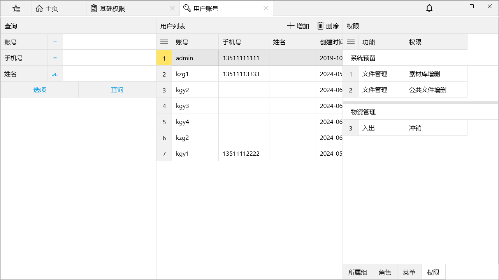
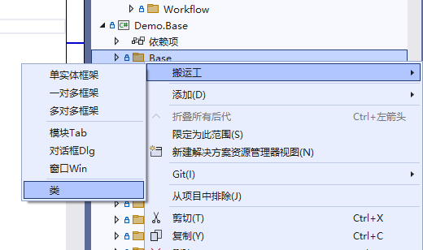
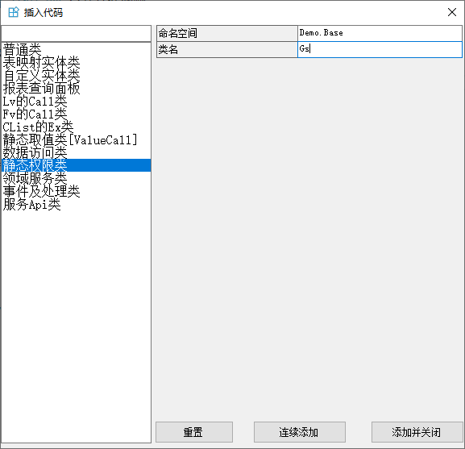

权限是指对系统资源的访问控制，RBAC中只和角色有多对多关系，和其它对象没有直接关系，通过多级关联实现和用户、组、菜单的多对多关系。

## 权限管理
权限管理分为两级：模块、功能，模块是子系统，功能是子系统的功能点，两级目录可以更好地组织权限，方便管理和授权。
权限只和角色有多对多关系，权限管理还包括权限授权，授权是指将权限分配给角色，通过多级关联可得到用户的权限：**用户权限=所属角色的权限+所属组的所属角色的权限**

## 权限判断
权限判断是指在系统中判断当前登录用户是否有访问某个资源的权限，通常是在代码中以硬编码的方式进行判断，所以增删改权限后需要同步代码，删除改动尤其谨慎。

搬运工的VS扩展可以根据权限数据生成方便使用的权限判断代码

/// 

/// 权限，VS扩展自动生成
/// 

public static partial class Gs
{
    public static class 系统预留
    {
        public static class 文件管理
        {
            public static Task<bool> 公共文件增删 => Kit.HasPermission(1L);
            public static Task<bool> 素材库增删 => Kit.HasPermission(2L);
        }
    }

    public static class 物资管理
    {
        public static class 入出
        {
            public static Task<bool> 冲销 => Kit.HasPermission(87434002596917248L);
        }
    }
}


使用方法

if (await Gs.系统预留.文件管理.公共文件增删)
{
    // 有权限
}
else
{
    // 没有权限
}


VS扩展生成权限判断代码

选择静态权限类
