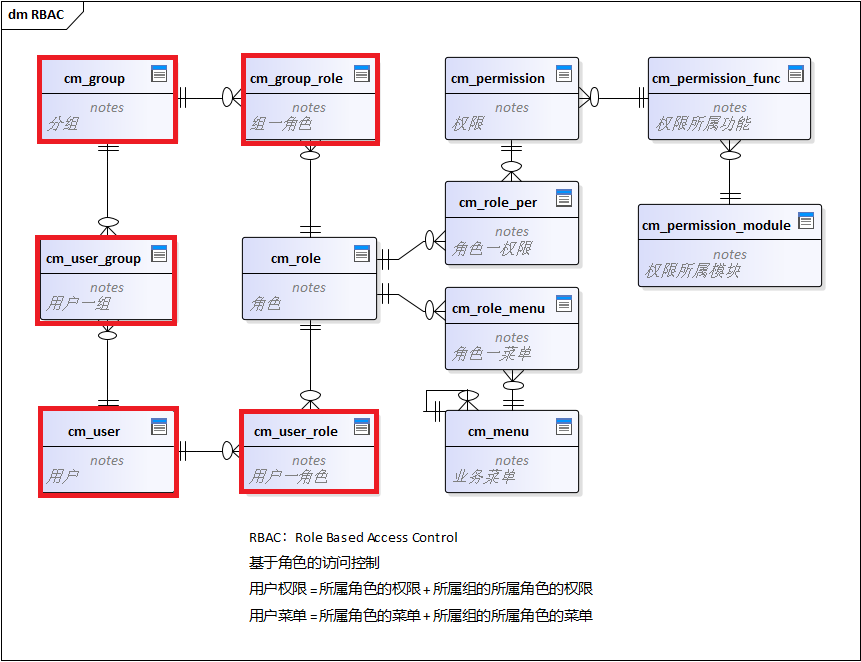
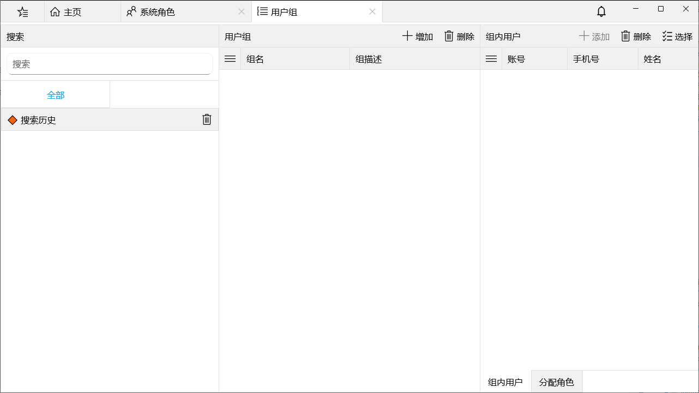
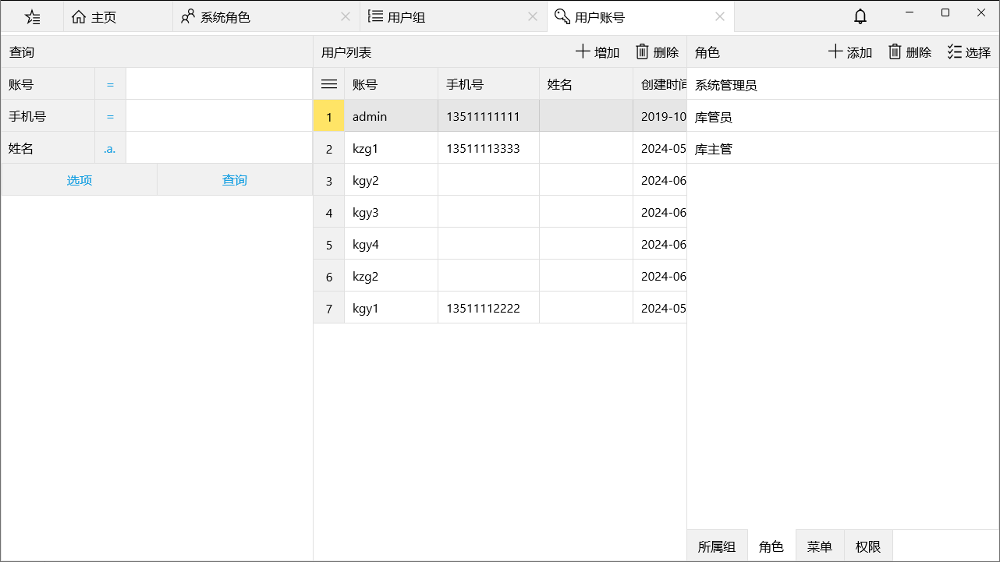

用户和角色是多对多关系，即：一个用户可同时充当多种角色，一种角色可以有多个用户担当。

当系统功能比较复杂，使用人员较多，权限分配比较自由时，单一的“用户-角色-权限”关系使得用户授权过程工作量巨大，引入用户分组解决此问题。

用户分组和用户是多对多关系，即：一个用户可以属于多个组，一个组可以有多个用户。用户分组和角色也是多对多关系，为用户分组分配角色即实现批量用户授权。

用户分组管理，管理用户组、组内用户，为用户组分配角色

用户管理，用户账号及所属用户组管理、为用户分配角色、查看用户可访问菜单和已授权限
