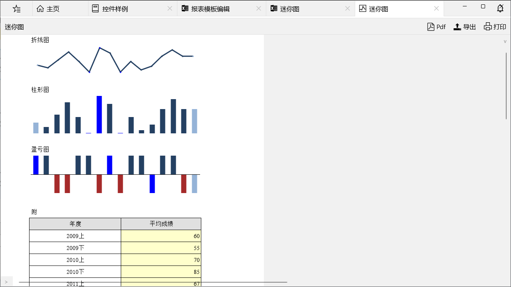

## 名词解释
- 报表模板：报表模板由包含若干个在运行时检索报表数据的查询和一些描述布局的信息组成，它在报表设计器中被创建，并且符合XML规范。
- 报表解析与报表实例：当最终用户浏览某张预定义报表时，报表系统会根据报表模板和用户输入的参数动态解析生成一个包含最终数据的遵循一定格式的XML文件，这个过程称为报表的实例化解析，这个XML文件称为报表实例。
- 报表渲染：将报表实例展现给最终用户的过程称为报表渲染，主要是将报表实例的XML内容在Excel控件中显示的过程。
- 报表脚本：能够在报表实例化解析过程中运行的脚本代码，每个报表模板可设置一个继承自RptScript的脚本类型，在报表实例化的每个阶段都可通过脚本辅助完成。

一张报表的定义包括模板编辑、参数定义、数据源定义、页面设置、报表预览设置等多个步骤，报表设计的结果为报表模板，以XML格式存储。

## 数据源定义
数据源定义的主要任务是定义报表在运行时需要检索的数据，根据提供数据的方式，数据源分为Db数据源和脚本数据源，Db数据源主要定义【服务+SQL+参数值】，运行时能够根据定义自动查询数据，脚本数据源由脚本在运行时动态提供数据，自由度较高。

### Db数据源
Db数据源定义包括下图所示内容

- **数据名称**用来区分不同的数据定义，在报表模板中唯一；
- **服务名**称指进行SQL查询时提交的服务；
- **SQL**中可以包含**以@开头**的参数，和参数定义中的参数名相对应，在报表浏览时由用户输入或自动填充参数值，最终以SQL参数的方式进行查询，SQL中也支持**以#包含的占位符**如`#abc#`，运行时用参数值替换占位符，主要用于更灵活的SQL查询。
- **列名**是SQL查询结果的所有列，列名之间逗号隔开，方便在模板设计时选项，无其它用途，可以在查询测试时自动生成。

### 脚本数据源
脚本数据源只需定义数据名称和列名，在渲染报表时会动态调用脚本获取数据，

脚本方法定义：

[RptScript]
public class DataRptScript : RptScript
{
    public override Task<Table> GetData(string p_name)
    {
        return Task.Run(() =>
        {
            using (var stream = typeof(RptHome).Assembly.GetManifestResourceStream($"Demo.UI.Files.Embed.数据源.{p_name}.json"))
            {
                return Table.Create(stream);
            }
        });
    }
}


## 参数定义
参数定义的主要任务是提供用户交互接口，这样用户在浏览报表时，可手工输入参数，根据参数的不同来提取不同的报表数据，从而使报表动态化，参数定义包括**参数管理**和**查询面板设计**两部分。

### 参数管理
报表模板中的参数应包含所有SQL中用到的@参数和#占位符，参数值既可以由用户输入，也可以自动赋值，如内置表达式:UserID,:Now等参数都可自动赋值。

- **参数名称**在报表模板中唯一，和SQL中的@参数或#占位符相对应；
- **参数类型**包括文本、数字、日期、时间、布尔值等，参数类型决定了用户输入的格式；
- **缺省值**是自动赋值的内容或表达式，如内置表达式:UserID,:Now，也可以是外部方法提供的值，如@RptValueCall.GetRandom()；

### 查询面板设计
查询面板设计是报表浏览时的用户输入界面，由QueryFv实现，自定义xaml可以控制参数顺序和参数的显示方式，参数的显示方式包括文本框、下拉框、日期控件等。

- **查询面板类名**是在代码中自定义查询面板的类名，自由度最高；
- **自动生成Xaml**是根据参数类型和顺序自动生成的QueryFv；
- **查询面板xaml**是自定义QueryFv的xaml，可以使用Fv设计器编辑，Fv设计器参见[通用视图](/dt-docs/4实体框架/5通用视图/)；


以上三种方法的优先级：类名 > Xaml > 自动生成Xaml，无类名无xaml不自动生成xaml时不显示查询面板，直接查询，显示报表


## 预览设置
预览设置是用户使用默认报表浏览窗口时的UI控制，包括以下内容，分别控制浏览窗口的不同部分。

**脚本类型名称**是自定义脚本的类名，每个报表模板可设置一个脚本类型，详见[脚本](#脚本)部分。

## 页面设置
页面设置主要是进行页面纸张大小、打印方向等打印设置。

## 脚本
脚本主要是对报表实例化解析过程的控制和交互控制，脚本类型名称在[预览设置](#预览设置)定义，每个报表模板可设置一个继承自RptScript的脚本类型，在报表实例化的每个阶段都可通过脚本辅助完成，脚本可以：
- 初始化查询参数值（自动查询时用）；
- 自定义数据源
- 绘制单元格内容和样式
- 初始化工具栏菜单；
- 打开上下文菜单
- 点击单元格脚本

脚本基类RptScript定义如下

public abstract class RptScript
{
    /// 

    /// 报表预览控件
    /// 

    public RptTab View { get; internal set; }

    /// 

    /// 初始化查询参数值（自动查询时用）
    /// 

    /// <param name="p_dict"></param>
    public virtual void InitParams(Dict p_dict)
        
    /// 

    /// 根据数据名称获取数据
    /// 

    /// <param name="p_name">数据名称</param>
    /// <returns></returns>
    public virtual Task<Table> GetData(string p_name)

    /// 

    /// 绘制单元格内容和样式
    /// 

    /// <param name="p_cell">单元格</param>
    /// <param name="p_args">单元格脚本参数</param>
    public virtual Task RenderCell(Cells.Data.Cell p_cell, RptCellArgs p_args)
        
    /// 

    /// 初始化工具栏菜单
    /// 

    /// <param name="p_menu"></param>
    public virtual void InitMenu(Menu p_menu)

    /// 

    /// RptTab中打开上下文菜单
    /// 

    /// <param name="p_contextMenu"></param>
    public virtual void OpenContextMenu(Menu p_contextMenu)

    /// 

    /// 点击单元格脚本
    /// 

    /// <param name="p_args">单元格脚本参数</param>
    public virtual void OnCellClick(RptCellArgs p_args)
}


自定义脚本样例，详细用法参加控件样例中的RptScriptDemo.cs。

[RptScript]
public class MyRptScript : DataRptScript
{
    static Dict _curParams;
        
    public override void InitParams(Dict p_dict)
    {
        if (_curParams == null)
        {
            p_dict["parentid"] = "";
            p_dict["parentname"] = "根菜单";
        }
        else
        {
            p_dict["parentid"] = _curParams["parentid"];
            p_dict["parentname"] = _curParams["parentname"];
        }
    }
        
    public override Task<Table> GetData(string p_name)
    {
        return Task.Run(() =>
        {
            using (var stream = typeof(RptHome).Assembly.GetManifestResourceStream($"Demo.UI.Files.Embed.数据源.{p_name}.json"))
            {
                var tbl = Table.Create(stream);
                var tgt = Table.Clone(tbl);
                var ls = from row in tbl
                            where row.Str("parentid") == View.Info.Params.Str("parentid")
                            select row;
                foreach (var row in ls)
                {
                    tgt.Add(row);
                }
                return tgt;
            }
        });
    }

    public override Task RenderCell(Dt.Cells.Data.Cell p_cell, RptCellArgs p_args)
    {
        if (p_args.Col == 1)
        {
            string name = View.Info.Params.Str("parentname");
            if (name == "根菜单")
            {
                p_cell.Value = name;
                p_cell.Foreground = Res.BlackBrush;
            }
            else
            {
                p_cell.Value = "<- " + name;
            }
        }
        else if (p_args.Col == 2)
        {
            if (p_args.Data.Bool("isgroup"))
            {
                p_cell.Value = "V";
                p_cell.Foreground = Res.GreenBrush;
            }
            else
            {
                p_cell.Value = "X";
                p_cell.Foreground = Res.RedBrush;
            }
        }
        return Task.CompletedTask;
    }

    public override void InitMenu(Menu p_menu)
    {
        Mi mi = new Mi { ID = "后退", Icon = Icons.向左 };
        mi.Click += OnBack;
        p_menu.Items.Insert(0, mi);
    }

    public override void OpenContextMenu(Menu p_contextMenu)
    {
        Mi back = p_contextMenu["后退"];
        if (back == null)
        {
            back = new Mi { ID = "后退", Icon = Icons.向左 };
            back.Click += OnBack;
            p_contextMenu.Items.Insert(0, back);
        }
        var ls = View.Tag as Stack<RptInfo>;
        back.Visibility = (ls != null && ls.Count > 0) ? Visibility.Visible : Visibility.Collapsed;

        if (p_contextMenu["菜单详情"] == null)
        {
            Mi mi = new Mi { ID = "菜单详情", Icon = Icons.文件 };
            mi.Click += OnDetail;
            p_contextMenu.Items.Add(mi);
        }
    }

    public override void OnCellClick(RptCellArgs p_args)
    {
        var row = p_args.Data;
        if (p_args.Row == 0 && p_args.Col == 1)
        {
            if (p_args.Text != "根菜单")
            {
                OnBack(null);
            }
        }
        else if (p_args.Col == 1)
        {
            if (row.Bool("isgroup"))
            {
                var info = new RptInfo
                {
                    Uri = "embedded://Demo.UI/Demo.UI.Files.Embed.模板.交互脚本.rpt",
                };
                _curParams = new Dict { { "parentid", row.Str("id") }, { "parentname", row.Str("name") } };
                    
                var ls = View.Tag as Stack<RptInfo>;
                if (ls == null)
                {
                    ls = new Stack<RptInfo>();
                    View.Tag = ls;
                }
                ls.Push(View.Info);
                View.LoadReport(info);
            }
            else
            {
                Dlg dlg = new Dlg();
                var pnl = new StackPanel
                {
                    Children =
                {
                    new TextBlock { Text = "id：" + row.Str("id")},
                    new TextBlock { Text = "parentid：" + row.Str("parentid")},
                    new TextBlock { Text = "name：" + row.Str("name")},
                    new TextBlock { Text = "isgroup：" + row.Str("isgroup")},
                },
                    Margin = new Thickness(20),
                };
                dlg.Content = pnl;
                dlg.Show();
            }
        }
        else if (p_args.Col == 2)
        {
            Kit.Msg(row.Bool("isgroup") ? "分组菜单" : "实体菜单");
        }
    }

    void OnBack(Mi e)
    {
        var ls = View.Tag as Stack<RptInfo>;
        if (ls != null && ls.Count > 0)
        {
            var info = ls.Pop();
            _curParams = info.Params;
            View.LoadReport(info);
        }
    }

    void OnDetail(Mi e)
    {
        Dlg dlg = new Dlg();
        dlg.Content = new TextBlock { Margin = new Thickness(20), Text = $"id：{View.Info.Params["parentid"]}\r\nname：{View.Info.Params["parentname"]}" };
        dlg.Show();
    }
}


## 模板编辑

模板编辑是报表设计的核心部分，主要是定义报表的布局，模板编辑器使用[Excel控件](/dt-docs/6报表/1excel/)。 

布局是在一个由单元格组成的空白面板上(下文称设计面板)，通过新建各种报表项，并指定这些报表项的之间的顺序、排版、样式等。值得注意的是，虽然布局设计是在Excel控件的单元格上完成的，但是其设计方式与Excel表格的绘制方式完全不同，这里的单元格面板只是作为一个各种报表项的载体，而不能直接在单元格中输入文字、定义样式，这些操作只能在报表项上进行。

### 报表布局
下图为报表布局的组成结构：

如上图所示，报表模板包括页眉、模板、页脚三个区域，但页眉、页脚都不是必须的，当页眉页脚无报表项时不进行绘制。三个区域均可新建多个报表项，是一对多关系。


报表模板中的一页，在报表浏览时，由于数据量和页大小设置的不同，可能会产生很多页，页眉页脚会出现在每页。


### 报表项
下图为报表项的层次示意图：

报表项其实是一种对象，目前，它包括文本、图片和数据区域。文本和图片属于静态的报表项，即如果报表模板中定义一个静态报表项，最终用户浏览报表时，显示出来的也仅有一个报表项。而数据区域则是动态报表项，在报表浏览时，其报表项的个数随着数据量的大小而动态变化，一般一个动态报表项是和一个数据集关联的。动态报表项包括四种：表格、矩阵、图表和迷你图，后面有详细介绍。

#### 文本
文本比较特殊，既可以单独使用，也可以作为其他报表项的子项使用。表格和矩阵只是布局容器，最终由文本承载内容。目前页眉页脚中只能使用文本，其它报表项不支持。

拖拽鼠标选择单元格面板上的一块空白区域，右键菜单**插入文本**，可以在指定区域上新建一个文本。注意，这时选中区域的单元格会被合并。

文本的值既可以是静态字符串如`abc`，也可以是表达式，还可以静态字符串与表达式的任意拼接如`abc || @RptValueCall.GetRandom() || :Var(页号)`。

表达式类型有很多种：

设计时不需要手写表达式，设计器会根据选项自动生成，避免手写错误。表达式更多的时候用在表格和矩阵的设计上。

以上表达式类型的值可涵盖报表所有可能值。


文本还可以设置样式，包括字体、颜色、对齐方式、边框、背景色等。

#### 表格
表格是报表布局中较复杂的报表项，它是一个动态报表项，必须和一个数据集绑定。在报表运行时，它呈现为列数固定、行数随数据集中的数据量动态扩展的数据表。

在报表模板中，表格为一个m行n列的实体，从外观来看，表格由很多个文本组成，表格的设计就是对文本的操作（如绑定数据集字段、参数、输入表达式等）。下图为表格的组成结构：

表格包含列头、分组、数据、列尾，一个表格必须包含数据部分，其他部分都是可选的。
- 列头是出现在表格的开始部分，相当于标题，一般为一些静态文字。
- 列尾出现在表格的尾部，一般在其上对表格数据作一些统计分析等。
- 数据部分是表格中显示关联数据集中数据的部分，它是按照数据集来纵向排版，即数据集中有多少条数据，数据部分就生成多少次。
- 有时需要对数据集中的某个字段进行分组，例如对记录按照年度分组，有多少个年度就产生多少个分组。当产生一个分组时，将分组放在该分组数据之前，通常是对该分组中的数据进行统计。一个表格可包含多个分组，分组之间为嵌套关系。

下图包含了表格的所有部分：

控件样例和管理样例中包含了表格的详细用法，下面是一些常用的功能演示。


#### 矩阵
矩阵，又称二维表、交叉表，是一种二维数据展现方式，适用于生成行数和列数都动态变化的表格。
下图演示了矩阵的概念：

上图中，矩阵的列数是由“单位”的多少决定的，而行数是由年度月份的多少决定的。

在报表模板中，矩阵从根本上也是由很多个文本框组成，但是矩阵的定义遵循严格的结构，下图为矩阵的组成结构：

上图中，行标题和列标题是数据的两个维度，所以矩阵又称二维表。

维度(Dimension)的概念来自于数据分析模型，它指的是观察数据的角度。例如可以从时间的角度、从地区的角度、从产品的角度去察看数据。在维度上可划分层次，例如在时间维度上，“年”可以划分成“月”，“月”可以划分成“日”，在这里，“年”“月”“日”就是上图中对应的“层”的概念。本节开始的例子中，行标题的维度为时间，列标题的维度为地区，时间维度分为两个层次，根层次为“年”，“年”包含子层次“月”。另外，可在“层次”上定义小计，上例中，可针对所有的年度作小计，也可对某个年度下所有的月份作小计。每个层的值是在报表生成时动态从数据库中获得的。

度量(Measure)也是来自数据分析模型的概念，指的是具体考察的数量值，可以理解为属性或指标，它在矩阵的结构中对应“标题”，在设计时已经确定。上例中，只有一个度量，即“发电量”，所以没有显式体现出“度量”的概念。下图是一个具有3个度量的例子：

这是一张人员工资报表，每个人的工资分为三个部分，分别为等级工资、基础津贴和综合补贴，这三个值就是“度量”，在设计矩阵时已经确定。

控件样例中的演示。


#### 图表
图表是一种以直观的图形方式呈现数据的报表项，与Excel中的图表类似。在报表导出Excel文件时，图表会被转换为Excel图表对象。

图表使用搬运工的图表控件实现，支持多种图表类型，包括柱形图、折线图、饼图、雷达图、散点图等。图表的设计和Excel中的图表类似，主要是定义数据源和图表类型。

控件样例中的演示。


#### 迷你图
迷你图和图表类似，只是迷你图是一个小的图表，主要用于在表格中显示数据的趋势。迷你图的设计和图表类似，主要是定义数据源和图表类型。

#### 图片与图标
图片与图标是静态报表项，主要是在固定区域显示图片或图标。图片在设计时上传，以base64编码格式保存在报表XML中，图标是搬运工内部的图标字符。

