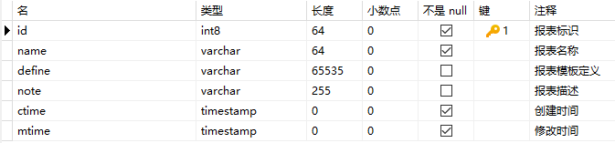
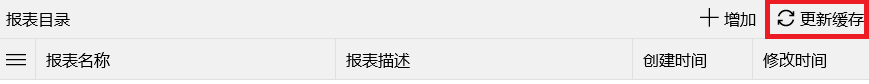
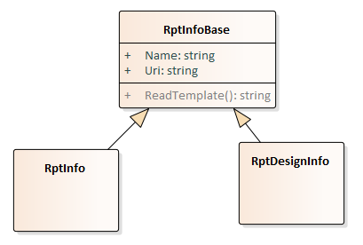

报表模板设计完成后，以XML格式存储在数据库、文件或代码中，当用户浏览某张预定义报表时，报表系统会根据报表模板和用户输入的参数动态解析生成一个包含最终数据的遵循一定格式的XML内容，这些内容支持以Excel或Pdf的格式显示。

## 报表管理
为了实现`快速开发`，对报表系统进行了封装，提供了`报表管理`的功能，将报表设计、报表模板XML存储、报表预览打包成一个不需要任何代码就可让用户使用的子系统。

打开主页，点击菜单`工作台 -> 报表设计`，可以看到所有的报表模板目录，报表模板的增删改查和普通的[单实体管理](/dt-docs/4实体框架/4通用框架/#单实体框架)相同。报表模板的XML存储在数据库表`cm_rpt`中，该表和其它表无任何关联关系，报表设计器可以直接打开和保存到数据库中。

以下演示报表管理全过程：新增报表模板、报表设计、报表模板XML保存、配置报表菜单、菜单授权、用户浏览报表。



为了减轻服务端压力，报表模板采用[模型缓存](/dt-docs/2基础/2基础功能/#模型缓存)，所以新增或修改报表模板后，必须`更新缓存`并重启应用后，才能看到最新的报表预览。



若报表浏览不是菜单方式提供给用户，而是以交互方式嵌入到某个操作中，需要提供简单代码。

Rpt.Show(new RptInfo { Uri = "rpt://Test" }, false, "标题", icon);


## 报表API
推荐使用`报表管理`方式来管理报表模板，以`菜单配置`方式提供报表浏览，尤其同一套系统提供给多个客户，而每个客户又有不同报表需求时，实现相同代码不同配置(数据)。

当然，系统也提供了更加灵活的方式处理报表，这些API涉及负责报表浏览的`RptInfo`类和负责报表设计的`RptDesignInfo`类，两类的基类为`RptInfoBase`。

### RptInfoBase
`RptInfoBase`类是报表浏览和报表设计的基类，包含报表名称、报表模板路径属性和读取模板内容方法等。

/// 

/// 报表描述信息
/// 提供报表模板三种方式优先级：
/// 1. 直接提供RptRoot对象，内部使用，如报表编辑时预览
/// 2. 重写 ReadTemplate 方法，模板在其他位置时
/// 3. 默认通过Uri查询模板，支持4种格式：rpt local ms-appx embedded
/// 

public abstract class RptInfoBase
{
    /// 

    /// 获取设置报表模板路径，作为唯一标识，支持4种格式：
    /// <para>cm_rpt表：rpt://模板名称</para>
    /// <para>本地sqlite库：local://库名/模板名称</para>
    /// <para>内容文件：ms-appx:///Dt.UIDemo/Report/模板名称.rpt，android不支持路径中文</para>
    /// <para>嵌入资源：embedded://程序集名/完整路径.模板名称.rpt</para>
    /// 

    public string Uri { get; set; }

    /// 

    /// 获取设置报表名称
    /// 

    public string Name { get; set; }

    /// 

    /// 读取模板内容，重写可自定义读取模板过程
    /// 

    /// <returns></returns>
    public virtual async Task<string> ReadTemplate()
}


从以上定义可以看出，`Uri`属性除了支持将报表模板XML存储在数据库表`cm_rpt`外，还支持将报表模板XML存储在本地库或文件中，文件包括项目内容文件和嵌入资源文件。这些是通过路径前缀区分的`rpt://  local://  ms-appx:///  embedded://`。

如果以上4个位置都不满足需求，可以重写`ReadTemplate`方法，返回报表模板XML内容。

### RptInfo
报表浏览的API，一般构造`RptInfo`对象时只需设置`Uri`和`Name`属性。

public static class Rpt
{
    /// 

    /// 打开新窗口显示报表
    /// 

    /// <param name="p_info">报表描述信息</param>
    /// <param name="p_isPdf">报表是否采用Pdf格式</param>
    /// <param name="p_winTitle"></param>
    /// <param name="p_icon">图标</param>
    public static async void Show(RptInfo p_info, bool p_isPdf = false, string p_winTitle = null, Icons p_icon = Icons.折线图)

    /// 

    /// 显示报表对话框
    /// 

    /// <param name="p_info">报表描述信息</param>
    /// <param name="p_isPdf">报表是否采用Pdf格式</param>
    /// <param name="p_title"></param>
    /// <returns>对话框</returns>
    public static async Task<Dlg> ShowDlg(RptInfo p_info, bool p_isPdf = false, string p_title = null)

    /// 

    /// 打开新窗口显示报表组
    /// 

    /// <param name="p_infos">报表组描述信息</param>
    /// <param name="p_isPdf">报表是否采用Pdf格式</param>
    /// <param name="p_winTitle">窗口标题</param>
    /// <param name="p_icon">图标</param>
    public static void Show(IList<RptInfo> p_infos, bool p_isPdf = false, string p_winTitle = null, Icons p_icon = Icons.折线图)
}


### RptDesignInfo
报表设计是报表系统的核心，报表设计的好坏直接影响到报表的使用效果，这部分在[报表设计](/dt-docs/6报表/2报表设计/)中已详细介绍。代码中很少需要直接调用报表设计器的情况，显示报表设计器的API：

public static class Rpt
{
    /// 

    /// 打开报表设计窗口
    /// 

    /// <param name="p_info">报表设计描述信息，null时使用临时空模板</param>
    /// <param name="p_winTitle">窗口标题，null时使用报表名称</param>
    /// <param name="p_icon">窗口图标</param>
    /// <returns></returns>
    public static async Task<bool> ShowDesign(RptDesignInfo p_info, string p_winTitle = null, Icons p_icon = Icons.Excel)
}


`RptDesignInfo`可以控制报表设计的所有选项，如各种菜单项的显示控制、自定义保存模板的位置等。

public partial class RptDesignInfo : RptInfoBase
{
    /// 

    /// 是否显示新文件菜单项，默认false
    /// 

    public bool ShowNewFile { get; set; }
        
    /// 

    /// 是否显示打开文件菜单项，默认false
    /// 

    public bool ShowOpenFile { get; set; }

    /// 

    /// 是否显示保存菜单项，默认false
    /// 

    public bool ShowSave { get; set; }
        
    /// 

    /// 保存模板内容
    /// 

    /// <param name="p_xml"></param>
    /// <returns></returns>
    public virtual async Task<bool> SaveTemplate(string p_xml)
}


## 报表控件
很多时候需要将报表预览功能和其它UI融入一体，这时需要使用报表控件`RptTab`。`RptTab`是一个包含报表预览功能的Tab控件，它的用法非常简单，只需在XAML中添加一个`RptTab`控件，在代码中调用`LoadReport`方法即可。


_rpt.LoadReport(new RptInfo { Uri = "rpt://综合" });
_rpt.LoadReport(new RptInfo { Uri = "local://rptdemo/综合" });
_rpt.LoadReport(new RptInfo { Uri = "ms-appx:///Demo.UI/Files/Content/zh.rpt" });
_rpt.LoadReport(new RptInfo { Uri = "embedded://Demo.UI/Demo.UI.Files.Embed.模板.综合.rpt" });
