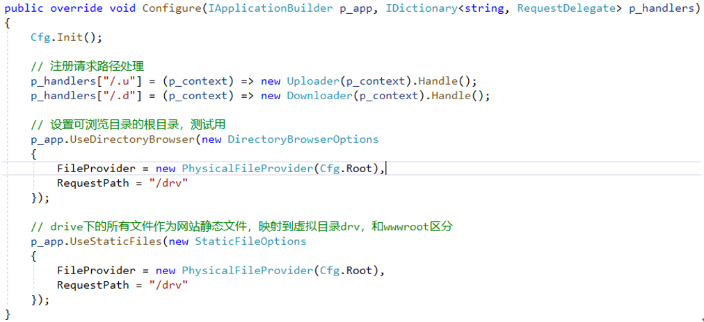
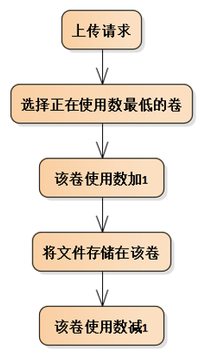
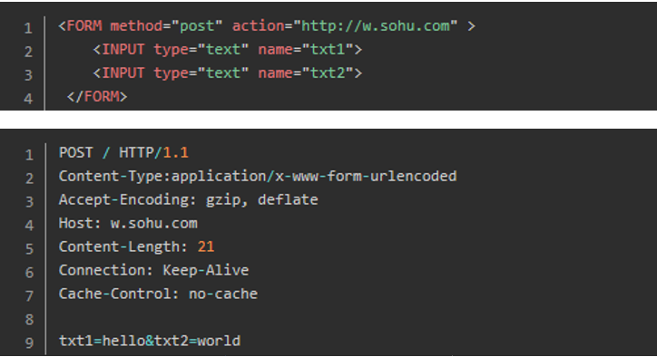
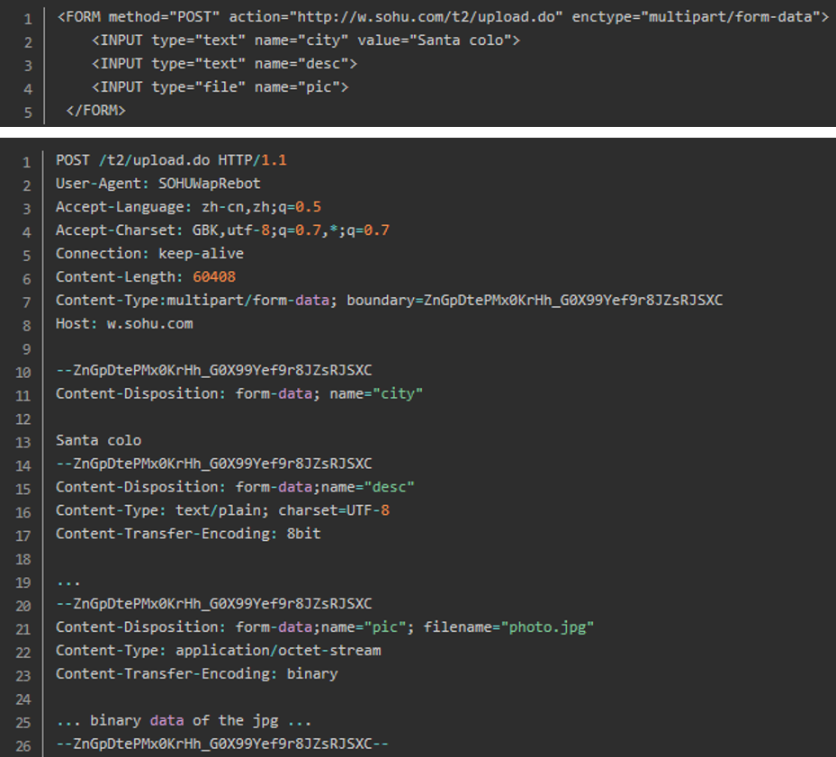
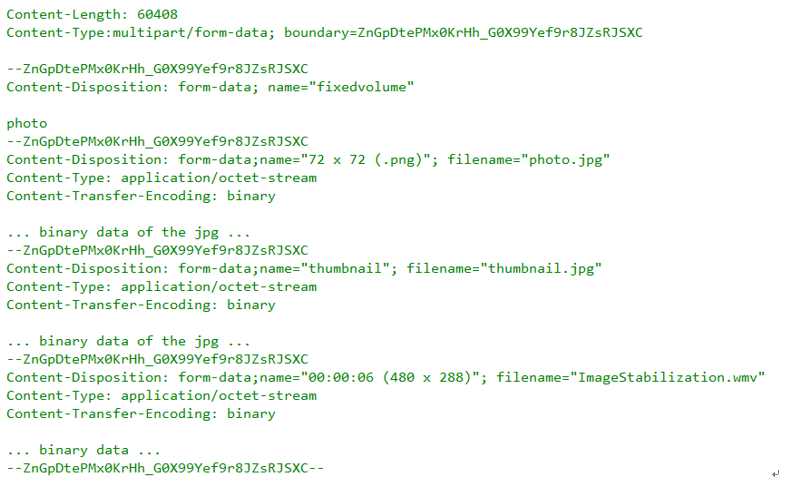
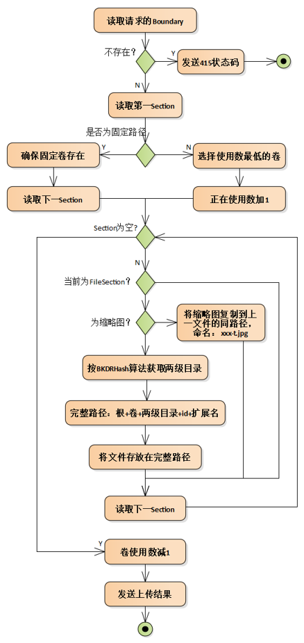
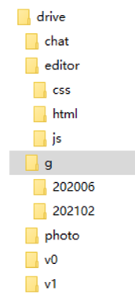
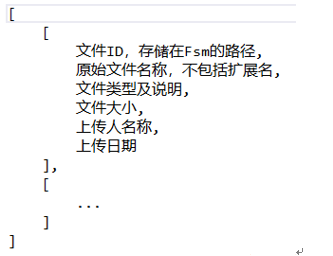
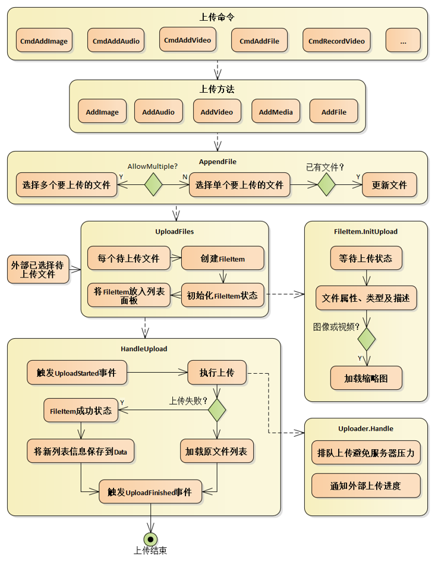
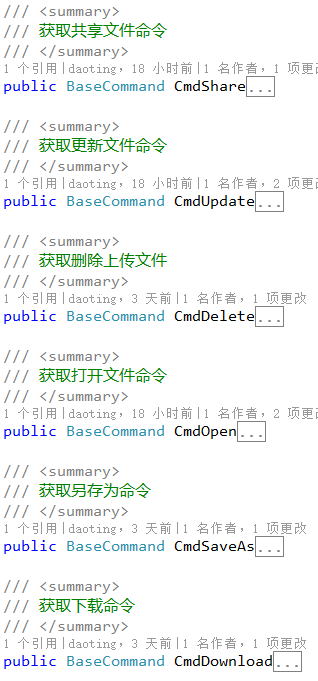

文件系统包括文件服务和文件客户端。

## 文件服务
文件服务统一管理应用范围内使用的文件，在k8s中支持多副本部署，支持分卷存储文件，可通过ConfigMap将数据卷Volume挂载到指定目录，该服务只负责文件的上传下载和文件管理功能，不涉及具体的业务问题，在功能和Api上较稳定。

### 卷
文件的本地目录为`drive`，为了和`wwwroot`区分，映射到虚拟目录`drv`，并且`drive`下的所有文件都作为网站静态文件，访问路径形如：`https://localhost/dt-fsm/drv/v0/21/06/80819234523705344.jpg`。

服务支持挂载多个卷，每个卷有不同的用途，系统将卷划分为固定卷和普通卷，固定卷是指客户端在上传文件时可根据卷名访问的卷，该卷一般存储特殊用途的文件，如头像文件、聊天文件等，使用场景较少。普通卷是除固定卷以外的卷，上传文件时根据普通卷的使用情况动态选择要存储的卷，服务启动时在Redis缓存中创建了SortedSet类型的volume键，该SortedSet列表中的每行对应一个卷，值为这个卷的“正在使用数”，正在使用数就是当前正在写入卷的请求数，该数值能正确反映一个卷的闲置状态，每次有新的上传请求时都选择“正在使用数”最小的卷进行存储。

### 上传
文件上传采用流式上传方式，流式上传和使用IFormFile在效率上没有太大的差异，IFormFile的缺点主要是客户端上传过来的文件首先会缓存在服务器内存中，任何超过 64KB 的单个缓冲文件会从 RAM 移动到服务器磁盘上的临时文件中。文件上传所用的资源（磁盘、RAM）取决于并发文件上传的数量和大小，流式上传主要解决内存占用过高和磁盘空间不足问题。

Http Post请求时内容有三种编码类型，文件上传使用multipart/form-data：

1. application/x-www-urlencoded，Form默认的编码类型，消息内容会经过 URL 格式编码，就像在 GET请求时 URL 里的 QueryString 那样。

1. multipart/form-data,它可以包含了多个 Parts，每个 Part 都包含头信息部分，Part 头信息中必须包含一个 Content-Disposition 头，其他的头信息则为可选项，比如 Content-Type 等，Content-Disposition 包含 type 和一个名字为 name 的 parameter，type是 form-data，name 参数的值则为表单控件（也即 field）的名字，如果是文件，那么还有一个 filename 参数，值就是文件名。

1. text-plain，空格转换为 "+" 加号，但不对特殊字符编码。

文件上传的Section结构如下：

当使用固定卷时第一Section用于指定固定卷名，当使用普通卷时所有Section都是FileSection。
文件上传过程：

### 下载
下载文件时需要提供文件的完整路径，记录文件下载次数。下载缩略图时，若缩略图不存在，则下载原始图像，客户端可通过Api先判断缩略图是否存在。
缩略图命名规则：原文件名添加后缀"-t.jpg"，如 143203944767549440.wmv 的缩略图文件名为143203944767549440.wmv-t.jpg。

### 浏览
和下载类似，文件服务还支持按路径直接浏览的方式，方便图片或视频等嵌入到网页中。
如：`https://localhost/dt-fsm/drv/v0/21/06/80819234523705344.jpg`
同样浏览缩略图时若无缩略图自动取原图。

### 网页发布
文件服务还提供静态网页浏览的功能，和cm服务中的发布模块配合。文件服务中有两个目录的文件与发布相关：`drive/editor`目录是`html`富文本编辑器，`drive/g`是动态生成的网页，目录结构如下：

`editor`目录包含`froala`编辑器的所有文件，默认编辑器在`editor\html\default.html`页面。g目录下保存生成的静态网页，以“年月”格式的目录作为网页的二级分类。因生成的网页中采用相对路径，如插入的图片或视频为`“../../drv/v0/26/2D/91789217609150464.mp4”`，并且为了保证生成的网页和`froala`中编辑的内容都能正常显示，禁止修改目录结构。
`html`编辑器用于编辑网页内容，编辑后的网页内容可以保存在数据库或根据模板生成完整网页。

## 文件客户端
文件客户端负责与`fsm`服务通信实现文件的上传下载功能，每个平台的实现方法不同，为了统一不同平台的文件上传下载操作，达到快速开发的目的，提供了`FileList`文件列表控件。

它封装了上传、下载、打开等文件操作过程中的UI交互功能，被其他多个控件引用，如`CFile`格、`CImage`格、`Dot`、`Chat`等。

### 数据源
`FileList.Data`属性保存着文件列表的json描述信息，json结构如下：

切换Data值时会触发重建文件列表FileItem，这只影响控件的界面，并未上传或下载文件。

### 上传文件

“上传命令”主要提供给外部使用，用于绑定菜单项或按钮用，“上传方法”方便在代码中调用，因选择文件、上传文件等操作在各平台使用不同代码，每次用到时重写比较繁琐，所以尽可能的使用以上命令和方法。当外部已选择待上传文件时，可以直接调用UploadFiles方法，如在Chat中既是。

### FileItem
FileItem是每个文件项的UI，内部有三种类型控件模板：普通文件、图像文件、视频文件，音频文件使用普通文件的模板，如下图：

控件的交互功能有，点击文件项时打开文件、显示原始图像、播放视频或音频，还负责上传下载过程中的交互，上传或下载过程中再次点击可取消。

FileItem还提供常用的文件命令和方法：

CFile格, CImage格或Chat中的菜单项就是绑定这些命令。

