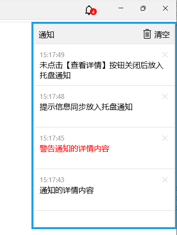

消息系统是一个用于传递和处理消息的系统，它的核心功能是实现消息的发送、接收和处理。消息系统的设计目标是提供一个高效、可靠和灵活的消息传递机制，以满足不同场景下的需求。

根据消息来源分为网络消息和本地消息。

## 网络消息
网络消息是指通过网络传输的消息，主要用于客户端和服务端之间的消息交互，传输路径：`客户端A -> 服务 -> 客户端B` 或 `服务 -> 客户端B`。

网络消息的本质就是远程过程调用（RPC），平台内置的基础消息服务，支持多副本部署，所有已注册的客户端在启动时调用服务端的`Register`方法，该`Api`采用基于`http2`协议的`ServerStream`模式，即：客户端发送一个请求，服务端返回数据流响应，相当于在服务端和客户端建立了长连接，服务端可以实时向客户端推送信息。

### 推送过程
服务端向客户端发送的消息主要包括三类：即时消息(聊天内容或系统消息)、订阅消息、指令消息，其中即时消息和指令消息按userid发送，订阅消息只推送给订阅了该消息类型的用户，所有类型消息的发送都遵循`“在线直接发送”、“离线按照用户设置进行推送”`的原则。其推送过程如下图所示：

上图，`SendMsg`发送系统消息，`SendLetter`发送聊天消息，`SendCmd`发送命令消息。

- 系统消息就是发送者固定为`系统`的聊天消息
- 聊天消息就是调用方法固定为`SysPushApi.ReceiveLetter`的命令消息
- 所有消息最终都是以命令消息发送

消息描述类型`MsgInfo`如下：


public class MsgInfo : IRpcJson
{
    /// 

    /// 在线时调用客户端的方法名，如 SysPushApi.ReceiveLetter
    /// 

    public string MethodName { get; set; }

    /// 

    /// 在线时调用客户端方法的参数
    /// 

    public List<object> Params { get; set; }

    /// 

    /// 离线推送时的消息标题
    /// 

    public string Title { get; set; }

    /// 

    /// 离线推送时的消息内容
    /// 

    public string Content { get; set; }
}


### 聊天消息API
客户端聊天的收发API如下：

public partial class ChatDs : DomainSvc<ChatDs>
{
    /// 

    /// 向某用户的客户端推送聊天信息，可通过指定LetterInfo.LetterType为Undo撤回信息
    /// 

    /// <param name="p_userID">目标用户</param>
    /// <param name="p_letter">聊天信息</param>
    /// <returns>true 在线推送</returns>
    public static Task<bool> SendLetter(long p_userID, LetterInfo p_letter)

    /// 

    /// 接收服务器推送的聊天信息
    /// 

    /// <param name="p_letter"></param>
    public static async void ReceiveLetter(LetterInfo p_letter)
}


### 系统消息API
系统消息就是聊天消息，只是发送者固定为`系统`，不是当前用户。

public partial class AtMsg
{
    /// 

    /// 向某用户的客户端推送系统消息
    /// 

    /// <param name="p_userID"></param>
    /// <param name="p_msg"></param>
    /// <returns>true 在线推送</returns>
    public static Task<bool> SendMsg(long p_userID, string p_msg)
        
    /// 

    /// 向用户列表的所有客户端推送系统消息
    /// 

    /// <param name="p_userIDs">用户列表</param>
    /// <param name="p_msg">待推送信息</param>
    /// <returns>在线推送列表</returns>
    public static Task<List<long>> BatchSendMsg(List<long> p_userIDs, string p_msg)
        
    /// 

    /// 向所有副本的所有在线用户广播信息
    /// 

    /// <param name="p_msg"></param>
    /// <param name="p_checkReplica">多副本实例时是否检查其他副本</param>
    public static Task<T> SendMsgToOnline<T>(string p_msg, bool p_checkReplica = true)
}


### 指令消息API
将指令消息推送到客户端

public partial class AtMsg
{
    /// 

    /// 向某用户的客户端推送指令信息
    /// 

    /// <param name="p_userID"></param>
    /// <param name="p_msg"></param>
    /// <returns>true 在线推送</returns>
    public static Task<bool> SendCmd(long p_userID, MsgInfo p_msg)

    /// 

    /// 向用户列表的所有客户端推送指令信息
    /// 

    /// <param name="p_userIDs">用户列表</param>
    /// <param name="p_msg">待推送信息</param>
    /// <param name="p_checkReplica">多副本实例时是否检查其他副本</param>
    /// <returns>在线推送列表</returns>
    public static Task<List<long>> BatchSendCmd(List<long> p_userIDs, MsgInfo p_msg, bool p_checkReplica = true)
}


客户端收到消息，会根据指令内容调用带`[PushApi]`标签的类型的方法，比如：

/// 

/// 系统内置推送处理
/// 

[PushApi]
public class SysPushApi
{
    /// 

    /// 接收服务器推送的聊天信息
    /// 

    /// <param name="p_letter"></param>
    public void ReceiveLetter(LetterInfo p_letter)
    {
        ChatDs.ReceiveLetter(p_letter);
    }

    /// 

    /// 系统警告提示
    /// 

    /// <param name="p_msg"></param>
    public void ShowSysWarning(string p_msg)
    {
        Kit.Warn($"【系统通知】\r\n{p_msg}");
    }

    /// 

    /// 新任务提醒
    /// 

    /// <param name="p_itemID">工作项id</param>
    /// <param name="p_sender"></param>
    public void WfNotify(long p_itemID, string p_sender)
    {
        WfiDs.ReceiveNewTask(p_itemID, p_sender);
    }
}


## 本地消息
本地消息是指在客户端同一进程内传递的消息，主要用于不同模块之间的消息交互，也是不同模块之间解耦的重要方式。

本地消息通过事件机制实现，模块之间通过订阅和发布事件来进行消息的传递。每个模块可以定义自己的事件类型，并在需要时发布事件，其他模块可以订阅这些事件并在事件发生时进行处理。

和服务端的[EventBus](/dt-docs/2基础/2基础功能/#eventbus)机制相同。

定义事件，如：

public class TestEventData : IEvent
{
    public string Name { get; set; }
}


订阅事件无需在代码中采用附加的方式，只需为事件处理类型加上`[EventHandler]`标签，并实现`IEventHandler<T>`接口，方法`Handle`就是处理事件的入口，如：

[EventHandler]
public class TestHandler2 : IEventHandler<TestEventData>
{
    public Task Handle(TestEventData p_event)
    {
        Log.Information($"{GetType().Name}已处理，Name：{p_event.Name}");
        return Task.CompletedTask;
    }
}


当然，多个模块可以订阅同一个事件，事件处理顺序是按照模块加载的顺序来执行的。

## 消息UI
消息UI是消息处理的用户界面，系统提供常用消息处理的基础UI。

### 提示信息
普通信息、警告信息，可带按钮，延时关闭可设置

方法定义：

public partial class Kit
{
    /// 

    /// 发布消息提示
    /// 

    /// <param name="p_content">显示内容</param>
    /// <param name="p_delaySeconds">
    /// 几秒后自动关闭，默认3秒
    /// <para>大于0：启动定时器自动关闭，点击也关闭</para>
    /// <para>0：不自动关闭，但点击关闭</para>
    /// <para>小于0：始终不关闭，只有程序控制关闭</para>
    /// </param>
    public static NotifyInfo Msg(string p_content, int p_delaySeconds = 3)

    /// 

    /// 警告提示
    /// 

    /// <param name="p_content">显示内容</param>
    /// <param name="p_delaySeconds">
    /// 几秒后自动关闭，默认5秒
    /// <para>大于0：启动定时器自动关闭，点击也关闭</para>
    /// <para>0：不自动关闭，但点击关闭</para>
    /// <para>小于0：始终不关闭，只有程序控制关闭</para>
    /// </param>
    public static NotifyInfo Warn(string p_content, int p_delaySeconds = 5)

    /// 

    /// 发布消息提示
    /// 

    /// <param name="p_notify">消息提示实例</param>
    public static void Notify(NotifyInfo p_notify)

    /// 

    /// 关闭消息提示，通常在连接按钮中执行关闭
    /// 

    /// <param name="p_notify"></param>
    public static void CloseNotify(NotifyInfo p_notify)
}


用法如下：

Kit.Msg("普通信息");
Kit.Warn("警告信息");

Kit.Msg("信息不自动关闭", 0);

NotifyInfo info = Kit.Msg(_tbMessage.Text, -1);
await Task.Delay(3000);
info.Message = "点击启动自动关闭";
info.NotifyType = NotifyType.Warning;
info.LinkCallback = (e) =>
{
    info.Message = "三秒后自动关闭";
    info.NotifyType = NotifyType.Information;
    info.Link = null;
    info.Delay = 3;
};
info.Link = "自动关闭";


### 托盘通知
托盘通知模拟windows任务栏托盘的通知中心，和[提示信息](#提示信息)不同。
- 托盘通知不展开时只显示通知个数，只有在点击展开后显示所有通知的详细内容，既不打扰用户，也不丢失未读的消息。
- 提示信息直观方便，但不适合有大量消息的场景，用户还可能错过自动关闭的信息。

方法定义：

public partial class Kit
{
    /// 

    /// 获取托盘通知列表
    /// 

    public static Table AllTrayMsg => _ui.AllTrayMsg;

    /// 

    /// 发布新托盘通知
    /// 

    /// <param name="p_content">通知内容</param>
    /// <param name="p_isWarning">是否为警告通知</param>
    public static void TrayMsg(string p_content, bool p_isWarning = false)

    /// 

    /// 发布新托盘通知
    /// 

    /// <param name="p_notify">消息提示实例</param>
    public static void TrayMsg(NotifyInfo p_notify)
}


用法如下：

Kit.TrayMsg("通知的详情内容");
Kit.TrayMsg("警告通知的详情内容", true);

NotifyInfo info = new NotifyInfo();
info.Message = "未点击【查看详情】按钮关闭后放入托盘通知";
info.Link = "查看详情";
info.LinkCallback = e =>
{
    Kit.Msg("详情内容");
    Kit.CloseNotify(e);
};
info.Delay = 3;
info.ToTray = e => Kit.TrayMsg(e);
Kit.Notify(info);


### 操作系统通知
- 支持跨平台，
- App完全退出也有效
- iOS只有app在后台或关闭时才显示！其他平台始终显示
- 点击通知后会激活或打开App，并且支持通知的启动参数。

方法定义：

public partial class Kit
{
    /// 

    /// 显示系统通知，iOS只有app在后台或关闭时才显示！其他平台始终显示
    /// 

    /// <param name="p_title">标题</param>
    /// <param name="p_content">内容</param>
    /// <param name="p_startInfo">点击通知的启动参数</param>
    public static void Toast(string p_title, string p_content, AutoStartInfo p_startInfo = null)
}


用法如下：

Kit.Toast("普通通知", "无启动参数\r\n" + DateTime.Now.ToString());

Kit.Toast("带自启动参数的通知",
    "点击打开LvHome\r\n" + DateTime.Now.ToString(),
    new AutoStartInfo
    {
        WinType = typeof(LvHome).AssemblyQualifiedName,
        Title = "列表"
    });


### 通讯录
通讯录是系统内置的聊天工具，负责接收、显示、发送聊天消息和系统消息，参见[聊天消息API](#聊天消息api)。

## 样例演示


