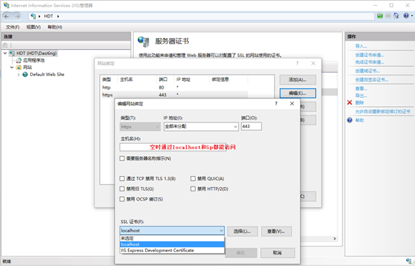
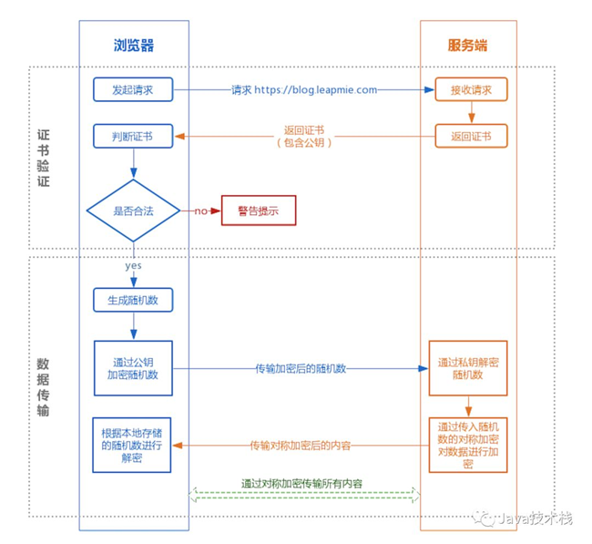
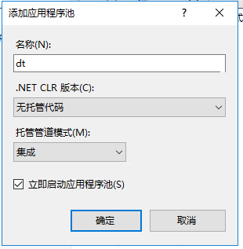

服务端环境的安装部署主要包括平台服务、mysql库、RabbitMQ、Redis、k8s、IIS等，本章主要介绍平台服务的两种部署方式：IIS部署、k8s部署。

最初开发时使用Traefik做反向代理，windows版的Traefik使用方式和容器版类似，可以按照服务的url规则进行配置，详细配置参见traefik.toml，还特意做了“搬运工助手”工具，用于启动、停止服务和查看日志。

##	Web服务器
Asp.net core的web服务器有两种：KestrelServer 和 IISHttpServer。
IISHttpServer主要用于部署在IIS并且进程内承载时使用，具体可参见下一节的“承载模式”，IISHttpServer的配置在web.config。
其他情况都使用KestrelServer，它的监听和协议在 `etc\config\kestrel.json` 中配置，可以监听多个Url，每个监听可以指定使用的协议、监听地址、端口、X509证书文件及密码等，如：


{
  // 启动KestrelServer时的监听设置
  "KestrelListen": [
    {
      "Scheme": "https",
      "Address": "0.0.0.0",
      "Port": "1234"
    },
    {
      "Scheme": "http",
      "Address": "0.0.0.0",
      "Port": "9999"
    }
  ]
}


## IIS部署
在开发或部署到windows server时首选IIS，和传统asp.net应用不同，IIS只作为反向代理使用。

### 安装 IIS
参见[安装 IIS](/dt-docs/1开始/1开发环境/#安装-iis)

### https配置
http2.0协议比http1.1更高效，本来http2.0协议和https之间没有依赖关系，但主流浏览器和.net都要求采用http2.0协议通信必须启用https。

平台所有服务都同时支持http1.1和http2.0协议，平台所有客户端与服务之间以及服务与服务之间都采用http2.0协议进行http请求，虽然http请求为http2.0但它们之间采用何种通信协议，最终取决于是否启用https，启用https时采用http2.0协议，否则仍采用http1.1协议。

因此要想采用高效的http2.0协议必须启用https通信，而要使用https需要在网站的服务器上配置https证书，IIS和k8s的traefik都需要配置该证书。

证书可以向专门的https证书提供商进行购买，也可以自己生成，两种的区别是自己生成的证书不被浏览器信任，需要点击信任或将证书安装在“受信任的根证书颁发机构”之后才能继续访问。

默认情况下，IIS中的网站只提供了http绑定，要支持https绑定，首先需要pfx格式的服务器证书，以下为生成https证书的过程：

* 在windows上安装Win64OpenSSL_Light-1_1_1b.exe，然后打开PowerShell(管理员)，cd到openssl.exe所在的目录
* 生成私钥tls.key, 密钥位数是 2048

.\openssl genrsa -out tls.key 2048


* 使用server.key 生成自签证书，域名localhost，有效期20年

.\openssl req -new -x509 -days 7300 -key tls.key -out tls.crt -subj /CN=localhost -addext "subjectAltName=DNS:localhost"


* 生成tls.key, tls.crt文件用于以上secret资源，crt存储公钥，key存储私钥
将私钥和公钥合并成pfx证书，密码为dt，用于服务的x509认证

.\openssl pkcs12 -export -in tls.crt -inkey tls.key -out tls.pfx -name "Dt Platform"

* 导入服务器证书，此证书签名为localhost，只在开发时使用，生成环境可替换，导入新证书即可。

然后右键“Default Web Site”->编辑绑定->添加->选择https->选择ssl证书，也可以使用IIS Express提供的证书。

对称加密是加密和解密使用同一个密钥；非对称加密使用一对非对称的私有密钥和公开密钥，发送密文的一方使用对方的公开密钥进行加密处理，对方收到被加密的信息后，再使用自己的私有密钥进行解密，对称密钥的好处是解密的效率比较快，非对称加密的好处是传输的内容不能被破解。HTTPS采用对称加密和非对称加密两者并用的混合加密机制，过程如下

### 承载模式

### 安装服务
部署服务时支持两种模式，参见[服务部署](/dt-docs/2基础/3服务/#服务部署)。

* 打开IIS管理器 `inetmgr`
* 添加应用池：

* 添加应用程序

## k8s部署
k8s的概念和环境安装过程请参见下一章介绍。
在开发环境和生产环境都可以使用k8s模式部署服务，k8s模式是通过helm->k8s->docker在容器内运行服务，该模式启动慢、耗资源、附加到远程调试无法调试服务的启动部分，运行前需要生成镜像、使用Helm部署到容器、附加到远程pod等过程，所以该模式部署繁琐耗时，不适合在开发过程中使用，适合于生产环境的云部署。
k8s模式下的服务需要一系列步骤才能运行：编译生成docker镜像、运行Helm打包脚本部署到k8s、附加到远程pod进行调试等，为方便部署和远程调试，开发工具使用VS Code，利用VS Code提供的任务，将一系列步骤打包成一个任务运行，任务定义参见.vscode\tasks.json，详细步骤参见dt\Service\k8s目录下的debug.ps1脚本文件、chart模板、服务配置。
k8s远程调试参见.vscode\launch.json，容器内运行时的远程调试配置如下：



{
    "name": "cm-k8s",
    "type": "coreclr",
    "request": "attach",
    // 前置任务
    //"preLaunchTask": "cm-k8s",
    // ${command:pickRemoteProcess} 出错，通常为1
    "processId": "1",
    "justMyCode": true,
    "pipeTransport": {
        "pipeProgram": "kubectl",
        "pipeArgs": [
            "exec",
            "-i",
            // 使用Deployment部署时pod名称变化，无法自动获取！
            "baisui-cm",
            "--"
        ],
        // 管道工作目录
        "pipeCwd": "${workspaceFolder}",
        // 调试工具位置
        "debuggerPath": "/root/vsdbg/vsdbg",
        "quoteArgs": false
    },
    "sourceFileMap": {
        // 设置源文件映射，容器中的/src映射到当前工作区的/src
        "/src": "${workspaceFolder}/src"
    }
}

运行命令kubectl exec –i baisui-cm – 附加到远程pod(baisui-cm)内，通过容器中的vsdbg调试工具建立与VS Code的通信，将调试控制和输出信息通过管道传输。sourceFileMap用来设置容器中编译时的源代码路径和当前工作区路径的映射关系，debuggerPath指定vsdbg的路径，quoteArgs设置命令后缀是字符串还是命令，默认true添加引号按字符串处理。
vsdbg是命令行方式的调试器，获取方式和VS2017的相同，因vsdbg下载过慢，为避免重复下载通常将其复制到asp.net基础镜像内的/root/vsdbg目录后制作新镜像作为基础镜像。

