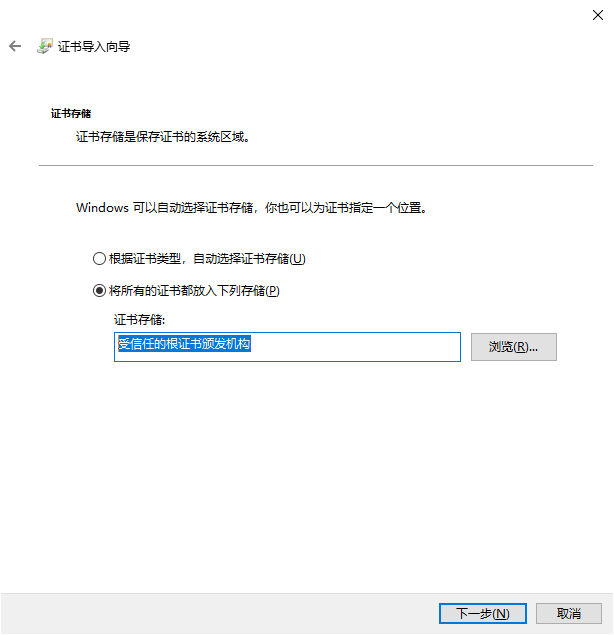

这里只介绍将win应用发布为旁加载的情况，发布到应用商店的请参考官方介绍。

旁加载应用是指来自非官方源的应用（如 Microsoft Store），打包发布时选择旁加载即可生成旁加载安装包。以下按照从打包、发布到用户安装、使用、自动升级的顺序进行介绍。

## 创建应用包

### 创建自签名证书

* 在 Visual Studio 2022 中打开解决方案
* 确保活动调试目标框架是net9.0-windows10.0.xxxxx
* 双击文件Package.appxmanifest
* 导航到选项卡打包
* 单击“选择证书”按钮
* 单击“创建”按钮，然后设置发布者公用名，然后单击“确定”。不要设置密码。
* 单击“确定”关闭“选择证书”窗口。
* 单击 Visual Studio 工具栏中的“保存文件”按钮

默认创建的自签名证书有效期1年，也可使用搬运工的VS扩展生成证书，可以自定义有效期和密码。如下图，Exe项目右键 -> 创建应用包。

### 生成应用
生成应用需要使用 msbuild 命令（从 WinAppSDK 1.5 开始不兼容），无法在VS中完成。
* windows开始菜单打开`Developer Command Prompt for VS 2022`命令窗口
* 导航到app项目所在目录，即demo.csproj所在目录（不支持在解决方案级别生成）
* 使用以下命令，可以自定义输出路径

msbuild /r /p:TargetFramework=net9.0-windows10.0.19041 /p:Configuration=Release /p:Platform=x64 /p:GenerateAppxPackageOnBuild=true /p:AppxBundle=Never /p:UapAppxPackageBuildMode=Sideloading /p:AppxPackageDir="D:/Dt/Packages/" /p:AppxPackageSigningEnabled=true


也可使用搬运工的VS扩展完成此过程


若因为IL裁剪出错，请将`Properties\PublishProfiles\win-x64.pubxml`中的 `PublishTrimmed` 设置为false，因为引用的包中有不支持IL裁剪的情况。


## 发布
找到应用程序包目录，将证书文件和安装包复制到 `cm` 服务或单体服务的`package/win`目录下

启动`cm` 服务或单体服务，浏览默认首页，如 `https://localhost:1234/`，查看安装包版本是否正确

发布完毕

## 安装
初次安装步骤：
* 浏览服务的默认首页
* 点击Win10+所在行的`下载证书`链接， 然后将该证书导入到`在本地计算机`的`受信任的根证书颁发机构`

* 下载`.msix`文件，然后双击安装，若未安装证书，会出现以下提醒

初次安装总结为：`导入安全证书、安装应用。`

完成初次安装后，版本升级时会自动进行，不需人工参与。

## 升级
App每次启动时都会检查是否有新版本程序包，若有，会根据cm服务配置提醒用户更新，`cm.json`

{
  // win客户端是否强制更新到最新版本
  "ForceUpdateWinApp": false,
}

当 `ForceUpdateWinApp` 为 `false` 时，App显示升级提醒，由用户选择是否更新

为 `true` 时，直接自动升级，升级完成后自动重启应用

**即使升级过程中手动关闭应用，也会在后台自动完成升级过程！**


客户端如果采用`https`的方式连接cm服务，升级时客户端会校验证书，无效时安装失败！！！
