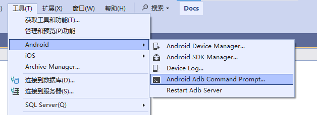
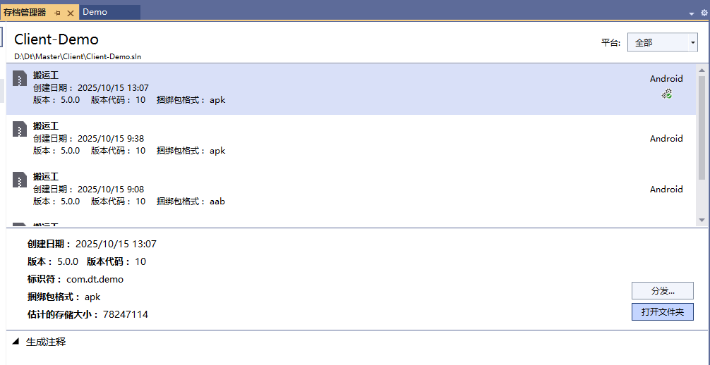
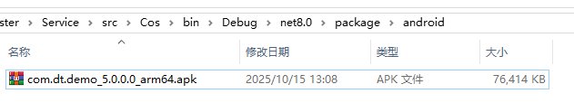
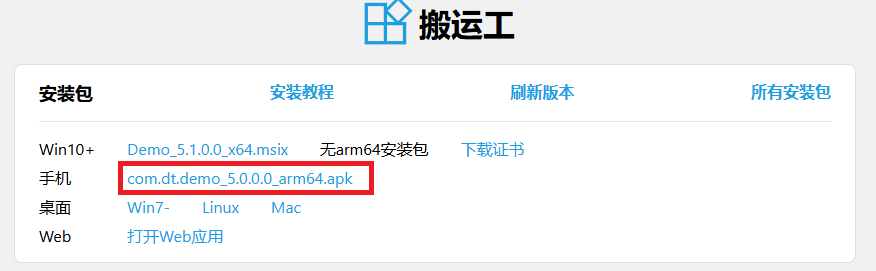

## 创建自签名证书

* 在 Visual Studio 中打开解决方案
* 工具 -> android -> android adb ...，如下图

* 输入命令

keytool -genkey -v -keystore app.keystore -alias key -keyalg RSA -keysize 2048 -validity 3650 -keypass 111111 -storepass 111111 -dname "CN=dt,C=CN,OU=dt"


* 在项目目录下生成 `app.keystore` 文件，记住口令 `111111`，有效期 3650 天

## 增加项目配置
在项目文件 `*.csproj` 中添加配置


	<PropertyGroup Condition="$(IsAndroid) AND '$(Configuration)' == 'Release'">
		<!-- 包格式apk，不生成aab -->
		<AndroidPackageFormat>apk</AndroidPackageFormat>
		<!-- apk支持的ABI架构，默认支持4种架构，减少支持ABI能缩小apk -->
		<RuntimeIdentifier>android-arm64</RuntimeIdentifier>
		<!--<RuntimeIdentifier>android-x64</RuntimeIdentifier>-->
		<!--<RuntimeIdentifiers>android-arm64;android-arm</RuntimeIdentifiers>-->
		<!-- 签名相关 -->
		<AndroidKeyStore>True</AndroidKeyStore>
		<AndroidSigningKeyStore>Platforms\Android\app.keystore</AndroidSigningKeyStore>
		<AndroidSigningKeyAlias>key</AndroidSigningKeyAlias>
		<AndroidSigningKeyPass>111111</AndroidSigningKeyPass>
		<AndroidSigningStorePass>111111</AndroidSigningStorePass>
	</PropertyGroup>


## 生成应用
1. 选择 Release
1. AndroidManifest.xml设置版本
1. 生成

## 发布
1. 项目右键选择“发布...”
1. 发布完成后“打开文件夹”

1. 文件夹内的`*.apk`文件是app安装包，将安装包复制到 `cm` 服务或单体服务的`package/android`目录下，按格式加上版本号和cpu架构，

1. 启动`cm` 服务或单体服务，浏览默认首页，如 `https://localhost:1234/`，查看安装包版本是否正确

1. 也可将其上传到应用商店或网站

1. 发布完毕