## 概念
Certificates（证书）
包括开发证书和发布证书等，开发证书就是真机调试所用到的证书Development，发布证书就是产品需要发布时候用到的证书Distribution。

Identifiers（认证）
最常用到的就是App IDs，要记住一点就是其中的Buddle ID要跟自己app中 Info.plist的CFBundleIdentifier一致。

Devices（设备）
这个是真机测试时添加的真机，添加时需要用到机器的UDID。

Provisioning Profiles （预置描述文件）
这是整个开发和发布过程的关键，只要app是在真机上运行，生成app时就需要预置描述文件。预置描述文件分为开发时和发布时两种。开发时的预置描述文件包含Development证书、App ID、Devices列表，发布时的预置描述文件包含Distribution证书和App ID。预置描述文件在app生成时通过App ID与Info.plist中的CFBundleIdentifier进行匹配。

Apple Store上架
将app放入Apple Store的过程叫上架，App首次上架过程是痛苦和漫长的，以下以App上架过程分别对各阶段进行详细描述，也可参见：
https://docs.microsoft.com/zh-cn/dotnet/maui/ios/deployment/overview 
https://docs.microsoft.com/zh-cn/dotnet/maui/ios/deployment/provision 

## Apple Developer

首先在apple开发者网站添加app的各种配置信息，打开https://developer.apple.com/account/，选择“Certificates, Identifiers & Profiles”，分别进行以下添加。

### 添加证书

包括Development证书和Distribution证书，这些证书一般通过xcode添加，因为生成证书的机器和开发机器是同一台时可以避免缺少私有密钥的错误，如：
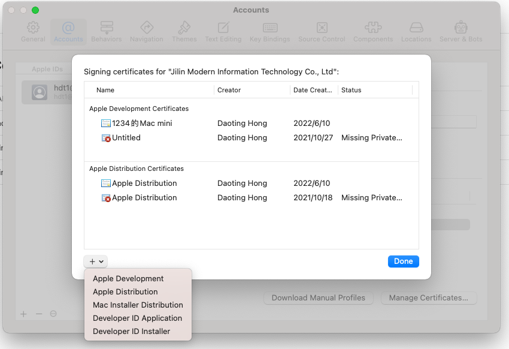

添加后的两类证书如下图
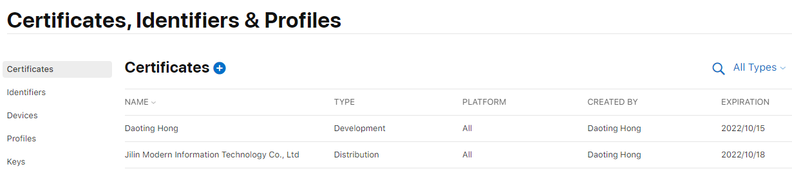

### 添加App ID
添加时 [选择类型App IDs] > [App] > [填写信息]如下，Bundle ID的命名规范形如com.dt.app，以com.dt.为前缀，后加app名称，所有字符必须小写，避免网上反映的因命名不规范造成的功能缺失，此处的Bundle Id和Info.plist文件中的CFBundleIdentifier必须一致。

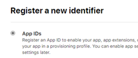

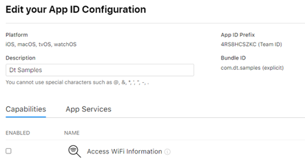

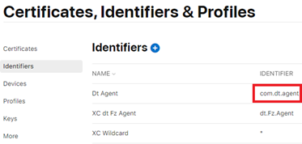

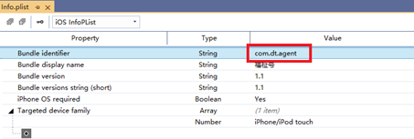

### 添加预置描述文件
只要app是在真机上运行，生成app时就需要预置描述文件。预置描述文件分为开发时和发布时两种，因此每个app需要生成两套预置描述文件：一个是development一个是Distribution。Development类型的预置描述文件除了选择Certificates, APP Id还可以选择测试的机器，配置文件的命名规范是Bundle ID去掉前面的“com.”，开发版需添加“.debug”后缀，如下图：

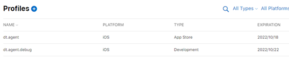

要注意的是每次对预置描述文件的某一项做出修改都要在mac上更新一次Provisioning Profiles文件，以确保在Xcode中可以得到最新的反馈。比如开发状态时需要添加了一个新的测试机器，要在Provisioning Profiles中选中对应的预置描述文件进行编辑，在Devices选项中勾选上刚添加的设备，然后在mac端重新预置描述文件点击安装即可。

最简单的安装预置描述文件的方法是在xcode中手动安装，如下图，此方法会安装该账户下的所有预置描述文件，文件的安装位置在：
~/Library/MobileDevice/Provisioning Profiles ，重复时可以手动清除。

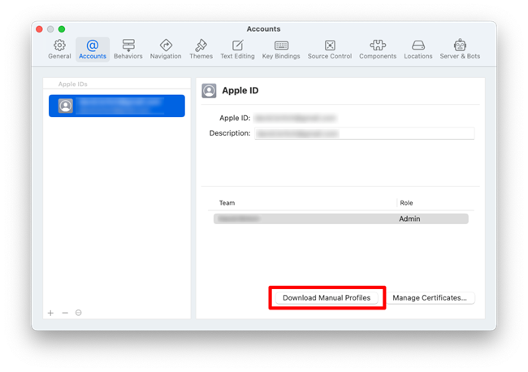

## App Store Connect
App Store Connect管理app上架信息，地址 https://appstoreconnect.apple.com/apps 。

### 添加app
新建 App，填写基本信息，此处的名称和Info.plist中的Bundle display name不同，Bundle display name是在用户屏幕上显示的“应用名称”，两者可以不同。

套装ID就是在Identifiers中配置的App ID，SKU作为自已使用的标识，可以随便填，一般去掉前缀”com.”即可。

### 新版本发布

## VS生成发布

### 准备
完成上述配置后在VS中将解决方案调整为Release、iPhone、远程设备，如下图：

预置描述文件在mac上安装后，需要在VS中进行设置，在iOS项目->属性中手动设置预置描述文件：

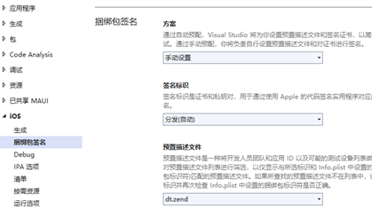

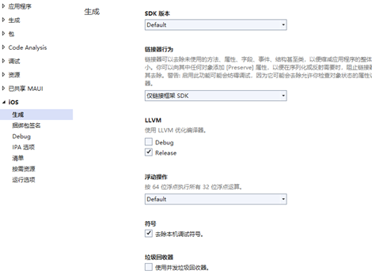

以下是发布时在iOS项目文件csproj中用到的参数配置，这些参数也可以在发布命令行中提供。

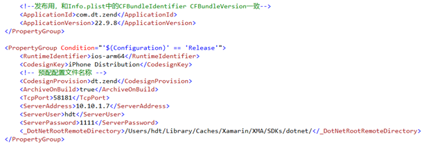

需要在iOS虚拟机上测试Release版时必须把Release条件的整个PropertyGroup删除，不然始终生成ios-arm64格式的dll，无法部署到虚拟机。

### 生成
生成前先确认Info.plist中的版本号是否正确，一定和iOS项目文件csproj中的相同，如下图：

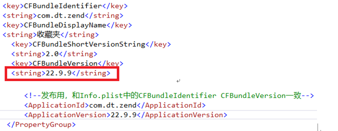

CFBundleShortVersionString是用来标识应用程序发布的版本号，FBundleVersion是一个发布或未发布的内部版本号，通常采用“年后两位.月.日”的命名方式。
确认无误后，开始生成或重新生成iOS项目，生成过程比较漫长。
因为VS采用ssh登录mac，初次生成时因login.keychain被锁定没有访问权限，会提示replacing existing signature 和 errSecInternalComponent的错误，如下图：

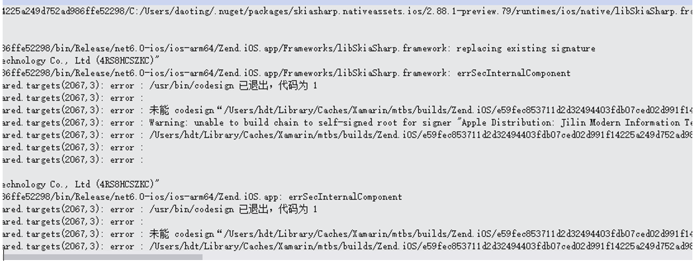

网上给出的方案大多是解锁钥匙链的命令：
在终端敲入 security unlock-keychain ${HOME}/Library/Keychains/login.keychain
实测时错误依旧，使用很多其它方法也没有解决。
最后的解决方案：在xcode创建新项目，Bundle ID和当前项目的相同，确保Release版的预置描述文件正确

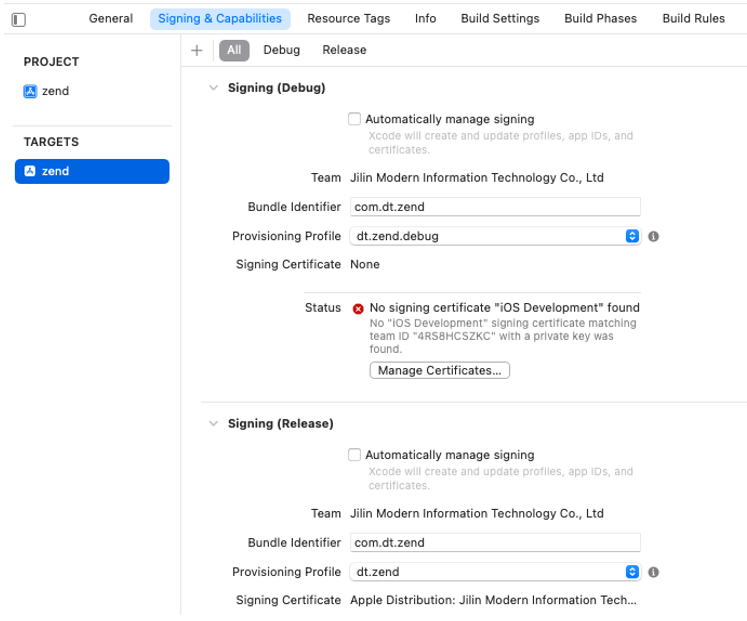

调整为Release模式

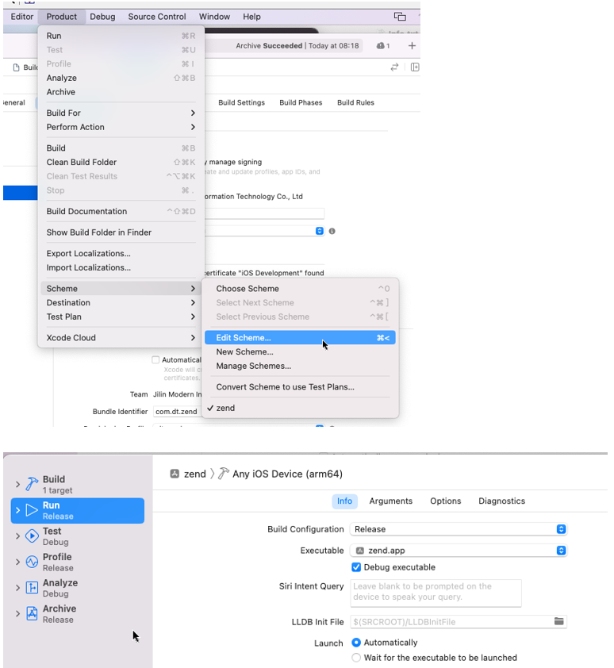

然后归档，归档成功后即可在VS中再次生成，生成成功后可进入发布。

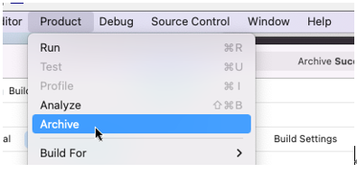

### 发布

## 存档分发

发布成功后，接下来需要在mac上进行分发，过程：打开xcode -> window -> organizer上选中要分发的Archive进行“Validate App”或”Distribute App”，一般直接”Distribute App”，如下图，”Distribute App”过程中经常因为网络连接问题上传失败，多试几次。

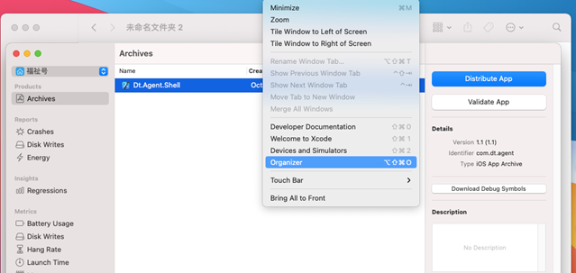

Apple Store 对ipa包内可执行文件的大小是有限制的，最初在Info.plist中MinimumOSVersion值为8.0，结果上传时总是报错，调整为10.0后上传正常，以下是包内可执行文件的大小限制：
iOS < 7.0，32位+64位最多为80MB；
iOS >= 7.0，32位和64位每个分区最多60MB；
iOS >= 9.0，总限制400MB；
ipa包内可执行文件是指：将你的ipa后缀更名为zip，解压之后形成Payload文件夹，之后查看.app后缀的包内容，从这堆文件中找到与你工程名相同的文件，这个文件就是可执行文件，如：

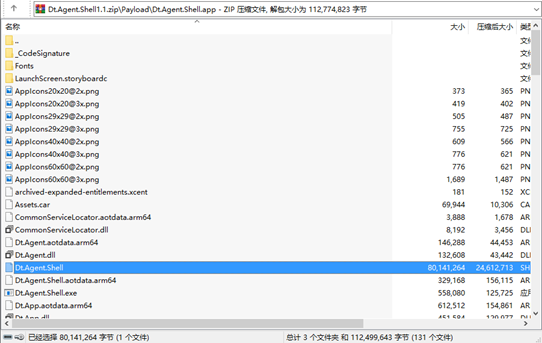

arm64 生成的包最小。

## TestFlight
“Distribute App”成功后，先进行内测确保各功能运行正常。在App Store Connect选择该App，点击TestFlight->管理，如下图：

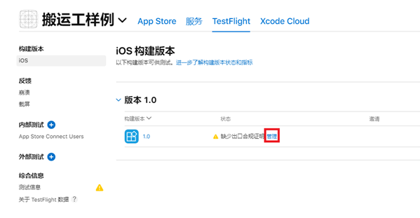

选择无加密->开始测试，然后选择左侧的“App Store Connect Users”，添加测试员，如图：

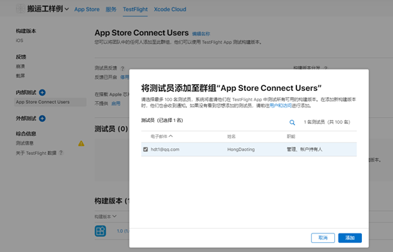

->到测试员邮箱点击“View in TestFlight”->显示测试邀请码如下图->确保测试员手机上安装TestFlight->启动TestFlight，点击”兑换”，输入兑换码->自动下载要测试的app

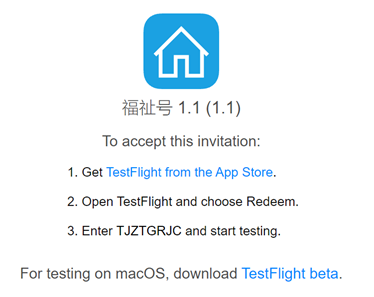

若测试未通过，循环执行：编码 –> 生成 -> 发布 -> 分发 -> 测试，每次只需修改内部版本号FBundleVersion，内部版本号采用“年后两位.月.日”的命名方式。

## 提交审核
测试通过后，在App Store Connect中完善app信息，提交app前选择一个构建版本，

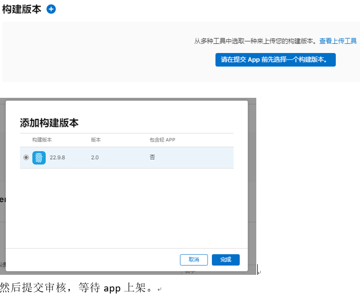

## 未缴费时
以下是未注册到开发人员之前的开发调试过程。
初次调试Dt.Shell.iOS时会遇到“在 iOS 上找不到 XXX的任何可用预配配置文件”的错误提示，虚拟机和真机都可能出现该错误提示，主要因为该应用未安装测试证书，需要在xcode中创建具有相同“绑定标识”的项目，并且保证在xcode中能正常运行。以下为xcode中未能创建测试证书的描述：

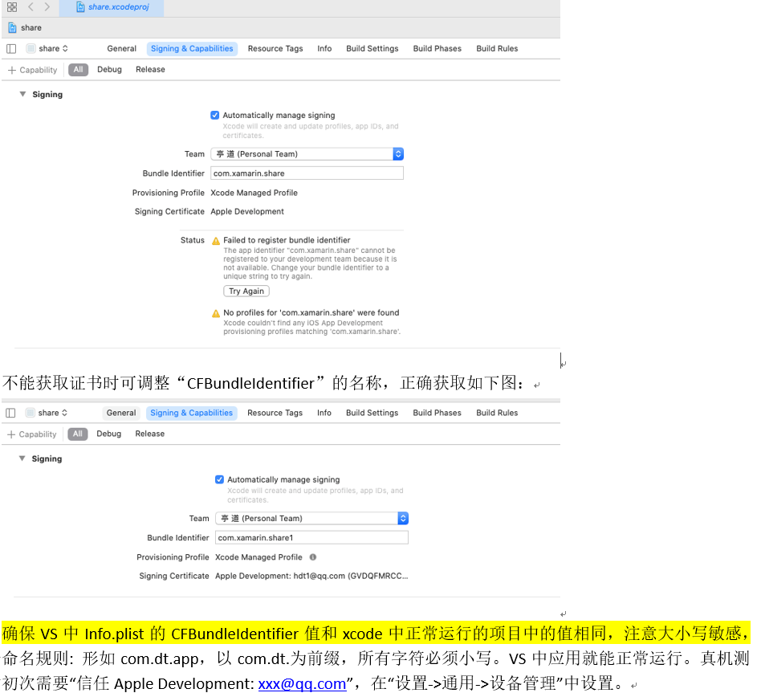

