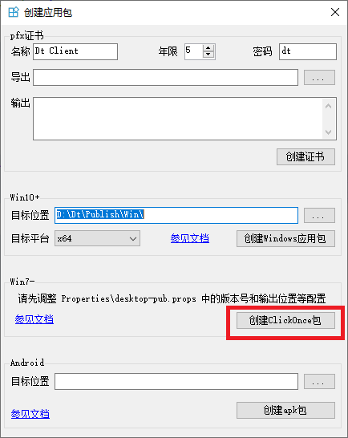
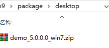
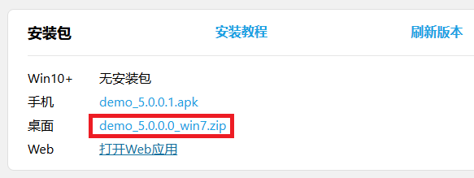

## 创建 ClickOnce 包

支持使用 ClickOnce 将桌面应用发布到 Windows 环境。

### 配置
发布时的配置如：

<Project>
	<PropertyGroup>
		<ApplicationVersion>5.0.0.*</ApplicationVersion>
		<PublishDir>D:\Dt\Publish\Desktop\</PublishDir>
		
		<ApplicationRevision>0</ApplicationRevision>
		<BootstrapperEnabled>True</BootstrapperEnabled>
		<Configuration>Release</Configuration>
		<CreateWebPageOnPublish>False</CreateWebPageOnPublish>
		<GenerateManifests>true</GenerateManifests>
		<Install>True</Install>
		<InstallFrom>Disk</InstallFrom>
		<IsRevisionIncremented>True</IsRevisionIncremented>
		<IsWebBootstrapper>False</IsWebBootstrapper>
		<MapFileExtensions>True</MapFileExtensions>
		<OpenBrowserOnPublish>False</OpenBrowserOnPublish>
		<Platform>x64</Platform>
		<PublishProtocol>ClickOnce</PublishProtocol>
		<PublishReadyToRun>False</PublishReadyToRun>
		<PublishSingleFile>False</PublishSingleFile>
		<RuntimeIdentifier>win-x64</RuntimeIdentifier>
		<SelfContained>True</SelfContained>
		<SignatureAlgorithm>(none)</SignatureAlgorithm>
		<SignManifests>False</SignManifests>
		<SkipPublishVerification>false</SkipPublishVerification>
		<TargetFramework>net9.0-desktop</TargetFramework>
		<UpdateEnabled>False</UpdateEnabled>
		<UpdateMode>Foreground</UpdateMode>
		<UpdateRequired>False</UpdateRequired>
		<WebPageFileName>Publish.html</WebPageFileName>
	</PropertyGroup>
	
	<ItemGroup>
		<!-- This section needs to be adjusted based on the target framework -->
		<BootstrapperPackage Include="Microsoft.NetCore.DesktopRuntime.8.0.x64">
			<Install>true</Install>
			<ProductName>.NET Desktop Runtime 8.0.10 (x64)</ProductName>
		</BootstrapperPackage>
	</ItemGroup>
</Project>


项目模板中将以上配置保存在 `Properties\desktop-pub.props` 文件，在项目文件`xxx.csproj`中导入该配置

<Project Sdk="Dt.Sdk">
	<PropertyGroup>
		<IsExe>true</IsExe>

		<!-- 主题颜色，无#前缀，logo图标、启动页背景色 -->
		<ThemeColor>1BA1E2</ThemeColor>

		<!-- WinAppSdk时和Package.appxmanifest模板生成AppxManifest.xml -->
		<ApplicationTitle>搬运工</ApplicationTitle>
		<ApplicationId>dt.Demo</ApplicationId>
		<ApplicationDisplayVersion>1.0</ApplicationDisplayVersion>
		<ApplicationVersion>1</ApplicationVersion>
		<ApplicationPublisher>Daoting</ApplicationPublisher>
		<Description>搬运工样例.</Description>
	</PropertyGroup>

	<!-- 发布时配置 -->
	<Import Project="Properties\win-pub.props" Condition="$(IsWinAppSdk) AND '$(Configuration)' == 'Release'" />
	<Import Project="Properties\android-pub.props" Condition="$(IsAndroid) AND '$(Configuration)' == 'Release'" />
	<Import Project="Properties\desktop-pub.props" Condition="$(IsDesktop) AND '$(Configuration)' == 'Release'" />
	
	<ItemGroup>
		<ProjectReference Include="..\Demo.Base\Demo.Base.csproj" />
		<ProjectReference Include="..\Demo.UI\Demo.UI.csproj" />
		<ProjectReference Include="..\Demo.Crud\Demo.Crud.csproj" />
		<ProjectReference Include="..\Demo.Lob\Demo.Lob.csproj" />
	</ItemGroup>
</Project>


### 生成
使用以下命令，可以自定义输出路径

msbuild /m /r /target:Publish /p:Configuration=Release /p:TargetFramework=net9.0-desktop


也可使用搬运工的VS扩展完成此过程

## 发布
找到应用程序包目录，将整个目录压缩成`.zip`包，并将zip包复制到 `cm` 服务或单体服务的`package/desktop`目录下

启动`cm` 服务或单体服务，浏览默认首页，如 `https://localhost:1234/`，查看安装包版本是否正确

发布完毕

## 安装
* 浏览服务的默认首页
* 点击`桌面`所在行的`.zip`链接，下载压缩包，解压并点击`setup.exe`安装
* 安装成功后会自动启动app
