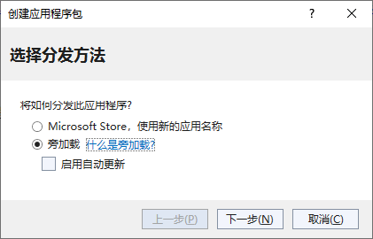
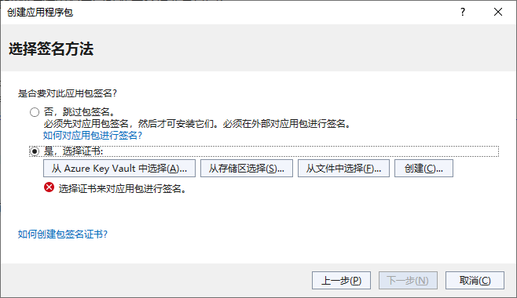
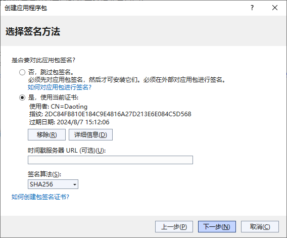
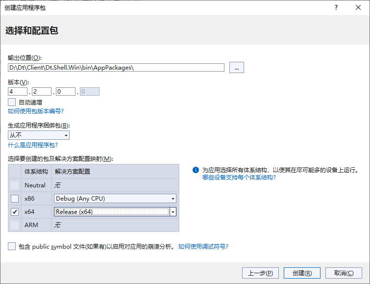
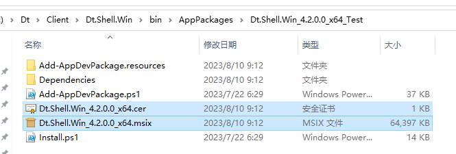
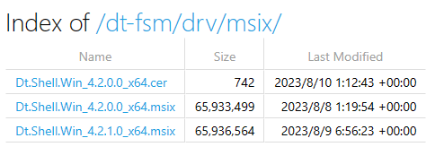
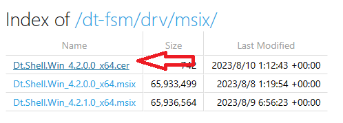
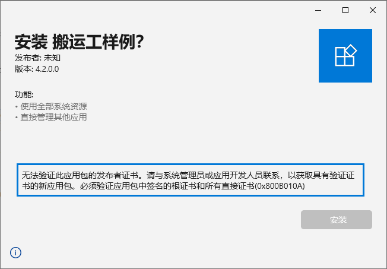
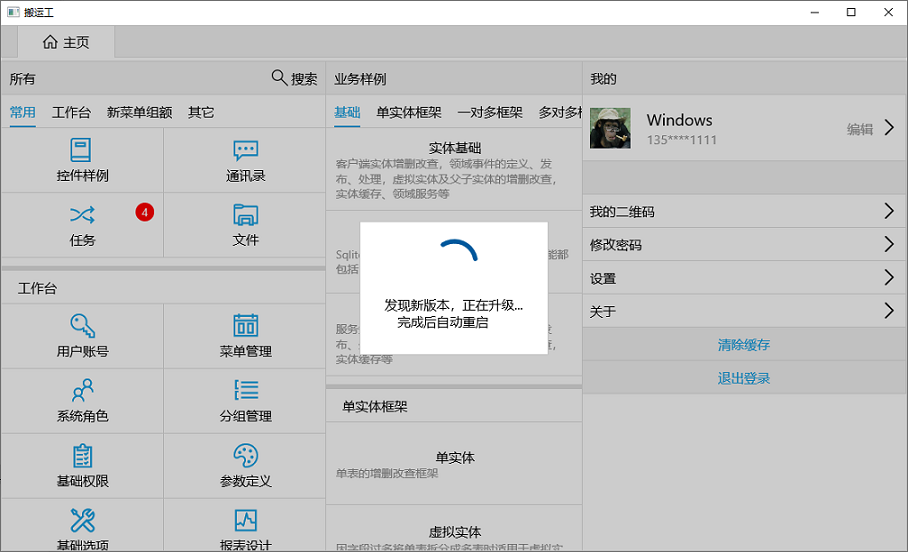

这里只介绍将win应用发布为旁加载的情况，发布到应用商店的请参考官方介绍。

旁加载应用是指来自非官方源的应用（如 Microsoft Store），打包发布时选择旁加载即可生成旁加载安装包。以下按照从打包、发布到用户安装、使用、自动升级的顺序进行介绍。

## 创建应用程序包
在VS中，项目右键 -> 打包和发布 ->  创建应用程序包

若无证书，点击`创建`证书，输入密码生成测试证书，有证书可选择证书文件

点击`下一步`，设置版本号和要生成包的体系结构，比如x64 arm64类型

点击`创建`，等待完成。

## 发布
找到应用程序包目录，将证书文件和安装包复制到 `fsm` 服务的`drive/msix`目录下

打开`fsm` 服务，浏览目录 `http://localhost/dt-fsm/drv/msix/`，查看文件目录是否正确

 打开`fsm` 服务的`etc/config/msix.confg`文件，该文件为待发布程序包的信息，修改版本号：
 
{
  "Version": "4.2.1.0",
  // 是否强制更新
  "ForceUpdate": false,
  // 文件名前缀
  "File": "Dt.Shell.Win"
}

发布完毕

## 安装
初次安装步骤：
* 打开`fsm` 服务，浏览 `http://localhost/dt-fsm/drv/msix/`目录
* 点击`.cer`文件下载， 然后将该证书导入到`在本地计算机`的`受信任的根证书颁发机构`

* 下载`.msix`文件，然后双击安装，若未安装证书，会出现以下提醒

初次安装总结为：`导入安全证书、安装应用。`

完成初次安装后，版本升级时会自动进行，不需人工参与。

## 升级
App每次启动时都会检查是否有新版本程序包，若有，会根据配置提醒用户更新

{
  "Version": "4.2.1.0",
  // 是否强制更新
  "ForceUpdate": false,
  // 文件名前缀
  "File": "Dt.Shell.Win"
}

当 `ForceUpdate` 为 `false` 时，App显示升级提醒，由用户选择是否更新

为 `true` 时，直接自动升级，升级完成后自动重启应用

**即使升级过程中手动关闭应用，也会在后台自动完成升级过程！**