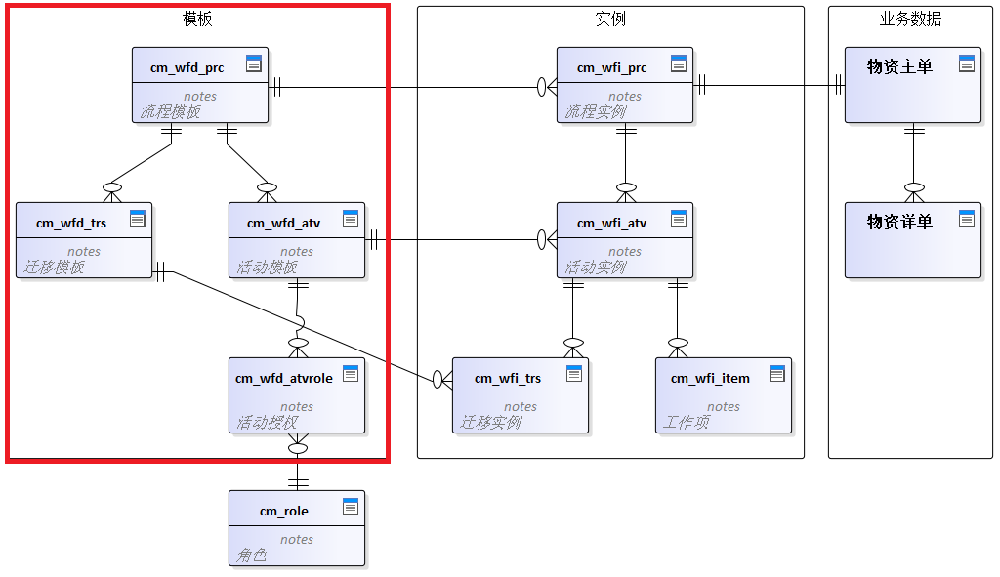
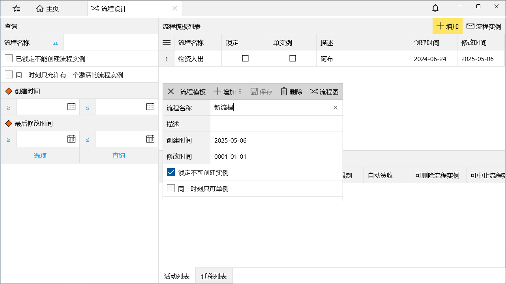
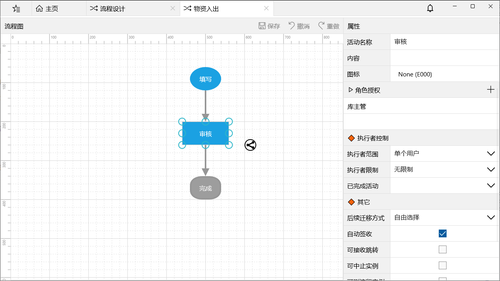

红框区域的模板部分在流程设计中用到。

## 创建流程模板
打开主页菜单 -> 工作台 -> 流程设计，点击“增加”流程模板。

流程名称不可重复，点击“流程图”或双击流程后进入流程模板设计界面。

## 流程模板设计
流程模板是最基础的工作流模型元素，它包含了解释、执行一个流程的全部模型信息。包括：
- 流程的开始、结束条件；
- 组成流程的活动；
- 在活动间迁移的规则；
- 调用的角色、实体模型；
- 以及相关数据、逻辑的定义等。

