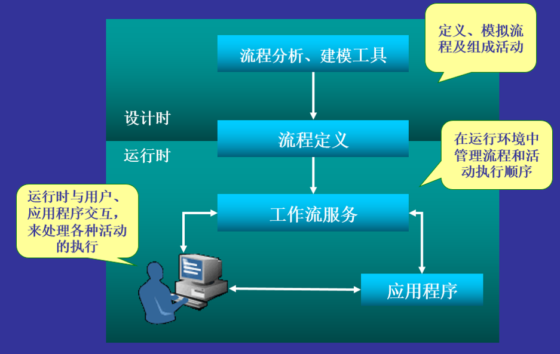
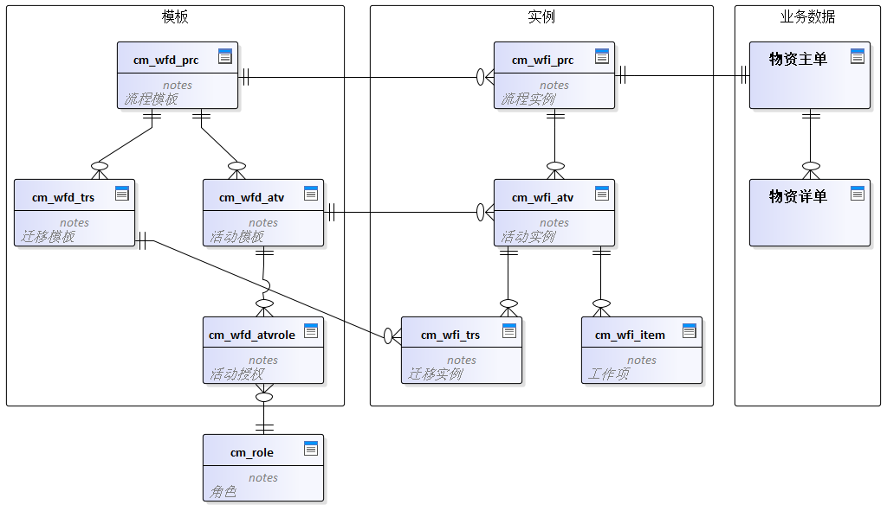

信息系统中许多基础性、关键性数据的产生并非简单的录入，而是需要经过多部门、多人协同处理，并且对流转过程进行管理、控制，才能作为合法信息进入系统。

工作流系统是搬运工平台的子系统。设计目标是能够针对企业复杂易变的需求敏捷的构建和维护流程模型，并为个性化应用的二次开发提供完备的基础设施和服务支持，从而最大程度的提高应用系统的实施效率。工作流系统由流程模板设计、流程实例管理、面向普通用户的任务管理等部分组成。


工作流系统不是万能的，对于业务复杂、个性化要求高、流程固定的功能建议使用传统模式开发，对于多部门协作、审批性质的、流程变动频繁的建议使用工作流系统。


## 名词解释
- 工作流：将一组任务组织起来完成业务过程。在工作流中定义任务的触发顺序和触发条件，每个任务可以由一个或一组用户完成，也可以由用户和软件系统协作完成。并且可以基于工作流对任务的触发、任务的同步和信息流的传递进行管理。

- 工作流系统：支持业务过程高效执行，并能监控执行过程的软件系统。

- 流程模板：流程模板反映了业务过程的目的和目标，包含流程名称、启用时间、优先级等工作流系统用于解释执行流程的全部模型信息。

- 活动模板：流程由一系列活动组成，活动模板是描述流程运转的最小单元。活动模板的主要属性包括活动名称、类型、调度参数、完成条件等，反映了业务过程中的步骤和操作。

- 迁移模板：迁移模板反映了业务过程的执行路由和执行条件，表示两个活动模板间的迁移顺序关系，分为常规迁移和回退迁移。

- 工作流实例：在流程运行时，模型元素被实例化，包括流程实例、活动实例和迁移实例。

- 工作项：用来标志流程运行中的用户交互，每个活动实例在被激活时，由工作流系统分配工作项。

- 执行者：指实际对活动实例进行处理的用户集合。

## 数据结构

- 模板：工作流系统的核心部分，主要包括流程模板`cm_wfd_prc`、活动模板`cm_wfd_atv`、迁移模板`cm_wfd_trs`等表结构，它们共同定义了一个完整的工作流模型。
- 实例：流程运行时，模型元素被实例化，包括流程实例`cm_wfi_prc`、活动实例`cm_wfi_atv`、迁移实例`cm_wfi_trs`、工作项`cm_wfi_item`等数据结构。
- 业务数据：流程从开始到结束，经过多部门、多人协同处理，并且对流转过程进行管理、控制，最终得到的业务数据。


为了避免流程实例和业务数据之间的耦合，采取完全解耦方式存储，流程实例和主业务数据之间隐含`一对一关系`，**流程实例id和主业务数据id相同**，提高系统的灵活性和可维护性，当然也限制了业务数据主键的数据类型。


