##	日志
日志是程序运行的黑匣子，记录运行过程中的错误、异常、调试输出、详细输出等信息，这些日志信息可以输出到控制台、VS输出窗口、文件或数据库中，帮助分析处理程序中的问题。

搬运工服务端和客户端都采用第三方开源日志`Serilog`，主要因为`Serilog`比较成熟、使用方便、第三方插件多等原因，比如第三方插件支持输出到`Console、Debug、File`和常见数据库，支持`xml、json`格式等。

### 创建日志
`Serilog`使用上非常方便，内置的静态类`Log`能完成大部分功能。`Serilog`中将日志分为六个等级：Verbose(冗余详细级)、Debug(内部调试级)、Information(普通信息级)、Warning(警告级)、Error(错误级)、Fatal(崩溃级)， `Log`类根据日志级别的不同提供对应的静态方法，如：`Log.Information(...), Log.Warning(...), Log.Error(...)`等，每个等级的静态方法都提供多种参数选择。

程序中需要记录日志的地方只需考虑日志级别和日志内容，不用顾及输出方式，**日志中含动态属性时尽可能使用消息模板的方式**，内部会对消息模板hash处理，节省资源、方便过滤等，如：

// 推荐
Log.Debug("PhoneUI模式：{Mode}，操作系统：{OS}", Kit.IsPhoneUI, Kit.HostOS);

// 不推荐
Log.Debug($"PhoneUI模式：{Kit.IsPhoneUI}，操作系统：{Kit.HostOS}");


除消息模板中的动态属性外，日志还可以包含附加属性，主要用来识别相关日志集合，附加属性按照作用域分为两类：

* 全局附加属性，在所有日志项上都添加的属性，通常在创建Logger时指定，基本不使用

Log.Logger = new LoggerConfiguration()
    .Enrich.WithProperty("Prop1", "Demo")
    .CreateLogger();


* 上下文附加属性，一般根据附加属性识别某类日志，注意每个ForContext都返回全新的Logger，主要有以下三种用法如：

// log输出的日志都包含两个附加属性
var log = Log.ForContext("IsPhoneUI", Kit.IsPhoneUI)
                .ForContext("OS", Kit.HostOS);
log.Debug("信息1");
log.Information("信息2");

// SourceContext：Dt.UIDemo.LogDemo
Log.ForContext<LogDemo>()
    .Error(new Exception("异常信息内容"), "出错信息内容");


### 日志设置
日志的最终目的是帮助分析处理程序中的问题，不同的问题需要通过日志设置控制输出级别、输出目标来帮助分析问题原因，因此日志设置也是重要环节。`Serilog`中可以在初始化时设置日志的最小输出级别、指定输出目标（如`Console Debug File Db`）。以下介绍服务端和客户端设置日志输出级别、输出目标的方法：

#### 服务端
输出级别既可以程序控制，也可以使用`json`文件控制，服务端使用`etc/config/logger.json`文件作为输出配置，支持运行时动态修改文件，输出目标为`html`和`文件`。

{
  "Serilog": {
    "Using":  ["Serilog.Sinks.Console"],
    "MinimumLevel": {
      "Default": "Debug",
      "Override": {
        "Microsoft": "Warning"
      }
    }
  }
}


内部日志初始化如下：

// 支持动态调整
var cfg = new ConfigurationBuilder()
    .SetBasePath(Path.Combine(AppContext.BaseDirectory, "etc/config"))
    .AddJsonFile("logger.json", false, true)
    .Build();

// 日志文件命名：
// 服务名-服务实例ID-日期.txt，避免部署在k8s挂载宿主目录时文件名重复
string svc = Kit.Stubs.Length == 1 ? Kit.Stubs[0].SvcName : "app";
string path = Path.Combine(AppContext.BaseDirectory, "etc/log", $"{svc}-{Kit.SvcID}-.txt");
Log.Logger = new LoggerConfiguration()
    .ReadFrom.Configuration(cfg)
    .WriteTo.Html()
    // 输出json文件，默认最大1G、最多保存31个文件、实时写、文件独占方式
    .WriteTo.File(
        new CompactJsonFormatter(),
        path,
        rollingInterval: RollingInterval.Day, // 文件名末尾加日期
        rollOnFileSizeLimit: true) // 超过1G时新文件名末尾加序号
    .CreateLogger();


日志事件的内容记录在`LogEvent`对象，包含：事件发生时的时间戳`[timestamp]`、描述何时应该捕获事件的级别`[level]`、记录事件的消息`[message]内容]`、描述事件的命名属性`[properties]`、还可能有一个`Exception`对象，本质上日志事件由消息模板+属性字典组成。

#### 客户端
客户端使用实现`ILogSetting`接口的服务控制日志输出级别和输出目标，在`AppStub`的`ConfigureServices`方法注入日志设置服务：

    public class AppStub : DefaultStub
    {
        public AppStub()
        {
            Title = "搬运工";
        }

        /// 

        /// 注入全局服务
        /// 

        /// <param name="p_svcs"></param>
        protected override void ConfigureServices(IServiceCollection p_svcs)
        {
            base.ConfigureServices(p_svcs);
            p_svcs.AddSingleton<IRpcConfig, RpcConfig>();
            p_svcs.AddTransient<IBackgroundJob, BackgroundJob>();
            p_svcs.AddTransient<IReceiveShare, ReceiveShare>();
            p_svcs.AddSingleton<ILogSetting, LogSetting>();
            //p_svcs.AddTransient<ITheme, CustomTheme>();
        }



日志设置服务样例

    class LogSetting : ILogSetting
    {
        /// 

        /// 是否将日志输出到Console
        /// 

        public bool ConsoleEnabled => true;

        /// 

        /// 是否将日志保存到文件
        /// 

        public bool FileEnabled => true;

        /// 

        /// 是否将日志输出到Trace
        /// 

        public bool TraceEnabled => true;

        /// 

        /// 日志输出级别
        /// 

        public LogEventLevel LogLevel => LogEventLevel.Debug;
    }


外部`AppStub`中不注入日志设置服务时，将采用内部默认设置

    class LogSetting : ILogSetting
    {
        /// 

        /// 是否将日志输出到Console，默认true
        /// 

        public bool ConsoleEnabled => true;

        /// 

        /// 是否将日志保存到文件，默认false
        /// 

        public bool FileEnabled => false;

        /// 

        /// 是否将日志输出到Trace，默认true
        /// 

        public bool TraceEnabled => true;

        /// 

        /// 日志输出级别，默认Debug
        /// 

        public LogEventLevel LogLevel => LogEventLevel.Debug;
    }


### 查看日志
日志的最终目的是帮助分析处理程序中的问题，以下介绍服务端和客户端如何查看日志内容：

#### 服务端
`Serilog`支持外部接收器(`sink`)处理日志事件，可以把日志输出到自定义的任意目标，搬运工参照第三方插件`Serilog.Sinks.Console`实现了输出为`html`的功能，方便通过web页远程监视日志输出，可以通过[.admin](http://localhost/dt-cm/.admin)页面查看日志：

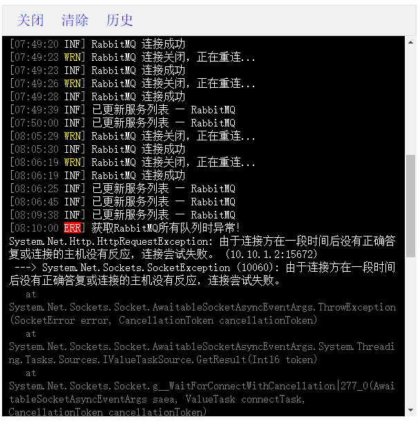

#### 客户端
Serilog支持外部接收器(sink)处理日志事件，可以把日志输出到自定义的任意目标，客户端实现了输出到Trace的功能，方便在App运行过程中监视日志输出，可通过以下方式调出系统日志：
* “主页”右键 -> 系统日志

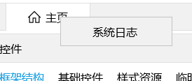

* 快捷键 Alt + ←
* PhoneUI模式，长按标题文字 -> 系统日志

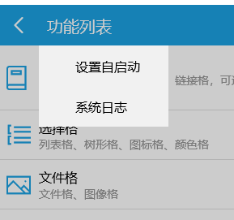

输出到Trace显示的系统日志：

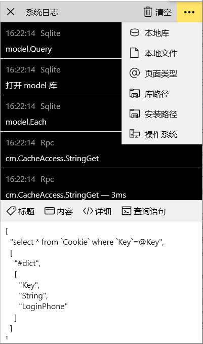

## 异常
异常是系统无法避免的，异常时会中断当前执行，按由内到外的回溯顺序跳入异常处理代码段，当外层程序都无异常处理时，会跳入.net统一的异常处理程序，.net再以事件方式通知程序有未处理异常，事件参数中可以指定未处理异常是否已修复，开发中合理利用异常能带来很多方便性。

### 利用异常
静态类`Throw`就是巧妙利用异常来中断当前执行，避免代码中过度复杂的条件判断和返回操作，在业务开发时尤其方便，比如在`Entity`的各种回调中使用`Throw`直接中断并给出提示信息：

protected override void InitHook()
{
    OnSaving(async () =>
    {
        if (_cells["不重复"].IsChanged)
        {
            int cnt = await AtSvc.GetScalar<int>($"select count(1) from demo_基础 where 不重复='{不重复}' and ID!={ID}");
            if (cnt > 0 )
            {
                Throw.Msg("[不重复]列存在重复值！");
            }
        }

        if (禁止保存)
        {
            Throw.Msg("已选中[禁止保存]，保存前校验不通过！");
        }

        if (_cells["值变事件"].IsChanged)
        {
            AddEvent(new 值变Event
            {
                OriginalVal = _cells["值变事件"].GetOriginalVal<string>(),
                NewVal = 值变事件,
            });
        }
    });

    OnDeleting(() =>
    {
        if (禁止删除)
        {
            Throw.Msg("已选中[禁止删除]，删除前校验不通过！");
        }
        return Task.CompletedTask;
    });

    OnChanging<string>(nameof(限长4), v =>
    {
        Throw.If(v.Length > 4, "超出最大长度4");
    });

    OnChanging<bool>(nameof(禁止选中), v =>
    {
        Throw.If(v, "[禁止选中]列无法选中");
    });
}


### Throw 类
`Throw`类在客户端和服务端都支持，其功能实现可谓一波三折，直到`.net7.0 maui + WinAppSdk V1.2`才算实现，虽然还是曲线救国：

`.net7.0 maui`抛异常规律：
* UI主线程同步方法中抛异常被.net内部拦截处理，不触发未处理异常事件
* UI主线程异步方法中抛异常，触发未处理异常事件
* Task内部异常，不管同步或异步都不触发未处理异常事件
* 因为触发未处理异常事件的不确定性，要想统一提供警告提示信息，只能在抛出`KnownException`异常前显示

`WinAppSdk V1.2` 都能触发未处理异常事件，已完美解决崩溃问题


总的来说，到目前为止，所有平台都不会因为异常而崩溃，对于maui上的非`KnownException`类型异常，在UI同步方法或后台抛出时无法给出警告提示！

详细过程参见[全局未处理异常事件](https://github.com/Daoting/dt/issues/1)


`Throw`类使用比较频繁，包括以下成员：

    /// 

    /// 抛出异常
    /// 

    [DebuggerStepThrough]
    public static class Throw
    {
        /// 

        /// 条件true时抛出异常，业务处理异常请指定异常消息，未指定异常消息时只抛出异常位置辅助判断
        /// 

        /// <param name="p_assert">true时抛出异常</param>
        /// <param name="p_msg">异常消息</param>
        public static void If(bool p_assert, string p_msg = null)

        /// 

        /// 参数为null时抛出异常，业务处理异常请指定异常消息，未指定异常消息时只抛出异常位置辅助判断
        /// 

        /// <typeparam name="T"></typeparam>
        /// <param name="p_value">待判断对象</param>
        /// <param name="p_msg">异常消息</param>
        public static void IfNull<T>(T p_value, string p_msg = null)

        /// 

        /// 字符串为 null、空、只空格 时抛出异常，业务处理异常请指定异常消息，未指定异常消息时只抛出异常位置辅助判断
        /// 

        /// <param name="p_value">待判断串</param>
        /// <param name="p_msg">异常消息</param>
        public static void IfEmpty(string p_value, string p_msg = null)

        /// 

        /// 直接抛出异常，业务处理异常请指定异常消息，未指定异常消息时只抛出异常位置辅助判断
        /// 

        /// <param name="p_msg">异常消息</param>
        public static void Msg(string p_msg)

        /// 

        /// 直接抛出异常，业务处理异常请指定异常消息，未指定异常消息时只抛出异常位置辅助判断
        /// <para>.net7.0 maui抛异常规律：</para>
        /// <para>1. UI主线程同步方法中抛异常被.net内部拦截处理，不触发未处理异常事件</para>
        /// <para>2. UI主线程异步方法中抛异常，触发未处理异常事件</para>
        /// <para>3. Task内部异常，不管同步或异步都不触发未处理异常事件</para>
        /// <para>因为触发未处理异常事件的不确定性，要想统一提供警告提示信息，只能在抛出KnownException异常前显示</para>
        /// <para></para>
        /// <para>WinAppSdk V1.2 都能触发未处理异常事件，已完美解决崩溃问题</para>
        /// <para></para>
        /// <para>总结：所有平台都不会因为异常而崩溃，对于maui上的非KnownException类型异常，在UI同步方法或后台抛出时无法给出警告提示！</para>
        /// 

        /// <param name="p_msg">异常消息</param>
        static void ThrowMsg(string p_msg)
        {
            if (string.IsNullOrEmpty(p_msg))
            {
                // 获取调用堆栈信息
                var st = new StackTrace();
                if (st.FrameCount > 2)
                {
                    var method = st.GetFrame(2).GetMethod();
                    p_msg = $"异常位置：{method.DeclaringType.Name}.{method.Name} -> Throw.{st.GetFrame(1).GetMethod().Name}";
                }
                else
                {
                    p_msg = "异常位置未知";
                }

                // 未指定异常消息时按错误输出到日志
                Log.Error(p_msg);
            }

#if !SERVER
            Kit.Warn(p_msg);
#endif
            throw new KnownException(p_msg);
        }
    }


通过以上代码看到客户端和服务端共用`KnownException`类型，`KnownException`类型的异常主要有两个作用：
1. 中断当前操作；
2. 向用户提示异常信息；

该类型的异常一般通过调用`Throw`的静态方法产生，作为业务处理警告或出错位置警告，使用场景较多，如判断方法参数、业务逻辑判断等，**该类型异常信息不记录日志，在客户端以警告提示框显示**。

对于其他类型的异常，会将异常详细信息记录到日志，在客户端显示简短错误提示，可在监视窗口或日志中查看详细内容。如下图，带"⚡"前缀表示服务器返回的异常

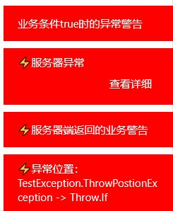


业务开发时注意抛出异常的位置，异常中断会造成资源的无法释放，一般很少碰到，服务器端抛异常时对关闭数据库连接、事务回滚已由系统统一处理。


### 全局未处理异常
对于全局未处理异常事件的附加，有兴趣的可参见[Kit-Init](https://github.com/Daoting/dt/blob/master/Client/Dt.Core/Kit/Kit-Init.cs#L109) 。

客户端对全局未处理异常的处理如下：

        static void OnUnhandledException(Exception p_ex)
        {
            try
            {
                // 不处理已知异常，已在抛出异常前警告(Throw类)，不输出日志
                if (!(p_ex is KnownException) && !(p_ex.InnerException is KnownException))
                {
                    string title;
                    if (p_ex is ServerException se)
                    {
                        title = se.Title;
                    }
                    else
                    {
                        title = $"未处理异常：{p_ex.GetType().FullName}";
                    }

                    // 警告、保存日志
                    var notify = new NotifyInfo
                    {
                        NotifyType = NotifyType.Warning,
                        Message = title,
                        Delay = 5,
                        Link = "查看详细",
                    };
                    notify.LinkCallback = (e) =>
                    {
                        ShowTraceBox();
                        notify.Close();
                    };
                    Notify(notify);

                    // ServerException日志已输出
                    if (p_ex is not ServerException)
                        Log.Error(p_ex, title);
                }
            }
            catch { }
        }


因客户端涉及多个平台，每个平台对未处理异常的处理方式不同：
* win可以通过`Application.UnhandledException`事件，效果满意；
* android通过`AndroidEnvironment.UnhandledExceptionRaiser`事件，但在调试时碰到异常都会终止，非调试状态能按流程运行；
* iOS未找到可行的处理方法，目前需要在Main函数中延用xamarin中 RunLoop 的方法处理，并且附加`ObjCRuntime.Runtime.MarshalManagedException`、`AppDomain.CurrentDomain.UnhandledException`事件，运行正常；
* wasm可以通过`AppDomain.CurrentDomain.UnhandledException`事件，效果满意；

以下流程图是客户端本地产生异常时的处理过程：
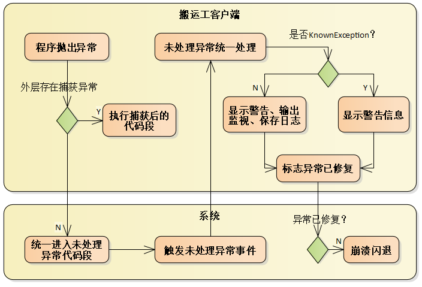

客户端调用服务端`Api`时，在服务端产生异常时的处理流程如下图所示：
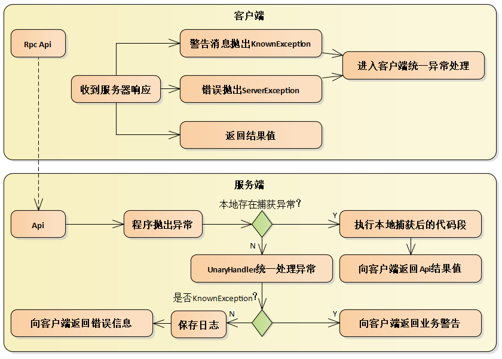

因此客户端调用`Api`代理方法时，**不需要处理业务警告和调用出错的情况**，已抛出异常由系统统一处理。


## Table操作
Table类是系统的数据集合类，扮演非常重要的角色，详细参见[从Row到Entity](/dt-docs/docs/2基础/3领域层/#从row到entity)

### 创建Table
有以下几种方式创建Table

* 手动构造Table，创建时直接给出列结构，string 类型可以省略，推荐使用初始化器的简单写法：

Table tbl = new Table
{
    { "id" },
    { "bh", typeof(int) },
    { "chushengrq", typeof(DateTime) },
    { "hunfou", typeof(bool) },
    { "shengao", typeof(double) },
    { "bumen", typeof(Gender) },
};


* 由实体类型创建，实体支持远程和本地sqlite

var tbl = await Table<CookieX>.Create();

tbl = await Table<MenuX>.Create();


* 复制表结构，**不复制数据**

Table src = CreateTable();
Table tbl = Table.Create(src);


* 复制行结构，**不复制数据**

Table src = CreateTable();
Row row = src.NewRow();
Table tbl = Table.Create(row);


* 复制实体结构，实体支持远程和本地sqlite

var cookie = new CookieX("test");
Table tblLocal = Table.Create(cookie);

var menu = new MenuX(1, "名称");
Table tbl = Table.Create(menu);


* 增删列

tbl.Columns.Add(new Column("name"));

tbl.Columns.RemoveAt(tbl.Columns.Count - 1);


### Row操作

* 创建新行

// 创建空行
var row = tbl.AddRow();

// 创建初始值新行
var row = tbl.AddRow(new
{
    id = "abc",
    bh = 110,
    chushengrq = DateTime.Now,
    hunfou = true,
    shengao = 1.80,
    bumen = Gender.女
});

// 创建独立行，未添加到当前Table
var row = tbl.NewRow(new { id = "123" });


* 克隆行，深度克隆行对象，返回同类型的独立行

var row = tbl.AddRow(new
{
    id = "abc",
    bh = 110,
});

var clone = row.Clone();


* 删除行

tbl.RemoveAt(tbl.Count - 1);

tbl.Remove(row);

tbl.Clear();


* 记录增删改数据行，

var tbl = await CrudX.Query("where true limit 4");
if (tbl.Count > 1)
{
    // 开始记录被删除的行，IsAdded为true的行不参加，当被删除的行重新添加时移除记录
    tbl.RecordDeleted();
    // 删
    tbl.RemoveAt(0);
    // 更
    tbl[0].Name = "批增更删" + _rnd.Next(1000);
}
// 增
tbl.Add(await CrudX.New("批增更删" + _rnd.Next(1000)));
await tbl.Save();


* 设置行内的Cell值

// 根据列名
row["name"] = "新名称";

// 根据索引
row[2] = 21;

// 设置单元格默认值，恢复单元格IsChanged=false状态
row.InitVal("name", "新名称");


* 获取行内Cell值

var v = row["name"];
var iv = row[0];

var str = row.Str("name");
var b = row.Bool(3);
...


* 独立行增加Cell

row.AddCell("ext1", "默认值");


## 缓存
为了更有效的利用机器资源，平台在服务端和客户端都使用了缓存，**总体原则是榨取客户端、节约服务器**，按照使用场景可分为四种缓存方法。

### 全局缓存
服务端全局缓存使用redis内存数据库，以`key-value`形式存储要缓存的内容，所有服务都可访问，使用常见的过期策略，[Entity的缓存](/dt-docs/docs/2基础/3领域层/#实体缓存)就是全局缓存。

key只能为字符串类型，value的数据类型有5种：`String、list、hash、set、sorted set`。系统以value数据类型作为区别，提供5个类实现不类型的相关操作：`StringCache、ListCache、HashCache、SetCache、SortedSetCache`，同时在Kit中提供更加方便使用的静态方法，适合于单独一次读写操作，相关操作包括：

/// 

/// Redis缓存方法
/// 

public partial class Kit
{
    /// 

    /// 根据键查询字符串类型的缓存值
    /// 

    /// <typeparam name="T">缓存类型</typeparam>
    /// <param name="p_keyPrefix">缓存键前缀，非空</param>
    /// <param name="p_key">不带前缀的键，非null时完整键形如"prefix:key"，null时前缀作为完整键</param>
    /// <returns>缓存对象</returns>
    public static Task<T> StringGet<T>(string p_keyPrefix, object p_key = null)

    /// 

    /// 将对象ToString添加到缓存
    /// 

    /// <typeparam name="T">缓存类型</typeparam>
    /// <param name="p_keyPrefix">缓存键前缀，非空</param>
    /// <param name="p_key">不带前缀的键，非null时完整键形如"prefix:key"，null时前缀作为完整键</param>
    /// <param name="p_value">待缓存对象</param>
    /// <param name="p_expiry">过期时间</param>
    /// <returns></returns>
    public static Task StringSet<T>(string p_keyPrefix, object p_key, T p_value, TimeSpan? p_expiry = null)

    /// 

    /// 按键名批量查询缓存对象
    /// 

    /// <typeparam name="T">缓存类型</typeparam>
    /// <param name="p_keyPrefix">缓存键前缀，非空</param>
    /// <param name="p_keys">不带前缀的键名列表</param>
    /// <returns>缓存对象列表</returns>
    public static Task<List<T>> StringBatchGet<T>(string p_keyPrefix, IEnumerable<object> p_keys)

    /// 

    /// 计数增加1
    /// 

    /// <param name="p_keyPrefix">缓存键前缀，非空</param>
    /// <param name="p_key">不带前缀的键，非null时完整键形如"prefix:key"，null时前缀作为完整键</param>
    /// <returns>返回加1后的值</returns>
    public static Task<long> StringIncrement(string p_keyPrefix, object p_key = null)

    /// 

    /// 计数减1
    /// 

    /// <param name="p_keyPrefix">缓存键前缀，非空</param>
    /// <param name="p_key">不带前缀的键，非null时完整键形如"prefix:key"，null时前缀作为完整键</param>
    /// <param name="p_min">最小值</param>
    /// <returns>返回减1后的值</returns>
    public static Task<long> StringDecrement(string p_keyPrefix, object p_key = null, int p_min = 0)

    /// 

    /// 根据键查询缓存对象
    /// 

    /// <typeparam name="T">缓存类型</typeparam>
    /// <param name="p_keyPrefix">缓存键前缀，非空</param>
    /// <param name="p_key">不带前缀的键，非null时完整键形如"prefix:key"，null时前缀作为完整键</param>
    /// <returns>缓存对象</returns>
    public static Task<T> HashGet<T>(string p_keyPrefix, object p_key = null)

    /// 

    /// 将对象添加到缓存
    /// 

    /// <typeparam name="T">缓存类型</typeparam>
    /// <param name="p_keyPrefix">缓存键前缀，非空</param>
    /// <param name="p_key">不带前缀的键，非null时完整键形如"prefix:key"，null时前缀作为完整键</param>
    /// <param name="p_value">待缓存对象</param>
    /// <param name="p_expiry">过期时间</param>
    /// <returns></returns>
    public static Task HashSet<T>(string p_keyPrefix, object p_key, T p_value, TimeSpan? p_expiry = null)

    /// 

    /// 按键名批量查询缓存对象
    /// 

    /// <typeparam name="T">缓存类型</typeparam>
    /// <param name="p_keyPrefix">缓存键前缀，非空</param>
    /// <param name="p_keys">不带前缀的键名列表</param>
    /// <returns>缓存对象列表</returns>
    public static Task<List<T>> HashBatchGet<T>(string p_keyPrefix, IEnumerable<object> p_keys)

    /// 

    /// 获取指定键名的hash中field对应的value
    /// 

    /// <typeparam name="T">field类型</typeparam>
    /// <param name="p_keyPrefix">缓存键前缀，非空</param>
    /// <param name="p_key">不带前缀的键，非null时完整键形如"prefix:key"，null时前缀作为完整键</param>
    /// <param name="p_field">hash中的field，大小写敏感</param>
    /// <returns>field对应的value</returns>
    public static Task<T> HashGetField<T>(string p_keyPrefix, object p_key, string p_field)

    /// 

    /// 设置指定键名的hash中field对应的value
    /// 

    /// <param name="p_keyPrefix">缓存键前缀，非空</param>
    /// <param name="p_key">不带前缀的键，非null时完整键形如"prefix:key"，null时前缀作为完整键</param>
    /// <param name="p_field">hash中的field，大小写敏感</param>
    /// <param name="p_value">field对应的value</param>
    /// <returns></returns>
    public static Task HashSetField(string p_keyPrefix, object p_key, string p_field, object p_value)

    /// 

    /// 根据键查询所有field-value数组
    /// 

    /// <param name="p_keyPrefix">缓存键前缀，非空</param>
    /// <param name="p_key">不带前缀的键，非null时完整键形如"prefix:key"，null时前缀作为完整键</param>
    /// <returns></returns>
    public static Task<HashEntry[]> HashGetAll(string p_keyPrefix, object p_key = null)

    /// 

    /// SortedSet中增加指定字符串的权重
    /// 

    /// <param name="p_key">完整键名</param>
    /// <param name="p_name">字符串</param>
    /// <param name="p_stepValue">增量</param>
    /// <returns></returns>
    public static Task<double> SortedSetIncrement(string p_key, string p_name, double p_stepValue = 1)

    /// 

    /// SortedSet中减少指定字符串的权重
    /// 

    /// <param name="p_key">完整键名</param>
    /// <param name="p_name">字符串</param>
    /// <param name="p_stepValue">减量</param>
    /// <returns></returns>
    public static Task<double> SortedSetDecrement(string p_key, string p_name, double p_stepValue = 1)

    /// 

    /// 获取权重值最小的字符串
    /// 

    /// <param name="p_key">完整键名</param>
    /// <returns></returns>
    public static Task<string> SortedSetGetMin(string p_key)

    /// 

    /// 获取权重值最大的字符串
    /// 

    /// <param name="p_key">完整键名</param>
    /// <returns></returns>
    public static Task<string> SortedSetGetMax(string p_key)

    /// 

    /// 在尾部添加元素
    /// 

    /// <param name="p_keyPrefix">缓存键前缀，非空</param>
    /// <param name="p_key">不带前缀的键，null时键前缀为完整键</param>
    /// <param name="p_value">待缓存对象</param>
    /// <returns></returns>
    public static Task<long> ListRightPush<T>(string p_keyPrefix, object p_key, T p_value)

    /// 

    /// 返回名称为key的list中start至end之间的元素
    /// 

    /// <param name="p_keyPrefix">缓存键前缀，非空</param>
    /// <param name="p_key">不带前缀的键，null时键前缀为完整键</param>
    /// <param name="p_start"></param>
    /// <param name="p_stop">-1表示最后一个元素</param>
    /// <returns></returns>
    public static Task<List<T>> ListRange<T>(string p_keyPrefix, object p_key, long p_start = 0, long p_stop = -1)

    /// 

    /// 删除缓存对象
    /// 

    /// <param name="p_keyPrefix">缓存键前缀，非空</param>
    /// <param name="p_key">不带前缀的键，非null时完整键形如"prefix:key"，null时前缀作为完整键</param>
    /// <returns></returns>
    public static Task<bool> DeleteCache(string p_keyPrefix, object p_key = null)

    /// 

    /// 批量删除缓存对象
    /// 

    /// <param name="p_keyPrefix">缓存键前缀，非空</param>
    /// <param name="p_keys">不带前缀的键名列表</param>
    /// <returns></returns>
    public static Task BatchDeleteCache(string p_keyPrefix, IEnumerable<string> p_keys)
}


### 进程内缓存
服务进程内缓存只在服务内部使用，通常缓存内容是不经常变化的数据，如Sql语句缓存就属于进程内缓存。

进程内缓存比较自由，常使用Dictionary或List<T>类型缓存数据，不需要网络通信，是性能最好的缓存方法，不常变动的业务数据也可以使用该类缓存，一般缓存过程为：查询缓存中是否有目标数据，存在时直接取出使用，不存在时查询数据库，将查询结果缓存到本地待下次使用。

### 模型缓存
客户端模型缓存使用`sqlite`文件型数据库，存储系统模型和静态(不常变化)信息，如表结构、系统模型数据、各种字典表、报表模板等，在服务器端生成，下载到客户端使用，合理利用模型缓存能大幅减轻服务端压力。

客户端启动时会根据模型文件版本号判断是否需要下载新版本文件，然后打开模型库，过程可参见[客户端启动过程](/dt-docs/docs/3客户端/1基础/#启动过程)一节，模型库是只读的，禁止程序中写数据。

模型文件是`sqlite`数据库格式的文件，在服务器端生成，文件中包含系统模型和静态(不常变化)信息，文件名作为版本号，存储在`etc/model/`目录下，用来供客户端识别模型文件是否一致，不相同时客户端下载最新版本。
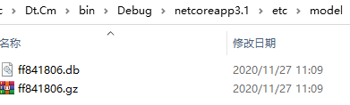

`cm`服务提供系统默认的模型文件，可以在`cm`模型的基础上增加自定义缓存内容，方法是在`service.json`中增加定义模型文件的表结构及数据，生成的模型文件中将包含配置的所有表及数据。
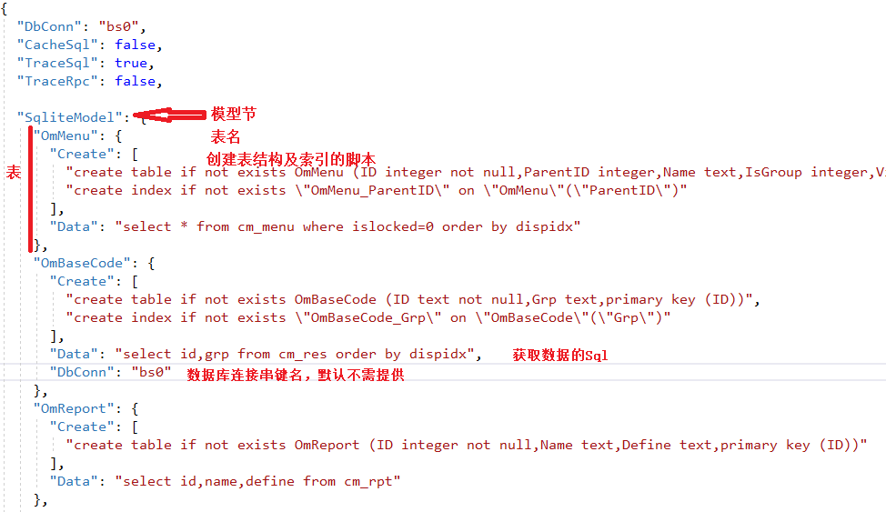

`cm`服务初次启动时会根据配置自动生成模型文件，当模型数据修改或增加后，可通过`.admin`页->`SysKernel.UpdateModel`->测试方法 更新模型文件。
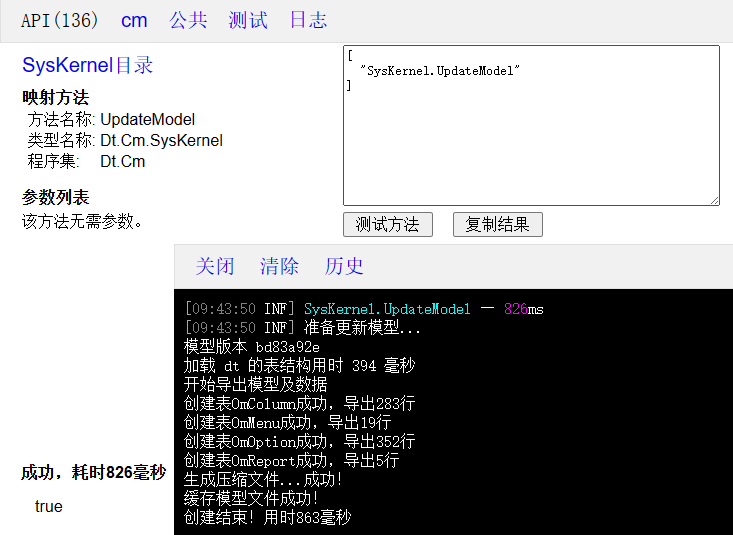

如上图所示，`SysKernel.UpdateModel`的内容包括：
* 创建新版本号
* 刷新服务端的表结构缓存
* 导出`global.json`中配置的所有数据库的表结构信息，导入`OmColumn`表，用于客户端生成sql
* 根据`service.json`中配置创建表结构、导入数据，若`service.json`中未提供任何模型文件的内容，则模型文件只包含`OmColumn`
* 生成`sqlite`文件并压缩成xxx.gz文件
* 刷新版本号，缓存xxx.gz文件等待下载

由此可见，在修改数据库表结构后或`service.json`配置的模型数据变化后都需要“更新模型”，`cm`服务的默认模型文件内容包括：
* OmOption基础选项，数据多，基本不修改，在客户端多用作下拉选择项；
* OmReport报表模板定义，模板定义内容长，修改频次低；
* OmMenu菜单定义，修改频次低，属于基础模型；

这些基础数据在客户端修改后会提醒“更新模型”，可以批量修改后一次性“更新模型”，客户端和`.admin`页都提供“更新模型”功能。

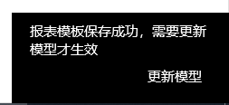

为保证`cm`服务有多个副本时版本号相同，“更新模型”时采用远程事件的方式通知所有副本最新的版本号并各自重新生成模型文件。当“更新模型”时，会通知当前服务的所有副本进行更新，最终由`ModelRefreshHandler`完成所有功能。

    /// 

    /// 更新服务端表结构缓存和sqlite模型库文件
    /// 

    /// <returns></returns>
    public bool UpdateModel()
    {
        return _modelHandler.Refresh();
    }
    
    /// 

    /// 刷新模型版本
    /// 

    /// <returns></returns>
    public bool Refresh()
    {
        if (Refreshing)
            return false;

        var ed = new ModelRefreshEvent { Version = Guid.NewGuid().ToString().Substring(0, 8) };
        if (Kit.GetSvcReplicaCount() > 1)
        {
            // 远程事件通知刷新，服务存在多个副本！
            Kit.RemoteMulticast(ed, "cm");
        }
        else
        {
            // 单个副本直接刷新
            _ = new ModelRefreshHandler().Handle(ed);
        }
        return true;
    }



### 用户数据缓存
客户端用户数据缓存是将用户频繁使用但又很少变化的数据保存在Sqlite库(如：state.db lob.db)，按照数据版本进行更新。

系统默认的用户数据缓存有两类：用户可访问的菜单、用户具有的权限，这些数据使用频繁但又很少变化，缓存在客户端能大大减少不必要的查询，同时在数据变化时能自动更新，建议也缓存具有这些特点的业务数据，虽然程序上复杂些但大大减轻了服务端的压力。数据缓存及更新过程见下图：

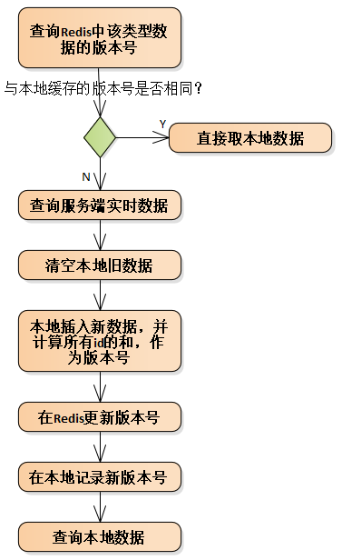

## Sql语句
Sql语句是业务开发的重要部分，采用领域层的Entity方式开发，原则上整个系统不会出现含`insert update delete`的Sql语句，增删改的Sql语句都由系统自动生成，**因此需要手写的只剩`select`查询语句**。


使用`select`查询语句的原则：
* 简单的查询语句尽量放在实体类或领域服务类中，封装成静态方法以便复用；
* 复杂的查询语句放在存储过程中，在实体类或领域服务类中封装成静态方法以便复用；
* 尽量采用sql参数化查询方式，而不是拼接字符串，当然为了支持跨多种数据库也可拼接字符串，如`oracle`的参数前缀是`:`，其它库是`@`，这时采用拼接字符串能省去多套sql语句；
* 对于需要关联多表进行的查询可创建视图，减少代码中`select`语句的复杂度；


## 分布式ID生成方案
通常使用数据库自增长字段、序列、Guid等方法生成ID。

对ID的理想要求是：
* 全局唯一
* 趋势递增
* 自由生成
* 存储空间小

以上方法都不能满足，最终系统采取`Twitter`的`Snowflake`算法生成`8`字节的`long`类型ID，mysql中为`bigint`型字段，实现以上理想要求。算法如下：
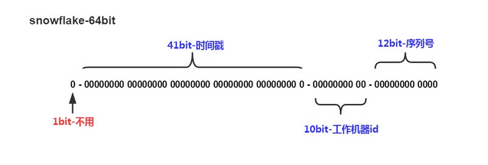

* 1位标识，long类型最高位是符号位，正数是0，负数是1，最高位始终为0。
* 41位时间戳(毫秒级)，存储时间差的值（当前时间戳 - 开始时间戳)，41位可以使用69年保证不重复，开始时间一般设置为生成器开始使用的时间，系统为2019-10-01。
* 10位工作机器id根据当前服务器IP生成，IPV6时将每个 Bit 位的后6位相加，IPV4时采用IP段数值相加生成唯一的workerId，满足 < 1024，重复可能性非常小，凑合用！
* 12位序列支持每个节点每毫秒(同一机器，同一时间戳)产生4096个序列号。

获取新ID方法：

public abstract class EntityX<TEntity> : Entity
{
    /// 

    /// 获取新ID，统一服务端和客户端写法
    /// 

    /// <returns></returns>
    public static Task<long> NewID()
}


数据库存储ID的字段类型：
* mysql       `bigint(20)`
* oracle      `NUMBER(19)`
* sqlserver   `bigint`
* postgresql  `int8`

## EventBus
系统中包含两种类型的`EventBus`：
* 一种是本地事件`LocalEventBus`，客户端和服务端都支持；
* 一种是基于`RabbitMQ`实现的远程事件`RemoteEventBus`，只服务端支持。

### 定义事件
本地事件和远程事件定义事件的方式相同，需要实现接口`IEvent`，该接口只是事件标志，无任何成员：

/// 

/// 事件，构造方法无参数！禁止事件为泛型！
/// 

public interface IEvent
{ }

public class TestEventData : IEvent
{
    public string Name { get; set; }
}


### 事件处理
本地事件的处理类需要实现接口`IEventHandler<TEvent>`

/// 

/// 本地事件处理接口
/// 

/// <typeparam name="TEvent">禁止事件为泛型</typeparam>
public interface IEventHandler<TEvent>
    where TEvent : IEvent
{
    /// 

    /// 事件处理
    /// 

    /// <param name="p_event">事件对象，禁止事件为泛型</param>
    /// <returns></returns>
    Task Handle(TEvent p_event);
}

[EventHandler]
public class TestHandler2 : IEventHandler<TestEventData>
{
    public Task Handle(TestEventData p_event)
    {
        Log.Information($"{GetType().Name}已处理，Name：{p_event.Name}");
        return Task.CompletedTask;
    }
}


远程事件只服务端支持，它的处理类需要实现接口`IRemoteEventHandler<TEvent>`

/// 

/// 远程事件处理接口
/// 

/// <typeparam name="TEvent">禁止事件为泛型</typeparam>
public interface IRemoteEventHandler<TEvent>
    where TEvent : IEvent
{
    /// 

    /// 事件处理
    /// 

    /// <param name="p_event">事件对象，禁止事件为泛型</param>
    /// <returns></returns>
    Task Handle(TEvent p_event);
}

[EventHandler]
public class TestHandler2 : IRemoteEventHandler<TestEventData>
{
    public Task Handle(TestEventData p_event)
    {
        Log.Information($"{GetType().Name}已处理");
        return Task.CompletedTask;
    }
}


### 事件发布
本地事件通过静态方法 `Kit.PublishEvent` 发布

/// 

/// 发布本地事件
/// 

/// <param name="p_event">事件对象，禁止事件为泛型</param>
public static async Task PublishEvent(IEvent p_event)

// 如：
_ = Kit.PublishEvent(new TestEventData { Name = new Random().Next().ToString() });


发布远程事件的方法很多：

public partial class Kit
{
    /// 

    /// 向应用内的所有服务进行广播
    /// 

    /// <param name="p_event">事件内容</param>
    /// <param name="p_isAllSvcInst">true表示所有服务的所有副本，false表示当服务有多个副本时只投递给其中一个</param>
    public static void RemoteBroadcast(IEvent p_event, bool p_isAllSvcInst = true)

    /// 

    /// 向应用内的多个服务进行广播
    /// 

    /// <param name="p_event">事件内容</param>
    /// <param name="p_svcs">服务列表</param>
    /// <param name="p_isAllSvcInst">true表示所有服务的所有副本，false表示当服务有多个副本时只投递给其中一个</param>
    public static void RemoteBroadcast(IEvent p_event, List<string> p_svcs, bool p_isAllSvcInst = true)

    /// 

    /// 向某个服务的所有服务副本进行组播
    /// 

    /// <param name="p_event">事件内容</param>
    /// <param name="p_svcName">服务名称，null表示当前服务</param>
    public static void RemoteMulticast(IEvent p_event, string p_svcName = null)

    /// 

    /// 向某个服务发布事件，有多个服务副本时采用均衡算法将消息投递给其中一个
    /// 

    /// <param name="p_event">事件内容</param>
    /// <param name="p_svcName">服务名称</param>
    public static void RemotePush(IEvent p_event, string p_svcName)

    /// 

    /// 向某个服务的固定副本发布事件，使用场景少，如在线推送消息，因客户端连接的副本不同
    /// 

    /// <param name="p_event">事件内容</param>
    /// <param name="p_svcID">服务副本ID</param>
    public static void RemotePushFixed(IEvent p_event, string p_svcID)
}


## 参数
平台涉及到的参数功能按使用级别分为四类：
* 应用级全局参数，使用服务端的`global.json`配置；
* 服务参数，使用`service.json`配置；
* 客户端参数，通过在`AppStub`类中注入服务进行设置；

public class AppStub : DefaultStub
{
    /// 

    /// 注入全局服务
    /// 

    /// <param name="p_svcs"></param>
    protected override void ConfigureServices(IServiceCollection p_svcs)
    {
        base.ConfigureServices(p_svcs);
        p_svcs.AddSingleton<IRpcConfig, RpcConfig>();
        p_svcs.AddTransient<IBackgroundJob, BackgroundJob>();
        p_svcs.AddTransient<IReceiveShare, ReceiveShare>();
        //p_svcs.AddSingleton<ILogSetting, LogSetting>();
        //p_svcs.AddTransient<ITheme, CustomTheme>();
    }
}

* 用户参数保存在表`cm_params`和`cm_userparams`中，代码中获取设置当前用户参数值的方法：

public partial class LobKit
{
    /// 

    /// 根据参数id获取用户参数值
    /// 

    /// <typeparam name="T"></typeparam>
    /// <param name="p_paramID"></param>
    /// <returns></returns>
    public static Task<T> GetParamByID<T>(long p_paramID)

    /// 

    /// 根据参数名称获取用户参数值
    /// 

    /// <typeparam name="T"></typeparam>
    /// <param name="p_paramName"></param>
    /// <returns></returns>
    public static Task<T> GetParamByName<T>(string p_paramName)

    /// 

    /// 保存用户参数值
    /// 

    /// <param name="p_paramID"></param>
    /// <param name="p_value"></param>
    /// <returns></returns>
    public static Task<bool> SaveParams(string p_paramID, string p_value)
}

“参数定义”是定义所有的用户参数和参数默认值：
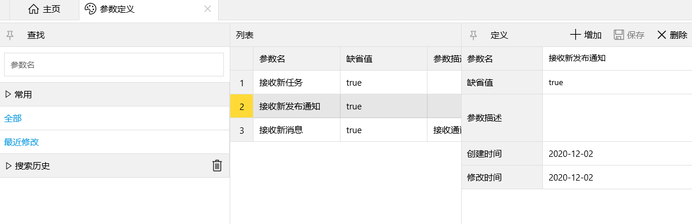

在“默认主页->我的->设置”中可修改自己的参数值，因每个系统的参数不同，界面要求各异，所以该设置界面可自定义，视图名称为“我的设置”，保存参数值的过程可参见MyParamsSetting。
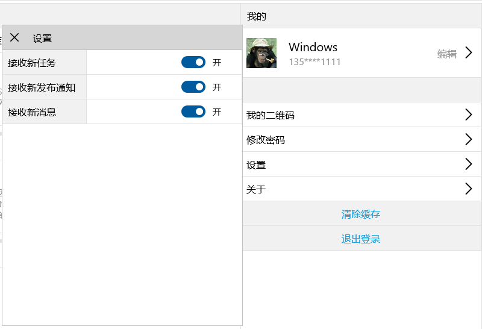

## RPC
`RPC（Remote Procedure Call）`全称为远程过程调用，是客户端与服务之间、服务与服务之间进行网络通信的基础。平台共使用三种方式的RPC：`Http rpc，RabbitMQ rpc，Local rpc`。
* UI客户端与服务之间使用`Http rpc`；
* 服务之间使用`RabbitMQ rpc`；
* 单体模式时服务之间使用`Local rpc`。

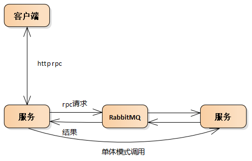


未使用`grpc`的原因：`protobuf`序列化复杂类型困难，且传输的类型复用到业务中效果不好，已有的`Dict,Table`等类型无法实现，从`.proto`原型生成代码对系统影响大且拦截、权限控制等功能无实现思路，并且`iOS Android`客户端对`grpc`暂不支持，故未使用`grpc`。 `grpc`基于`http2`实现4种通信模式参见[github](https://github.com/grpc/grpc-dotnet) 。

虽然未直接使用`grpc`，但`http rpc`底层的通信方法和通信模式都参考`grpc`，保证了灵活性和稳定性。


### 代理方法
代理方法是RPC发起方调用的方法，以上三种情况（客户端与服务、服务之间、单体模式服务之间）使用相同的代理方法，只是内部的实现不同，详见后面几节。

系统以微服务为组织单位，每个微服务`Api`的所有代理方法放在.admin页面可通过系统自动生成，供客户端和其他微服务调用，所有代理方法都为静态方法，生成代理方法的过程：
1. 完成Api方法；
2. 打开.admin页面；
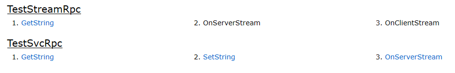
3. 点击要生成代理的类名，生成静态方法；

public static Task<string> GetRpcString()
{
    return Kit.Rpc<string>(
        _svc,
        "TestRpc.GetRpcString"
    );
}

public static Task<bool> SetRpcString(string p_str)
{
    return Kit.Rpc<bool>(
        _svc,
        "TestRpc.SetRpcString",
        p_str
    );
}

4. 复制生成的代理方法放在调用方。

每个代理方法内部都包含了`http/RabbitMQ`通信、序列化参数、反序列化结果等过程，具体可参照`Kit.Rpc<string>()`方法，该方法在客户端调用、服务之间调用、单体模式本地调用的实现上不同。

代理采用静态方法，并且仅需要原`Api`的输入参数，大大简化了调用时的代码量，优于常见的模式。比如使用比较多的方式：`Api`采用接口定义，代理类通过`DispatchProxy`根据接口定义动态生成，该模式在新建或修改`Api`时改动地方比较多，而且每次调用代理方法前需要动态生成代理对象，代码比较冗余。

### Http RPC
`Http RPC`采用基于`http2`协议、使用`Post`方法、传输`json`内容的方式调用服务端的`Api`，返回j`son`格式的结果，未使用`http3`因底层基于`udp`，目前当`UDP`流量过大的时候基本上都会触发运营商随机丢包，这个问题连`Google`自己都没有解决。目前只有客户端和服务之间使用该方式。

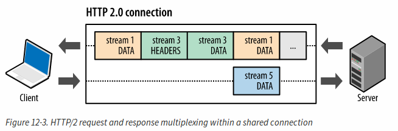

以`cm`服务的`Entry.LoginByPwd`方法为例，RPC调用过程为：
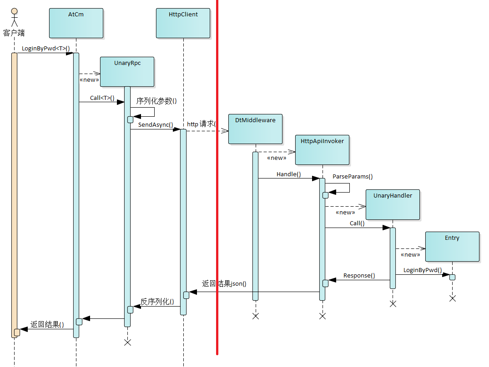

`UnaryRpc.Call<T>` 和 `UnaryHandler.Call`方法


    /******************* UnaryRpc.Call<T> *******************/
    /// 

    /// 发送json格式的Http Rpc远程调用
    /// 

    /// <typeparam name="T">结果对象的类型</typeparam>
    /// <returns>返回远程调用结果</returns>
    public async Task<T> Call<T>()
    {
        // 远程请求
        byte[] data = null;
        using (var request = CreateRequestMessage())
        using (var content = new PushStreamContent((ws) => RpcClientKit.WriteFrame(ws, _data, _isCompressed)))
        {
            request.Content = content;
            HttpResponseMessage response;
            try
            {
                response = await _client.SendAsync(request).ConfigureAwait(false);
            }
            catch (Exception ex)
            {
                var msg = $"调用【{_methodName}】时服务器连接失败！";
#if !SERVER
                _log?.Error(msg, ex);
#endif
                throw new ServerException("服务器连接失败", msg + ex.Message);
            }

            if (response.StatusCode != System.Net.HttpStatusCode.OK)
            {
                var msg = $"调用【{_methodName}】时返回状态码：{response.StatusCode}";
#if !SERVER
                // 无权限时
                if (response.StatusCode == System.Net.HttpStatusCode.Unauthorized)
                {
                    Kit.GetService<IRpcConfig>()?.OnRpcUnauthorized(_methodName);
                }
                _log?.Error(msg);
#endif
                throw new ServerException("服务器返回错误状态码", msg);
            }

            var stream = await response.Content.ReadAsStreamAsync();
            data = await RpcClientKit.ReadFrame(stream);
            response.Dispose();
        }
        return ParseResult<T>(data);
    }

    /******************* UnaryHandler.Call *******************/
    /// 

    /// 调用服务方法
    /// 

    /// <returns></returns>
    protected override async Task<bool> CallMethod()
    {
        object result = null;
        UnaryResult resultType = UnaryResult.Success;
        ApiResponseType responseType = ApiResponseType.Success;
        string error = null;

        // 输出耗时
        Stopwatch stopwatch = new Stopwatch();
        stopwatch.Start();
        try
        {
            var mi = _invoker.Api.Method;
            if (mi.ReturnType == typeof(Task))
            {
                // 异步无返回值时
                var task = (Task)mi.Invoke(_tgt, _invoker.Args);
                task.Wait(_invoker.RequestAborted);
            }
            else if (typeof(Task).IsAssignableFrom(mi.ReturnType))
            {
                // 异步有返回值
                var task = (Task)mi.Invoke(_tgt, _invoker.Args);
                task.Wait(_invoker.RequestAborted);
                result = task.GetType().GetProperty("Result").GetValue(task);
            }
            else
            {
                // 调用同步方法
                result = mi.Invoke(_tgt, _invoker.Args);
            }
        }
        catch (Exception ex)
        {
            if (ex is OperationCanceledException
                || ex.InnerException is OperationCanceledException)
            {
                // 客户端取消请求，不记录日志，不Response
                resultType = UnaryResult.Cancel;
            }
            else
            {
                resultType = UnaryResult.Error;
                KnownException rpcEx = ex.InnerException as KnownException;
                if (rpcEx == null)
                    rpcEx = ex as KnownException;

                if (rpcEx != null)
                {
                    // 业务异常，在客户端作为提示消息，不记日志
                    responseType = ApiResponseType.Warning;
                    error = rpcEx.Message;
                }
                else
                {
                    // 程序执行过程的错误，将异常记录日志
                    responseType = ApiResponseType.Error;
                    error = $"调用{_invoker.ApiName}出错";
                    if (ex.InnerException != null && !string.IsNullOrEmpty(ex.InnerException.Message))
                    {
                        _invoker.Log.Error(ex.InnerException, error);
                        error += "\r\n" + ex.InnerException.Message;
                    }
                    else
                    {
                        _invoker.Log.Error(ex, error);
                        error += "\r\n" + ex.Message;
                    }
                }
            }
        }
        finally
        {
            stopwatch.Stop();
        }

        if (resultType != UnaryResult.Cancel)
        {
            if (TraceRpc)
                _invoker.Log.Information("{0} — {1}ms", _invoker.ApiName, stopwatch.ElapsedMilliseconds);

            await _invoker.Response(responseType, stopwatch.ElapsedMilliseconds, error == null ? result : error);
        }
        return resultType == UnaryResult.Success;
    }
}    


`Http RPC`除了普通的请求/响应模式外，参照`grpc`实现4种通信模式：

    /// 

    /// Api调用模式
    /// 

    public enum ApiCallMode
    {
        /// 

        /// 普通请求/响应模式
        /// 

        Unary,

        /// 

        /// 客户端发送一个请求，服务端返回数据流响应
        /// 

        ServerStream,

        /// 

        /// 客户端发送请求数据流，服务端返回一个响应
        /// 

        ClientStream,

        /// 

        /// 客户端发送请求数据流，服务端返回数据流响应
        /// 

        DuplexStream
    }


最常使用的为`Unary`模式，就是普通的请求/响应，`Api`调用基本使用这种模式。其余三种模式统称为流模式，`ServerStream`实现了服务器推送功能，`ClientStream`实现了上传功能，`DuplexStream`支持请求/响应双向流，所有模式都是基于`http2`协议建立的长连接，以帧(Frame)的方式发送接收，可以多路复用，网络传输的`json`内容长度默认超过4K时进行gzip压缩。

服务之间`Rpc`完全支持上述四种模式，客户端为`Win、Android、iOS、WebAssembly`应用时，只支持`Unary`和`ServerStream`两种模式，因客户端基础通信使用`HttpClient`，不同平台使用不同`Handler`类，Win使用默认`HttpClientHandler`，Android、iOS使用自定义的`NativeMessageHandler`封装对本地平台的调用，Android内部使用第三方`OkHttp3`，iOS内部使用原生`NSUrlSession`，所有服务端证书始终有效。`HttpClient.SendAsync`方法在发送请求时内部使用的`WriteStream`类型不同，无法实现双工通信。

客户端与服务端进行`Rpc`时，有三种方式可中断请求：
1. 客户端`HttpClient.SendAsync`方法未结束时可通过`CancellationToken`取消请求；
2. 客户端收到`HttpResponseMessage`但`Response`未结束时(如`ServerStream`模式)，可以`Response.Dispose`；
3. 服务端通过`HttpContext.Abort()`取消请求；


切记切记不要使用第二种方式，因该方式会被服务端断开连接，其余两种方式只是结束请求并未断开连接！如客户端登录后会调用msg服务的`Register`方法来注册服务器推送，该`Rpc`为`ServerStream`模式的长连接，当多个客户端通过同一连接连接到msg服务时，任何一个客户端若采用第二种方式取消请求，会造成同一连接的所有客户端断开！所以`ServerStream`模式只能通过第三种方式取消请求！


### RabbitMQ RPC
最初服务之间`RPC`的方式和客户端`RPC`方式相同，都采用`http rpc`。

2.0版本后改用基于`RabbitMQ`实现自己的`RPC`中间件来完成，改用`RabbitMQ RPC`的优点：
* 每个服务调用时不再需要对方服务的`http`地址，这一点尤其在微服务增减副本、ip变化、实例切换时非常重要！不再需要静态配置地址或动态监测等功能，大大增加了`RPC`的准确性和稳定性。
* 当被调用的微服务有多个副本时，可以准确的指定副本实例进行调用，这对于有状态服务非常必要，比如：每个`msg`服务副本都持有大量的客户端连接，当要判断某客户端是否在线时就需要查找每个副本，原有`RPC`模式必须借用具体的部署环境(如k8s)来实现。
* 减轻服务器的压力，过多的请求会被 `RabbitMQ` 消化掉，服务器可以控制消费请求的频次，并不会影响到服务器，其本质为消息队列模式的 `RPC` 调用。原有`RPC`模式中如果客户端的请求过多，服务器的压力会过大。
* 微服务的横向扩展更加容易：如果已有的微服务副本处理能力不能满足请求的频次，只需要增加副本实例来消费 `RabbitMQ` 的消息即可，`RabbitMQ`会帮我们实现消息消费的负载均衡。

缺点：增加了中间环节，增加了网络通信，增加`RPC`实现过程的复杂度（将`pub/sub`模式转成异步调用模式）。

同样以`cm`服务的`Entry.LoginByPwd`方法为例，`msg`服务调用该方法的`RPC`过程为：
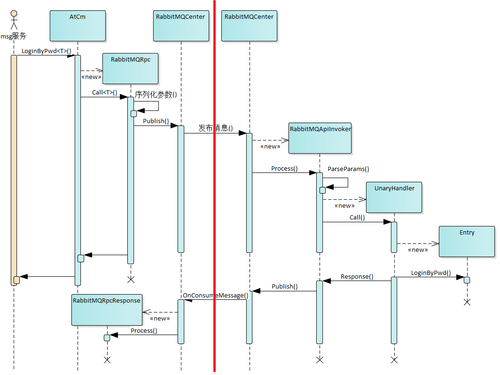
其中`RabbitMQRpcResponse`只是通过`TaskCompletionSource`将异步结果通知到`RabbitMQRpc`，然后反序列化、转型、返回结果。

### Local RPC
单体模式时原服务之间的RPC采用本地调用方式，在`Kit.Rpc<T>`分情况处理，调用过程和以上两方式相同，只是没有序列化和反序列化。

    /// 

    /// 调用服务API(RabbitMQ Rpc)，单体服务时本地直接调用
    /// 

    /// <typeparam name="T">结果对象的类型</typeparam>
    /// <param name="p_serviceName">服务名称</param>
    /// <param name="p_methodName">方法名</param>
    /// <param name="p_params">参数列表</param>
    /// <returns>返回远程调用结果</returns>
    /// <exception cref="Exception"></exception>
    public static Task<T> Rpc<T>(string p_serviceName, string p_methodName, params object[] p_params)
    {
        if (EnableRabbitMQ && !Stubs[0].SvcName.Equals(p_serviceName, StringComparison.OrdinalIgnoreCase))
        {
            // 非单体且非本服务时，远程调用
            return new RabbitMQRpc().Call<T>(
                p_serviceName,
                null,
                p_methodName,
                p_params
            );
        }

        // 单体服务，本地直接调用
        return new NativeApiInvoker().Call<T>(p_methodName, p_params);
    }


## 序列化/反序列化
`Rpc`的内容为`json`格式，服务端和客户端采用的序列化/反序列化方法相同。序列化类型分为两类：内置类型、非内置类型。

内置类型包括：
1. 系统简单类型，如`string`、值类型、`byte[]`等；
2. 自定义序列化类型，如`Table, Row, Dict, MsgInfo,LetterInfo`等，以及这些类型的`List<T>`集合和互相嵌套，基本涵盖常用场景，`List<object>`和`Dict`中值的类型为`object`，虽然`json`中无法区分数值类型、时间类型、字节数组，但两端在传输时已记录类型，所以两端类型始终相同。

非内置类型：

所有其他`class`都是非内置类型，支持通用的序列化/反序列化，在`Rpc`的`Api`代理方法中统一为`object`类型，并且支持和内置类型互相嵌套使用，属性类型为内置类型时，需要标记`[RpcJson]`，以便正常序列化/反序列化，也可以通过`[JsonIgnore]`忽略不参与序列化的属性，如：

    public class Product
    {
        public string Name { get; set; }

        public DateTime ExpiryDate { get; set; }

        [JsonIgnore]
        public decimal Price { get; set; }

        public string[] Sizes { get; set; }
    }

    public class Student
    {
        public string Name { get; set; }

        public DateTime LastModified { get; set; }

        [RpcJson]
        public Dict Salary { get; set; }

        [RpcJson]
        public Table Info { get; set; }
    }


## RabbitMQ 消息总线
### 概念
* Connection：生产者或消费者(客户端)与 RabbitMQ Broker 建立的一条 TCP 连接。
* Channel：信道，是建立在 Connection 之上的虚拟连接，RabbitMQ 处理的每条 AMQP 指令都是通过信道完成的，多个信道可以TCP连接复用，当信道流量过大时可创建多个Connection分担Channel。
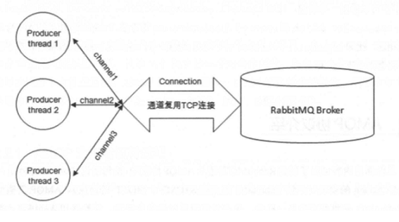

* Exchange：交换机，是接受生产者消息并将消息路由到消息队列的关键组件，ExchangeType和Binding决定了消息的路由规则，系统主要用到了Direct和Topic路由规则。

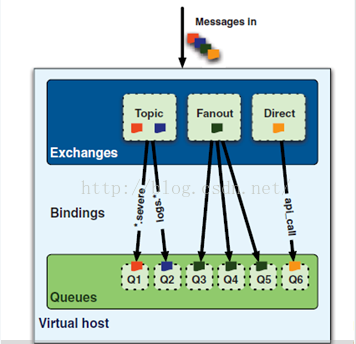

* Queue：队列，是Massage的落脚点和等待接收的地方，消息除非被扔进黑洞否则就会被安置在一个队列里面，当有多个消费者订阅同一个队列时，RabbitMQ采用轮流调度(Round-Robin)实现负载均衡。如果一个消费者在一个信道中正在订阅某一个队列的消息，是不允许该消费者在同一个信道去声明其他队列的。

### 两大责任
RabbitMQ作为消息总线在系统中担负两大责任：
1. 实现服务之间的事件总线`RemoteEventBus`的发布/订阅(pub/sub)；
2. 实现服务之间的`RPC`功能；

为实现以上两大功能，每个服务在启动时打开一个连接(Conntection)、四个通道(Channel)，声明一个交换机(exchange)、三个消费者队列(Queue)。

* 一个连接：只创建一条 TCP 连接。
* 四个通道：一个用来发布事件(生产者)；另外三个提供给消费者队列。
* 一个交换机：交换机名称使用当前应用的名称，只提供给第二消费者队列绑定。
* 三个消费者队列：
  1. 第一消费者队列名称为AppName.SvcName，采用work模式，未绑定交换机，只支持接收和队列名称完全匹配的投递，当有多个服务副本时采用均衡算法只投递给其中一个。
  2. 第二消费者队列名称为AppName.SvcName.SvcID，绑定交换机，路由规则采用topic，按正则表达式对RoutingKey匹配，提供两种匹配方式的RoutingKey，第一种 AppName.SvcName.*  接收对服务所有副本的投递，第二种 #.SvcID  接收对当前副本的投递，两种匹配实现接收对所有副本的组播和指定副本的投递。因每次重启服务id不同，队列采用自动删除模式。
  3. 第三消费者队列名称为AppName-SvcName-SvcID-Queue，用来通过系统交换机amq.rabbitmq.event，订阅系统队列变化事件(queue.*)，准确实时获取所有微服务的副本信息，用于针对具体副本RPC的情况。

第一、第二消费者队列满足以下常见的消息发布场景：
* 向应用内的所有服务的所有副本或单个副本进行投递，调用`Broadcast`方法
* 向应用内的多个服务的所有副本进行投递，调用`Broadcast`方法
* 向应用内的多个服务进行广播，当一个服务有多个副本时只投递给其中一个副本，调用`Broadcast`方法
* 向某个服务的所有副本进行组播，调用`Multicast`方法
* 只向某个服务发布事件，有多个服务副本时采用均衡算法将消息投递给其中一个，调用`Push`方法
* 只向某个服务的固定副本发布事件，使用场景少，调用`PushFixed`方法

## 依赖注入/控制反转
依赖注入DI(Dependency Injection)和控制反转IoC(Inversion of Control)是从不同角度描述的同一件事情，指通过引入IoC容器，利用依赖关系注入的方式，实现对象之间的解耦。

服务端和客户端虽然依赖注入的实现方式不同，但为了统一使用体验，都是在`AppStub.ConfigureServices`中注入全局服务，通过`Kit. GetService`获取服务对象实例。

public class AppStub : DefaultStub
{
    protected override void ConfigureServices(IServiceCollection p_svcs)
    {
        base.ConfigureServices(p_svcs);
        p_svcs.AddSingleton<IRpcConfig, RpcConfig>();
        p_svcs.AddTransient<IBackgroundJob, BackgroundJob>();
        p_svcs.AddTransient<IReceiveShare, ReceiveShare>();
        p_svcs.AddSingleton<ILogSetting, LogSetting>();
        p_svcs.AddTransient<ITheme, CustomTheme>();
    }
}

public partial class Kit
{
    /// 

    /// 在全局服务容器中获取指定类型的服务对象，服务类型不存在时返回null，不抛异常
    /// 

    /// <typeparam name="T">服务类型</typeparam>
    /// <returns>服务对象</returns>
    public static T GetService<T>()

    /// 

    /// 在全局服务容器中获取指定类型的服务对象，服务类型不存在时抛异常
    /// 

    /// <typeparam name="T">服务类型</typeparam>
    /// <returns>服务对象</returns>
    public static T GetRequiredService<T>()

    /// 

    /// 在全局服务容器中获取指定类型的服务对象，服务类型不存在时返回null，不抛异常
    /// 

    /// <param name="p_svcType"></param>
    /// <returns>服务对象</returns>
    public static object GetService(Type p_svcType)

    /// 

    /// 在全局服务容器中获取指定类型的服务对象，服务类型不存在时抛异常
    /// 

    /// <param name="p_svcType"></param>
    /// <returns>服务对象</returns>
    public static object GetRequiredService(Type p_svcType)

    /// 

    /// 在全局服务容器中获取指定类型的所有服务对象
    /// 

    /// <typeparam name="T">服务类型</typeparam>
    /// <returns>所有服务对象</returns>
    public static IEnumerable<T> GetServices<T>()

    /// 

    /// 在全局服务容器中获取指定类型的所有服务对象
    /// 

    /// <param name="p_svcType">服务类型</param>
    /// <returns>所有服务对象</returns>
    public static IEnumerable<object> GetServices(Type p_svcType)
}


