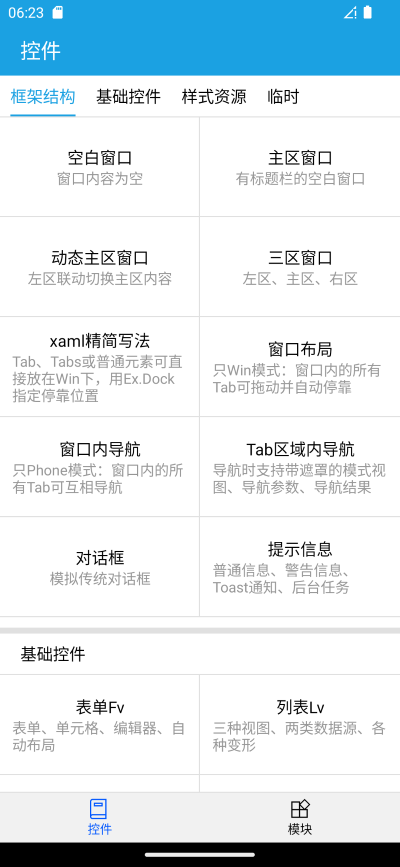
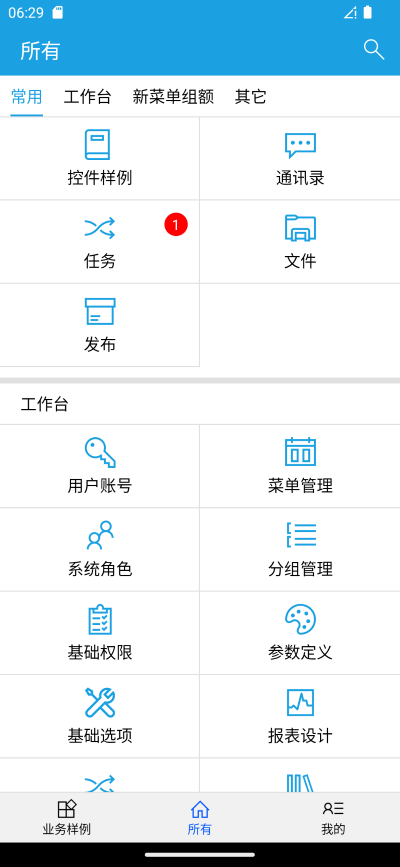
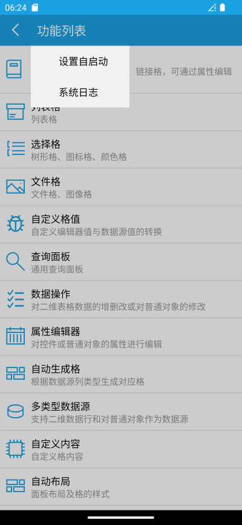
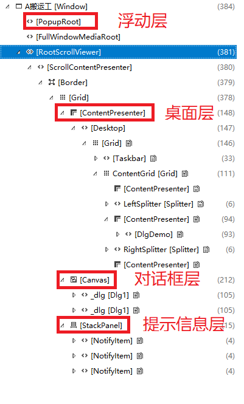
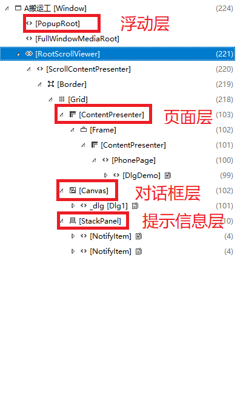
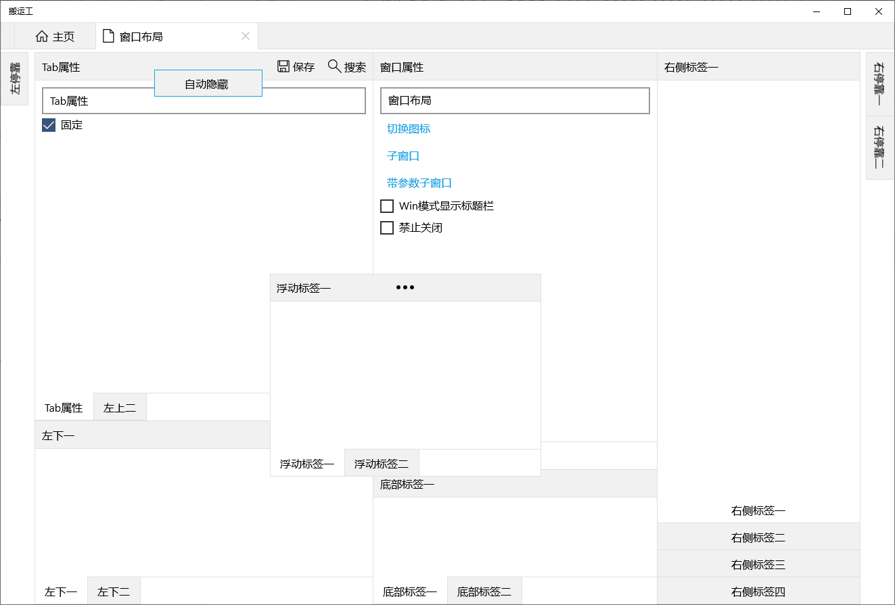
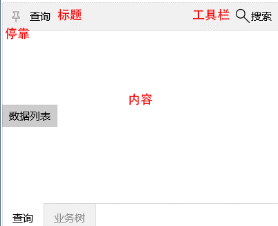
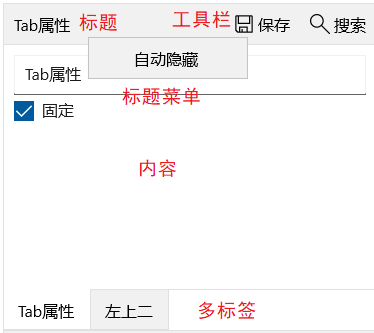
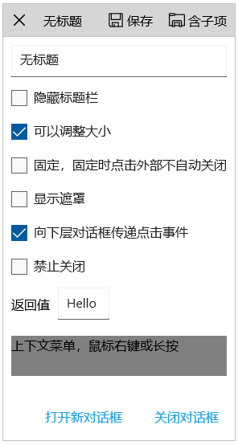
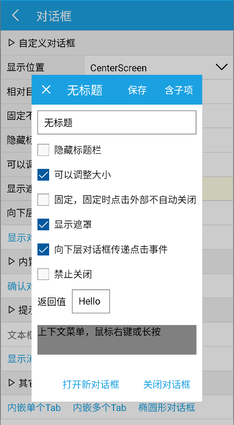

平台界面框架基于`两种界面模式、四层结构`进行设计。

* 两种界面模式主要为适应App界面大小，并能随界面大小的变化在两种模式之间切换，使大小屏幕无缝融合，具有独特优势。
* 四层结构是UI叠放的层次结构，从底层到高层依次为桌面层/页面层、对话框层、提示信息层、浮动层，对应每一层都提供不同的容器控件，包括窗口、对话框、提示信息等，并且每一种控件都适应两种界面模式。

## 界面模式
内置两种界面模式：`windows模式`和`Phone模式`，iOS, Android上是Phone模式；win和wasm上支持两种模式的自动切换，当应用界面的实际宽度足够时按照windows模式显示，宽度较小时自动切换到Phone模式。程序中通过`Kit. IsPhoneUI`判断当前模式。

### Windows模式
客户端运行在界面大小富裕的平台上的模式，如windows上的app wasm、mac上的浏览器wasm等，该模式模拟windows操作系统，支持多窗口显示，对应关系如下：

任务栏

任务栏按钮支持右键菜单和水平拖拽调序，右键功能：
* 设置自启动后，再次启动应用时自动打开当前窗口，只支持设置一个自启动，可以取消自启动。
* 关闭其他即关闭除当前窗口外的所有其他窗口。
* 停靠在两侧的功能模拟多窗口平铺的情况。

### Phone模式
iOS, Android上的显示模式，宽度较小的app和wasm应用也使用该模式。

除首页外，其他页面都包含返回按钮，长按标题部分显示系统菜单，可以设置或取消自启动、查看系统日志，设置自启动后，再次启动应用时自动打开当前窗口的首页但并不是当前页面！其他自启动功能和windows模式相同。右侧工具栏最多显示两个按钮，可以是字符图标或文字，多余的按钮在更多下拉面板中。

## 框架结构
平台真正实现一套代码多种界面模式运行，将大小屏幕无缝融合，内部定义了四层结构：桌面层/页面层、对话框层、提示信息层、浮动层。

### 桌面层/页面层
该层是处于最底层的内容区域，在Windows模式时根节点为Desktop，可以容纳多个窗口，在phone模式时根节点为Frame，主页作为首页，可以导航到任意页面。窗口Win是支持可停靠的多区域窗口，windows模式为独立窗口，phone模式多个页面，页面之间的导航关系可在运行时自定义，Win的详细功能参加基本元素的窗口部分。

### 对话框层
对话框层始终显示在桌面层/页面层的上面，可以同时显示多个对话框，根据焦点自动调整对话框显示次序，Dlg自适应两种模式，支持多种显示位置，支持异步等待到对话框关闭，默认情况点击对话框外部时自动关闭。

### 提示信息层
提示层在对话框层的上面，主要显示非交互类信息，通过Kit.Msg, Kit.Warn方法显示，windows模式显示在右下侧，phone模式显示在顶部，支持同时显示多个、自动关闭、单个操作按钮等功能。

### 浮动层
浮动层采用系统的Popup，主要用于需要交互的提示信息等，始终有全屏遮罩，使用场景较少。

## 窗口
窗口(Win)是界面元素的基本容器，业务开发时通常对应一个菜单项的功能，实现独立的业务子模块。Windows模式下可以同时打开多个窗口，通过操作任务栏来激活、关闭、切换窗口，phone模式下则由多个可互相导航的页面组成，这就实现了同一套界面方案适应不同模式的操作习惯。

### 窗口布局
窗口布局只在windows模式下有效，phone模式下窗口不作为界面直接显示，只是管理内部Tab之间的导航功能，不要附加Win.Loaded事件，因Phone模式时不触发！

在windows模式下窗口内部采用经典的多区域、可停靠布局方式，内部分上、下、左、右、主区五个区域，每个区域包含多个分类内容，内容之间可能存在逻辑上的父子关系或无直接关系，内容的承载者为Tab，各区域之间可以调整大小，支持浮动子窗口、停靠到四周、拖拽自动组合、恢复默认布局等功能，可视树结构为：Win->Pane->Tabs->Tab->内容，浮动、停靠、拖拽组合时以Tab为最小单位进行。结构如下图所示：

恢复默认布局

自动隐藏Tab

常用布局xaml

<a:Win
    x:Class="Dt.UIDemo.WinLayout"
    xmlns="http://schemas.microsoft.com/winfx/2006/xaml/presentation"
    xmlns:x="http://schemas.microsoft.com/winfx/2006/xaml"
    xmlns:a="using:Dt.Base"
    x:Name="_win">

    <a:Main>
        <a:Tabs x:Name="_tabs" >
            <a:Tab Order="1" Title="窗口属性">
                <StackPanel Margin="10">
                    <TextBox Text="{Binding Title,Mode=TwoWay,ElementName=_win}" />
                    <Button Content="切换图标" Click="OnToggleIcon" />
                </StackPanel>
            </a:Tab>
            <a:Tab Title="不可拖动" CanFloat="False"/>
        </a:Tabs>
    </a:Main>
    <a:Pane InitWidth="500">
        <a:Tabs InitHeight="600">
            <a:Tab x:Name="_tabAttr" Order="2" Title="Tab属性">
                <a:Tab.Menu>
                    <a:Menu>
                        <a:Mi ID="保存" Icon="保存" />
                        <a:Mi ID="搜索" Icon="搜索" />
                    </a:Menu>
                </a:Tab.Menu>
                <StackPanel Margin="10">
                    <TextBox Text="{Binding Title,Mode=TwoWay,ElementName=_tabAttr}" />
                    <CheckBox Content="固定" IsChecked="{Binding IsPinned,Mode=TwoWay,ElementName=_tabAttr}" />
                </StackPanel>
            </a:Tab>
            <a:Tab Title="左上二" />
            <a:Tab Title="左停靠" IsPinned="False" PopWidth="300" />
        </a:Tabs>
        <a:Tabs InitHeight="300">
            <a:Tab Title="左下一" />
            <a:Tab Title="左下二" />
        </a:Tabs>
    </a:Pane>
    <a:Pane InitWidth="300" Pos="Right">
        <a:Tabs>
            <a:Tab Title="右侧标签一" />
            <a:Tab Title="右侧标签二" />
            <a:Tab Title="右停靠一" IsPinned="False"/>
            <a:Tab Title="右停靠二" IsPinned="False"/>
        </a:Tabs>
    </a:Pane>
    <a:Pane InitHeight="200" Pos="Bottom">
        <a:Tabs>
            <a:Tab Title="底部标签一" />
            <a:Tab Title="底部标签二" />
        </a:Tabs>
    </a:Pane>
    <a:Pane Pos="Floating" FloatPos="Center" FloatSize="400, 300">
        <a:Tabs>
            <a:Tab Title="浮动标签一" />
            <a:Tab Title="浮动标签二" />
        </a:Tabs>
    </a:Pane>
</a:Win>


Win的子项可以为Pane、Main或普通界面元素，当为普通界面元素，会将其放于主区、不显示标题栏、不自动保存布局状态。

当调整区域大小、拖拽移动Tab位置、切换停靠状态时，Win默认会保存调整后的布局，以便下次打开窗口时仍采用最后的布局，可以设置 AutoSaveLayout = false 不自动保存布局。

### 窗口内部导航

窗口内部导航只在Phone模式下有效，以下描述为Phone模式。


一个窗口包含多个页面，多个页面之间可以通过导航方式或标签方式进行组织，实现对窗口所有内容的展示，Tab为页面内容的承载者，是页面导航或标签页的最小组织单位，这种展现窗口所有内容的方式称为窗口内部导航。Win通过Items属性管理子元素，在Phone模式下Win不作为界面直接显示，可以把它看作所有Tab的集合，容器Pane, Tabs也无需布局管理。

Win中所有Tab的Title不能重名，因导航时通过Title识别！

Win提供两种类型的导航：导航到单个Tab，导航到多个Tab。效果如下图：

导航过程可能为向前导航或向后导航(可跨多级)，Win中的导航方法定义如下：

public partial class Win
{
    /// 

    /// 导航到窗口主页
    /// 

    public void NaviToHome()
    
    /// 

    /// 导航到指定页，支持多页Tab形式
    /// 

    /// <param name="p_tabTitle">多个页面时用逗号隔开(自动以Tab形式显示)，null时自动导航到第一个Tab</param>
    public void NaviTo(string p_tabTitle)
    
    /// 

    /// 在多页Tab中选择指定Tab
    /// 

    /// <param name="p_tabTitle">Tab标题</param>
    public void SelectTab(string p_tabTitle)

    /// 

    /// 在多页Tab中选择指定Tab
    /// 

    /// <param name="p_index">Tab索引</param>
    public void SelectTab(int p_index)
}


Phone模式下的所有页面都是`PhonePage`，它继承自`Page`，是空白页，页面内容动态加载，内容类型包括`Tab, PhoneTabs`两种，`Tab`为单个页面内容，`PhoneTabs`将多个`Tab`以多标签形式显示。`PhonePage`不对外公开，只作为页面容器使用。

### Tab结构
Tab是windows模式下是最小组织单位，在Phone模式下是功能界面和页面容器的桥梁，在两种界面模式下的不同样式：

### 切换主区内容
窗口内部分上、下、左、右、主区五个区域，主区位于窗口的中部，业务开发过程中经常在左侧加载选项列表，在列表中选择不同项时需要动态切换主区内容的情况。为在两种模式下都满足此使用场景，在Win中添加方法`LoadMain`，该方法在phone模式下自动导航到新内容页面，在Windows模式下动态切换主区内容

### 打开窗口
共有三种方法，Kit包含两个静态方法：

public partial class Kit
{
    /// 

    /// 根据窗口/视图类型和参数激活旧窗口、打开新窗口 或 自定义启动(IView)
    /// 

    /// <param name="p_type">窗口/视图类型</param>
    /// <param name="p_title">标题</param>
    /// <param name="p_icon">图标</param>
    /// <param name="p_params">初始参数</param>
    /// <returns>返回打开的窗口或视图，null表示打开失败</returns>
    public static object OpenWin(
        Type p_type,
        string p_title = null,
        Icons p_icon = Icons.None,
        object p_params = null)

    /// 

    /// 根据视图名称激活旧窗口、打开新窗口 或 自定义启动(IView)
    /// 

    /// <param name="p_viewAlias">视图别名</param>
    /// <param name="p_title">标题</param>
    /// <param name="p_icon">图标</param>
    /// <param name="p_params">启动参数</param>
    /// <returns>返回打开的窗口或视图，null表示打开失败</returns>
    public static object OpenView(
        string p_viewAlias,
        string p_title = null,
        Icons p_icon = Icons.None,
        object p_params = null)
}


也可直接通过Win实例`Open Close`窗口。

## 容器控件

### 对话框
`Dlg`对话框是显示在窗口上层的基本容器，含有标题、工具栏、关闭按钮、内容区域，可指定显示位置，如居中、全屏、相对于窗口中的某元素等，默认情况下点击对话框外部会自动关闭，可以设置`IsPinned`属性固定对话框，支持异步等待到对话框关闭，提供对话框`Closing, Closed`事件，`Closing`事件可控制禁止关闭对话框，Phone模式支持返回键关闭对话框。

显示、关闭对话框方法：

public partial class Dlg : Control, IDlgPressed
{
    /// 

    /// 显示对话框
    /// 

    /// <returns>true 正常打开；false 已显示无需再次打开</returns>
    public bool Show()

    /// 

    /// 显示对话框，可异步等待到关闭
    /// 

    /// <returns>返回关闭时(通过Close方法)的参数值</returns>
    public Task<bool> ShowAsync()

    /// 

    /// 关闭对话框
    /// 

    /// <param name="p_ok">传递给异步等待对话框关闭方法的返回值(通过ShowAsync方法)</param>
    public void Close(bool p_ok = false)
}


扩展方法：

public static class DlgEx
{
    /// 

    /// 显示提示消息
    /// 

    /// <param name="p_target"></param>
    /// <param name="p_content"></param>
    public static void Msg(this FrameworkElement p_target, string p_content)

    /// 

    /// 显示警告信息
    /// 

    /// <param name="p_target"></param>
    /// <param name="p_content"></param>
    public static void Warn(this FrameworkElement p_target, string p_content)

    /// 

    /// 显示提示信息
    /// 

    /// <param name="p_target"></param>
    /// <param name="p_msg"></param>
    /// <param name="p_brush"></param>
    public static void ShowMessage(FrameworkElement p_target, string p_msg, SolidColorBrush p_brush)

    /// 

    /// 显示对话框
    /// 

    /// <param name="p_dlg">对话框</param>
    /// <param name="p_winPlacement">windows模式的显示位置</param>
    /// <param name="p_phonePlacement">phone模式的显示位置</param>
    /// <param name="p_target">采用相对位置显示时的目标元素</param>
    /// <param name="p_hideTitleBar">否隐藏标题栏</param>
    /// <param name="p_isPinned">是否固定对话框</param>
    public static void ShowAt(
        this Dlg p_dlg,
        DlgPlacement p_winPlacement,
        DlgPlacement p_phonePlacement,
        FrameworkElement p_target = null,
        bool p_hideTitleBar = false,
        bool p_isPinned = false)

    /// 

    /// 显示对话框
    /// 

    /// <param name="p_dlg">对话框</param>
    /// <param name="p_winPlacement">windows模式的显示位置</param>
    /// <param name="p_phonePlacement">phone模式的显示位置</param>
    /// <param name="p_target">采用相对位置显示时的目标元素</param>
    /// <param name="p_hideTitleBar">否隐藏标题栏</param>
    /// <param name="p_isPinned">是否固定对话框</param>
    /// <returns></returns>
    public static Task ShowAtAsync(
        this Dlg p_dlg,
        DlgPlacement p_winPlacement,
        DlgPlacement p_phonePlacement,
        FrameworkElement p_target = null,
        bool p_hideTitleBar = false,
        bool p_isPinned = false)
}


### 提示信息
提示面板显示在通知区，windows模式下在右下方，phone模式下在顶部，支持同时显示多个提示信息，可设置自动关闭或手动关闭，分为普通提示信息和警告信息，内容中可包含操作按钮。错误信息不使用提示面板，以对话框方式显示。Kit中方法定义：

public partial class Kit
{
    /// 

    /// 发布消息提示
    /// 

    /// <param name="p_content">显示内容</param>
    /// <param name="p_delaySeconds">
    /// 几秒后自动关闭，默认3秒
    /// <para>大于0：启动定时器自动关闭，点击也关闭</para>
    /// <para>0：不自动关闭，但点击关闭</para>
    /// <para>小于0：始终不关闭，只有程序控制关闭</para>
    /// </param>
    public static NotifyInfo Msg(string p_content, int p_delaySeconds = 3)

    /// 

    /// 警告提示
    /// 

    /// <param name="p_content">显示内容</param>
    /// <param name="p_delaySeconds">
    /// 几秒后自动关闭，默认5秒
    /// <para>大于0：启动定时器自动关闭，点击也关闭</para>
    /// <para>0：不自动关闭，但点击关闭</para>
    /// <para>小于0：始终不关闭，只有程序控制关闭</para>
    /// </param>
    public static NotifyInfo Warn(string p_content, int p_delaySeconds = 5)

    /// 

    /// 显示确认对话框
    /// 

    /// <param name="p_content">消息内容</param>
    /// <param name="p_title">标题</param>
    /// <returns>true表确认</returns>
    public static Task<bool> Confirm(string p_content, string p_title = null)

    /// 

    /// 显示错误对话框
    /// 

    /// <param name="p_content">消息内容</param>
    /// <param name="p_title">标题</param>
    public static void Error(string p_content, string p_title = null)
}


### 工具栏菜单
工具栏菜单和标题、返回按钮占有同一行，属于内容容器的标准组成部分，工具栏菜单在Phone模式下第一级最多显示两个按钮，只显示图标或文字，通过ShowInPhone控制只显示文字。在xaml中可直接设置工具栏内容：

<a:Tab Title="工具栏菜单">
    <a:Tab.Menu>
        <a:Menu x:Name="_m" ItemClick="OnItemClick">
            <a:Mi ID="保存" Icon="保存" ShowInPhone="Icon" />
            <a:Mi ID="搜索" Icon="搜索" ShowInPhone="Icon" />
            <a:Mi ID="选择项" Icon="pos机" IsCheckable="True" />
            <a:Mi ID="无图标" />
            <a:MiSplit />
            <a:Mi ID="含子项" Icon="文件夹">
                <a:Mi ID="修改" Icon="修改" />
                <a:Mi ID="复制" Icon="复制" />
                <a:Mi ID="无图标" />
                <a:Mi ID="打开" Icon="打开">
                    <a:Mi ID="设置" Icon="设置" />
                    <a:Mi ID="复印" Icon="复印" />
                    <a:Mi ID="打开" Icon="打开">
                        <a:Mi ID="设置" Icon="设置" />
                        <a:Mi ID="复印" Icon="复印" />
                    </a:Mi>
                </a:Mi>
                <a:Mi ID="选择项" IsCheckable="True" />
            </a:Mi>
            <a:Mi ID="分组单选" Icon="文件夹">
                <a:Mi ID="选项1" IsCheckable="True" GroupName="Test" />
                <a:Mi ID="选项2" IsCheckable="True" GroupName="Test" />
                <a:Mi ID="选项3" IsCheckable="True" GroupName="Test" />
                <a:Mi ID="选项4" IsCheckable="True" GroupName="Test" />
            </a:Mi>
        </a:Menu>
    </a:Tab.Menu>
    
    <a:Fv x:Name="_fv">
    </a:Fv>
</a:Tab>


运行效果如下图：

