Fv是FormView的缩写，数据表单编辑控件，因使用频率高采用缩写作为控件名称，该控件也可当做布局控件使用。

## 布局
为统一两模式下的布局方式，采用自定义布局面板`FormPanel`，单元格的宽度根据实际区域自动调整，在`296-456px`之间，高度按行数计算，每行高度`41px`，内容高度实际`40px`。

通过指定`RowSpan`来设置行数，当`RowSpan`为-1时，根据内容高度自动计算所占行数。

通过`ColSpan`设置单元格占用列的比例，取值范围 0~1，0表示水平填充，1表示占满整列，默认1。

布局算法为：
* 根据表单实际区域大小和单元格数量决定每个单元格的位置，**优先按列排**；
* 当单元格的数量按照一列摆放，未排满高度的80%时，或表单总宽度无法容纳两列时(<296 X 2)时，只摆放一列，phone模式基本一列；
* 能够摆放两列，按照一列摆放超过80%或无法容纳三列时，摆放两列；
* 能够摆放三列，按照两列摆放超过80%或无法容纳四列时，摆放三列；
* 暂时最多支持摆放四列。
* 当表单区域无法摆放所有单元格时，显示垂直滚动栏，始终无水平滚动。

Fv可以作为普通的布局控件使用，为获得单元格样式的控制，通常将普通控件放在CFree内，达到和普通单元格相同的控制，可以设置标题、标题宽度、是否显示标题、是否显示红星、所占行数等，但内嵌的普通控件不参与数据的绑定、编辑等功能，当内嵌控件实现IFreeCell接口后，成为自定义格，作为布局控件使用时如：

<a:Fv x:Name="_fv">
    <a:CFree Title="文本框">
        <TextBox />
    </a:CFree>
    <TextBox Text="文本框" />
    <a:CFree Title="自动行高" RowSpan="-1">
        <TextBox AcceptsReturn="True" MinHeight="130" />
    </a:CFree>
    <Button Content="&#xE06E;" Style="{StaticResource 字符按钮}" HorizontalAlignment="Center" />
    <CheckBox Content="选择框" />
    <a:CFree Title="选择框">
        <CheckBox />
    </a:CFree>
    <a:CBar Title="水平填充自动行高" />
</a:Fv>


## 数据源
数据源可以为`Row`或`普通对象`，`Row`时将`Cell`值绑定到单元格，普通对象时将属性绑定到单元格，支持多级属性，根据属性是否可写控制单元格是否可编辑，因此`Fv`还可作为属性编辑器独立使用。针对不同的数据类型内部提供多种通用格，实现数据编辑。

通过`Fv.Data`设置数据源，根据单元格`ID`将对应的数据项绑定到单元格，编辑后新值再同步到数据源，完成数据修改功能。

`Fv`支持根据数据源自动生成单元格的功能，通过`Fv.AutoCreateCell`控制，内部根据数据项的数据类型生成对应格，外部无法动态指定，使用场景较少。

在切换数据源时，`Fv`只处理含`ID`的单元格，其它单元格怕有影响未设置`DataContext`！

上级元素或当前元素设置`DataContext`时，所有绑定中未指明数据源的都使用继承的`DataContext`，当绑定模式为`TwoWay`或`OneWay`时，`DataContext`必须实现`INotifyPropertyChanged`接口才能将修改值传递到绑定的`UI`，`DataContext`继承`DependencyObject`的依赖属性也无效，但直接在绑定中指定数据源时依赖属性有效！

数据源为`null`时，隐藏所有含`ID`的单元格编辑器，避免误操作。

数据源为普通对象时，已实现和`Row`相同的功能，包括`Fv.Changed`事件、`FvCell.Changed`事件、淡黄色修改状态样式、支持撤销等功能，对普通对象没有特殊要求，内部采用包装方式进行功能扩展(`ObjectView PropertyView`)。

列值变化事件`Fv.Changed`，使用场景较少，`Row`的所有列值变化都触发，不只是`FvCell`绑定的列，普通对象只有UI对应的属性变化时触发。

数据源列值的初始值，主要有以下几种情况：
* 普通默认值
* 获取服务端的序列值
* CList格自动取第一行
* 内置表达式
* 单元格cookie值等

## 格
格是表单编辑的最小单位，负责数据的显示、交互编辑、新值同步到数据源等功能，格之间可能存在联动关系，内部提供多种格：普通文本格、数值格、掩码格、布尔格、列表格、时间格、图标选择格、颜色选择格、文件格、图像格、自定义格等，还包括分割栏、链接格等无编辑功能的格，每种类型的格有自己的行为控制，实现常见的编辑功能。

格的基类为`FvCell`，实现公共样式和功能，常用属性如下：

public partial class FvCell : DtControl, IFvCell
{
    /// 

    /// 获取设置列名(字段名或属性名)
    /// 

    public string ID

    /// 

    /// 获取设置列标题
    /// 

    public string Title

    /// 

    /// 获取设置列名的宽度
    /// 

    public double TitleWidth

    /// 

    /// 获取设置是否显示标题列
    /// 

    public bool ShowTitle

    /// 

    /// 获取设置自定义取值赋值过程的类名
    /// 

    public string Call

    /// 

    /// 获取设置是否垂直显示标题
    /// 

    public bool IsVerticalTitle

    /// 

    /// 获取设置占用的行数，默认1行，-1时自动行高
    /// 

    public int RowSpan

    /// 

    /// 获取设置单元格占用列的比例，取值范围 0~1，0表示水平填充，1表示占满整列，默认1
    /// 

    public double ColSpan

    /// 

    /// 获取设置列是否只读，最终是否只读由ReadOnlyBinding确定！
    /// 

    public bool IsReadOnly

    /// 

    /// 获取设置是否自动保存单元格最后一次编辑值，默认False
    /// 

    public bool AutoCookie

    /// 

    /// 获取设置占位符文本
    /// 

    public string Placeholder

    /// 

    /// 获取设置查询时对条件比较符控制：无比较符、可修改比较符、比较符只读
    /// 

    public QueryType Query

    /// 

    /// 获取设置查询时的条件比较符
    /// 

    public CompFlag QueryFlag
}


其中`Call`属性是自定义取值赋值过程的类名，相当于数据源和格之间绑定的转换器，这部分转换也可以放在数据源中统一处理，该类的定义过程如下：

[FvCall]
public class TenTimesMid : IFvCall
{
    public object Get(Mid m)
    {
        return m.Int / 100;
    }

    public object Set(Mid m)
    {
        return m.Int * 100;
    }
}


### CBar
CBar是单元格分隔行，主要为单元格分组，使界面功能更清晰，无编辑功能，提供默认样式：
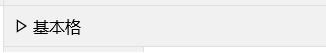

xaml定义如：

<a:CBar Title="基本格" />

<a:CBar>
    <StackPanel Orientation="Horizontal">
        <Button Content="切换第一格内容" />
        <Button Content="切换CBar内容" />
    </StackPanel>
</a:CBar>


### CLink
链接格，功能和按钮相同，触发`Click`事件，无编辑功能，内容样式采用手机App常用样式，继承自`CBar`，使用方法和`CBar`相同。默认样式：

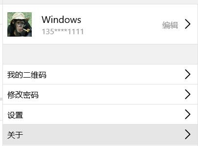


<a:CLink Title="默认链接格" />

<a:CLink Title="切换内容" ColSpan="1" Click="OnToggleLink" />

<a:CLink Click="OnEditInfo" RowSpan="2">
    <Grid>
        <Grid.ColumnDefinitions>
            <ColumnDefinition Width="Auto" />
            <ColumnDefinition Width="*" />
            <ColumnDefinition Width="Auto" />
        </Grid.ColumnDefinitions>
        <Image x:Name="_img" Width="50" Height="50" Margin="0,0,20,0" />
        <StackPanel VerticalAlignment="Center" Grid.Column="1">
            <TextBlock x:Name="_tbName" FontSize="{StaticResource 标题字}" />
            <TextBlock x:Name="_tbPhone" Foreground="{StaticResource 深灰2}" />
        </StackPanel>
        <TextBlock Text="编辑" Foreground="{StaticResource 深灰2}" VerticalAlignment="Center" Grid.Column="2" />
    </Grid>
</a:CLink>
<a:CBar />
<a:CLink Title="我的二维码" />


### CFree
自定义格，可以自定义编辑器，当向`Fv.Items`添加普通UI时，这些UI会用`CFree`包裹，如：


<a:CFree Title="文本框">
    <TextBox />
</a:CFree>
<TextBox Text="文本框" />
<a:CFree Title="自动行高" RowSpan="-1">
    <TextBox AcceptsReturn="True" MinHeight="130" />
</a:CFree>


### CText
普通文本格，文本框功能，使用频率最高，属性：


/// 

/// 获取设置是否允许多行显示，默认false
/// 

public bool AcceptsReturn

/// 

/// 获取设置可在文本框中键入或粘贴的最大字符数，默认0无限制
/// 

public int MaxLength

/// 

/// 获取设置是否实时更新值，默认true实时更新
/// 

public bool UpdateTimely

/// 

/// 获取设置输入法，输入法始终不可为null，不然uno中文本框右侧的清空按钮失效！！！
/// 

public InputScope InputScope


### CNum
数值格，可在样例中动态调整各属性测试功能，属性：

/// 

/// 获取设置当前值
/// 

public double Value

/// 

/// 获取设置是否为整型数值
/// 

public bool IsInteger

/// 

/// 获取设置小数位数
/// 

public int Decimals

/// 

/// 获取设置最大值
/// 

public double Maximum

/// 

/// 获取设置最小值
/// 

public double Minimum

/// 

/// 获取设置格式化显示
/// 

public ValueFormat ValueFormat

/// 

/// 获取设置是否实时更新Cell值
/// 

public bool UpdateTimely

/// 

/// 获取设置自定义单位，显示在数字后面
/// 

public string CustomUnit

/// 

/// 获取设置为空时显示的字符串
/// 

public string NullValue

/// 

/// 获取设置最大变化量
/// 

public double LargeChange

/// 

/// 获取设置最小变化量
/// 

public double SmallChange

/// 

/// 获取设置是否可自动循环调值
/// 

public bool AutoReverse

/// 

/// 获取设置区域格式
/// 

public NumberFormatInfo NumberFormatInfo


### CMask
掩码格，支持原有PC版的所有掩码功能，可在样例中动态调整各属性测试功能，属性：

/// 

/// 掩码类型
/// 

public MaskType MaskType

/// 

/// 掩码表达式
/// 

public string Mask

/// 

/// 是否显示掩码占位符，RegEx有效
/// 

public bool ShowPlaceHolder

/// 

/// 掩码占位符，RegEx有效
/// 

public char PlaceHolder

/// 

/// 是否保存为转换后的结果，Simple、Regular有效
/// 

public bool SaveLiteral

/// 

/// 自动完成方式，RegEx有效
/// 

public AutoCompleteType AutoComplete

/// 

/// 是否按掩码格式化显示
/// 

public bool UseAsDisplayFormat

/// 

/// 输入是否可为空
/// 

public bool AllowNullInput

/// 

/// 忽略空格
/// 

public bool IgnoreBlank


### CDate
日期时间格，提供两种模式的选择器，触摸模式选择器支持点击日期时选择日期和点击时间时选择时间，属性：


/// 

/// 获取设置格式串，默认 yyyy-MM-dd，完整如：yyyy-MM-dd HH:mm:ss
/// 

public string Format

/// 

/// 获取设置是否始终为触摸模式选择器，默认 false
/// 

public bool AlwaysTouchPicker


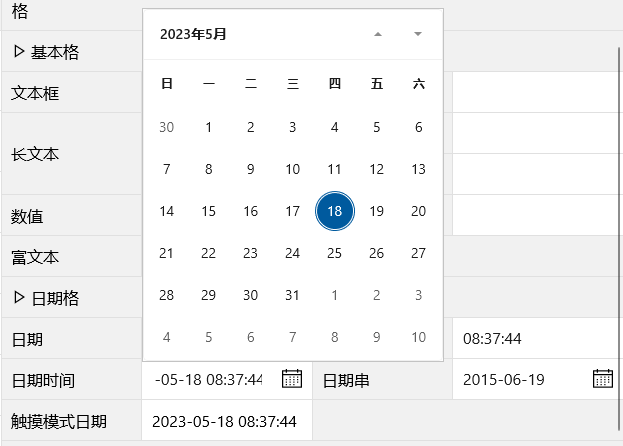
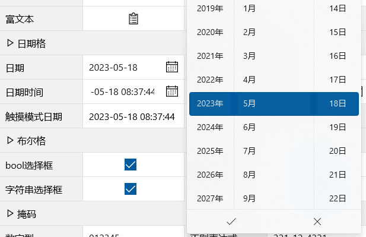

### CBool
布尔格，提供选择框和开关两种显示控件，属性：

/// 

/// 获取设置是否显示为开关，默认false为选择框
/// 

public bool IsSwitch

/// 

/// 获取设置True时的值
/// 

public object TrueVal

/// 

/// 获取设置False时的值
/// 

public object FalseVal


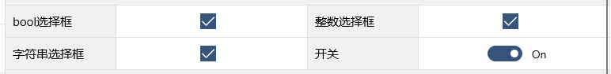

### CList
列表选择格，该格使用场景较多，列表数据源复杂，支持单选、多选，支持选择后同步填充多列值功能，总体数据绑定关系为：

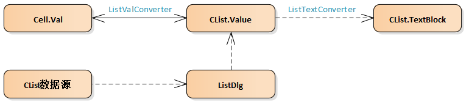

选择列表由`ListDlg`显示，该对话框主要包含`Lv`控件，`Lv`数据源来自于`CList`属性设置，数据源种类有多种，具有不同优先级：
1. 直接设置`Data`属性
2. 通过LoadData事件加载数据

<a:CList ID="listobj" Title="对象列表" LoadData="OnLoadPersons">

void OnLoadPersons(object sender, AsyncEventArgs e)
{
    ((CList)sender).Data = SampleData.CreatePersonsList(20);
}

3. 设置`Ex`属性，该属性是`类名#参数`的字符串，类需要继承自`CListEx`，重写方法可控制下拉对话框和数据源。以下是`Ex`属性、`CListEx`定义、`EnumData`和`Option`扩展的例子：

/// 

/// 获取设置扩展CList功能的类名和参数，用于控制下拉对话框和数据源，类名和参数之间用#隔开，如：
/// <para>EnumData#Dt.Base.DlgPlacement,Dt.Base</para>
/// <para>Option#民族</para>
/// 

public string Ex

/// 

/// CList功能扩展基类
/// 

public abstract class CListEx
{
    protected CList _owner;
    protected ListDlg _dlg;
    protected string _params;

    public void Init(CList p_owner, ListDlg p_dlg, string p_params)
    {
        _owner = p_owner;
        _dlg = p_dlg;
        _params = p_params;
        OnInit();
    }

    protected virtual void OnInit()
    {
    }

    public abstract Task<INotifyList> GetData();
}

/// 

/// 枚举类型作为下拉框数据源
/// 

[CListEx]
public class EnumData : CListEx
{
    /// 

    /// 格式：枚举名(包含命名空间),程序集；如：
    /// <para>Dt.Base.CtType,Dt.Base</para>
    /// 

    /// <returns></returns>
    /// <exception cref="Exception"></exception>
    public override Task<INotifyList> GetData()
    {
        // 枚举数据
        Type type = Type.GetType(_params, true, true);
        var data = (INotifyList)_dlg.CreateEnumData(type);
        return Task.FromResult(data);
    }
}

/// 

/// 模型库的OmOption作为下拉框数据源
/// 

[CListEx]
public class Option : CListEx
{
    /// 

    /// 格式：枚举名(包含命名空间),程序集；如：
    /// <para>Dt.Base.CtType,Dt.Base</para>
    /// 

    /// <returns></returns>
    /// <exception cref="Exception"></exception>
    public override async Task<INotifyList> GetData()
    {
        return await AtModel.Query($"select name from OmOption where Category=\"{_params}\"");
    }
}

4. 格的数据源类型为枚举时，自动生成Enum数据
5. 外部(xaml中)定义的对象列表

<a:CList ID="liststr" Title="字符串列表">
    <a:CList.Items>
        <x:String>选项一</x:String>
        <x:String>选项二</x:String>
        <x:String>选项三</x:String>
        <x:String>选项四</x:String>
        <x:String>选项五</x:String>
        <x:String>选项六</x:String>
    </a:CList.Items>
</a:CList>
<a:CList ID="listint" Title="整数列表">
    <a:CList.Items>
        <x:Int32>1</x:Int32>
        <x:Int32>2</x:Int32>
        <x:Int32>3</x:Int32>
    </a:CList.Items>
</a:CList>
<a:CList ID="idstrdsp" Title="IDStr" SrcID="id" TgtID="idstr">
    <a:CList.Items>
        <a:IDStr ID="0" Str="选项一" />
        <a:IDStr ID="1" Str="选项二" />
        <a:IDStr ID="2" Str="选项三" />
    </a:CList.Items>
</a:CList>



数据源为Table时，确保存在name列；

为普通对象时，直接将对象赋值！


选择后需要同步填充多列时需要设置以下两属性，确保源和目标的属性个数相同：

/// 

/// 获取设置源属性列表，用'#'隔开
/// 

public string SrcID

/// 

/// 获取设置目标属性列表，用'#'隔开
/// 

public string TgtID


该功能可实现IDString效果，当在xaml中直接设置数据源时可以使用IDStr，如：

<a:CList ID="idstrdsp" Title="IDStr" SrcID="id" TgtID="idstr">
    <a:CList.Items>
        <a:IDStr ID="0" Str="选项一" />
        <a:IDStr ID="1" Str="选项二" />
        <a:IDStr ID="2" Str="选项三" />
    </a:CList.Items>
</a:CList>


每次选择显示`ListDlg`时都刷新选择列表时可以设置属性：

/// 

/// 获取设置是否动态加载数据源，默认false
/// true表示每次显示对话框时都加载数据源，false表示只第一次加载
/// 

public bool RefreshData


格的数据源类型为枚举时，系统自动生成Enum数据，推荐方案如：

在表结构中定义`enum`类型字段：

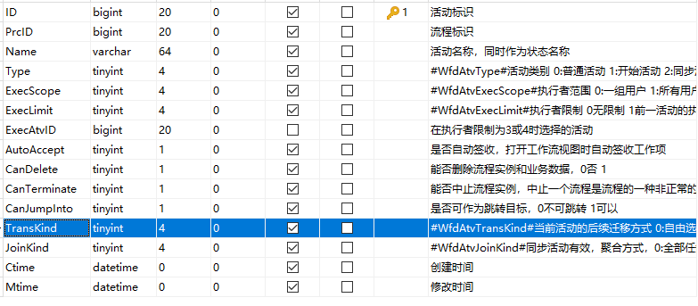

mysql中`tinyint(1)`对应C#的`bool`，无符号的`tinyint(4)`对应`byte`，有符号`tinyint(4)`对应`SByte`(使用场景少)。

为了编码、查询、显示方便，特殊处理了`enum`类型的情况，将无符号`tinyint(4)`设计为`enum`类型，最多能存储256个成员在程序中已够用，生成实体类时支持自动将`#EnumName#`开始的注释当作枚举类型，增加方便性和代码的可读性。


在程序中定义`enum`类型：

public enum WfdAtvTransKind
{
    /// 

    /// 自由选择后续迁移
    /// 

    自由选择,

    /// 

    /// 活动的所有后续迁移都执行
    /// 

    全部,

    /// 

    /// 只允许选择一条后续迁移
    /// 

    独占式选择
}


xaml中CList不需要任何设置，因单元格数据源类型是enum，自动生成下拉列表内容：

<a:CList ID="transkind" Title="后续迁移方式" />


运行时：

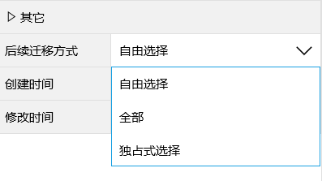

### CFile
文件格的控件模板未使用公共的`CellPanel`，采用完全自定义方式：

文件格默认为自动行高(RowSpan = -1)，避免出现局部区域的滚动栏，所占区域会根据文件列表个数自动调整，为使Fv整体布局统一，普通文件和图片文件默认高度82，占两行，视频文件占5行。

模板第一行为标题栏，左侧标题，右侧工具栏，第二行为FileList。

`FileList.Data`与格的`Value`绑定，`FileList`的上传下载删除等操作会触发`CFile.Changed`事件，因此可以通过`Changed`事件在操作后自动保存。

文件格提供默认的工具栏内容（只有一个添加按钮），当需要上传拍照或录视频等其他功能时可自定义工具栏，工具栏的`DataContext`为当前的`FileList`，因此按钮可将`Command`绑定到`FileList`命令上。

<a:CFile ID="file2" Title="多文件" Changed="OnChanged">
    <a:CFile.Toolbar>
        <StackPanel Orientation="Horizontal">
            <Button Content="图片" Command="{Binding CmdAddImage}" />
            <Button Content="视频" Command="{Binding CmdAddVideo}" />
            <Button Content="音频" Command="{Binding CmdAddAudio}" />
            <Button Content="录音" Command="{Binding CmdCaptureVoice}" />
            <Button Content="拍照" Command="{Binding CmdTakePhoto}" />
            <Button Content="录像" Command="{Binding CmdRecordVideo}" />
        </StackPanel>
    </a:CFile.Toolbar>
    <a:Ex.Menu>
        <a:Menu>
            <a:Mi ID="下载" Icon="向下" Cmd="{Binding CmdDownload}" />
            <a:Mi ID="打开" Icon="打开" Cmd="{Binding CmdOpen}" />
        </a:Menu>
    </a:Ex.Menu>
</a:CFile>

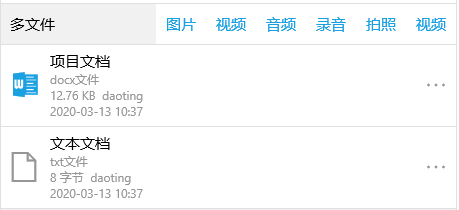

文件格提供默认上下文菜单，也可以自定义菜单，如上图采用扩展依赖项属性`Ex.Menu`，菜单的`DataContext`为当前所属的`FileItem`，因此也可将`Mi`的`Cmd`绑定到`FileItem`命令上。默认菜单如下：

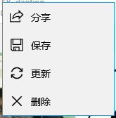

文件格中用于控制`FileList`的属性采用包裹方式直接设置到`FileList`，如下：

/// 

/// 获取设置列数，默认1列
/// 

public int ColCount

/// 

/// 获取设置文件项之间的间隔距离，默认0
/// 

public double Spacing

/// 

/// 获取设置图像的显示高度，默认82，0表示和宽度相同
/// 

public double ImageHeight

/// 

///  获取设置图像填充模式，默认Uniform
/// 

public Stretch ImageStretch

/// 

/// 获取设置文件项是否可点击，默认true
/// 

public bool EnableClick

/// 

/// 获取设置文件数量上限，默认int.MaxValue
/// 

public int MaxFileCount

/// 

/// 获取设置要上传的固定卷名，默认null表示上传到普通卷
/// 

public string FixedVolume


工具栏菜单相关的属性：

/// 

/// 获取设置工具栏内容
/// 

public FrameworkElement Toolbar

/// 

/// 获取设置是否显示默认工具栏，默认true
/// 

public bool ShowDefaultToolbar

/// 

/// 获取设置是否显示默认菜单，默认true
/// 

public bool ShowDefaultMenu


### CImage
图像格是只有一个图像的文件格，内部也使用`FileList`、自动行高、提供默认上下文菜单，不同的是它采用`CellPanel`布局、无工具栏。

<a:CImage ID="img1" Title="图像" />
<a:CImage ID="img2" Title="无图像" />
<a:CImage ID="img3" Title="自定义菜单">
    <a:Ex.Menu>
        <a:Menu>
            <a:Mi ID="下载" Icon="向下" Cmd="{Binding CmdDownload}" />
            <a:Mi ID="打开" Icon="打开" Cmd="{Binding CmdOpen}" />
        </a:Menu>
    </a:Ex.Menu>
</a:CImage>


Phone模式：

### CIcon
图标选择格，内部未使用绑定，采用直接取值/赋值的方式，图标列表使用`Icons`枚举，对应内部自定义的矢量字体库。

<a:CIcon ID="icon" Title="枚举图标"/>
<a:CIcon ID="iconint" Title="整数图标"/>
<a:CIcon ID="iconstr" Title="名称图标"/>

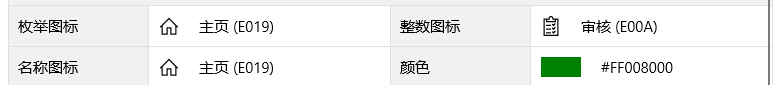

### CColor
颜色选择格，内部未使用绑定，采用直接取值/赋值的方式，选择列表使用`Colors`枚举，暂未提供自定义功能。

<a:CColor ID="color" Title="颜色"/>
<a:CColor ID="colorstr" Title="颜色字符串"/>
<a:CColor ID="colorbrush" Title="颜色画刷"/>


### CTree
树形选择格，使用上和`CList`相似，有两种方式设置`Tv`数据源：
* 一种直接设置`Data`属性
* 另一种通过LoadData事件动态加载

支持单选、多选，支持选择后同步填充多列值功能，支持动态加载树数据源。


<a:CTree ID="tree" Title="普通树" LoadData="OnLoadTreeData" />
<a:CTree ID="treedata" Title="动态树" RefreshData="true" LoadData="OnLoadTreeData" />
<a:CTree ID="treefill" Title="填充其它列值" SrcID="id" TgtID="treefillid" LoadData="OnLoadTreeData" />

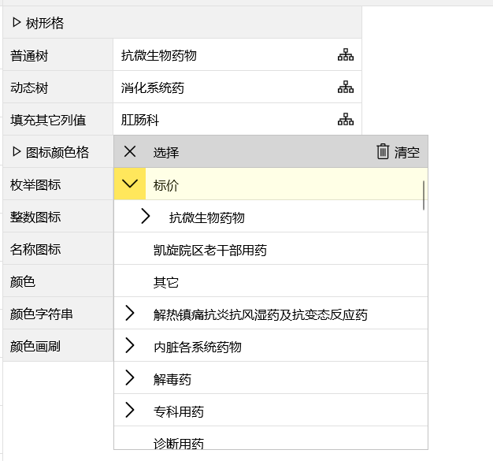

### CPassword
密码格，属性：

/// 

/// 获取设置占位符
/// 

public string Holder

/// 

/// 获取设置最大字符数
/// 

public int MaxLength

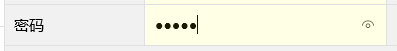

### CHtml
基于`html`的富文本格，内嵌`WebView`对`html`内容进行编辑和浏览，`html`编辑器使用`Froala Editor(V3.1.1)`，功能强大界面美观，支持手机操作，但`uno`中`WebView`暂不支持`InvokeScriptAsync`方法，还无法设置或获取编辑器中的`html`。

编辑框的保存按钮只是将编辑后的`html`赋值到数据源，若需要同时保存到数据库或其他操作请处理`Saved`事件。

### CTip
只读信息格，和其他编辑格相同，也是通过`ID`绑定到数据源来显示只读信息，但只适用于需要始终只读的格，以上编辑格如`CText`提供只读/编辑两种模式，可以根据需求在两模式之间动态切换，但`CTip`始终只读。用法简单，支持指定通用格式化串：

<a:CTip ID="tip" Title="普通只读信息" />
<a:CTip ID="tipdate" Title="日期信息" />
<a:CTip ID="tipnum" Title="数字信息" Format="N2" />
<a:CTip ID="tipclick" Title="点击事件" Click="OnTipClick" />

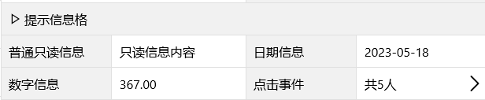

