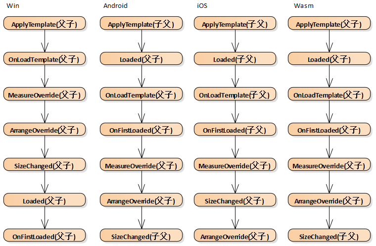
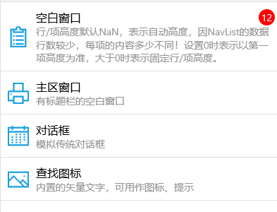
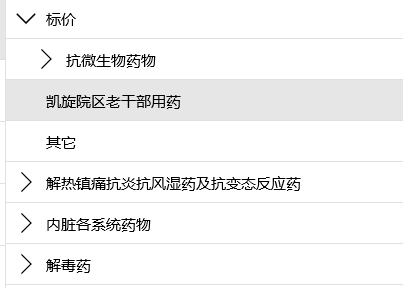
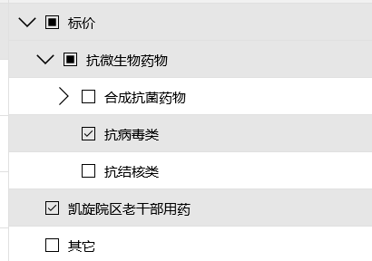
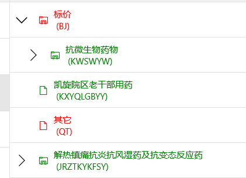
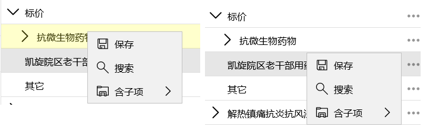
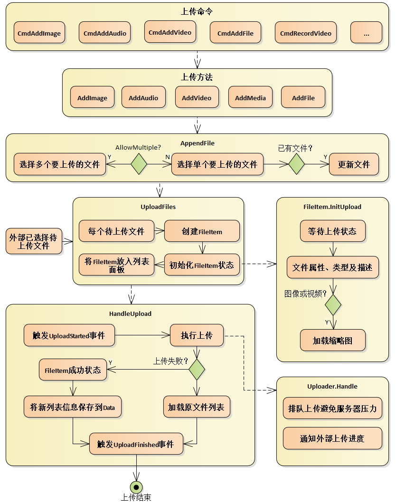

## 控件加载过程

Win Android iOS Wasm 四个平台的控件加载过程各不相同：

## NavList
该控件是集成了`Lv`的`Tab`，类似按钮列表，通过点击单个项打开新窗口、切换主区内容或自定义执行内容，俗称**功能列表**，`Lv`的数据源类型为`Nl<Nav>`或`Nl<GroupData<Nav>>`，`Nav`用于描述功能项，列表采用`Lv`的两种显示模式：`List和Tile`，

点击单个项时可以通过`To`属性控制加载内容的目标位置：`NewWin`或`WinMain`，也可以通过`Nav.To`控制，可以指定项模板、项高度、选择模式，`NavList`的属性包括：

/// 

/// 加载内容的目标位置，默认WinMain(当前Win的主区)，Nav.To的优先级更高
/// 

public NavTarget To

/// 

/// 获取设置视图类型：列表List、磁贴Tile，默认List
/// 

public NavViewMode ViewMode

/// 

/// 获取设置 Nav 类型的数据源列表，如Nl<Nav>或Nl<GroupData<Nav>>，其它类型不支持
/// 

public INotifyList Data

/// 

/// 获取设置行/项目高度，0时以第一项高度为准，NaN时自动高度
/// <para>默认NaN：因数据行数较少，每项的内容多少不同！</para>
/// 

public double ItemHeight

/// 

/// 获取设置项的DataTemplate，null时采用默认模板
/// 

public DataTemplate ItemTemplate

/// 

/// 获取设置选择模式，默认None
/// 

public SelectionMode SelectionMode


`Nav`属性如下，界面会根据属性值自动调整显示内容，`Cache`只控制切换主区内容时是否缓存UI。

/// 

/// 获取设置图标
/// 

public Icons Icon

/// 

/// 获取设置标题
/// 

public string Title

/// 

/// 获取设置描述信息
/// 

public string Desc

/// 

/// 醒目提示的数字
/// 

public string Warning

/// 

/// 获取设置内容类型
/// 

public Type Type

/// 

/// 获取设置外部回调方法
/// 

public Action<Win, Nav> Callback

/// 

/// 新窗口或主区内容的类型的构造方法的参数
/// 

public object Params

/// 

/// 加载内容的目标位置，优先级高于NavList，null时采用 NavList.To 的设置
/// 

public NavTarget? To

/// 

/// 获取设置是否缓存主区内容
/// 

public bool Cache { get; set; } = true;

/// 

/// 获取主区内容
/// 

/// <returns></returns>
public object GetCenter()


## TreeView
树控件在设计和使用上类似于`Lv`，功能上较`Lv`简单。

### 数据源
数据源需要实现`ITreeData`接口，主要为加载分层数据用：

/// 

/// 树状数据接口
/// 

public interface ITreeData
{
    /// 

    /// 获取树根节点数据
    /// 

    /// <returns></returns>
    IEnumerable<object> GetTreeRoot();

    /// 

    /// 获取指定节点的子节点数据
    /// 

    /// <param name="p_parent"></param>
    /// <returns></returns>
    IEnumerable<object> GetTreeItemChildren(object p_parent);
}


`Table`已实现该接口，但需要包含固定列`id, parentid`。

### 选择模式
`SelectionMode`属性控制选择模式

### 节点模板及样式
和`Lv`相同，节点模板和样式也是通过以下属性设置：

/// 

/// 获取设置节点模板或模板选择器
/// 

public object View

/// 

/// 获取设置自定义行样式的回调方法
/// 

public Action<TvItemStyleArgs> ItemStyle


样例如：

<a:TreeView x:Name="_tv">
    <DataTemplate>
        <StackPanel Orientation="Horizontal">
            <a:Dot ID="icon" Call="TvItemStyleUI.图标" Margin="10,0,10,0" VerticalAlignment="Center" />
            <StackPanel Margin="0,10,0,10">
                <a:Dot ID="name" />
                <a:Dot ID="code" />
            </StackPanel>
        </StackPanel>
    </DataTemplate>
</a:TreeView>

_tv.ItemStyle = (e) =>
{
    string code = e.Row.Str("code");
    if (code.Length < 4)
        e.Foreground = Res.RedBrush;
    else if (code.Length > 4)
        e.Foreground = Res.GreenBrush;

    if (e.Children.Count > 4)
        e.Background = Res.浅黄;
};


### 固定根节点

/// 

/// 获取设置固定根节点，切换数据源时不变
/// 

public object FixedRoot

protected override void OnFirstLoaded()
{
    MenuX m = new MenuX(ID: 0, Name: "菜单", IsGroup: true, Icon: "主页");
    m.AddCell("parentname", "");
    _tv.FixedRoot = m;
    _tv.Data = await AtCm.Query<MenuX>("菜单-完整树");
}


### 动态加载子节点

/// 

/// 获取设置是否动态加载节点，默认false
/// 

public bool IsDynamicLoading

<a:TreeView x:Name="_tv" IsDynamicLoading="True">
    <DataTemplate>
        <a:Dot ID="name" />
    </DataTemplate>
</a:TreeView>

public TvDynamicLoading()
{
    InitializeComponent();
    _tv.Data = TvData.GetRootTbl();
    _tv.LoadingChild += OnLoadingChild;
}

async void OnLoadingChild(object sender, LoadingChildArgs e)
{
    using (e.Wait())
    {
        // 模拟等待
        await Task.Delay(400);
        e.Children = ((ITreeData)TvData.GetTbl()).GetTreeItemChildren(e.CurrentItem.Data);
    }
}


### 上下文菜单
和Lv上下文菜单用法相同，上下文菜单的定义统一通过附件依赖属性`Ex.Menu`，如：

<a:TreeView x:Name="_tv">
    <a:Ex.Menu>
        <a:Menu>
            <a:Mi ID="保存" Icon="保存" />
            <a:Mi ID="搜索" Icon="搜索" />
        </a:Menu>
    </a:Ex.Menu>
    <DataTemplate>
        <a:Dot ID="name" />
    </DataTemplate>
</a:TreeView>


触发上下文菜单的方式支持多种：点击标识按钮、右键或长按、左键点击。

## FileList
`FileList`是文件列表控件，负责与`fsm`服务通信实现文件的上传下载功能，它封装了上传、下载、打开等文件操作过程中的UI交互功能，被其他多个控件引用，如`CFile格、CImage格、Lv的单元格、Chat`等。

### 数据源
`Data`属性保存着文件列表的`json`描述信息，`json`结构如下：

[
    [
        文件ID，存储在Fsm的路径,
        原始文件名称，不包括扩展名,
        文件类型及说明,
        文件大小,
        上传人名称,
        上传日期
    ], 
    [
        ...
    ]
]


切换`Data`值时会触发重建文件列表`FileItem`，这只影响控件的界面，并未上传或下载文件。

### 上传文件

“上传命令”主要提供给外部使用，用于绑定菜单项或按钮用，“上传方法”方便在代码中调用，因选择文件、上传文件等操作在各平台使用不同代码，每次用到时重写比较繁琐，所以尽可能的使用以上命令和方法。当外部已选择待上传文件时，可以直接调用`UploadFiles`方法，如在`Chat`中既是。

### 属性及命令

/// 

/// 获取设置文件列表的json描述信息
/// 

public string Data

/// 

/// 获取设置文件数量上限，默认int.MaxValue
/// 

public int MaxFileCount

/// 

/// 获取设置要上传的固定卷名，默认null表示上传到普通卷
/// 

public string FixedVolume

/// 

/// 获取设置列数，默认1列
/// 

public int ColCount

/// 

/// 获取设置文件项之间的间隔距离，默认0
/// 

public double Spacing

/// 

/// 获取设置图像的显示高度，默认82，0表示和宽度相同
/// 

public double ImageHeight

/// 

///  获取设置图像填充模式，默认Uniform
/// 

public Stretch ImageStretch

/// 

/// 获取设置文件项是否可点击，默认true
/// 

public bool EnableClick

/// 

/// 获取所有FileItem
/// 

public IEnumerable<FileItem> Items

/// 

/// 获取添加图片命令
/// 

public BaseCommand CmdAddImage

/// 

/// 获取添加视频命令
/// 

public BaseCommand CmdAddVideo

/// 

/// 获取添加音频命令
/// 

public BaseCommand CmdAddAudio

/// 

/// 获取添加文件命令
/// 

public BaseCommand CmdAddFile

/// 

/// 获取添加录音命令
/// 

public BaseCommand CmdCaptureVoice

/// 

/// 获取拍照命令
/// 

public BaseCommand CmdTakePhoto

/// 

/// 获取录视频命令
/// 

public BaseCommand CmdRecordVideo


### FileItem
`FileItem`是每个文件项的UI，内部有三种类型控件模板：普通文件、图像文件、视频文件，音频文件使用普通文件的模板，如下图：

控件的交互功能有，点击文件项时打开文件、显示原始图像、播放视频或音频，还负责上传下载过程中的交互，上传或下载过程中再次点击可取消。

`FileItem`还提供常用的文件命令和方法：

/// 

/// 获取共享文件命令
/// 

public BaseCommand CmdShare

/// 

/// 获取更新文件命令
/// 

public BaseCommand CmdUpdate

/// 

/// 获取删除上传文件
/// 

public BaseCommand CmdDelete

/// 

/// 获取打开文件命令
/// 

public BaseCommand CmdOpen

/// 

/// 获取另存为命令
/// 

public BaseCommand CmdSaveAs

/// 

/// 获取下载命令
/// 

public BaseCommand CmdDownload


CFile格, CImage格或Chat中的菜单项就是绑定这些命令。

